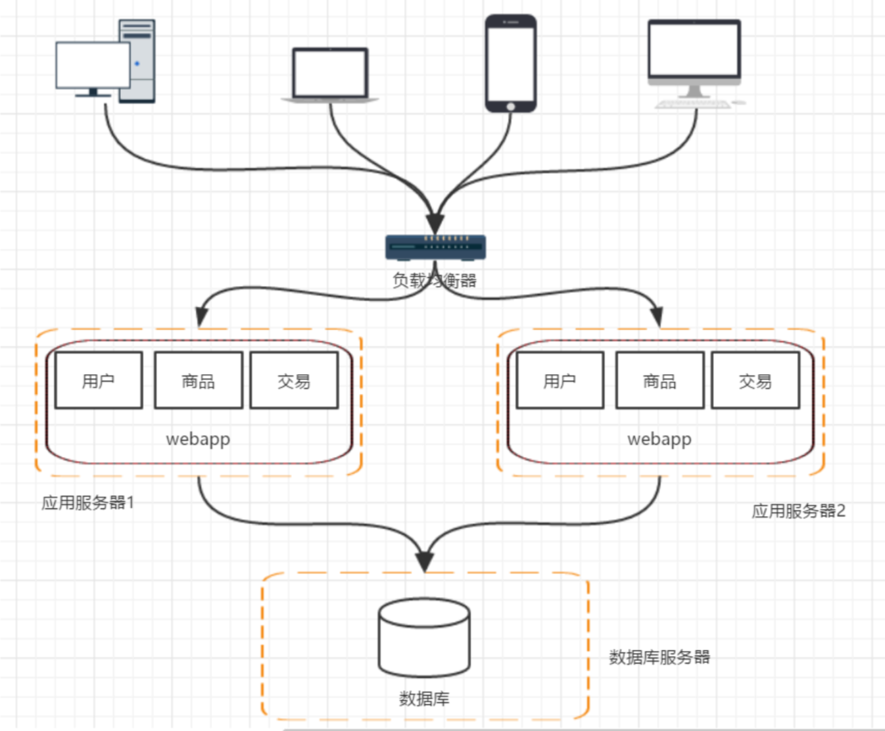
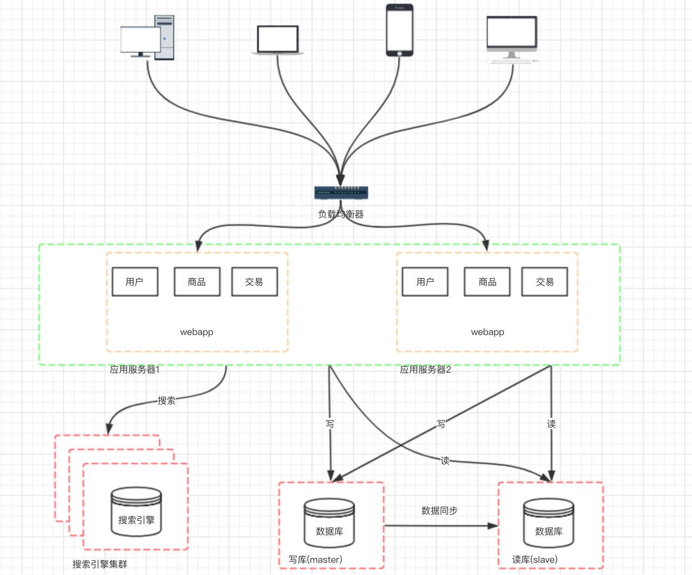
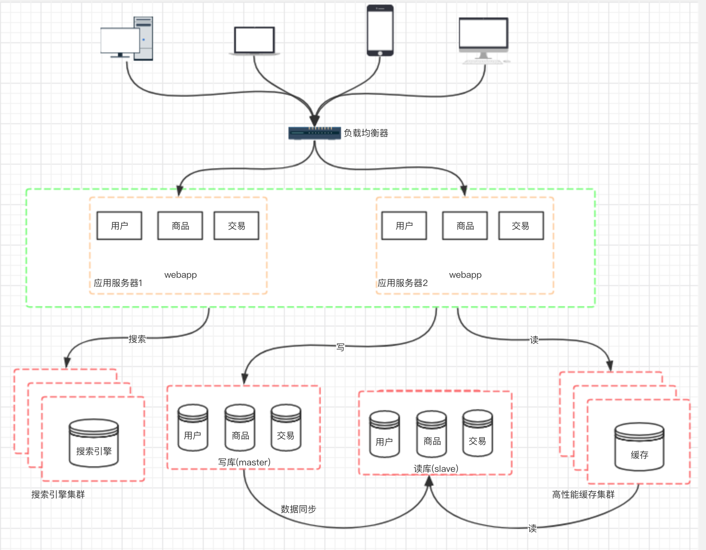

# 分布式

## 分布式架构的常见概念

**单机**

> 一台服务器处理整个项目所有的服务。

 例：一个饭店有一个厨师，这个厨师负责切菜炒菜全干。

**集群**

> 把单机复制到多个服务器，多个服务器相互不依赖的为项目提供服务。

例：后来客人多了，一个厨师忙不过来，又请来了一个或者2个厨师，这些厨师都干一样的活就是切菜炒菜。这些厨师的关系是集群。

**分布式**

> 多个服务相互依赖共同为项目提供服务，每个服务器只为项目中其中一个功能提供服务。
>
> 分布式应用：它是将一个应用程拆成多个服务，部署在不的机器上，各个服务之间通过网络进行通信、相互协作来实现和完成应用程序的各项功能。
>
> 它的特点是：
>
> 1. 各个服务可以很方便的做集群
> 2. 可以根据需要增加更多的机器
>
> 优点：
>
> * 高性能（通过增加机器分算服务器压力）
> * 高可用性（服务集群，避免单机故障）
>
> 缺点：
>
> - 排查问题相对困难
> - 运维成本相对较大
> - 数据一致性问题不可完全避免

例如：为了让厨师专心炒菜，把菜做到极致，又请了个配菜师负责切 菜、备菜、备料，厨师和配菜师的关系是分布 式，一个配菜师 也忙不过来了，又请了个配菜师，两个配菜师关系是集群。

## 架构的发展过程

　　一个成熟的大型系统架构并不是一开始就设计的非常完美，也不是一开始就具备高性能、高可用、安全性等特性，而是随着用户量的增加、业务功能的扩展逐步完善演变过来的。 随着数据量的增多、访问量的增加，系统架构发改变以适应业务对性能要的求。

### 阶段一：单应用架构

　　初期，我们通常是在单机上跑我们所有的程序和软件。 把所有软件和应用都部署在一台机器上，这样就完成一个简单 系统的搭建，这个时候的讲究的是效率。

### 阶段二：应用服务器和数据库服务器分离

　　随着业务发展，访问量的逐步上升，服务器的复制慢慢提高。这个时候一台服务器已经没办法满足正常的用户访问。加入代码层面的优化没有办法继续提高，在不提高单台服务器的性能的情况下是一个比较好的方式。

　　这个阶段增加服务器的主要目的就是将应用服务器和数据库服务器拆分，这样不仅能提高单台服务器的负载能力，也提高了容灾能力。

### 阶段三：应用服务器集群

　　随着访问量的继续增加，单台应用服务器已经无法满足需求。在假设数据服务器还没有遇到性能问题的时候，我们可以增加应用服务器，通过应用服务器集群来把用户的请求分流到各个服务器中，从而继续提升负载能力，此时多台应用服务器之间没 有直接的交互，他们都是依赖数据库各自对外提供服务。

架构发展到这个阶段，各种问题也会慢慢呈现 

1. 用户请求由谁来转发到具体的应用服务器

2. 用户如果每次访问到的服务器不一样，那么如何维护 session

### 阶段四：数据库压力变大，数据库读写分离

　　应用服务器的提升带来的问题就是数据库的负载也在慢慢变大，如何来提高数据库的负载呢？既然一台数据库服务器不行，那就增加服务器。但是假如我 们单纯的把数据库一分为二，然后对于后续数据库的请求，分别负 载到两台数据库服务器上，那么一定会造成数据库不统一的问题。 所以我们一般先考虑读写分离的方式。因为应用中百分之80的情况是在读数据，只有百分之20在写数据。

这个架构的变化会带来几个问题 ：

1. 主从数据库之间的数据同步  ； 可以使用 mysql 自带的 master-slave方式实现主从复制 

2. 对应数据源的选择 ； 采用第三方数据库中间件，例如mycat

### 阶段五：使用搜索引擎缓解读库的压力

　　数据库做读库的话，尝尝对模糊查找效率不是特别好，像电商类的 网站，搜索是非常核心的功能，即便是做了读写分离，这个问题也 不能有效解决。那么这个时候就需要引入搜索引擎了 使用搜索引擎能够大大提高我们的查询速度，但是同时也会带来一 些附加的问题，比如维护索引的构建。

### 阶段六：引入缓存机制缓解数据库的压力

　　随着访问量的持续增加，逐渐出现许多用户访问统一部分内容的情 况，对于这些热点数据，没必要每次都从数据库去读取，我们可以 使用缓存技术，比如memcache、redis来作为我们应用层的缓存； 另外在某些场景下，比如我们对用户的某些IP的访问频率做限制， 那这个放内存中又不合适，放数据库又太麻烦，这个时候可以使用 Nosql的方式比如mongDB来代替传统的关系型数据库。

### 阶段七：数据库的水平/垂直拆分

　　我们的网站演进的变化过程，交易、商品、用户的数据都还在同一 个数据库中，尽管采取了增加缓存，读写分离的方式，但是随着数 据库的压力持续增加，数据库的瓶颈仍然是个最大的问题。因此我 们可以考虑对数据的垂直拆分和水平拆分。

**垂直拆分**

> 把数据库中不同业务数据拆分到不同的数据库

**水平拆分**

> 把同一个表中的数据拆分到两个甚至跟多的数据库中， 水平拆分的原因是某些业务数据量已经达到了单个数据库的瓶颈， 这时可以采取将表拆分到多个数据库中 

### 阶段八：应用的拆分

　　随着业务的发展，业务越来越多，应用的压力越来越大。工程规模 也越来越庞大。这个时候就可以考虑讲应用拆分，按照领域模型讲 我们的用户、商品、交易拆分成多个子系统。

　　这样拆分以后，可能会有一些相同的代码，比如用户操作，在商品 和交易都需要查询，所以会导致每个系统都会有用户查询访问相关 操作。这些相同的操作一定是要抽象出来，否则就会是一个坑。所 以通过走服务化路线的方式来解决 。

　　那么服务拆分以后，各个服务之间如何进行远程通信呢？ 通过RPC技术，比较典型的有：webservice、hessian、http、RMI 等等，前期通过这些技术能够很好的解决各个服务之间通信问题，but， 互联网的发展是持续的，所以架构的演变和优化还在持续。

[参考1：分布式框架演进过程](https://blog.csdn.net/zenghu_10/article/details/80614899?utm_source=blogxgwz4)

[参考2：分布式架构的前世今生...](https://www.cnblogs.com/hafiz/p/9222973.html)