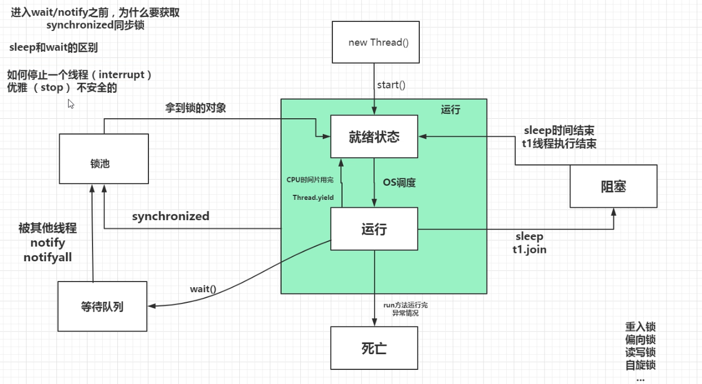
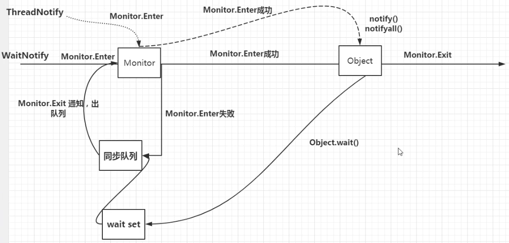
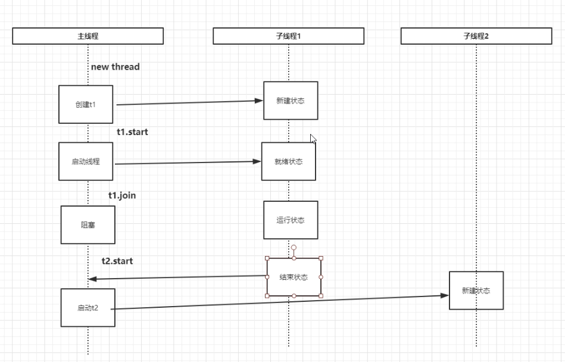

# 并发基础

## 1.多任务

**任务是什么？**

* 简单来说，就是一件事情，对应到计算机就是“一个正在运行的程序的实例”，对应的就是一个进程

**处理任务的方式是什么？**

* 将任务抽象成进程，要做的事抽象成子任务即线程
* 每个进程至少要干一件事，所以一个进程至少有一个线程
* 操作系统以进程为单位分配资源，CPU以线程为单位进行执行
* 线程什么时候执行，执行多长时间，这完全由操作系统决定（进程、线程调度），程序自己不能决定

**为什么要多任务？**

* 充分利用CPU资源

  > 因为CPU的处理速度很快，但往往一些IO操作很慢，跟不上CPU的处理速度，如果让CPU等待IO完成才进行下一步，这中间就会白白浪费时间，多任务就是要把这些原本等待的时间也用起来

* 同时处理多件事情，更好的用户体验，更高的效率

  > 例如看电影，就必须由一个线程播放视频，另一个线程播放音频，否则，单线程实现的话就只能先把视频播放完再播放音频，或者先把音频播放完再播放视频，这显然是不行的

**怎么实现多任务?**

- 多进程模式
- 多线程模式（在一个进程内启动多个线程）
- 多进程+多线程模式（这种模型更复杂，实际很少采用）

**多任务的底层是怎么做的？**

* 单核cpu，伪并行

  >操作系统轮流让各个任务交替执行（**调度**），任务1执行0.01秒，切换到任务2，任务2执行0.01秒，再切换到任务3，执行0.01秒……这样反复执行下去。表面上看，每个任务都是交替执行的，但是，由于CPU的执行速度实在是太快了，我们感觉就像所有任务都在同时执行一样

* 多核CPU，可实现真正的并行

  > 但是，由于任务数量远远多于CPU的核心数量，所以，操作系统也会自动把很多任务轮流调度到每个核心上执行


## 2.进程与线程

### 2.1模型


**关系**

- 进程是系统分配资源的基本单位

- 线程是CPU执行的基本单位
- 进程由至少一个线程组成
- 进程和线程何时执行，何时结束。完全由操作系统决定（OS线程调度）

**OS线程调度方法**

* 时间片调度

* 优先级调度

* 多级队列调度

**并发**

* 即多任务
* 一个CPU核心在同一时刻只能运行一个进程
* 在多核CPU里面可以达到真正的并发：同一时刻每个核心都运行一个进程
* 单核CPU里面同时运行多个进程，实际上是伪并发，是由操作系统轮流让各个任务交替执行，由于CPU的执行速度很快，切换时间很短用户感知不到

**引入线程的原因**

* 线程更加轻量级
* 切换时占用的资源更小
* 在多核cpu上可以达到真正意义上的并发


### 2.2线程的状态


```mermaid
graph TB
s1["新建<br>new Thread()"]
subgraph ""
s2["就绪"]
s3["运行"]
end
s4["死亡"]
s5["阻塞"]
s6["锁池(等待)"]
s1--"start()"-->s2
s2--"OS调度"-->s3
s3--"CPU时间片用完<br>Thread.yield"-->s2
s3--"sleep<br>subt1.join()"-->s5
s5--"sleep时间结束<br>subt1运行时结速"-->s2
s6--"拿到锁的对象"-->s3
s3--"synchronized"-->s6
s3--"run方法运行完成<br>发生异常"-->s4

```




---

**synchronized、wait、notify过程**







**yield**

- 作用
  - 当前线程让出CPU，也就是让当前线程从运行状态变成就绪状态

**join**

- 作用
  - 子程线.join()的作用：使调用它的**主线程**等待它执行完成

**synchronized**

* 锁范围
  * 分为实例级别、类级别，关键取决一于`synchronized(锁类型)`括号中的内容是class还是实例。如果没有括号，则为实例级别，方法上加synchronized就是这种情况
* 作用
  * 在入块时（monitor.enter）加锁，出块时（monitor.exit）释放锁
  * 保证被锁定的代码块，同一时时刻只被一个线程执行
  * 线程在入块前，如果已经加锁，则将准备入块的线程加入等待队列
* 与lock的区别
  * 实现方式不同：lock是接口，synchronized是native方法
  * synchronized只能在出块或异常时释放锁，不够灵活。lock是接口可以在需要时随时调用，更灵活，更轻量

**notify/notifyAll**

- 作用
  - 唤醒等待队列中的线程
- 特点
  - 一次notify只会唤醒等待队列中的一个线程
  - 调用notify以后，并不是立即就是去唤醒，而是要等了synchronized块出块（monitor.exit）时才会真正的唤醒

**sleep和wait的区别**

- wait会使线程进入到等待队列，释放出 CPU 资源
- sleep不会释放CUP资源

**如何停止一个线程**

* stop（暴力的方式，直接将其它线程kill掉，不安全）
* interrupt（优雅的方式）

**volatile**

- 作用
  - 保证跨线程的内存可见性
  - 保证操作原子性（不能保证复合操作的原子性）  
  - 防止指令重排序
    * 编译器的优化重排序
    * 指令的并行重排序
    * 内存重排序

- 底层原理
  - 设置内存屏障

**线程数设置**

- 计算密集型

  > 线程数等于 cpu 核心数

- IO密集型

  > 线程数大于 cpu 核心数