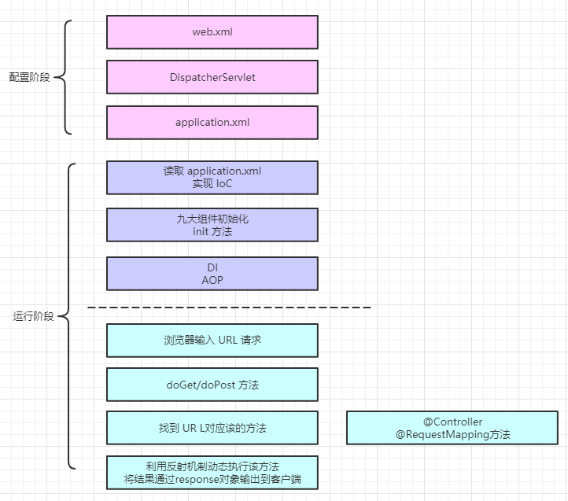

# 手写Spring v0.1

## Spring有哪此核心功能

* DI/IoC

  1.管理bean生命周期

  2.自动将bean注入到使用它的对象中：使用者只需声明（通过注解或xml配置）自己需要什么样的对象，Spring会根据使用者的声明将相应对象的实例注入到使用者中

* 事件机制

* 资源定位

* 国际化

* 类型转换

* 校验

* 数据绑定

* AOP

### 依赖注入和控制反转

- Ioc（控制反转）

  > 对象对自己所依赖的资源的控制权发生转变。
  >
  > 所有的类都会在spring容器中登记，告诉spring你是个什么东西，你需要什么东西，然后spring会在系统运行到适当的时候，把你要的东西主动给你，同时也把你交给其他需要你的东西。所有的类的创建、销毁都由 spring来控制，也就是说控制对象生存周期的不再是引用它的对象，而是spring。对于某个具体的对象而言，以前是它控制其他对象，现在是所有对象都被spring控制，所以这叫控制反转。

- DI（依赖注入）

  > 被注入对象（使用者）依赖IoC容器来配置依赖对象（资源）。

- IoC和DI之间的关系

  > 其实它们**是同一个概念的不同角度描述**，由于控制反转概念比较含糊（可能只是理解为容器控制对象这一个层面，很难让人想到谁来维护对象关系），所以2004年大师级人物Martin Fowler又给出了一个新的名字：“依赖注入”，相对IoC 而言，“依赖注入”明确描述了“被注入对象（使用者）依赖IoC容器来配置依赖对象（资源）”。

## Spring实现

- Spring的机制

  servlet+自定义注解+加反射

  

- 实现过程

  1. web应用入口中配置定自实现的servlet类
  2. 配置文件配置需要处理的包路径， 也可以在配置文件中指哪些类需要自动装载
  3. 自定义注解，用来标记哪些类是要自动注入；哪些http路径映射到哪个方法；方法返回什么样的内容
  4. 自实现的servlet类的init方法中：
     - 加载配置。读取xml配置文件，简单的实现可以用.properties来代替
     - 扫描类。扫描配置文件中描述了的类，以及配置的包路径下被注解标记了的类
     - Ioc容器初始化。实例化所有被扫描到的类，存放到IoC容器（Map）
     - 依赖注入。从IoC容器中的实例中找到加上了@Autowired注解的属性，并找到其在Ioc容器中的实例进行动态赋值
     - HandlerMapping。把@Controller中加了@ RequestMapping这个注解的方法和URL构造成一个对应关系（可以理解为就是一个Map<url,method>结构）
  5. 自实现的servlet类的doPost方法中：
     - 请求分发。解析请求路径，根据路径查找映射的方法， 调用映射的方法并处理返回结果