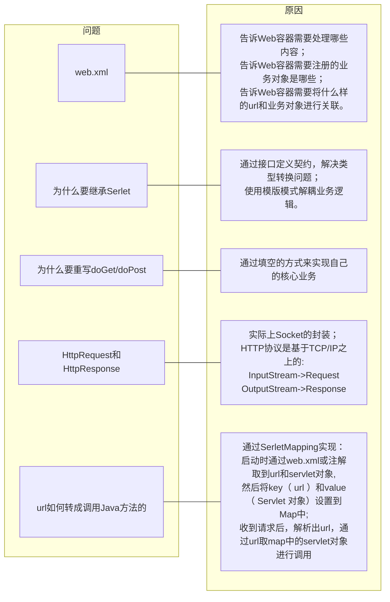

# 手写Tomcat v0.1

## 探究原理的作用：知其然，知其所以然

### 智者境界

> 聪明者知其然，精明者知其然知其所以然，高明者知其所以然知其所必然

- 聪明

  知道结果

- 精明

  不但知道结果，还知道发生的原因

- 高明

  知道结果，知道如何发生，知道为何如此、如何预防

### 架构师能力

1. 代码熟练度（与工作年限有关）
2. 思维能力、全局把控能力（好奇心是最好的老师）
3. 排错能力、工作效率（阅历与经验）
4. 预见能力（总结、判断力）

## 带着问题学习

### 关于 Java Web 应用的基础（ Servlet ）的疑问

1. 为什么要配置一个 web.xml ？
2. 为什么一定要继承 servlet 接口？
3. 为什么要重写 doGet、doPost 方法？
4. HttpRequest和HttpResponse是哪里出来的，自己从没new过它？
5. 在浏览器输入的url是如何被转换为调用Java方法的？

### 解答

### 实现过程

1. 定义Servlet模版，约定doGet方法、doPost方法，在service方法中根据请求方法类型调用doGet/doPost

2. 实现Servlet容器，启动时加载配置文件，初始化ServletMapping

   1. 等待用户请求

   2. 获取Scoket对象

      将socket.getInputStream()封装成Request

      将socket.getOutPutStream()封装成Response

   3. 解析请求url

   4. 通过url取ServletMapping中的Servlet对象，调用Servlet对象的对service()方法来实现doGet/doPost的动态调用

3. 应用程序继承Servlet模版类，重写doGet或doPost方法实现业务逻辑