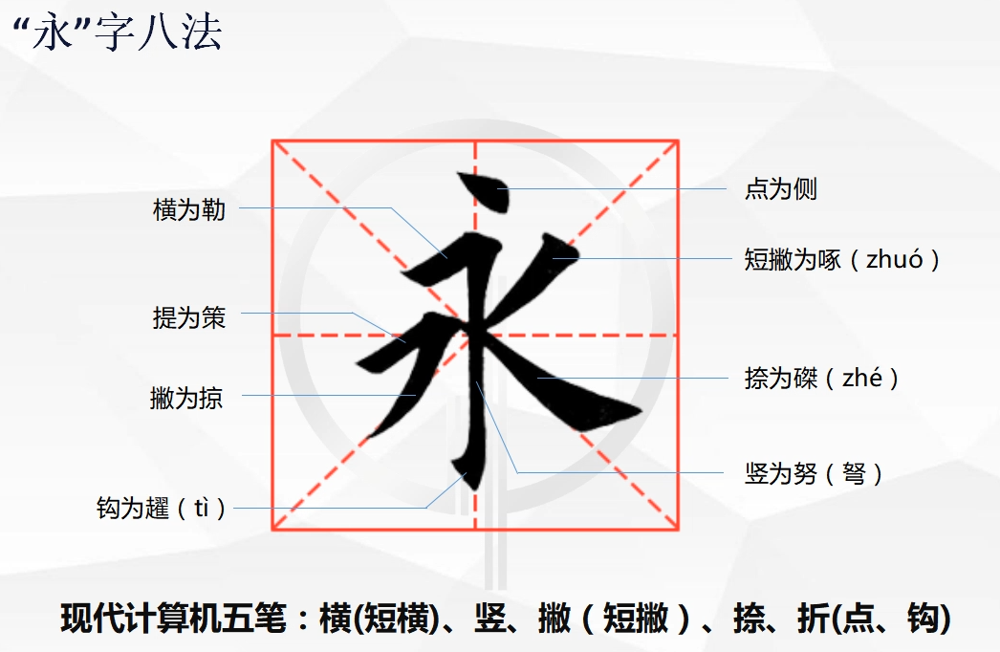

# 如何写出工整又漂亮的字

## 为什么要练字？

1、塑造第二张脸

2、修身养性良方

## 实用书写怎样才能美观？

### 一般人的困惑

- 为什么单个字写的不错，放在一起就不好看

- 为什么有些人单个字写得不好看，但整体看起来很舒服

### 解决办法

- 关键是要合理排版

### 如何合理排版？

- 普通记事本
  1. 一行字不要占满整个格子（字的空间，占格子的三分之二，留三分之一空白）
  2. 字间距要小于行间距（字间距也不能太拥挤，占字的宽度的五分之一左右为宜）

- 田字格
  1. 瞄准字的间架结构

## 书法普及法则

### 什么是书法？

书法即书写汉字的法则，包括以下两方面：

1. 实用法则（便揵：易于书写、便于转播）
2. 审美发则（视觉：美观）

### 实用法则（字体起源）

由于汉字本身具有的传播属性，为了加快写过程，而衍生出来各种字体

> 秦朝以前
>
> - 甲骨文、钟鼎文
>
> 秦汉时期
>
> - 篆书（秦朝书同文）
> - 隶书（同文    隶书）
> - 草书（民间）
>
> 晋唐时期
>
> - 行书（三国两晋）
> - 楷书（唐朝）
>
> 宋朝以后
>
> - 宋体（印刷术的）

### 审美法则

在文字的传播过程中，汉字逐渐有了审美的属性，因而，引申出对美的定义。

1. 对笔画的定义
   - 横轻竖重
   - 横细竖粗
   - “永”字八法
2. 对笔画位置的定义
   - 间架结构
   - 田字格
   - 米字格

### “永”字八法

- 侧（点法）

  > 下毛要快，笔锋着纸后向右，慢慢加重力道下压再慢慢上收转向，回笔藏锋视情形改变其角度

- 勒（横法）

  > 笔锋触纸向右下压再横画而慢慢收起，作一横向笔画

- 努（竖法）

  > 又称作“弩”，为直向笔画，以直笔之法作为开头，竖笔慢慢向下写，向左微偏带一点轻微弧度后返回，其笔画不宜死直，否则无力

- 趯(zhé)（钩法）

  > 当竖直笔画完后，趁其势顿笔再向左上偏，一出即收笔向上

- 策（提法）

  > 笔锋触纸向右压再转右上斜画而慢慢收起，要点是需轻抬而进

- 掠（撇法）

  > 向左下的笔画，必须快而准，取之中的险劲为要节，出锋需干净利落，利而不墬

- 啄（短撇）

  > 又称短撇，为向左下之笔画，如同啄木鸟啄树的力道和气势

- 磔(tì)（捺法）

  > 向左下之笔画，徐徐而有劲，起笔藏锋，收尾时下压再向右横画而慢慢提笔，所谓一波三折

### 技法修炼的方法

先临摹，后创新

### 现化书法家字帖

字帖参考：

行书：《卢定山行书入门字谱》

楷书：《田英章楷书字帖》