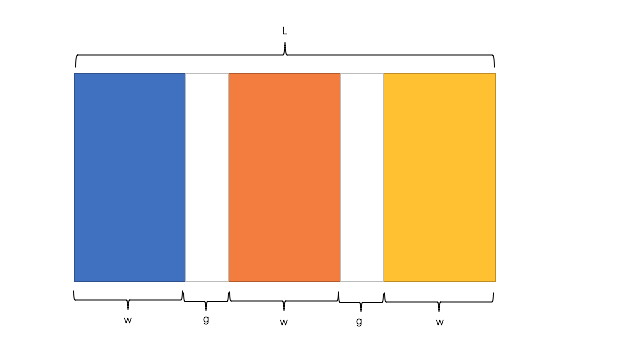
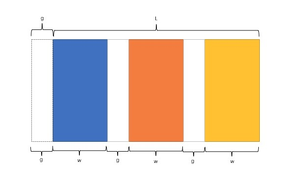
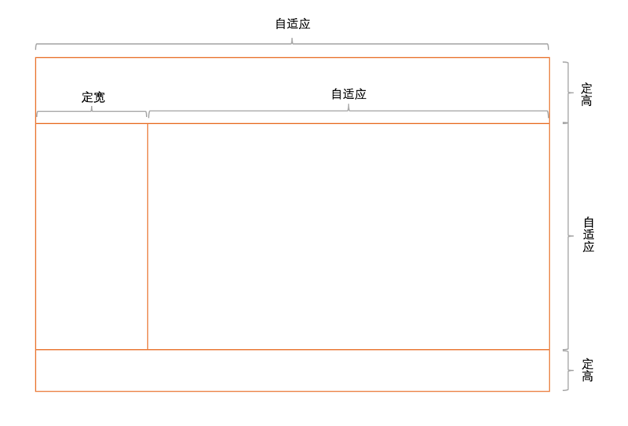
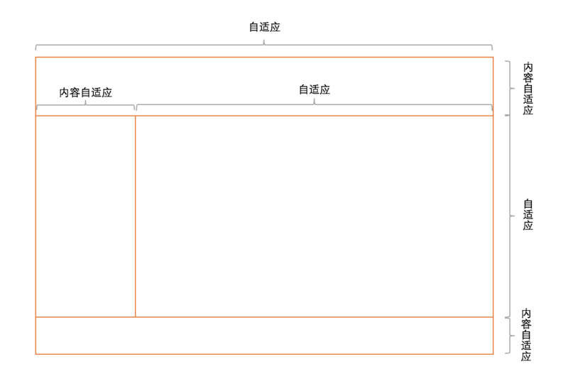

# CSS布局解决方案

[TOC]

## 前言

前端布局非常重要的一环就是页面框架的搭建，也是最基础的一环。在页面框架的搭建之中，又有居中布局、多列布局以及全局布局，今天我们就来总结总结前端干货中的CSS布局。

## 居中布局
### 水平居中
#### 1. 使用`inline-block+text-align`

- 原理、用法

  原理：先将子框由块级元素改变为行内块元素，再通过设置行内块元素居中以达到水平居中。

  用法：对子框设置`display:inline-block`，对父框设置`text-align:center`。

- 代码实例

``` html
<div class="parent">
    <div class="child">DEMO</div>
</div>
  
.child{
    display:inline-block;
}
.parent{
    text-align:center;
}
```

- 优缺点

  - 优点：兼容性好，甚至可以兼容ie6、ie7
  - 缺点：child里的文字也会水平居中，可以在.child添加text-align:left;还原


#### 2. 使用`table+margin`

- 原理、用法

  原理：先将子框设置为块级表格来显示（类似 `<table>`），再设置子框居中以达到水平居中。
  用法：对子框设置`display:table`，再设置`margin:0 auto`。

- 代码实例

```html
<div class="parent">
    <div class="child">DEMO</div>
</div>

.child {
   display:table;
   margin:0 auto;
}
```

- 
  优缺点：

  优点：只设置了child，ie8以上都支持。
  缺点：不支持ie6、ie7,将div换成table。

#### 3. 使用`absolute+transform`

- 原理、用法

  原理：将子框设置为绝对定位，移动子框，使子框左侧距离相对框左侧边框的距离为相对框宽度的一半，再通过向左移动子框的一半宽度以达到水平居中。当然，在此之前，我们需要设置父框为相对定位，使父框成为子框的相对框。
  用法：对父框设置`position:relative`，对子框设置`position:absolute;left:50%;transform:translateX(-50%)`。

- 代码实例

```html
<div class="parent">
    <div class="child">DEMO</div>
</div>
                
.parent {
   position:relative;
}
.child {
   position:absolute;
   left:50%;
   transform:translateX(-50%);
}
```

- 
  优缺点

  优点：居中元素不会对其他的产生影响
  缺点：ransform属于css3内容，兼容性存在一定问题，高版本浏览器需要添加一些前缀

#### 4. 使用`flex+margin`

- 原理、用法

  原理：通过CSS3中的布局利器flex将子框转换为flex item，再设置子框居中以达到居中。
  用法：先将父框设置为`display:flex`，再设置子框`margin:0 auto`。

- 代码实例

```html
<div class="parent">
    <div class="child">DEMO</div>
</div>

.parent {
    display:flex;
}
.child {
    margin:0 auto;
}
```

- 优缺点

  缺点：低版本浏览器(ie6 ie7 ie8)不支持

#### 5. 使用`flex+justify-content`

- 原理、用法

  原理：通过CSS3中的布局利器flex中的`justify-content`属性来达到水平居中。
  用法：先将父框设置为`display:flex`，再设置`justify-content:center`。

- 代码实例

```html
<div class="parent">
    <div class="child">DEMO</div>
</div>

.parent {
    display:flex;
    justify-content:center;
}
```

- 
  优缺点

优点：设置parent即可
缺点：低版本浏览器(ie6 ie7 ie8)不支持

### 垂直居中

#### 1. 使用`table-cell+vertical-align`

- 原理、用法

  原理：通过将父框转化为一个表格单元格显示（类似 `<td> `和 `<th>`），再通过设置属性，使表格单元格内容垂直居中以达到垂直居中。
  用法：先将父框设置为`display:table-cell`，再设置`vertical-align:middle`。(**注意：**父级需要有高度，否则看不出效果。)

- 代码实例

```html
<div class="parent">
    <div class="child">DEMO</div>
</div>

.parent {
    display:table-cell;
   vertical-align:middle;
}
```

- 优缺点

  优点：兼容性较好，ie8以上均支持

#### 2. 使用`absolute+transform`

- 原理、用法

  原理：类似于水平居中时的`absolute+transform`原理。将子框设置为绝对定位，移动子框，使子框上边距离相对框上边边框的距离为相对框高度的一半，再通过向上移动子框的一半高度以达到垂直居中。当然，在此之前，我们需要设置父框为相对定位，使父框成为子框的相对框。
  用法：先将父框设置为`position:relative`，再设置子框`position:absolute，top:50%，transform:translateY(-50%)`。(**注意：**父级需要有高度，否则看不出效果。)

- 代码实例

```html
<div class="parent">
    <div class="child">DEMO</div>
</div>
.parent {
    position:relative;
}
.child {
    position:absolute;
    top:50%;
    transform:translateY(-50%);
}
```

- 优缺点

  优点：居中元素不会对其他的产生影响
  缺点：transform属于css3内容，兼容性存在一定问题，高版本浏览器需要添加一些前缀

#### 3. 使用`flex+align-items`

- 原理、用法

  原理：通过设置CSS3中的布局利器flex中的属性align-times，使子框垂直居中。
  用法：先将父框设置为`position:flex`，再设置`align-items:center`。(**注意：**父级需要有高度，否则看不出效果。)

- 代码实例

```html
<div class="parent">
    <div class="child">DEMO</div>
</div>

.parent {
    display:flex;
    align-items:center;
}
```

- 优缺点

  优点：只设置parent
  缺点：兼容性存在一定问题

### 水平垂直居中

#### 1. 使用`absolute+transform`

- 原理、用法

  原理：将水平居中时的`absolute+transform`和垂直居中时的`absolute+transform`相结合。详见：水平居中的3和垂直居中的2。
  用法：见水平居中的3和垂直居中的2。(**注意：**父级需要有高度和宽度，否则看不出效果。要注意百分比宽高没生效问题。)

- 代码实例

```html
<div class="parent">
    <div class="child">DEMO</div>
</div>

.parent {
    position:relative;
}
.child {
    position:absolute;
    left:50%;
    top:50%;
    transform: translate(-50%, -50%);
}
```

- 优缺点

  优点：child元素不会对其他元素产生影响
  缺点：兼容性存在一定问题

#### 2. 使用`inline-block+text-align+table-cell+vertical-align`

- 原理、用法

  原理：使用`inline-block+text-align`水平居中，再用`table-cell+vertical-align`垂直居中，将二者结合起来。详见：水平居中的1和垂直居中的1。
  用法：见水平居中的1和垂直居中的1。(**注意：**父级需要有高度和宽度，否则看不出效果。要注意百分比宽高没生效问题。)

- 代码实例


```html
<div class="parent">
    <div class="child">DEMO</div>
</div>

.parent {
    text-align:center;
    display:table-cell;
    vertical-align:middle;
}
.child {
    display:inline-block;
}
```

- 优缺点

  优点：兼容性较好

#### 3. 使用`flex+justify-content+align-items`

- 原理、用法

  原理：通过设置CSS3布局利器flex中的`justify-content`和`align-items`，从而达到水平垂直居中。详见：水平居中的4和垂直居中的3。
  用法：见水平居中的4和垂直居中的3。(**注意：**父级需要有高度，否则看不出效果。要注意百分比高没生效问题。)

- 代码实例


```html
<div class="parent">
    <div class="child">DEMO</div>
</div>

.parent {
    display:flex;
    justify-content:center;
    align-items:center;
}
```

- 优缺点

  优点：只设置了parent
  缺点：兼容性存在一定问题


## 多列布局

### 定宽+自适应

#### 1. 使用`float+overflow`

- 原理、用法

  原理：通过将左边框脱离文本流，设置右边规定当内容溢出元素框时发生的事情以达到多列布局。
  用法：先将左框设置为`float:left`、`width`、`margin-left`，再设置实际的右框`overflow:hidden`。

- 代码实例


```html
<div class="parent">
    <div class="left">
        <p>left</p>
    </div>
    <div class="right">
        <p>right</p>
        <p>right</p>
    </div>
</div>

.left {
    float:left;
    width:100px;
    margin-right:20px;
}
.right {
    overflow:hidden;
}
```

- 优缺点

  优点：简单
  缺点：不支持ie6

#### 2. 使用`float+margin`

- 原理、用法

  原理：通过将左框脱离文本流，加上右框向右移动一定的距离，以达到视觉上的多列布局。
  用法：先将左框设置为`float:left`、`margin-left`，再设置右框`margin-left`。

- 代码实例


```html
<div class="parent">
    <div class="left">
        <p>left</p>
    </div>
    <div class="right">
        <p>right</p>
        <p>right</p>
    </div>
</div>

.left {
    float:left;
   width:100px;
}
.right {
    margin-left:120px;
}
```

- 优缺点

  优点：简单，易理解
  缺点：兼容性存在一定问题，ie6下有3px的bug。right下的p清除浮动将产生bug

#### 3. 使用`float+margin`（改良版）

- 原理、用法

  原理：在1的基础之上，通过向右框添加一个父框，再加上设置左、右父框属性使之产生BFC以去除bug。
  用法：先将左框设置为`float:left`、`margin-left`、`position:relative`，再设置右父框`float:right; width:100%;`、 `margin-left;`最后设置实际的右框`margin-left`。

- 代码实例


```html
<div class="parent">
    <div class="left">
        <p>left</p>
    </div>
    <div class="rigth-fix">
        <div class="right">
            <p>right</p>
            <p>right</p>
        </div>
    </div>
</div>

.left {
    float:left;
    width:100px;
    position:relative;
}
.right-fix {
    float:right;
    width:100%;
    margin-left:-100px;
}
.right {
    margin-left:120px;
}
```

- 优缺点


- 优点：简单，易理解

#### 4. 使用`table`

- 原理、用法

  原理：通过将父框设置为表格，将左右边框转化为类似于同一行的td，从而达到多列布局。
  用法：先将父框设置为`display:table; width:100%; table-layout:fixed`，再设置左右框`display:table-cell`，最后设置左框`width`、`padding-right`。

- 代码实例


```html
<div class="parent">
    <div class="left">
        <p>left</p>
    </div>
    <div class="right">
        <p>right</p>
        <p>right</p>
    </div>
</div>

.parent {
    display:table;
    width:100%;
    table-layout:fixed;
}
.left {
    width:100px;
    padding-right:20px;
}
.right,.left {
    display:table-cell;    
}
```

#### 5. 使用`flex`

- 原理、用法

  原理：通过设置CSS3布局利器flex中的flex属性以达到多列布局。
  用法：先将父框设置为`display:flex`，再设置左框`flex:1`，最后设置左框`width`、`margin-right`。

- 代码实例


```html
<div class="parent">
    <div class="left">
        <p>left</p>
    </div>
    <div class="right">
        <p>right</p>
        <p>right</p>
    </div>
</div>

.parent {
    display:flex;
}
.left {
    width:100px;
    margin-right:20px;
}
.right {
    flex:1;
}
```

- 优缺点

  优点：flex很强大
  缺点：兼容性存在一定问题，性能存在一定问题

### 两列定宽+一列自适应

#### 1. 使用`float+margin-right+overflow`

- 原理、用法

  原理：这种情况与两列定宽查不多。
  用法：先将左、中框设置为`float:left`、`width`、`margin-right`，再设置右框`overflow:hidden`。

- 代码实例


```html
<div class="parent">
    <div class="left">
        <p>left</p>
    </div>
    <div class="center">
        <p>center</p>
    </div>
    <div class="right">
        <p>right</p>
        <p>right</p>
    </div>
</div>

.left,.center {
    float:left;
    width:100px;
    margin-right:20px;
}
.right {
    overflow:hidden;
}
```

### 不定宽+自适应

#### 1. 使用`float+overflow`

- 原理、用法

  原理：这种情况与两列定宽差不多。
  用法：先将左框设置为`float:left`、`margin-right`，再设置右框`overflow: hidden`，最后设置左框中的内容`width`。

- 代码实例


```html
<div class="parent">
    <div class="left">
        <p>left</p>
    </div>
    <div class="right">
        <p>right</p>
        <p>right</p>
    </div>
</div>

.left{
    float: left;
    margin-right: 20px;
}
.right{
    overflow: hidden;
}
.left p{
    width: 200px;
}
```

- 优缺点

  优点：简单
  缺点：ie6下兼容性存在一定问题

#### 2. 使用`table`

- 原理、用法

  原理：通过将父框改变为表格，将左右框转换为类似于同一行的td以达到多列布局，设置父框宽度100%，给左框子元素一个固定宽度从而达到自适应。
  用法：先将父框设置为`display: table`、`width: 100%`，再设置左、右框`display: table-cell`，最后设置左框`width: 0.1%`、`padding-right`以及左框中的内容`width`。

- 代码实例


```html
<div class="parent">
    <div class="left">
        <p>left</p>
    </div>
    <div class="right">
        <p>right</p>
        <p>right</p>
    </div>
</div>

.parent{
    display: table; width: 100%;
    }
.left,.right{
    display: table-cell;
}
.left{
    width: 0.1%;
    padding-right: 20px;
}
.left p{
    width:200px;
}
```

- 优缺点

  缺点：ie6 ie7不支持

#### 3. 使用flex

- 原理、用法

  原理：通过设置CSS3布局利器flex中的flex属性以达到多列布局，加上给左框中的内容定宽、给右框设置flex达到不定款+自适应。
  用法：先将父框设置为display:flex，再设置右框flex:1，最后设置左框margin-right:20px、左框中的内容width。

- 代码实例


```html
<div class="parent">
    <div class="left">
        <p>left</p>
    </div>
    <div class="right">
        <p>right</p>
        <p>right</p>
    </div>
</div>

.parent {
    display:flex;
}
.left {
    margin-right:20px;
}
.right {
    flex:1;
}
.left p{
    width: 200px;
}
```

- 优缺点

  优点：flex很强大
  缺点：兼容性存在一定问题，性能存在一定问题

### 两列不定宽+一列自适应

#### 1. 使用`float+margin-right+overflow`

- 原理、用法

  原理：这个情况与一列不定宽+一列自适应查不多。
  用法：先将左、中框设置为`float:left`、`margin-right`，再设置右框`overflow:hidden`，最后给左中框中的内容设置`width`。

- 代码实例


```html
<div class="parent">
    <div class="left">
        <p>left</p>
    </div>
    <div class="center">
        <p>center</p>
    </div>
    <div class="right">
        <p>right</p>
        <p>right</p>
    </div>
</div>

.left,.center{
    float: left;
    margin-right: 20px;
}
.right{
    overflow: hidden;
}
.left p,.center p{
    width: 100px;
}
```

### 等分布局



```javascript
公式转化:
l = w * n + g * (n-1) -> l = w * n + g * n - g -> l + g = （w + g） * n
```



因此，我们需要解决两个问题：

>  如何让总宽度增加g(即：L+g)
> 如何让每个宽包含g（即：w+g）

#### 1. 使用`float`

- 原理、用法

  原理：增大父框的实际宽度后，使用CSS3属性box-sizing进行布局的辅助。
  用法：先将父框设置为`margin-left: -*px`，再设置子框`float: left`、`width: 25%`、`padding-left`、`box-sizing: border-box`。

- 代码实例

```html
<div class="parent">
    <div class="column"><p>1</p></div>
    <div class="column"><p>2</p></div>
    <div class="column"><p>3</p></div>
    <div class="column"><p>4</p></div>
</div>

.parent{
    margin-left: -20px;//l增加g
}
.column{
    float: left;
    width: 25%;
    padding-left: 20px;
    box-sizing: border-box;//包含padding区域 w+g
}
```

- 优缺点

  优点：兼容性较好
  缺点：ie6 ie7百分比兼容存在一定问题

#### 2. 使用`table`

- 原理、用法

  原理：通过增加一个父框的修正框，增大其宽度，并将父框转换为`table`，将子框转换为`tabel-cell`进行布局。
  用法：先将父框的修正框设置为`margin-left: -*px`，再设置父框`display: table`、`width:100%`、`table-layout: fixed`，设置子框`display: table-cell`、`padding-left`。

- 代码实例


```html
<div class="parent-fix">
    <div class="parent">
        <div class="column"><p>1</p></div>
        <div class="column"><p>2</p></div>
        <div class="column"><p>3</p></div>
        <div class="column"><p>4</p></div>
    </div>
</div>

.parent-fix{
    margin-left: -20px;//l+g
}
.parent{
    display: table;
    width:100%;
    table-layout: fixed;
}
.column{
    display: table-cell;
    padding-left: 20px;//w+g
}
```
- 优缺点

  优点：结构和块数无关联
  缺点：增加了一层

#### 3. 使用`flex`

- 原理、用法

  原理：通过设置CSS3布局利器flex中的flex属性以达到等分布局。
  用法：将父框设置为`display: flex`，再设置子框`flex: 1`，最后设置子框与子框的间距`margin-left`。

- 代码实例


```html
<div class="parent">
    <div class="column"><p>1</p></div>
    <div class="column"><p>2</p></div>
    <div class="column"><p>3</p></div>
    <div class="column"><p>4</p></div>
</div>

.parent{
    display: flex;
}
.column{
    flex: 1;
}
.column+.column{
    margin-left:20px;
}
```
- 优缺点

  优点：代码量少，与块数无关
  缺点：兼容性存在一定问题

### 定宽+自适应+两块高度一样高

#### 1. 使用`float`

- 原理、用法

  原理：通过过分加大左右子框的高度，辅助超出隐藏，以达到视觉上的等高。
  用法：将父框设置`overflow: hidden`，再设置左右子框`padding-bottom: 9999px`、`margin-bottom: -9999px`，最后设置左框`float: left`、`width`、`margin-right`，右框`overflow: hidden`。

- 代码实例


```html
<div class="parent">
    <div class="left">
        <p>left</p>
    </div>
    <div class="right">
        <p>right</p>
        <p>right</p>
    </div>
</div>

p{
    background: none!important;
}

.left,.right{
    background: #444;
}
.parent{
    overflow: hidden;
}
.left,.right{
    padding-bottom: 9999px;
    margin-bottom: -9999px;
}
.left{
    float: left; 
    width: 100px;
    margin-right: 20px;
}
.right{
    overflow: hidden;
}
```
- 优缺点

  优点：兼容性好
  缺点：伪等高，不是真正意义上的等高

#### 2. 使用`table`

- 原理、用法

  原理：将父框转化为`tabel`，将子框转化为`tabel-cell`布局，以达到定宽+自适应+两块高度一样高。
  用法：先将父框设置为`display:table`、`width:100%`、`table-layout:fixed`，再设置左右框为`display:table-cell`，最后设置左框`width`、`padding-right`。

- 代码实例


```html
<div class="parent">
    <div class="left">
        <p>left</p>
    </div>
    <div class="right">
        <p>right</p>
        <p>right</p>
    </div>
</div>

.parent {
    display:table;
    width:100%;
    table-layout:fixed;
}
.left {
    width:100px;
    padding-right:20px;
}
.right,.left {
    display:table-cell;
}
```

#### 3. 使用`flex`

- 原理、用法

  原理：通过设置CSS3布局利器flex中的flex属性以达到定宽+自适应+两块高度一样高。
  用法：将父框设置为`display: flex`，再设置左框`width`、`margin-right`，最后设置右框`flex:1`。

- 代码实例


```html
<div class="parent">
    <div class="left">
        <p>left</p>
    </div>
    <div class="right">
        <p>right</p>
        <p>right</p>
    </div>
</div>

.parent {
    display:flex;
}
.left {
    width:100px;
    margin-right:20px;
}
.right {
    flex:1;
}
```

- 优缺点

  优点：代码少，flex很强大
  缺点：兼容性存在一定问题

#### 4. 使用`display`

- 原理、用法

  原理：通过设置`display`中的CSS3的`-webkit-box`属性以达到定宽+自适应+两块高度一样高。
  用法：将父框设置为`display: -webkit-box`、`width: 100%`，再设置左框`width`、`margin-right`，最后设置右框`-webkit-box-flex: 1`。

- 代码实例


```html
<div class="parent">
    <div class="left">left</div>
    <div class="right">right </div>
</div>

.parent {
    width: 100%;
    display: -webkit-box;
}
.left {
    width:100px;
    margin-right: 20px;
}
.right {
    -webkit-box-flex: 1;
}
```

- 优缺点

  缺点：兼容性存在较大的问题

## 全屏布局

- 全屏布局的特点
  - 滚动条不是全局滚动条，而是出现在内容区域里，往往是主内容区域
  - 浏览器变大时，撑满窗口

### 方案一、top区域及bottom区域定高



#### 1. 使用`position`

- 原理、用法

  原理：将上下部分固定，中间部分使用定宽+自适应+两块高度一样高。
  用法：见实例。

- 代码实例


```html
<div class="parent">
    <div class="top">top</div>
    <div class="left">left</div>
    <div class="right">
        <div class="inner">right</div>
    </div>
    <div class="bottom">bottom</div>
</div>

html,body,.parent{
    margin:0;
    height:100%;
    overflow:hidden;
}
body{
    color:white;
}

.top{
    position:absolute;
    top:0;
    left:0;
    right:0;
    height:100px;
    background:blue;
}
.left{
    position:absolute;
    left:0;
    top:100px;
    bottom:50px;
    width:200px;
    background:red;
}
.right{
    position:absolute;
    left:200px;
    top:100px;
    bottom:50px;
    right:0;
    background:pink;
    overflow: auto;
}
.right .inner{
    min-height: 1000px;
}
.bottom{
    position:absolute;
    left:0;
    right:0;
    bottom:0;
    height:50px;
    background: black;
}
```
- 优缺点

  优点：兼容性好，ie6下不支持

#### 2. 使用`flex`

- 原理、用法

  原理：通过灵活使用CSS3布局利器flex中的`flex`属性和`flex-direction`属性以达到全屏布局。
  用法：见实例。

- 代码实例


```html
<div class="parent">
    <div class="top">top</div>
    <div class="middle">
        <div class="left">left</div>
        <div class="right">
            <div class="inner">right</div>
        </div>
    </div>
    <div class="bottom">bottom</div>
</div>

html,body,.parent{
    margin:0;
    height:100%;
    overflow:hidden;
}
body{
    color: white;
} 

.parent{
    display: flex;
    flex-direction: column;
}
.top{
    height:100px;
    background: blue;
}
.bottom{
    height:50px;
    background: black;
}
.middle{
    flex:1;
    display:flex;
}
.left{
    width:200px;
    background: red;
}
.right{
    flex: 1;
    overflow: auto;
    background:pink;
}
.right .inner{
    min-height: 1000px;
}
```

- 优缺点

  缺点：兼容性差，ie9及ie9以下不兼容


### 方案二、top区域及bottom区域内容自适应



#### 1. 使用`flex`

- 原理、用法

  原理：通过灵活使用CSS3布局利器flex中的`flex`属性和`flex-direction`属性以达到全屏布局。
  用法：见实例。

- 代码实例


```html
<div class="parent">
    <div class="top">top</div>
    <div class="middle">
        <div class="left">left</div>
        <div class="right">
            <div class="inner">right</div>
        </div>
    </div>
    <div class="bottom">bottom</div>
</div>

html,body,.parent{
    margin:0;
    height:100%;
    overflow:hidden;
}
body{
    color:white;
} 
.parent{
    display:flex;
    flex-direction:column;
}
.top{
    background:blue;
}
.bottom{
    background:black;
}
.middle{
    flex:1;
    display:flex;
}
.left{
    background: red;
}
.right{
    flex:1;
    overflow:auto;
    background: pink;
}
.right .inner{
    min-height:1000px;
}
```


### 全屏布局相关方案的兼容性、性能和自适应一览表

**（注：不代表最新观点）**

| 方案     | 兼容性 | 性能 | 是否自适应 |
| -------- | ------ | ---- | ---------- |
| Position | 好     | 好   | 部分自适应 |
| Flex     | 较差   | 差   | 可自适应   |
| Grid     | 差     | 较好 | 可自适应   |

​		

## 待补充

相比传统的positon布局，现代布局方案中的grid和flex有很多优势，必定是未来的主流。时至今日，它们的性能及兼容性问题应该已经得到了极大的改善，需要收集最新的资料以做论证，可以从以下几方面考察：

- 移动端浏览器

- PC端浏览器

- H5开发的混合应用（Android/iOs）


## 整理说明

- 文章摘抄自网络

- 所有示例都已在chrome浏览器上验证通过，验证过程中已修正原文中存在的几处笔误。

  ​																-----by zy


## 参考

参考文档:[CSS布局解决方案（终结版）](https://segmentfault.com/a/1190000013565024)