<<<<<<< Updated upstream
# 金字塔原理

# 前言

　　 1973 年，我出版了一套关于“金字塔原理(The Pyramid Principle)”的书，共六册，介绍了一种可以解决写作思路不清晰问题的新方法。我在书中提到，条理清晰的文章几乎一眼就能够看出来，因为这种文章都具有清晰的金字塔结构(Pyramimdal Structure)，而条理不清楚的文章则肯定不具备金字塔结构。

　　 金字塔结构中的各种思想之间只有非常少的几中逻辑关系（向上、向下或横向联系），这种简单性使我们有可能找到这些逻辑关系的一般性规则。我认为，要想写出条理清晰的文章，关键是在开始写作之前，先将作者的思想组织成金字塔结构，并按照逻辑关系的有关规则进行检查和修改。　　 金字塔结构中的各种思想之间只有非常少的几中逻辑关系（向上、向下或横向联系），这种简单性使我们有可能找到这些逻辑关系的一般性规则。我认为，要想写出条理清晰的文章，关键是在开始写作之前，先将作者的思想组织成金字塔结构，并按照逻辑关系的有关规则进行检查和修改。

　　 以上观点是我先后在麦肯锡管理咨询公司(Mckinsey & Company)的克利夫兰分支机构和伦敦分支机构工作时逐渐总结出来的。1963 年，麦肯锡公司从哈佛商学院的8名女性学员中聘请我作为该公司的第一位女性咨询顾问。不久，麦肯锡公司就认定我在处理数字方面无可救药，但在写作方面却还算一把好手。于是，公司将我派往伦敦，去帮助那些需要用英语写报告的欧洲人。

　　 有意思的是，当我开始研究有关写作方面的资料时，我发现，虽然世界上有无数关于如何写作句子和段落的书，但却几乎没有关于如何组织思想的书，而思想才是句子和段落所要表达的内容，仅有的几本涉及此问题的书只是泛泛地谈了谈“要有逻辑性”、“要有一个有逻辑的提纲”之类的东西。看完这些资料，我还是不知道究竟如何才能将“有逻辑性” 提纲和“无逻辑性” 的提纲区别开来，便开始自己去探寻实用的方法。于是我发现了金字塔原理。

　　 金字塔原理可以适用于任何需要条理清晰的文章。下面我举一非常简单的例子，看看按金字塔结构组织的思想和未经过组织的思想在表达上效果会产生多大的差别：

　　

**未经作者组织的思想**

　　 约翰.科林斯来电话说他3点钟不能参加会议。哈尔.约翰逊说他不介意晚一点开会，把会放在明天开也可以，但10:30以前不行。唐克利福德的秘书说，唐克利福德明天较晚时间才能从法兰克福敢回来。会议室明天已经有人预订了，但星期四还没有人预订。会议 时间定在星期四11点修似乎比较合适。您看行吗？ 　　

---

* 人员情况 
  * 科林斯 今天不行  
  * 约翰逊 明天 11:30 以前不行 
  * 唐克利福德 星期四以前不行
* 会议室情况 
  * 明天不可用（已被别人预订）
  * 星期四可预订 
* 结论
  *  星期四开会可以吗？ 

---

**金字塔结构的思想**

　　 我们可以将今天的会议改在星期四 11 点开吗？因为这样对科林斯和约翰逊都会更方便，唐克利福德也可以参加，并且本周只有这一天会议室还没有被预订。

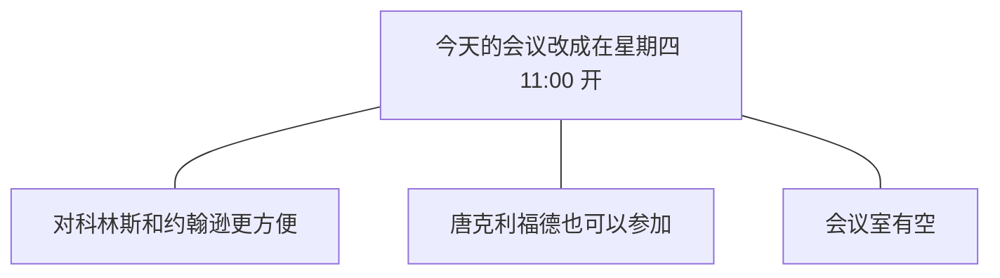

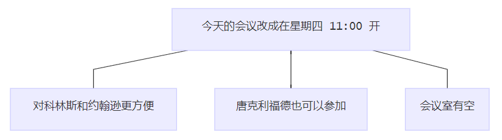

------

- 结论
  - 今天的会议改在星期四 11:00 开
- 原因
  - 对科林斯和约翰逊更方便
  - 唐克利福德也可以参加
  - 会议室有空

------

　　 1967年还很少有人接受我的理论，但是麦肯锡公司却有一些智者大度地指出在我的理论中存在的问题，并帮助我进行修正。现在，明托金字塔原理已经成为麦肯锡公司的公司标准，并被麦肯锡公司看作是其公司理念和规范的一个重要组成部分。

　　 1973年，我离开了麦肯锡公司，开始向各行各业的人们宣传我的理论。截至目前，我已向全世界约10 000人讲授过金字塔原理，他们中既有来自管理咨询公司的，也有来自社会各界人士。我在1981年和1987年出版过本书的两较早版本，并在1981年编制一套相关录像教程，在1985年开发了一套相关的计算机教学课件。1996年，我还推出新版的录像教程。

　　 我很高兴地看到，由于我所做的种种努力，明托金字塔原理已经成为管理者和咨询业的实际行业标准，而且其中最基本的一规则已经被社会各界的许多课程所吸纳，并在各地广为传授。

　　 在不断的教学过程中，包括在最近修订新版录像教程的过程中，我又获得了一些新的发现，这将有助于我进一步充实和完善原理论的各个部分。我还发现，金字塔原理除了能够帮助人们以书面形式组织和表达思想以外，还具有更广泛的作用。从具体的方面说，金字塔原理可以适用于确定问题、 分析问题的过程；而从更宏观的方面说，金字塔原理可以整个写作过程的组织和管理进行指导。

　　 本书是关于金字塔原理的最新版本，收录了我从1987年至今获得和发现的所有关于思维表达方面的体会和技巧。与旧版相比，本书增加了新的章节，如介绍如何界定问题和分析问题，以及如何从视觉的角度出发，在纸张和屏幕上演示金字塔结构。

　　 本书分为四大部分，即四篇。

　　 第一篇（写作的逻辑），同以前的版本没太大的区别，主要对金字塔原理的概念进行了解释，并介绍了如何利用这一原理构建基本的金字塔结构。本篇的内容足以使你理解和使用简单文书的写作技巧。

　　 第二篇（思考逻辑），介绍了如何深入细致地的把握思维的细节，以保证你使用的语句能够真实地反映你希望表达的思想要点。本篇列举了许多实例，突出了强迫自己进行“冷静思维”对明确表达思想的重要性。

　　 第三篇（解决问题的逻辑），是全新的内容，主要针对的对象是需要写研究分析报告的人士、以及需要对复杂的问题进行分析、提出结论供决策者使用的人士。本篇介绍了如何在解决问题过程中的不同阶段使用多种框架组织你的分析过程，使你的思维实际上进行了预先组织，从需能够列方便地应用金字塔原理。

　　 第四篇（演示的逻辑），介绍了一些演示技巧，能够帮助你在以幻灯片等书面形式演示具有金字塔结构的思想时，使读者或观众感受到金字塔结构的存在。

　　 本书还附有三个附录。附录一涉及的是分析法和科学法在解决问题过程中的区别；附录二列举了序言部分的各种常用写作模式；附录三是本书要点的详细提纲，其中突出了本的关键概念和关键思维技巧，以便读者快速查阅。

　　 实际应用明托金字塔原理需要相当毅力。但是，如果你有意地以书中介绍的方法强迫自己“先想后写” ， 的写作能力肯定能够得到惊人的改善，使你能够：

1. 减少完成最终一稿通常所需的时间；
2. 增加文章的条理性；
3. 减少文章长度。最重要的是使你能够在最短的时间内写出简明扼要、思路清晰的文章。　　

巴巴拉.明托

1996年于伦敦

# 目录

[TOC]

# 第 1 篇　　写作的逻辑

## 引言

　　人们在工作中遇到的最不愉快的一件事可能就是要写东西，几乎所有的人都认为写作是令人烦恼的事，他们都希望自己能够更“会写”。许多人还曾经被专门告之：如果他们希望在事业上有发展，就必须提高写作的能力。

　　多数人无法在写作上取得较大提高的原因，是他们认为“写得更清楚一点”就意味着使用更简单、更直接的句子。诚然，人们在文章中使用的句子的确经常过于冗长、句子关系表达也过于笨拙。他们使用的语言经常过于专业、过于抽象，段落中的句子关系有时也安排得比较差。

　　但是，以上这些问题都属于写作风格（style）的范畴。对于一个已经完了学院正规教育的人来说，改变写作风格的难度太大。这不是因为人们无法改变写作风格，而是因为改变写作风格就像学习打字，需大量的重复练习，而多数正在企业和政府中供职的人们根本没有这么多时间，因此，他们还将不断地接受“写得再清楚一点”之类的告诫。

　　但是，文章条理不清还有一个比上面提到的这种原因更普遍，但也更容易改正的原因。这个原因同文章的结构（structure）——也就是句子的组织顺序有关（不管句子本身写得是好是坏）。如果某人写出的文章条理不清，很可能是因为其表达思想时采用的顺序与读者的理解力发生了矛盾。

　　对读者来说，最容易理解的顺序先了解主要的、抽象的思想，然后再了解次要的、为主要思想提供支持的思想。因为主要思想总是从资要思想中概括出来的，文章中所有思想的理想组织结构也就是必定是一个金字塔结构——由一个总的思想统领多组思想。在这种金字塔结构中，思想之间的联系方式可以是纵向的（vertically）——即任何一个层次上的思想都是对其下面一个层次上的思想的总结；也可以是横向上的（horizontally）——即多个思想因共同组成同一个逻辑推断式，而被并列组织在一起。

　　我们可以很容易地使读者了解以金字塔结构组织思想——先从金字塔的最顶部开始，沿各个分支向下展开。首先表达的主要思想将使读者对作者这样表述产生某种疑问，而主要思想的（金字塔结构中的）下一个层次上的思想将对此问题作出回答。通过不断地进行疑问/回答式的对话，读者就可以了解文章中的所有思想。

　　对文章所述思想作出的疑问/回答式反应是人类的一种自然反应，没有国籍和民族的差别。人类还有一个共同的特点，即只有以某种方式将思想表达出来——说出来或写下来，我们才能够准确地把握自己的思想。幸运的是，人们弄清自己思想所需要用到的结构也是金字塔结构。因此，写作者在强迫自己将思想组织成金字塔结构后将发现，准确把握自己的思想也有助于其本人写出条理清楚、意义明确的句子。

　　本篇的主要部分解释了为什么读者最容易对金字塔结构作出反应，以及组成金字塔结构的子结构之间如何相关联；介绍了如何利用以上知识确定需要写入文章的思想，以及如何为这些思想确清晰的相互关系；细致地分析了序言部分的逻辑，并澄清了演绎和归纳这个两个容易令人混淆的概念

　　这一部分将帮助你理解和掌握如何将希望表达的思想组织成简单的金字塔结构。本篇在最后部分说明了使用金字塔原理能够检查作者思想的有效性、一致性和完整性，还能够帮助作者发现遗漏的思想，并进一步创造性地发展其思维。

---

## 第一章　　为什么选择金字塔结构？

　　如果有人希望通过阅读你的文章了解你对某一问题的看法，那么他面临的将是一项复杂的任务。因为即使你的文章篇幅很短，譬如只有两页纸，谙中也会包括一约 100 个句子。读者必须阅读每一句话、理解每一句话，并且将每一句话互相关联，融会贯通。如果你的文章结构呈金字塔形，文章的思路自金字塔顶部开始逐渐向下展开，那么读者肯定会发现你的文章比较容易读懂。这一结论反映了我地思维工作方式的一基本发现：

* 大脑自动将信息归到金字塔结构的不同分组中，以便于理解。

- 任何预先归到金字塔结构中的思想组都更加易于理确。

- 这说明任何书面文书都应有意地将其思想组织成金字塔结构

　　下面将具体说明具有金字塔结构的思想指的是什么。
### 将思想组织成金字塔结构

　　人们在很早以前就认识到，大脑会自动将其发现的所有事物以某种秩序组织起来。基本上，大脑会认为一同发生的任何事物之间都存在某种关联，并且会将这些事物按某种逻辑模式组织起来。举个例子，古希腊人向星空眺望时，看到是由星辰组成的各种图案，而不是散乱的星辰。这个例子证明人脑具有将事物进行归类组织的特点。

　　大脑会将其认为具有“共性”的任何事物组织在一起。“共性”指的是具有某种类似的共同特点或所处的位置比较接近。我们再看一个例子：

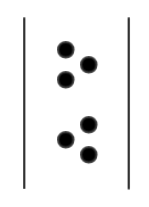

　　无论是谁，乍一看到上面的六个黑点，都会认为共有两组黑点，每组三个。造成这种印象的原因主要是有些黑点之间的距离比另一些黑点这间的距离大。

　　将事物组织成为逻辑单元无疑具有极大的作用。为了说明这一点，请阅读下面几组彼此之间通常并无联系的名词。

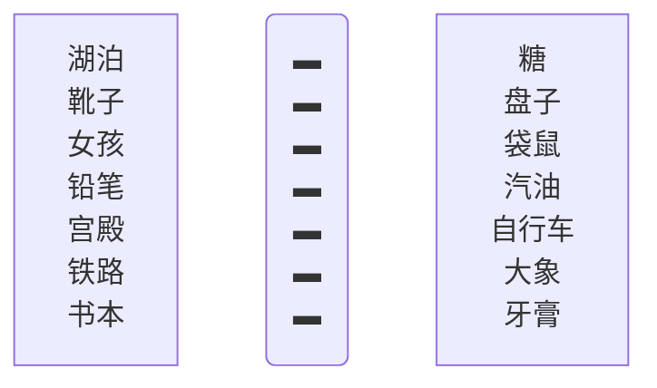

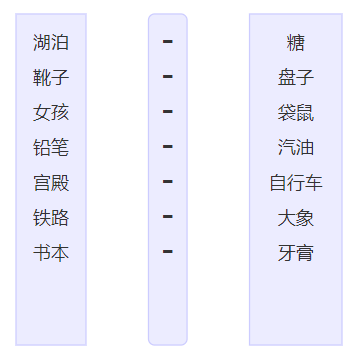

　　现在，你试着设想一个可能使每两个名词发生联系的情景，并将其“组织”在一起，譬如：糖在湖水中溶解，或靴子立在盘子上，等等。然后将右边的一列词盖住，只看左边一列词。你是否还能记起右边对应的词？大多数人都可以毫不费力地做到这一点。

　　当你听别人说话或者阅读文章时，也会发生类似的对思想进行组织的现象。你会将同时出现的或位置相邻的几个思想联系在一起，并努力以某种逻辑模式将其组织起来。这种逻辑模式必定是金字塔结构，因为只有金字塔结构才能够满足大脑的以下要求：

* 仅记忆 7 个以内的思想式概念；
* 找出其逻辑关系。

### 神奇的数字 7

　　人一次能够理解的思想或概念的数量是有限的。举个例子，假设你决定离开温暖、舒适的客厅，出去买一份报纸，你对你的妻子说：“我想去买份报纸，你有什么要我带的吗？”

> 
　　“太好了，看到电视上那么多葡萄广告，我现在特想吃葡萄。”妻子在你走向衣柜拿外衣时说，“也许你还可以再买点牛奶。”
>
> 
　　你从衣柜中拿出外衣，妻子则走进了厨房。
>
> 
　　“我看看碗橱里的土豆够不够。对了，我想起来了，我们已经没有鸡蛋了。我看看，对我们是訪买一些土豆了。”
>
> 
　　你穿上外衣向门口走去。
>
> 
　　“再多买此胡萝卜，也可以买些桔子。”
>
> 
　　你打开房门。
>
> 
　　“还有黄油。”
>
> 
　　你开始下楼梯。
>
> 
　　“苹果”
>
> 
　　你坐进汽车。
>
> 
　　“再买点酸奶”
>
> 
　　“还有没有？”
>
> 
　　“没有了，谢谢你，亲爱的。”

　　如果不重新读一遍上面的文字，现在你还能记住妻子让你买的　９　样东西吗？大多数男人回家时可能只买了报纸和葡萄。

　　出现这种情况的主要原因是，你遇到了“神奇的数字　７　”。这个术语是由乔治·A·米勒在他的论文《神奇的数字 7 ± 2》中提出来的。米勒认为，大脑的短期记忆无法一次容纳约 7 个以上的记忆项目。有的人可能一次记住 9 个项目，而有的人则只能记住 5 个（我就只能记住 5 个）。大脑比较容易记住的是3个项目，当然最容易记住的是一个项目。

　　这就意味着，当大脑发现其需要处理的项目数量增加到4个或5个以上时，就会开始将其归类到不同的逻辑范畴中，以便于记忆。在上面的例子中，大脑很可能会将需购物品按超市的不同区域进行归类。

　　为了说明这种方式的作用，请阅读以下购物清单。每看到一件物品时，就按以上方法将其归类。这样就很可能记住所有的9项物品。

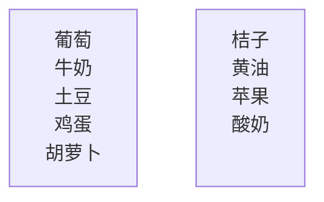

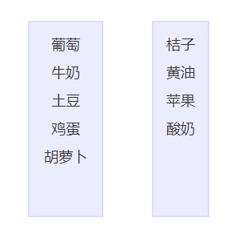

　　如果你试着想象一下这个过程，你就会发现，你已经建立了几个在各项目之间存在逻辑关系的金字塔结构。

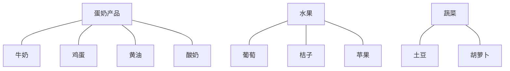

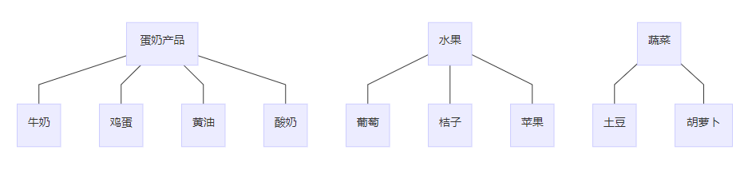

### 找出逻辑关系

　　显然，仅仅以逻辑的方式将思想或概念分组是不够的，还必须找出其逻辑关系。分类的作用不只是为了将一组 9 个概念，分成每组有 4 个、3 个和 2 个概念的三组概念，因为这样合起来仍是 9 个概念。你所要做的是提高一个抽象层次，将大脑需要处理的 9 个项目变成 3 个项目。

　　这就是说，你无须记住 9 个概念中的每一个概念，而仅仅需要记忆 9 个概念分别所属的 3 个组。你的思维抽象程度就高了一层，但是由于处于较高层次的思想总是能够提示其下面一个层次的思想，而且这种关系不像前面编造的湖泊与糖那样牵强，因而也更容易记忆。

　　所有的思维过程（如：思考、记忆、解决问题）显然都在使用这种分组和概括的方式，以便将人们大脑中的信息组织成一个由互相关联的金字塔组成的巨大的联合体。如果你需要同具有这种思维方式的人交流，你所要做的，就是确保你说的内容能够符合其金字塔体系中的某一部分。

　　现在我们要谈一谈实际汇通问题。如果你本人清楚地“了解”这些思想或概念组，那么，就这些思想或概念组同别人进行交流，也就是要使对方同样“了解”这些思想或概念组。但是，正如我前面举的妻子让你买东西的例子一样，你只能一项一项地提出各个概念。我们发现最有效的方法是先提出总的概念，再列出具体项目。也就是说，要自上而下地组织思想。

### 自上而下组织思想

　　 控制你表达思想的顺序是做到清晰写作的唯一最重要的行为，而最清楚的顺序就是先提出总结性思想，然后再提出被总结的具体思想。关于这一点我需要再三强调。

　　读者（或听众）的大脑只能逐句理解作者表达的思想。他们会假定一同出现的思想在逻辑上存在某种联系。如果你不预先告诉他们这种逻辑关系，而只是逐句表达你的思想，读者会自动从中录找某种共同点，将你表达的思想进行归类组合，以便了解各个组合的意义。

　　但是，由于人们的知识背景和理解力千差万别，他们很少能够对你表达的思想组作出与你完全一样的解读。事实上，如果你不预先告诉读者某一组思想之间的逻辑关系。他们很有可能会认为某一组中的思想之间根本没有任何联系。退一步说，即使人们能够作出与你完全相同的解读，你也使他们的阅读增加了难度，因为他们必须自己找出这种未被说明的逻辑关系。

　　下面我将举例说明，除自上而下的顺序以外，任何其他顺序都可能造成误解。假设我和你正在酒吧喝啤酒，突然我对你说：

> 
　　上个星期我去了趟苏黎世。你知道，苏黎世是一个非常保守的城市。我们到一家室外餐馆吃饭，你知道吗？在 15 分钟内我至少见到了 15 个留胡须或胡髭的人。

　　我说这番话是向你传达了一个信息，但是我并没有意识到，你会主动推测我向你传达这个信息的原因。也就是说，你会将我说的这番话看做是一组还未表达出的思想的一部分，你会假设某种可能的原因，并据此调整你的思路，准备接着听后面的话。这种预期性的准备能够减少大脑进行信息分析的负担，因为你无须分析随后接收的每一个信息的所有特征，而只需录找与前面信息相同的特征。

　　于是，你可能会认为，“她在谈论苏黎世已变得不再保守”，或“她准备把苏黎世同其他城市进行比较”，甚至“她很迷恋男人的胡须或胡髭”。无论你作出什么反应，你的大脑都在等待关于以上话题的进一步信息，而不管实际的后续信息如何。我看到你一脸茫然，就接着说：

> 
　　而且，如果你在任何一家纽约的办公室周围转一转，你会发现几乎没有一个不留短络腮胡子或胡髭的人。

　　现在我想达的是什么思想呢？我似乎并不是在比较城市，倒像是在比较城市中的白领职员；而且我想表达的似乎也不只是胡须和胡髭，还包括各种面部毛发。这时你也话会认为，“也话她不喜欢男人面部蓄须；也话她想比较不同办公室职员的蓄须方式；也许她对专业机构如此此容忍职员蓄须感到惊讶。”不管怎样，你含混地嘟哝了几句，算是对我所说的话的反应，于是我不得不接着说下去：

> 
　　当然，面部蓄须多年以前就已经是伦敦街头的一景了。

　　“噢，”你想，“我终于明她想说什么 了。她想说伦敦在这方面比其他城市发展得都更早。”于是你把你理解的意思告诉了我。你的理解在逻辑上完全合理，但根本不是我想表达的意思。事实上，我想表达的思想是：

> 
　　你知道吗？我简直难以想信，在商业圈子里，男人面部蓄须已达了如此被广泛接受的程度。
>
> 
　　在苏黎世……
>
> 
　　在纽约……
>
> 
　　还有，在伦敦……

　　看，一旦告诉你判断每句话之间关系的框架，你就可以非常容易地以我希望你采取的方式来理解我所表达的这组思想。读者在摄入信息时，总是在录找一种能够将所摄入信息联系起来的结构。为了保证读者找到的结构就是你希望他采纳的结构，你必须提前把这种结构告诉他们——这样他们就知道要寻找哪个共同点。否则，读者很可能会发现某种非你所望的逻辑关系，甚至可能根本发现不了任何关系，这样妈是在浪费你的时间，也是在浪费读者的时间。

　　请看下面这篇关于男女同酬的文章的开头。这个例子就是一个读者找不到逻辑关系的例证：

> 
　　即使享有同酬待遇，妇女的处境也可能比以前更差——以就是说，同现在想比，女性和男性的平均收入的差距将不会缩小，反而会扩大。
>
> 
　　对雇主来说同酬指的是对相同的岗位或相同的工作价值应支付相同的报酬。
>
> 
　　采用任何一种解释都意味着：
>
> 
　　迫使雇主为自身利益采取行动；或者通过男性员工结束限制性措施。

　　虽然这段文字的作者自认为是“自上而下”展开论述的，但这段文字向你提供的 5 个思想之间并无清晰的逻辑关系。你是不是为了试图找到各思想之间的联系而绞尽脑汁，最后仍不得不因为实在找不到相关联系而愤然放弃？这种繁重的思维负担是常人难以承受的。

　　无论读者的智商有多高，他们可利用的思维能力都很有限。一部分思维能力用于识加盟和解读所读到的词语，另一部分用于找出各种思想之间的关系，剩下的思维能力则用于理解所表述思想的涵义。

　　你可能通过有效的法表达你的思想，减少读者用在前两项活动上的时间，从而使读者能够用最少的脑力来理解你所表达的思想。相反，如果读者必须不断的在上下文中寻找某种联系，那么这种思想表述的顺序就是不适当的，大多数读者也会对不断地寻找句子之间的逻辑关系感到厌烦。

　　概括地说，读者必然会将所读到的思想进行归类概括，以便记住这些思想。如果作者传达结读者的思想事先已经经过归类和概括，并且按自上而下的顺序表述出来，读者就能更容易地理解作者所表述的思想。以上说明，条理清楚的书面文书应当具有金字塔结构，并且不断“自上而下”也向读者传递信息（虽然在写作之初作者的思维是“自下而上”进行的）。

### 自下而上思考

　　如果你准备将你所有的信息归类概括，并以自上而下的方式表达出来，那么你的文章结构看上去可能会像图 1-1 所示。每一个方框代表你希望表达的某一种思想。你的思维从最底部的层次开始，将句子按革种逻辑顺序组织成段落，然后再将段落组织成章节，最后将章节组织成完整的文章，而代表这篇完整文章的则金字塔最项部的一个思想。

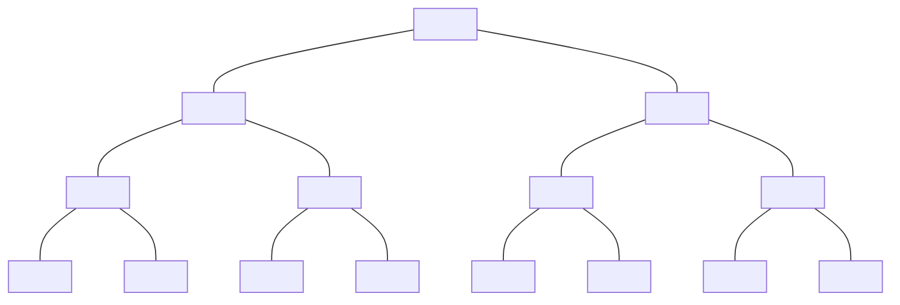

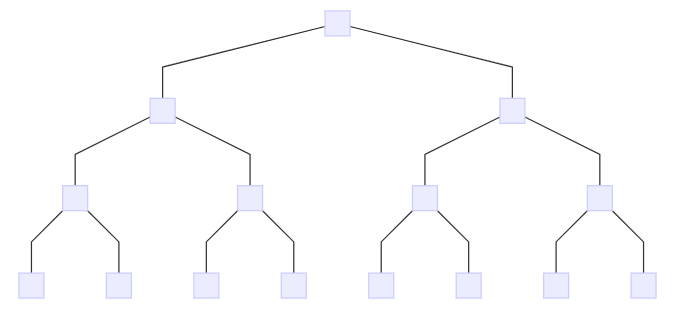

图 1-1 文章中的思想应该形成单一思想统领下的金字塔结构

　　如果你仔细想一想你在写作时的实际思维过程，你会发现，你在总结主要思想时的确使用了这种自下而上的方式。在金字塔结构的最底层，你将包含单个思想或概念的句子组织成为段落。

　　假充你要将六个句子组织成一个段落。为什么你要将这六个句子组织在一起，而不是包括其他句子？原因很明显，就是你认为这六个句子中具有某种逻辑关系，而这种逻辑关系总是要求所有这六个句子共同解释或支持由其组成的段落所表述的单一思想（即对这六个句子的准确概括）。兴个例子，你不将五个关于金融方面的句子和一个关于网球方面的句子组织在一起，因为他们这间的相互关系难以用一句概括性的句子表达出来。

　　得出这个概括性的句子后，你的思维抽象程度就搞高了一个层次，并且可以将得出概括性句子段落看做只包含一个思想，而不是六个思想。通过这种有效的方法，你可以接着将三全段落（每个段落都包含一个抽象程度比单个句子高一个层次的单一思想）组织成一个章节。

　　你将这三个段落而不是其他段落组织在一起，也是因为段落之间存在某种逻辑关系，而这种逻辑关系又总是要求所有这三个段落共同解释或支持由其组成的章节所表述的单一思想（即对这三个段落的概括）。

　　将章节组只成文章也完全按照以上思路进行。你将三个章节组织在一起（每个章节都由一段落组成，而每个段落也都由一组句子组成），因为所有这三个章节必须共同支持由其组成的文章所表述的单一思想（即对这三个章节的概括）。

　　因为你总是要不断地对思想进行归类和概括，直到没有可与之关联的思想可继续概括，因此，你写的每一篇文章的结构都必定只支持一个思想，即概括了所有各组思想的单一思想。这一思想应当就是你希望表达的思想，而所有在其之下的思想则越往下越具体越详细（如果你正确地建立了文章结构），并且都对你希望表达的主题思想起着解释和支持作用。

　　幸运的是，你可以通检查你的思想是否以金字塔结构相互关联，从而预先确定你是否正确地建立了文章的结构。具体地说，文章中的思想必须符合以下规则：

1. 文章结构中任一层次上的思想都必须是其下一层次思想的概括。
2. 每一组中的思想都必须属于同一范畴。
3. 每一组中的思想都必须按逻辑顺序组织。

　　下面我解释一下文章中的思想为什么都“必须”符合这些规则：

**1.文章结构中任一层次上的思想都必须是其下一层次思想的概括**

　　第一条规则说明，你在思维和写作中的主要活动，就是将较具体的思想概括抽象为新的思想。正如我们在上文看到的，段落的主题就是对段落中各个句子的概括；章节的主题也是对章节中各个段落的概括；依此类推。

　　但是，如果你准备从一组句子或段落中概括出一个主题，那么首先这些句子组或段落组必须经过适当的组织。这就要求有第二和第三条规则。

**2.每一组中的思想都必须属于同一范畴**

　　如果你希望将某一组思想的抽象程度提高一个层次，那这一组的中的思想必须在逻辑上具有共同点。例如，你可以符合逻辑地将苹果和梨归类概括为水果，也可以将桌子椅子归类概括为家具。但是怎样才能将苹果和椅子将在同一个组中呢？仅仅提高一个抽象层次是不够的，因为下一个抽象层次是水果和家具的范畴。因此，你必须提高到更新的层次，将其概括为“物品”和“无生命物体”，但是这这的概括过于宽泛，难以说明该组思想之间的逻辑关系。

　　在写作中，你希望表达的思想就是每组思想的逻辑关系直接蕴涵的思想，也就是说，每组中的思想都必须属于同一逻辑范畴。因此，如果某组思想中的第一个思想是做某件事的一个原因，那该组中的其他思想也必须是做同样一件事的其他原因。如果某组中的第一个思想是某个过种的一个步骤，那么该组中的其他思引导也必须是同一过程的其他步骤。如果某组中的第一个思想是某公司面临的一个问题，那么该组中的其他思想也必须是与之相关的问题。依此类推。

　　检查你将思想分组的一个简便方法，就是你是否能够用一个复数名词表示该组的所有思想。根据这一方法，该组中的所有思想都可以被冠以“建议”、“原因”或“问题”、“需要进行的改变”等名词。思想的种类没有限制，但每一组中的思想都必须属于同一范畴，都必须能够用一个复数名词表示。本书第三篇的第六章和第七章将进一步阐述如何确何将想同范畴的思想组织在一起。

**3.每一组中的思想都必须按照逻辑顺序组织**

　　也就是说，必须有明确的理由说明为什么把第二思想入在第二位，而不是放在第一位或第三位。本书第六章将详细介绍如何确定适当的逻辑顺序。组织思想基本上只有四种可能的逻辑顺序：

- 演绎顺序（大前提、小前提、结论）
- 时间顺序（第一、第二、第三）
- 结构顺序（波士顿、纽约、华盛顿）
- 重性顺序（最重要、次重要，等等）

　　你所选择的逻辑顺序反映了你在组织思想时的分析过程。如果思想的组织方式是演绎护理，那么这些思想的逻辑顺序就是论证顺序；如果思想按因果关系组织，那么其逻辑顺序就是时间顺序；如果是对某种现有结构进行评论，那其逻辑顺序就是结构顺序；如果按类别组织思想，那么其逻辑顺序就是重要性顺序。因为演绎推理、发现因果关系、化整为零和归纳总结是大脑可进行的仅有的四种分析活动，因此，这四种顺序也是大脑可用于组织思想的仅有的四种顺序。

　　所以，写出条理清楚的文章的关键，实际上就是在开始写作之前先将你的思想放金字塔结构，并根据以上规则进行检验。如果不能符合以上任何规则，就说明你的思维尚存在问题，或者你的思想还没有得到充分完善，或者你组织思想的方式不能立刻使读者理解你表达的信息。这时，你可以对你的思想进行修正或改变，以使其能够符合金字塔原理的规则，从而免去反复改写文章的烦恼。
---

## 第二章　　金字塔中的子结构

　　如第一章所述，条理清晰的文章所表达的各个思想之间都具有明确的逻辑关系，以便组成总体上的金字塔结构（参见图 2-1 ）。这样的文章总是自金字塔的顶端开始、自上而下地沿每一个分支结构将其思想逐渐呈现给读者。

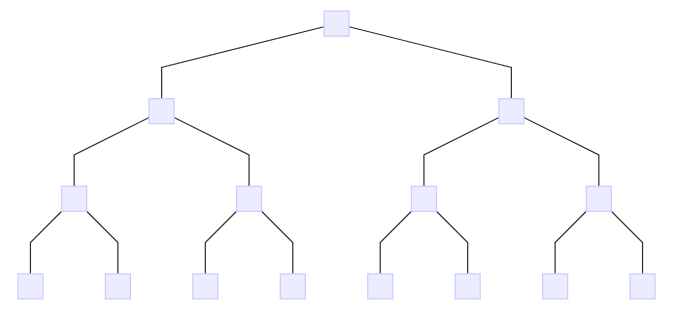

图 2-1　　文章中的思想应该组成由单一思想统领的金字塔结构

　　由于金字塔的规则非常明确，如果在开始写作之前，你就已经十分了解你想要表达的思想，你就可以相对容易地将要表达的思想组织成规范的金字塔结构。但是，大多数人刚坐下来开始写作时，可能对他们想要表达的思想还只有一个模糊的想法，甚至根本不知如何下笔。在你不得不用话语或文字将你的思想用符号表示出来之前，你很可能无法准确地了解自己的思想。甚至边你认为已经构思好的第一个思想，写出来都可能不是十分准确。

　　因此，不要幻想一坐下来就开始将思想组织成金字塔结构。首先你必须发现想要表达的思想。金字塔结构包括的一些子结构能够加快你发现思想的过程。这些子结构是：

- 主题和子主题之间的纵向关系
- 子主题之间的横向关系
- 序言的讲故事式结构

　　下面我将详细解释以上这些逻辑关系。在第三章中，我还将介绍如何利用这些逻辑关系发现、分类和组织思想，以便你本人和读者都能够清楚地理解你的思想。
### 纵向关系

　　有些非常明显的事实可能也需要经过漫长的时间才能被人们认识。一个典型的例子就是阅读的过程。一般的文章都是一维的（one - dimensional）:一个句子接着一个句子，在纸面上基本呈现出纵向向下的结构。但是这种文字的纵向延续却掩盖了一个事实，即思想是位于不同的抽象层次上的。根据这一事实，大主题下的任何思想都同时与文章中的其他思想发生着纵向及横向的联系。

　　纵向联系能够很好地吸引读者的主意力。通过纵向联系，你可以建立一种疑问/回答式的对话，从而使读者带着极大的兴趣了解你的思维发展为。什么我们可以肯定读者一定会感兴趣？因为这种纵向联系迫使读者按照你的思想作出符合逻辑的反应。

　　你放在金字塔结构中每一个方框中的就是一个“思想”（idea）。在本书中，我将“思想”定义为“向读者发出新信息并引起读者疑问的语句”。（人们一般不会阅读他们已经了解的内容，因此，也可说，表达思想的主要目的就是向读者传递新的信息。）

　　为了向读者传递新的信息而进行的表述必然会使读者就其逻辑性产生疑问——例如：“为什么会这样？”“怎样才能这样？”或者“为什么你这样说？”作为文章的作者，你必须在该表述的下一个层次横向地对该问题作出回答。但是，你的回答仍然是向读者传递他不知道的新信息，这又使读者产生新的疑问，于是你又在再下一个层次对新疑问作出回答。

　　你将一断地按照“引起读者疑问并回答疑问”的模式继续你的写作，直到你认为读者不会再对你的新表述提出任何疑问为止。（读者不一定会同意作者从第一个表述到最后一个表述的思维发展方式，但是至少能够明确地了解作者的思路，而这就是任何作者都期望的最佳效果。）至此，作者就可以离开金字塔结构的自费一个分支，返回关键句（ Key Line ）层次，继续回答由金字塔最顶端方框中的思想引起的初始疑问。

　　因此，要想吸引读者的全部注意力，必须在作者做好回答问题的准备之前，避免引起读者的疑问；也必须在引起读者疑问之前，避免先提供对该问题的回答。例如，只要你发现某篇文章在提出主要观点之前先出了题为“我们的假设”的章节，你就可以肯定，文章的作者根本没有给读者提出疑问的机会，就先给出了问题的答案。这样，在作者与读者对话的相应阶段，就不得不重复传递（或重复阅读）以上信息。

　　金字塔结构具有一种神奇的力量，迫使你只有在读者需要的时候才提供相应的信息。下面让我们看几个例子。图 2-2 是从G•K•切斯特顿写的文章中搞出的一个幽默故事。我选择这个例子的原因是，它能够使你了解纵向的疑问/回答式对话怎样吸引读者的注意力，而同时又能使作者无需考虑表达内容的模向逻辑关系。

　　切斯特顿说，猪应该被当作宠物；读者当然会为“为什么这么说？”。切斯特顿说：“有两个原因：首先，猪很漂亮；其次，猪可以培育出多种品种。”

> 
　　读者：为什么说猪很漂亮？
>
> 
　　切斯特顿：猪很漂亮，因为猪很肥，而且具有英国既强势又仁慈的特征。
>
> 
　　读者：肥胖有什么漂亮的？
>
> 
　　切斯特顿：肥胖能够使人显得更苗条，也能够使肥胖者更谦虚。

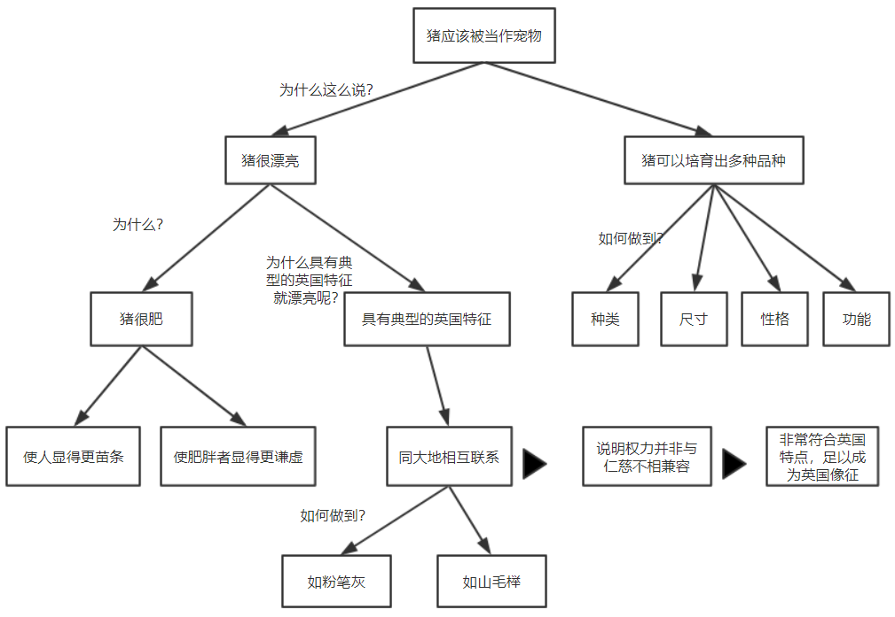

图 2-2 金字塔结构建立疑问/回答式对话

　　至此，虽然你显然不会同意切斯特顿的论述，但至少你能够明白他的论述过程。你能够清楚地了解切斯特顿为什么作出如上表述，也显然不需要再提出疑问以进一步了解其推理过程。于是，切斯特顿可以继续他的另一部分的论述，即猪漂亮是因为它们有英武的英国特征。

> 
　　读者：为什么具有典型的英国特征就漂亮呢？
>
> 
　　切斯特顿：猪同大地是互相联系的，这种联系说明权力并非与仁慈不相兼容，这种态度是很符合英国特点的，也非常美好，足以成为英国国家的象征。

　　同样，你可能会对这种观点持不同意见，但是你能够很清楚地了解切斯特顿这样表述原因。这种表述之所以清晰，是因为其思想的组织一直紧紧围绕着回答由主题引起的问题。最后一部分关于猪的品种的论述，也能够同样清楚地被读者理解。

　　如图 2-3 所示，你还可以在商业报告的写作中发现作者使用了同样的支巧。这是一份 20 页的商业备忘录的文章结构。这份备忘录的主题是建议购买英国菜兰公司(Leyland)的特许经销权（当然是在许多年以前）。建议购买特许经销权有三个原因，在每个原因下一层次，都对读者可能提出的疑问作出了回答。由于文章的论述过程非常清晰，读者所要做的只是决定自己是否同意作者的观点，并提出相关的逻辑问题。

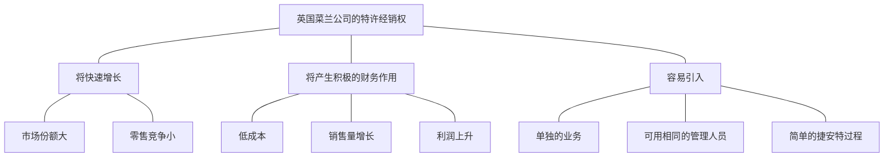

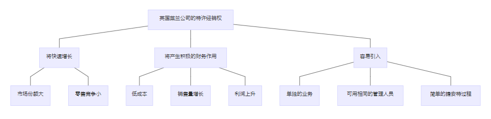

图 2-3 所有文章都应该具有疑问/回答式对话结构

　　综上所述，金字塔结构的巨大价值，就在于迫使你在理清你的思路时，对纵向的疑问/回答式逻辑关系在视觉上清晰化。你所做的每一个表述都应当引起读者的疑问，而你也必须在这一表述以下的结构层次上横向地地读者的疑问予以回答。
### 横向关系

　　当考虑在下一结构层次上如何表述时，必须保证你的表述能够回答在其上一个结构层次的表述所引起的疑问，同时还必须保证表述符合逻辑。也就是说，表述必须具有明确的归纳或演绎关系，但不可同时既具有归纳关系、又具有演绎关系。在组织思想时，归纳和演绎是仅有的两种可能的逻辑关系。

　　演绎性思想组合是由几项承前启后的论述组成的。也就是说，第一个思想是对当今世界上的某种现象的表述；第二个思想是对该句子的主语或谓语进行的表述；第三个思想则说明了以上两种表述同时在世界上存在时所具有的隐含意义。因此，演绎性思想组合具有以下形式：

- 所有的人都会死。
- 苏格拉底是一个人。
- 因此苏格拉底会死。

　　你需要概括演绎性思想组中的论述，以提高一个抽象层次。你的概括主要基于最后一个表述：“因为苏格拉底是一个人，所以苏格拉底会死。”

　　归纳性思想组中的思想仅仅因为你能够用同一个复数名词（支持的原因、反对的原因、步骤、问题，等等）表示它们而互相关联。归纳论述方式的形式是：

- 法国坦克已抵达波兰边境
- 德国坦克已抵达波兰边境
- 俄国坦克已抵达波兰边境

　　为了提高一个抽象层次，你需要判断以上句子的共同点（即：都是针对波兰的战争行为），并得出一个推论。你的推论可能是“波兰将受到坦克入侵”或类似的思想。

　　如果你选择以演绎法回答由某个思想引起的疑问，你就必须进行三段论式的论述。其中，第二个思想是对第一个思想的主语或谓语作出的表述，而第三个思想则从以上两个思想中得出推论。如果你选择以归纳法回答由某个思想引起的疑问，你就必须保证该组思想在逻辑上具有共同点，并且可以由一个复数名词表示。

　　了解了以上知识后，现在你已经可以随时从某一思想开始构建你的金字塔结构，并在需要时加入其他思想（向上、向下或横向）。但是，在你着手构建自己的金字塔结构之前，还需要了解一件事，这就是你的文章需要回答的初始问题（即读者将提出的第一个疑问）。你可以通过讲故事式的序言确定初始问题。
### 序言结构

　　此前，我们已经了解到，金字塔结构可以使用你同读者不断地进行疑问/回答式的对话。但是，除非引导发这种疑问/回答式对话的句子与读者具有关联，否则这种疑问/回答式对话也无法吸引读者的注意力。保证出现这一关联的惟一办法，这就是使这个句子直接回答你发现的业已存在于读者头脑中的某一问题。

　　虽然此前我还说过，写作主要目的是告诉别人他们不知道的信息。但是，读者只有在需要了解问题的答案时才会去找答案；如果读者没有这种需要，就不会提出任何疑问；反之亦然。

　　因此，为了保证你的文章能够引起读者注意，你必须使其能够回答读者头脑中业已存在的某个问题，或才是读者对周围发生的事情进行短暂的思考后可能会提出的问题。文章的序言部分可以通过追溯问题的起源和发展来确定这一问题。

　　问题的起源和发展必然以讲故事的形式出现，因此也应当按照典型的讲故事的模式发展。就是说，开头应向读者说明“情境( Stiuation )”的时间和地点。在这一“情境”中应当生了某件事情称为“冲突( Complication )”，使读者提出（或将使用读者提出）你文章中将要回答( Answer )的“( Question )”。

　　这种典型的讲故事式讲解——情境、冲突、疑问、回答——能够使你确保在引导读者了解你的思维过程之前，你和读者是“站在同一地点”。这种模式还能够使你明确地将思想的重点放在文章的最前端。这也是判断你是否以最直接的方式伟递正确信息的一种办法。

　　为了说明以上观点，请看下面这段商业报告中常见的序言部分：

> 本备忘录的目的是为了进一步思考和讨论以下问题而收集观点：
>
> 1. 董事会的组成及其最适宜的人数
> 2. 董事会和执行委员会的一般作用、具体职责及相互关系
> 3. 使外部董事会成员成为有效的参与者
> 4. 董事会成员的选举和任期的有关规则
> 5. 就董事会和执行委员会的运作，公司可采取的其他方式

　　请注意，当作者以讲故事的模式撰写备忘录的序言部分时，读者理解备忘录的目的和信息将会变得容易许多：

> 
　　10 月份新建的机构将管理该机构两个部门的所有日常事务的全部权力和责任，这些原本都完全由两个部门的经理负责。这一举措将董事会从琐事中解脱出来，全力处理董事会独有的决策和规划等宏观事务。
>
> 
　　但是，因为董事会长期深陷于处理短期运营问题，现在无法有效地将工作重心转移到长期战略发展上。因此，董事会必须考虑实现工作重心转移需要进行的变革。具体地说，我们认为董事会必须考虑实现工作重转移需要进行的变革。具体地说，我们认为董事会应当考虑如下变革：
>
> - 将日常运营事务交由执行委员会处理
> - 扩大董事会编制，吸纳外部董事参与
> - 建立规范内部运作的政策和程序

　　总之，序言部分以讲故事的形式向读者说明，你已经了解或预计将了解的你正在讨论的主题的一些信息，从而使读者想起他本人的、本篇文章也将要对之进行回答的问题。讲故事的序言部分说明了发生“冲突”的“情境”，以及“冲突”引发的“疑问”，而这个“疑问”正是你的文章将要“回答”的。一量你提出了对该“疑问”的“回答”（即位于文章金字塔结构顶端的思想），就会使读者产生新的疑问，于是你也就要在文章结构的下一层次上对新的疑问予以回答。

　　这三种子结构（即纵向的疑问/回答式对话、横向的演绎或归纳逻辑、讲故事式的序言结构）能够帮助你找到构建金字塔所需的思想。了解了纵向关系，你就可以确定某一层次上的思想组必须表达哪种信息（即：必须回答针对上一层次思想提出的疑问）。了解了横向关系，你就可以判断，你组织在一起的思想是否以符合逻辑的方式表达了这种信息（即：是否属于正确的归纳或演绎论述）。更重要的是，了解读者最早提出的问题，将确保你组织起来的思想与读者有关联（即：文章中的思想有助于回答读者的初始问题）。

　　现在你一定希望以一种有序的方式应用以上规则。第三章将告诉你如何做到这一点。

## 第三章　　如何构建金字塔结构

　　当你坐下来开始写作时，你常会遇到这样的情况：你只是大致知道要写什么，但并不清楚你具体想表达什么，以及如何表达。即使你知道你最终表达出的思想必定会组成一个金字塔结构，你仍然会怀有这种不确定感。

　　但是，实际上你对将要完成的“成品”已经了解得很多。首先，你知道在你的文章的金字塔结构顶端将有一个包括主语和谓语的句子。其次，你知道这个句子的语言就是文章的主题。

　　此外，你还知道这个句子是对读者头脑中业已存在的某个问题的回答。当在（读者有所了解的）某个“情境”中发生了（读者所了解的）某种“冲突”，就会相发读者的“疑问”，而回答这个“疑问”就是你要写作的动机。你可能还大致知道将要表达的一些要点、。

　　这些对你来说已经不少了。你可以利用你知道的这些知识自上而下或自下而上地构建文章的金字塔结构。自上而下的方法通常比自下而上的方法容易一些，因此应当首先尝试使用自上而下的方法。

### 自上而下法

　　自上而下地构建金字塔结构通常较容易一些，因为你开始思考的是你最容易确定的事情，即文章的主题，以及读者对该主题的了解情况（你将在文章的序言部分使读者重温其了解的情况）。

　　但是，你还不能现在就坐下来，开始写序言部分。你应当先利用序言部分的结构，将头脑中的正确观点逐个理出来。为了做到这一点，我建议你遵循图 3-1 中的流程。具体说明如下：

**1.画出主题方框**

　　
=======
# 金字塔原理

# 前言

　　 1973 年，我出版了一套关于“金字塔原理(The Pyramid Principle)”的书，共六册，介绍了一种可以解决写作思路不清晰问题的新方法。我在书中提到，条理清晰的文章几乎一眼就能够看出来，因为这种文章都具有清晰的金字塔结构(Pyramimdal Structure)，而条理不清楚的文章则肯定不具备金字塔结构。

　　 金字塔结构中的各种思想之间只有非常少的几中逻辑关系（向上、向下或横向联系），这种简单性使我们有可能找到这些逻辑关系的一般性规则。我认为，要想写出条理清晰的文章，关键是在开始写作之前，先将作者的思想组织成金字塔结构，并按照逻辑关系的有关规则进行检查和修改。　　 金字塔结构中的各种思想之间只有非常少的几中逻辑关系（向上、向下或横向联系），这种简单性使我们有可能找到这些逻辑关系的一般性规则。我认为，要想写出条理清晰的文章，关键是在开始写作之前，先将作者的思想组织成金字塔结构，并按照逻辑关系的有关规则进行检查和修改。

　　 以上观点是我先后在麦肯锡管理咨询公司(Mckinsey & Company)的克利夫兰分支机构和伦敦分支机构工作时逐渐总结出来的。1963 年，麦肯锡公司从哈佛商学院的8名女性学员中聘请我作为该公司的第一位女性咨询顾问。不久，麦肯锡公司就认定我在处理数字方面无可救药，但在写作方面却还算一把好手。于是，公司将我派往伦敦，去帮助那些需要用英语写报告的欧洲人。

　　 有意思的是，当我开始研究有关写作方面的资料时，我发现，虽然世界上有无数关于如何写作句子和段落的书，但却几乎没有关于如何组织思想的书，而思想才是句子和段落所要表达的内容，仅有的几本涉及此问题的书只是泛泛地谈了谈“要有逻辑性”、“要有一个有逻辑的提纲”之类的东西。看完这些资料，我还是不知道究竟如何才能将“有逻辑性” 提纲和“无逻辑性” 的提纲区别开来，便开始自己去探寻实用的方法。于是我发现了金字塔原理。

　　 金字塔原理可以适用于任何需要条理清晰的文章。下面我举一非常简单的例子，看看按金字塔结构组织的思想和未经过组织的思想在表达上效果会产生多大的差别：

　　

**未经作者组织的思想**

　　 约翰.科林斯来电话说他3点钟不能参加会议。哈尔.约翰逊说他不介意晚一点开会，把会放在明天开也可以，但10:30以前不行。唐克利福德的秘书说，唐克利福德明天较晚时间才能从法兰克福敢回来。会议室明天已经有人预订了，但星期四还没有人预订。会议 时间定在星期四11点修似乎比较合适。您看行吗？ 　　

---

* 人员情况 
  * 科林斯 今天不行  
  * 约翰逊 明天 11:30 以前不行 
  * 唐克利福德 星期四以前不行
* 会议室情况 
  * 明天不可用（已被别人预订）
  * 星期四可预订 
* 结论
  *  星期四开会可以吗？ 

---

**金字塔结构的思想**

　　 我们可以将今天的会议改在星期四 11 点开吗？因为这样对科林斯和约翰逊都会更方便，唐克利福德也可以参加，并且本周只有这一天会议室还没有被预订。

------

- 结论
  - 今天的会议改在星期四 11:00 开
- 原因
  - 对科林斯和约翰逊更方便
  - 唐克利福德也可以参加
  - 会议室有空

------

　　 1967年还很少有人接受我的理论，但是麦肯锡公司却有一些智者大度地指出在我的理论中存在的问题，并帮助我进行修正。现在，明托金字塔原理已经成为麦肯锡公司的公司标准，并被麦肯锡公司看作是其公司理念和规范的一个重要组成部分。

　　 1973年，我离开了麦肯锡公司，开始向各行各业的人们宣传我的理论。截至目前，我已向全世界约10 000人讲授过金字塔原理，他们中既有来自管理咨询公司的，也有来自社会各界人士。我在1981年和1987年出版过本书的两较早版本，并在1981年编制一套相关录像教程，在1985年开发了一套相关的计算机教学课件。1996年，我还推出新版的录像教程。

　　 我很高兴地看到，由于我所做的种种努力，明托金字塔原理已经成为管理者和咨询业的实际行业标准，而且其中最基本的一规则已经被社会各界的许多课程所吸纳，并在各地广为传授。

　　 在不断的教学过程中，包括在最近修订新版录像教程的过程中，我又获得了一些新的发现，这将有助于我进一步充实和完善原理论的各个部分。我还发现，金字塔原理除了能够帮助人们以书面形式组织和表达思想以外，还具有更广泛的作用。从具体的方面说，金字塔原理可以适用于确定问题、 分析问题的过程；而从更宏观的方面说，金字塔原理可以整个写作过程的组织和管理进行指导。

　　 本书是关于金字塔原理的最新版本，收录了我从1987年至今获得和发现的所有关于思维表达方面的体会和技巧。与旧版相比，本书增加了新的章节，如介绍如何界定问题和分析问题，以及如何从视觉的角度出发，在纸张和屏幕上演示金字塔结构。

　　 本书分为四大部分，即四篇。

　　 第一篇（写作的逻辑），同以前的版本没太大的区别，主要对金字塔原理的概念进行了解释，并介绍了如何利用这一原理构建基本的金字塔结构。本篇的内容足以使你理解和使用简单文书的写作技巧。

　　 第二篇（思考逻辑），介绍了如何深入细致地的把握思维的细节，以保证你使用的语句能够真实地反映你希望表达的思想要点。本篇列举了许多实例，突出了强迫自己进行“冷静思维”对明确表达思想的重要性。

　　 第三篇（解决问题的逻辑），是全新的内容，主要针对的对象是需要写研究分析报告的人士、以及需要对复杂的问题进行分析、提出结论供决策者使用的人士。本篇介绍了如何在解决问题过程中的不同阶段使用多种框架组织你的分析过程，使你的思维实际上进行了预先组织，从需能够列方便地应用金字塔原理。

　　 第四篇（演示的逻辑），介绍了一些演示技巧，能够帮助你在以幻灯片等书面形式演示具有金字塔结构的思想时，使读者或观众感受到金字塔结构的存在。

　　 本书还附有三个附录。附录一涉及的是分析法和科学法在解决问题过程中的区别；附录二列举了序言部分的各种常用写作模式；附录三是本书要点的详细提纲，其中突出了本的关键概念和关键思维技巧，以便读者快速查阅。

　　 实际应用明托金字塔原理需要相当毅力。但是，如果你有意地以书中介绍的方法强迫自己“先想后写” ， 的写作能力肯定能够得到惊人的改善，使你能够：

1. 减少完成最终一稿通常所需的时间；
2. 增加文章的条理性；
3. 减少文章长度。最重要的是使你能够在最短的时间内写出简明扼要、思路清晰的文章。　　

巴巴拉.明托

1996年于伦敦

# 目录

[TOC]

# 第 1 篇　　写作的逻辑

## 引言

　　人们在工作中遇到的最不愉快的一件事可能就是要写东西，几乎所有的人都认为写作是令人烦恼的事，他们都希望自己能够更“会写”。许多人还曾经被专门告之：如果他们希望在事业上有发展，就必须提高写作的能力。

　　多数人无法在写作上取得较大提高的原因，是他们认为“写得更清楚一点”就意味着使用更简单、更直接的句子。诚然，人们在文章中使用的句子的确经常过于冗长、句子关系表达也过于笨拙。他们使用的语言经常过于专业、过于抽象，段落中的句子关系有时也安排得比较差。

　　但是，以上这些问题都属于写作风格（style）的范畴。对于一个已经完了学院正规教育的人来说，改变写作风格的难度太大。这不是因为人们无法改变写作风格，而是因为改变写作风格就像学习打字，需大量的重复练习，而多数正在企业和政府中供职的人们根本没有这么多时间，因此，他们还将不断地接受“写得再清楚一点”之类的告诫。

　　但是，文章条理不清还有一个比上面提到的这种原因更普遍，但也更容易改正的原因。这个原因同文章的结构（structure）——也就是句子的组织顺序有关（不管句子本身写得是好是坏）。如果某人写出的文章条理不清，很可能是因为其表达思想时采用的顺序与读者的理解力发生了矛盾。

　　对读者来说，最容易理解的顺序先了解主要的、抽象的思想，然后再了解次要的、为主要思想提供支持的思想。因为主要思想总是从资要思想中概括出来的，文章中所有思想的理想组织结构也就是必定是一个金字塔结构——由一个总的思想统领多组思想。在这种金字塔结构中，思想之间的联系方式可以是纵向的（vertically）——即任何一个层次上的思想都是对其下面一个层次上的思想的总结；也可以是横向上的（horizontally）——即多个思想因共同组成同一个逻辑推断式，而被并列组织在一起。

　　我们可以很容易地使读者了解以金字塔结构组织思想——先从金字塔的最顶部开始，沿各个分支向下展开。首先表达的主要思想将使读者对作者这样表述产生某种疑问，而主要思想的（金字塔结构中的）下一个层次上的思想将对此问题作出回答。通过不断地进行疑问/回答式的对话，读者就可以了解文章中的所有思想。

　　对文章所述思想作出的疑问/回答式反应是人类的一种自然反应，没有国籍和民族的差别。人类还有一个共同的特点，即只有以某种方式将思想表达出来——说出来或写下来，我们才能够准确地把握自己的思想。幸运的是，人们弄清自己思想所需要用到的结构也是金字塔结构。因此，写作者在强迫自己将思想组织成金字塔结构后将发现，准确把握自己的思想也有助于其本人写出条理清楚、意义明确的句子。

　　本篇的主要部分解释了为什么读者最容易对金字塔结构作出反应，以及组成金字塔结构的子结构之间如何相关联；介绍了如何利用以上知识确定需要写入文章的思想，以及如何为这些思想确清晰的相互关系；细致地分析了序言部分的逻辑，并澄清了演绎和归纳这个两个容易令人混淆的概念

　　这一部分将帮助你理解和掌握如何将希望表达的思想组织成简单的金字塔结构。本篇在最后部分说明了使用金字塔原理能够检查作者思想的有效性、一致性和完整性，还能够帮助作者发现遗漏的思想，并进一步创造性地发展其思维。

---

## 第一章　　为什么选择金字塔结构？

　　如果有人希望通过阅读你的文章了解你对某一问题的看法，那么他面临的将是一项复杂的任务。因为即使你的文章篇幅很短，譬如只有两页纸，谙中也会包括一约 100 个句子。读者必须阅读每一句话、理解每一句话，并且将每一句话互相关联，融会贯通。如果你的文章结构呈金字塔形，文章的思路自金字塔顶部开始逐渐向下展开，那么读者肯定会发现你的文章比较容易读懂。这一结论反映了我地思维工作方式的一基本发现：

* 大脑自动将信息归到金字塔结构的不同分组中，以便于理解。

- 任何预先归到金字塔结构中的思想组都更加易于理确。

- 这说明任何书面文书都应有意地将其思想组织成金字塔结构

　　下面将具体说明具有金字塔结构的思想指的是什么。
### 将思想组织成金字塔结构

　　人们在很早以前就认识到，大脑会自动将其发现的所有事物以某种秩序组织起来。基本上，大脑会认为一同发生的任何事物之间都存在某种关联，并且会将这些事物按某种逻辑模式组织起来。举个例子，古希腊人向星空眺望时，看到是由星辰组成的各种图案，而不是散乱的星辰。这个例子证明人脑具有将事物进行归类组织的特点。

　　大脑会将其认为具有“共性”的任何事物组织在一起。“共性”指的是具有某种类似的共同特点或所处的位置比较接近。我们再看一个例子：

　　无论是谁，乍一看到上面的六个黑点，都会认为共有两组黑点，每组三个。造成这种印象的原因主要是有些黑点之间的距离比另一些黑点这间的距离大。

　　将事物组织成为逻辑单元无疑具有极大的作用。为了说明这一点，请阅读下面几组彼此之间通常并无联系的名词。

　　现在，你试着设想一个可能使每两个名词发生联系的情景，并将其“组织”在一起，譬如：糖在湖水中溶解，或靴子立在盘子上，等等。然后将右边的一列词盖住，只看左边一列词。你是否还能记起右边对应的词？大多数人都可以毫不费力地做到这一点。

　　当你听别人说话或者阅读文章时，也会发生类似的对思想进行组织的现象。你会将同时出现的或位置相邻的几个思想联系在一起，并努力以某种逻辑模式将其组织起来。这种逻辑模式必定是金字塔结构，因为只有金字塔结构才能够满足大脑的以下要求：

* 仅记忆 7 个以内的思想式概念；
* 找出其逻辑关系。

### 神奇的数字 7

　　人一次能够理解的思想或概念的数量是有限的。举个例子，假设你决定离开温暖、舒适的客厅，出去买一份报纸，你对你的妻子说：“我想去买份报纸，你有什么要我带的吗？”

> 
　　“太好了，看到电视上那么多葡萄广告，我现在特想吃葡萄。”妻子在你走向衣柜拿外衣时说，“也许你还可以再买点牛奶。”
>
> 
　　你从衣柜中拿出外衣，妻子则走进了厨房。
>
> 
　　“我看看碗橱里的土豆够不够。对了，我想起来了，我们已经没有鸡蛋了。我看看，对我们是訪买一些土豆了。”
>
> 
　　你穿上外衣向门口走去。
>
> 
　　“再多买此胡萝卜，也可以买些桔子。”
>
> 
　　你打开房门。
>
> 
　　“还有黄油。”
>
> 
　　你开始下楼梯。
>
> 
　　“苹果”
>
> 
　　你坐进汽车。
>
> 
　　“再买点酸奶”
>
> 
　　“还有没有？”
>
> 
　　“没有了，谢谢你，亲爱的。”

　　如果不重新读一遍上面的文字，现在你还能记住妻子让你买的　９　样东西吗？大多数男人回家时可能只买了报纸和葡萄。

　　出现这种情况的主要原因是，你遇到了“神奇的数字　７　”。这个术语是由乔治·A·米勒在他的论文《神奇的数字 7 ± 2》中提出来的。米勒认为，大脑的短期记忆无法一次容纳约 7 个以上的记忆项目。有的人可能一次记住 9 个项目，而有的人则只能记住 5 个（我就只能记住 5 个）。大脑比较容易记住的是3个项目，当然最容易记住的是一个项目。

　　这就意味着，当大脑发现其需要处理的项目数量增加到4个或5个以上时，就会开始将其归类到不同的逻辑范畴中，以便于记忆。在上面的例子中，大脑很可能会将需购物品按超市的不同区域进行归类。

　　为了说明这种方式的作用，请阅读以下购物清单。每看到一件物品时，就按以上方法将其归类。这样就很可能记住所有的9项物品。

　　如果你试着想象一下这个过程，你就会发现，你已经建立了几个在各项目之间存在逻辑关系的金字塔结构。

### 找出逻辑关系

　　显然，仅仅以逻辑的方式将思想或概念分组是不够的，还必须找出其逻辑关系。分类的作用不只是为了将一组 9 个概念，分成每组有 4 个、3 个和 2 个概念的三组概念，因为这样合起来仍是 9 个概念。你所要做的是提高一个抽象层次，将大脑需要处理的 9 个项目变成 3 个项目。

　　这就是说，你无须记住 9 个概念中的每一个概念，而仅仅需要记忆 9 个概念分别所属的 3 个组。你的思维抽象程度就高了一层，但是由于处于较高层次的思想总是能够提示其下面一个层次的思想，而且这种关系不像前面编造的湖泊与糖那样牵强，因而也更容易记忆。

　　所有的思维过程（如：思考、记忆、解决问题）显然都在使用这种分组和概括的方式，以便将人们大脑中的信息组织成一个由互相关联的金字塔组成的巨大的联合体。如果你需要同具有这种思维方式的人交流，你所要做的，就是确保你说的内容能够符合其金字塔体系中的某一部分。

　　现在我们要谈一谈实际汇通问题。如果你本人清楚地“了解”这些思想或概念组，那么，就这些思想或概念组同别人进行交流，也就是要使对方同样“了解”这些思想或概念组。但是，正如我前面举的妻子让你买东西的例子一样，你只能一项一项地提出各个概念。我们发现最有效的方法是先提出总的概念，再列出具体项目。也就是说，要自上而下地组织思想。

### 自上而下组织思想

　　 控制你表达思想的顺序是做到清晰写作的唯一最重要的行为，而最清楚的顺序就是先提出总结性思想，然后再提出被总结的具体思想。关于这一点我需要再三强调。

　　读者（或听众）的大脑只能逐句理解作者表达的思想。他们会假定一同出现的思想在逻辑上存在某种联系。如果你不预先告诉他们这种逻辑关系，而只是逐句表达你的思想，读者会自动从中录找某种共同点，将你表达的思想进行归类组合，以便了解各个组合的意义。

　　但是，由于人们的知识背景和理解力千差万别，他们很少能够对你表达的思想组作出与你完全一样的解读。事实上，如果你不预先告诉读者某一组思想之间的逻辑关系。他们很有可能会认为某一组中的思想之间根本没有任何联系。退一步说，即使人们能够作出与你完全相同的解读，你也使他们的阅读增加了难度，因为他们必须自己找出这种未被说明的逻辑关系。

　　下面我将举例说明，除自上而下的顺序以外，任何其他顺序都可能造成误解。假设我和你正在酒吧喝啤酒，突然我对你说：

> 
　　上个星期我去了趟苏黎世。你知道，苏黎世是一个非常保守的城市。我们到一家室外餐馆吃饭，你知道吗？在 15 分钟内我至少见到了 15 个留胡须或胡髭的人。

　　我说这番话是向你传达了一个信息，但是我并没有意识到，你会主动推测我向你传达这个信息的原因。也就是说，你会将我说的这番话看做是一组还未表达出的思想的一部分，你会假设某种可能的原因，并据此调整你的思路，准备接着听后面的话。这种预期性的准备能够减少大脑进行信息分析的负担，因为你无须分析随后接收的每一个信息的所有特征，而只需录找与前面信息相同的特征。

　　于是，你可能会认为，“她在谈论苏黎世已变得不再保守”，或“她准备把苏黎世同其他城市进行比较”，甚至“她很迷恋男人的胡须或胡髭”。无论你作出什么反应，你的大脑都在等待关于以上话题的进一步信息，而不管实际的后续信息如何。我看到你一脸茫然，就接着说：

> 
　　而且，如果你在任何一家纽约的办公室周围转一转，你会发现几乎没有一个不留短络腮胡子或胡髭的人。

　　现在我想达的是什么思想呢？我似乎并不是在比较城市，倒像是在比较城市中的白领职员；而且我想表达的似乎也不只是胡须和胡髭，还包括各种面部毛发。这时你也话会认为，“也话她不喜欢男人面部蓄须；也话她想比较不同办公室职员的蓄须方式；也许她对专业机构如此此容忍职员蓄须感到惊讶。”不管怎样，你含混地嘟哝了几句，算是对我所说的话的反应，于是我不得不接着说下去：

> 
　　当然，面部蓄须多年以前就已经是伦敦街头的一景了。

　　“噢，”你想，“我终于明她想说什么 了。她想说伦敦在这方面比其他城市发展得都更早。”于是你把你理解的意思告诉了我。你的理解在逻辑上完全合理，但根本不是我想表达的意思。事实上，我想表达的思想是：

> 
　　你知道吗？我简直难以想信，在商业圈子里，男人面部蓄须已达了如此被广泛接受的程度。
>
> 
　　在苏黎世……
>
> 
　　在纽约……
>
> 
　　还有，在伦敦……

　　看，一旦告诉你判断每句话之间关系的框架，你就可以非常容易地以我希望你采取的方式来理解我所表达的这组思想。读者在摄入信息时，总是在录找一种能够将所摄入信息联系起来的结构。为了保证读者找到的结构就是你希望他采纳的结构，你必须提前把这种结构告诉他们——这样他们就知道要寻找哪个共同点。否则，读者很可能会发现某种非你所望的逻辑关系，甚至可能根本发现不了任何关系，这样妈是在浪费你的时间，也是在浪费读者的时间。

　　请看下面这篇关于男女同酬的文章的开头。这个例子就是一个读者找不到逻辑关系的例证：

> 
　　即使享有同酬待遇，妇女的处境也可能比以前更差——以就是说，同现在想比，女性和男性的平均收入的差距将不会缩小，反而会扩大。
>
> 
　　对雇主来说同酬指的是对相同的岗位或相同的工作价值应支付相同的报酬。
>
> 
　　采用任何一种解释都意味着：
>
> 
　　迫使雇主为自身利益采取行动；或者通过男性员工结束限制性措施。

　　虽然这段文字的作者自认为是“自上而下”展开论述的，但这段文字向你提供的 5 个思想之间并无清晰的逻辑关系。你是不是为了试图找到各思想之间的联系而绞尽脑汁，最后仍不得不因为实在找不到相关联系而愤然放弃？这种繁重的思维负担是常人难以承受的。

　　无论读者的智商有多高，他们可利用的思维能力都很有限。一部分思维能力用于识加盟和解读所读到的词语，另一部分用于找出各种思想之间的关系，剩下的思维能力则用于理解所表述思想的涵义。

　　你可能通过有效的法表达你的思想，减少读者用在前两项活动上的时间，从而使读者能够用最少的脑力来理解你所表达的思想。相反，如果读者必须不断的在上下文中寻找某种联系，那么这种思想表述的顺序就是不适当的，大多数读者也会对不断地寻找句子之间的逻辑关系感到厌烦。

　　概括地说，读者必然会将所读到的思想进行归类概括，以便记住这些思想。如果作者传达结读者的思想事先已经经过归类和概括，并且按自上而下的顺序表述出来，读者就能更容易地理解作者所表述的思想。以上说明，条理清楚的书面文书应当具有金字塔结构，并且不断“自上而下”也向读者传递信息（虽然在写作之初作者的思维是“自下而上”进行的）。

### 自下而上思考

　　如果你准备将你所有的信息归类概括，并以自上而下的方式表达出来，那么你的文章结构看上去可能会像图 1-1 所示。每一个方框代表你希望表达的某一种思想。你的思维从最底部的层次开始，将句子按革种逻辑顺序组织成段落，然后再将段落组织成章节，最后将章节组织成完整的文章，而代表这篇完整文章的则金字塔最项部的一个思想。

图 1-1 文章中的思想应该形成单一思想统领下的金字塔结构

　　如果你仔细想一想你在写作时的实际思维过程，你会发现，你在总结主要思想时的确使用了这种自下而上的方式。在金字塔结构的最底层，你将包含单个思想或概念的句子组织成为段落。

　　假充你要将六个句子组织成一个段落。为什么你要将这六个句子组织在一起，而不是包括其他句子？原因很明显，就是你认为这六个句子中具有某种逻辑关系，而这种逻辑关系总是要求所有这六个句子共同解释或支持由其组成的段落所表述的单一思想（即对这六个句子的准确概括）。兴个例子，你不将五个关于金融方面的句子和一个关于网球方面的句子组织在一起，因为他们这间的相互关系难以用一句概括性的句子表达出来。

　　得出这个概括性的句子后，你的思维抽象程度就搞高了一个层次，并且可以将得出概括性句子段落看做只包含一个思想，而不是六个思想。通过这种有效的方法，你可以接着将三全段落（每个段落都包含一个抽象程度比单个句子高一个层次的单一思想）组织成一个章节。

　　你将这三个段落而不是其他段落组织在一起，也是因为段落之间存在某种逻辑关系，而这种逻辑关系又总是要求所有这三个段落共同解释或支持由其组成的章节所表述的单一思想（即对这三个段落的概括）。

　　将章节组只成文章也完全按照以上思路进行。你将三个章节组织在一起（每个章节都由一段落组成，而每个段落也都由一组句子组成），因为所有这三个章节必须共同支持由其组成的文章所表述的单一思想（即对这三个章节的概括）。

　　因为你总是要不断地对思想进行归类和概括，直到没有可与之关联的思想可继续概括，因此，你写的每一篇文章的结构都必定只支持一个思想，即概括了所有各组思想的单一思想。这一思想应当就是你希望表达的思想，而所有在其之下的思想则越往下越具体越详细（如果你正确地建立了文章结构），并且都对你希望表达的主题思想起着解释和支持作用。

　　幸运的是，你可以通检查你的思想是否以金字塔结构相互关联，从而预先确定你是否正确地建立了文章的结构。具体地说，文章中的思想必须符合以下规则：

1. 文章结构中任一层次上的思想都必须是其下一层次思想的概括。
2. 每一组中的思想都必须属于同一范畴。
3. 每一组中的思想都必须按逻辑顺序组织。

　　下面我解释一下文章中的思想为什么都“必须”符合这些规则：

**1.文章结构中任一层次上的思想都必须是其下一层次思想的概括**

　　第一条规则说明，你在思维和写作中的主要活动，就是将较具体的思想概括抽象为新的思想。正如我们在上文看到的，段落的主题就是对段落中各个句子的概括；章节的主题也是对章节中各个段落的概括；依此类推。

　　但是，如果你准备从一组句子或段落中概括出一个主题，那么首先这些句子组或段落组必须经过适当的组织。这就要求有第二和第三条规则。

**2.每一组中的思想都必须属于同一范畴**

　　如果你希望将某一组思想的抽象程度提高一个层次，那这一组的中的思想必须在逻辑上具有共同点。例如，你可以符合逻辑地将苹果和梨归类概括为水果，也可以将桌子椅子归类概括为家具。但是怎样才能将苹果和椅子将在同一个组中呢？仅仅提高一个抽象层次是不够的，因为下一个抽象层次是水果和家具的范畴。因此，你必须提高到更新的层次，将其概括为“物品”和“无生命物体”，但是这这的概括过于宽泛，难以说明该组思想之间的逻辑关系。

　　在写作中，你希望表达的思想就是每组思想的逻辑关系直接蕴涵的思想，也就是说，每组中的思想都必须属于同一逻辑范畴。因此，如果某组思想中的第一个思想是做某件事的一个原因，那该组中的其他思想也必须是做同样一件事的其他原因。如果某组中的第一个思想是某个过种的一个步骤，那么该组中的其他思引导也必须是同一过程的其他步骤。如果某组中的第一个思想是某公司面临的一个问题，那么该组中的其他思想也必须是与之相关的问题。依此类推。

　　检查你将思想分组的一个简便方法，就是你是否能够用一个复数名词表示该组的所有思想。根据这一方法，该组中的所有思想都可以被冠以“建议”、“原因”或“问题”、“需要进行的改变”等名词。思想的种类没有限制，但每一组中的思想都必须属于同一范畴，都必须能够用一个复数名词表示。本书第三篇的第六章和第七章将进一步阐述如何确何将想同范畴的思想组织在一起。

**3.每一组中的思想都必须按照逻辑顺序组织**

　　也就是说，必须有明确的理由说明为什么把第二思想入在第二位，而不是放在第一位或第三位。本书第六章将详细介绍如何确定适当的逻辑顺序。组织思想基本上只有四种可能的逻辑顺序：

- 演绎顺序（大前提、小前提、结论）
- 时间顺序（第一、第二、第三）
- 结构顺序（波士顿、纽约、华盛顿）
- 重性顺序（最重要、次重要，等等）

　　你所选择的逻辑顺序反映了你在组织思想时的分析过程。如果思想的组织方式是演绎护理，那么这些思想的逻辑顺序就是论证顺序；如果思想按因果关系组织，那么其逻辑顺序就是时间顺序；如果是对某种现有结构进行评论，那其逻辑顺序就是结构顺序；如果按类别组织思想，那么其逻辑顺序就是重要性顺序。因为演绎推理、发现因果关系、化整为零和归纳总结是大脑可进行的仅有的四种分析活动，因此，这四种顺序也是大脑可用于组织思想的仅有的四种顺序。

　　所以，写出条理清楚的文章的关键，实际上就是在开始写作之前先将你的思想放金字塔结构，并根据以上规则进行检验。如果不能符合以上任何规则，就说明你的思维尚存在问题，或者你的思想还没有得到充分完善，或者你组织思想的方式不能立刻使读者理解你表达的信息。这时，你可以对你的思想进行修正或改变，以使其能够符合金字塔原理的规则，从而免去反复改写文章的烦恼。
---

## 第二章　　金字塔中的子结构

　　如第一章所述，条理清晰的文章所表达的各个思想之间都具有明确的逻辑关系，以便组成总体上的金字塔结构（参见图 2-1 ）。这样的文章总是自金字塔的顶端开始、自上而下地沿每一个分支结构将其思想逐渐呈现给读者。

图 2-1　　文章中的思想应该组成由单一思想统领的金字塔结构

　　由于金字塔的规则非常明确，如果在开始写作之前，你就已经十分了解你想要表达的思想，你就可以相对容易地将要表达的思想组织成规范的金字塔结构。但是，大多数人刚坐下来开始写作时，可能对他们想要表达的思想还只有一个模糊的想法，甚至根本不知如何下笔。在你不得不用话语或文字将你的思想用符号表示出来之前，你很可能无法准确地了解自己的思想。甚至边你认为已经构思好的第一个思想，写出来都可能不是十分准确。

　　因此，不要幻想一坐下来就开始将思想组织成金字塔结构。首先你必须发现想要表达的思想。金字塔结构包括的一些子结构能够加快你发现思想的过程。这些子结构是：

- 主题和子主题之间的纵向关系
- 子主题之间的横向关系
- 序言的讲故事式结构

　　下面我将详细解释以上这些逻辑关系。在第三章中，我还将介绍如何利用这些逻辑关系发现、分类和组织思想，以便你本人和读者都能够清楚地理解你的思想。

#### 纵向关系

　　有些非常明显的事实可能也需要经过漫长的时间才能被人们认识。一个典型的例子就是阅读的过程。一般的文章都是一维的（one - dimensional）:一个句子接着一个句子，在纸面上基本呈现出纵向向下的结构。但是这种文字的纵向延续却掩盖了一个事实，即思想是位于不同的抽象层次上的。根据这一事实，大主题下的任何思想都同时与文章中的其他思想发生着纵向及横向的联系。

　　纵向联系能够很好地吸引读者的主意力。通过纵向联系，你可以建立一种疑问/回答式的对话，从而使读者带着极大的兴趣了解你的思维发展为。什么我们可以肯定读者一定会感兴趣？因为这种纵向联系迫使读者按照你的思想作出符合逻辑的反应。

　　你放在金字塔结构中每一个方框中的就是一个“思想”（idea）。在本书中，我将“思想”定义为“向读者发出新信息并引起读者疑问的语句”。（人们一般不会阅读他们已经了解的内容，因此，也可说，表达思想的主要目的就是向读者传递新的信息。）

　　为了向读者传递新的信息而进行的表述必然会使读者就其逻辑性产生疑问——例如：“为什么会这样？”“怎样才能这样？”或者“为什么你这样说？”作为文章的作者，你必须在该表述的下一个层次横向地对该问题作出回答。但是，你的回答仍然是向读者传递他不知道的新信息，这又使读者产生新的疑问，于是你又在再下一个层次对新疑问作出回答。

　　你将一断地按照“引起读者疑问并回答疑问”的模式继续你的写作，直到你认为读者不会再对你的新表述提出任何疑问为止。（读者不一定会同意作者从第一个表述到最后一个表述的思维发展方式，但是至少能够明确地了解作者的思路，而这就是任何作者都期望的最佳效果。）至此，作者就可以离开金字塔结构的自费一个分支，返回关键句（ Key Line ）层次，继续回答由金字塔最顶端方框中的思想引起的初始疑问。

　　因此，要想吸引读者的全部注意力，必须在作者做好回答问题的准备之前，避免引起读者的疑问；也必须在引起读者疑问之前，避免先提供对该问题的回答。例如，只要你发现某篇文章在提出主要观点之前先出了题为“我们的假设”的章节，你就可以肯定，文章的作者根本没有给读者提出疑问的机会，就先给出了问题的答案。这样，在作者与读者对话的相应阶段，就不得不重复传递（或重复阅读）以上信息。

　　金字塔结构具有一种神奇的力量，迫使你只有在读者需要的时候才提供相应的信息。下面让我们看几个例子。图 2-2 是从G•K•切斯特顿写的文章中搞出的一个幽默故事。我选择这个例子的原因是，它能够使你了解纵向的疑问/回答式对话怎样吸引读者的注意力，而同时又能使作者无需考虑表达内容的模向逻辑关系。

　　切斯特顿说，猪应该被当作宠物；读者当然会为“为什么这么说？”。切斯特顿说：“有两个原因：首先，猪很漂亮；其次，猪可以培育出多种品种。”

> 
　　读者：为什么说猪很漂亮？
>
> 
　　切斯特顿：猪很漂亮，因为猪很肥，而且具有英国既强势又仁慈的特征。
>
> 
　　读者：肥胖有什么漂亮的？
>
> 
　　切斯特顿：肥胖能够使人显得更苗条，也能够使肥胖者更谦虚。

图 2-2 金字塔结构建立疑问/回答式对话

　　至此，虽然你显然不会同意切斯特顿的论述，但至少你能够明白他的论述过程。你能够清楚地了解切斯特顿为什么作出如上表述，也显然不需要再提出疑问以进一步了解其推理过程。于是，切斯特顿可以继续他的另一部分的论述，即猪漂亮是因为它们有英武的英国特征。

> 
　　读者：为什么具有典型的英国特征就漂亮呢？
>
> 
　　切斯特顿：猪同大地是互相联系的，这种联系说明权力并非与仁慈不相兼容，这种态度是很符合英国特点的，也非常美好，足以成为英国国家的象征。

　　同样，你可能会对这种观点持不同意见，但是你能够很清楚地了解切斯特顿这样表述原因。这种表述之所以清晰，是因为其思想的组织一直紧紧围绕着回答由主题引起的问题。最后一部分关于猪的品种的论述，也能够同样清楚地被读者理解。

　　如图 2-3 所示，你还可以在商业报告的写作中发现作者使用了同样的支巧。这是一份 20 页的商业备忘录的文章结构。这份备忘录的主题是建议购买英国菜兰公司(Leyland)的特许经销权（当然是在许多年以前）。建议购买特许经销权有三个原因，在每个原因下一层次，都对读者可能提出的疑问作出了回答。由于文章的论述过程非常清晰，读者所要做的只是决定自己是否同意作者的观点，并提出相关的逻辑问题。

图 2-3 所有文章都应该具有疑问/回答式对话结构

　　综上所述，金字塔结构的巨大价值，就在于迫使你在理清你的思路时，对纵向的疑问/回答式逻辑关系在视觉上清晰化。你所做的每一个表述都应当引起读者的疑问，而你也必须在这一表述以下的结构层次上横向地地读者的疑问予以回答。

#### 横向关系

　　当考虑在下一结构层次上如何表述时，必须保证你的表述能够回答在其上一个结构层次的表述所引起的疑问，同时还必须保证表述符合逻辑。也就是说，表述必须具有明确的归纳或演绎关系，但不可同时既具有归纳关系、又具有演绎关系。在组织思想时，归纳和演绎是仅有的两种可能的逻辑关系。

　　演绎性思想组合是由几项承前启后的论述组成的。也就是说，第一个思想是对当今世界上的某种现象的表述；第二个思想是对该句子的主语或谓语进行的表述；第三个思想则说明了以上两种表述同时在世界上存在时所具有的隐含意义。因此，演绎性思想组合具有以下形式：

- 所有的人都会死。
- 苏格拉底是一个人。
- 因此苏格拉底会死。

　　你需要概括演绎性思想组中的论述，以提高一个抽象层次。你的概括主要基于最后一个表述：“因为苏格拉底是一个人，所以苏格拉底会死。”

　　归纳性思想组中的思想仅仅因为你能够用同一个复数名词（支持的原因、反对的原因、步骤、问题，等等）表示它们而互相关联。归纳论述方式的形式是：

- 法国坦克已抵达波兰边境
- 德国坦克已抵达波兰边境
- 俄国坦克已抵达波兰边境

　　为了提高一个抽象层次，你需要判断以上句子的共同点（即：都是针对波兰的战争行为），并得出一个推论。你的推论可能是“波兰将受到坦克入侵”或类似的思想。

　　如果你选择以演绎法回答由某个思想引起的疑问，你就必须进行三段论式的论述。其中，第二个思想是对第一个思想的主语或谓语作出的表述，而第三个思想则从以上两个思想中得出推论。如果你选择以归纳法回答由某个思想引起的疑问，你就必须保证该组思想在逻辑上具有共同点，并且可以由一个复数名词表示。

　　了解了以上知识后，现在你已经可以随时从某一思想开始构建你的金字塔结构，并在需要时加入其他思想（向上、向下或横向）。但是，在你着手构建自己的金字塔结构之前，还需要了解一件事，这就是你的文章需要回答的初始问题（即读者将提出的第一个疑问）。你可以通过讲故事式的序言确定初始问题。

#### 序言结构

　　此前，我们已经了解到，金字塔结构可以使用你同读者不断地进行疑问/回答式的对话。但是，除非引导发这种疑问/回答式对话的句子与读者具有关联，否则这种疑问/回答式对话也无法吸引读者的注意力。保证出现这一关联的惟一办法，这就是使这个句子直接回答你发现的业已存在于读者头脑中的某一问题。

　　虽然此前我还说过，写作主要目的是告诉别人他们不知道的信息。但是，读者只有在需要了解问题的答案时才会去找答案；如果读者没有这种需要，就不会提出任何疑问；反之亦然。

　　因此，为了保证你的文章能够引起读者注意，你必须使其能够回答读者头脑中业已存在的某个问题，或才是读者对周围发生的事情进行短暂的思考后可能会提出的问题。文章的序言部分可以通过追溯问题的起源和发展来确定这一问题。

　　问题的起源和发展必然以讲故事的形式出现，因此也应当按照典型的讲故事的模式发展。就是说，开头应向读者说明“情境( Stiuation )”的时间和地点。在这一“情境”中应当生了某件事情称为“冲突( Complication )”，使读者提出（或将使用读者提出）你文章中将要回答( Answer )的“( Question )”。

　　这种典型的讲故事式讲解——情境、冲突、疑问、回答——能够使你确保在引导读者了解你的思维过程之前，你和读者是“站在同一地点”。这种模式还能够使你明确地将思想的重点放在文章的最前端。这也是判断你是否以最直接的方式伟递正确信息的一种办法。

　　为了说明以上观点，请看下面这段商业报告中常见的序言部分：

> 本备忘录的目的是为了进一步思考和讨论以下问题而收集观点：
>
> 1. 董事会的组成及其最适宜的人数
> 2. 董事会和执行委员会的一般作用、具体职责及相互关系
> 3. 使外部董事会成员成为有效的参与者
> 4. 董事会成员的选举和任期的有关规则
> 5. 就董事会和执行委员会的运作，公司可采取的其他方式

　　请注意，当作者以讲故事的模式撰写备忘录的序言部分时，读者理解备忘录的目的和信息将会变得容易许多：

> 
　　10 月份新建的机构将管理该机构两个部门的所有日常事务的全部权力和责任，这些原本都完全由两个部门的经理负责。这一举措将董事会从琐事中解脱出来，全力处理董事会独有的决策和规划等宏观事务。
>
> 
　　但是，因为董事会长期深陷于处理短期运营问题，现在无法有效地将工作重心转移到长期战略发展上。因此，董事会必须考虑实现工作重心转移需要进行的变革。具体地说，我们认为董事会必须考虑实现工作重转移需要进行的变革。具体地说，我们认为董事会应当考虑如下变革：
>
> - 将日常运营事务交由执行委员会处理
> - 扩大董事会编制，吸纳外部董事参与
> - 建立规范内部运作的政策和程序

　　总之，序言部分以讲故事的形式向读者说明，你已经了解或预计将了解的你正在讨论的主题的一些信息，从而使读者想起他本人的、本篇文章也将要对之进行回答的问题。讲故事的序言部分说明了发生“冲突”的“情境”，以及“冲突”引发的“疑问”，而这个“疑问”正是你的文章将要“回答”的。一量你提出了对该“疑问”的“回答”（即位于文章金字塔结构顶端的思想），就会使读者产生新的疑问，于是你也就要在文章结构的下一层次上对新的疑问予以回答。

　　这三种子结构（即纵向的疑问/回答式对话、横向的演绎或归纳逻辑、讲故事式的序言结构）能够帮助你找到构建金字塔所需的思想。了解了纵向关系，你就可以确定某一层次上的思想组必须表达哪种信息（即：必须回答针对上一层次思想提出的疑问）。了解了横向关系，你就可以判断，你组织在一起的思想是否以符合逻辑的方式表达了这种信息（即：是否属于正确的归纳或演绎论述）。更重要的是，了解读者最早提出的问题，将确保你组织起来的思想与读者有关联（即：文章中的思想有助于回答读者的初始问题）。

　　现在你一定希望以一种有序的方式应用以上规则。第三章将告诉你如何做到这一点。

## 第三章　　如何构建金字塔结构

　　当你坐下来开始写作时，
>>>>>>> Stashed changes
