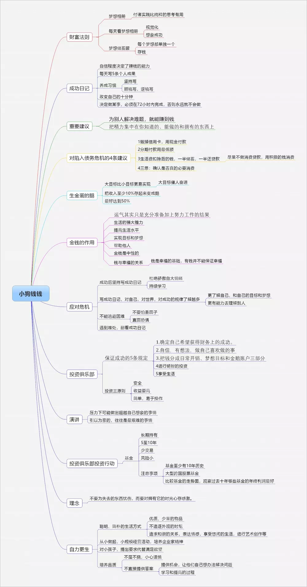

# 《小狗钱钱》读书笔记

# 1.关于金钱

## 1.1.金钱的意义

- 追求财富是我们与生俱来的权利

- 金钱是中性的，金钱本身既不会使人幸福，也不会带来不幸

  > 钱只会留在那些为之付出努力的人身边。用非法手段取得不义之财的人，反而会比没钱的时候感觉更糟糕。只有当钱属于某一个人的时候，它才会对这个人产生好的影响或者坏的影响。钱可以被用于好的用途，也可以被用于坏的用途

- 有了钱，才能够改善生活质量，才能生活得更有尊严

- 有了足够的钱，才能够更好地为自己和他人服务

  > 金钱能成为我们生活中非常强大的助推力。金钱可以在一定程度上提高我们的生活水平——生活的许多方面都是以钱为基础的。有了钱，我们就更容易实现我们的目标和梦想——当然，包括好的目标和梦想，也包括坏的目标和梦想

# 2.真正想要的是什么

## 2.1.确立最重要的目标

先列出最想实现的10个愿望，然后从中挑出3个最重要的。

 **为什么要确立几个最重要的目标？**

- 大多数人并不清楚自己想要的是什么，他们只知道，自己想得到更多的东西。像这样，由于没有明确目标反而什么都得不到

- 目标太多容易会分算精力，应该确定最关键的几个，逐一去实现

  > 一个人挣钱的多少是和他的自信心联系在一起的。另外，他的精力究竟是集中在自己的能力范围之内，还是放到了他力所不能及的事情上，这也是很重要的一点

## 2.2.如何达成目标

- 制作愿望清单，并每天回顾（强化自己的潜意识）

  > 它会不断地提醒你自己想得到什么，这你就会密切关注一切可以帮助你实现这些愿望的机遇了

- 准备一本相册，贴满与梦想有关的照片，每天看几遍，想象自己愿望达成时的样子（视觉化强化自己的潜意识）

  > 使用梦想相册使目标图象化、视觉化来强化自己的潜意识
  >
  > 你必须设想自己已经拥有了这些东西，这样你的一个小愿望才会变成一种强烈的渴望。你想象得越多，你的愿望就越强烈，那么你就会开始寻找机会来实现自己的梦想

- 准备梦想储蓄罐，将自己的收入中的至少10%存起来

  > 首先必须学会量入为出，只有这样，我们才有能力获得更多的钱。有了更多的钱，才能更好的为我们达成目标服务

- 付诸行为，并持之以恒

  > 要想过更幸福、更满意的生活，人就得改变自身。没有人能强迫你做你不愿意做的事情。只有你自己才能强迫自己去做

- 不能实验，只有两个选择——做或者不做

  > 如果你只是抱着试试看的心态，那么你只会以失败告终，你会一事无成。‘尝试’纯粹是一种借口，你还没有做，就已经给自己想好了退路。

- 改变思考问题的方式，以成功为导向

  > 不要总是想事情做不成的原因，应该想如何解决阻碍从而达成目标

# 3.成功最关键的因素

## 3.1.自信程度决定了是否能成功

是否能挣到钱，最关键的并不是你有没有好点子，也不是你有多聪明，而是你的自信程度。

- 为什么自信是最关键因素？

  > 你的自信程度决定了你是否相信自己的能力，是否相信你自己。
  >
  > 假如你根本不相信你能做到的话，那么你就根本不会动手去做，而假如你不开始去做，那么你就什么也得不到。

## 3.2.建立自信的方法

- 记录成功日记，每天写至少5条

  > 把所有做成功的事情记录进去。每次都写至少5条你的个人成果，任何小事都可以。开始的时候也许你觉得不太容易，可能会问自己，这件或那件事情是否真的可以算作成果。在这种情况下，你的回答应该是肯定的。过于自信比不够自信要好得多。

### 3.3.成功之道

- 第一，为别人解决一个难题，那么你就能赚到许多钱；

- 第二，把精力集中在你知道的、能做的和拥有的东西上。

  > 先想清楚自己喜欢做什么，然后再考虑怎么用它来挣钱

# 4.成功日记的重要性及作用

当你取得一些成功之后，不要停止写你的成功日记，这是很重要的。

## 4.1.建立自信的有效方法

> 每当你觉得有些事情不好办的时候，你可以做一件事，只要翻一翻成功日记，你就会从过去的事情中找到证据，相信自己未来也有能力完成任何事情

## 4.2.了解自己及自己愿望的一种方式

> 当你写成功日记的时候，你会对自己，对世界，还有对成功的规律作更深入的思考，会越来越多地了解自己和自己的愿望，这样你才会有能力去理解别人。彻底了解自己和世界上的所有秘密，是我们无法完全实现的一种理想，但我们可以一步一步地慢慢接近这种理想

## 4.3.应对恐惧的工具

> 恐惧总是出现在我们设想事情会如何不顺的时候。我们对失败的可能性想得越多，就会越害怕。而当你看着自己的成功日记时，你就会注意到那些成功的事情，自然而然也就会想到应该怎样去做
>
> **当你朝着积极的目标去思考的时候，就不会心生畏惧**
>
> 并非困难使我们放弃，而是因为我们放弃，才显得如些困难

# 5.付诸实施的关键——72小时定律

当你决定做一件事情的时候，你必须在72小时之内完成，否则你很可能永远不会再做了。

# 6.分清重要性和紧迫性

许多没有钱的人爱犯的错误。他们总是有那么多紧急的事情要做，以至于没有时间来关注重要的事情。

## 6.1.如保证在任何情况下都不偏离制订的目标？

- 必须每天不间断地去做对未来意义重大的事情

  > 你为此花费的时间不会超过10分钟，但是就是这10分钟会让一切变得不同。大多数人总是在现有的水平上停滞不前，就是因为他们没有拿出这10分钟。他们总是期望情况能向有利于自己的方向转变，但是他们忽视了一点，那就是他们首先必须改变自己。这10分钟就是你用来改变自己的最好机会。

- 即使有成千上万件事情可能让你分心，你每天也必须应该在固定的时间里，有规律地做未来意义重大的事情

# 7.如何处理债务？

当还清了债务的时候，所拥有的财产为零，也就是一无所有。一无所有并不是最终目标。

## 7.1.处理债务的方法

### 1.毁掉信用卡

> 因为大多数人在使用信用卡的时候，会比使用现金时花的钱要多得多

### 2.在许可范围内按最低的分期付款数目标准支付

> 为了能快一点儿还清贷款，人们往往选择每年付较高的分期付款，许多人和银行约定的分期付款数额刚好在他们承受能力的上限，因此他们手里的钱一直很紧张。在这样情况下，当有其它事件导致额外开消的时候，他们就会不停地申请新的贷款来偿还旧的贷款

### 3.将扣除生活费后剩下的钱的一半存起来，剩下的一半用于支付消费贷款。最好根本不申请消费贷款

> 只有这样，才有能力在不申请新的贷款的情况下，满足自己的愿望。也才能心安理得地、更好地享用这些东西。
>
> 消费贷款指的是与住房无关的贷款，例如购置新的汽车、家具、电视机或其他用于生活的商品而贷的款，就是消费贷款

### 4.消费前问自己“这真的有必要吗？”

> 首先必须学会量入为出，否则有了更多的钱只会带来更大的麻烦，因为支出往往会和收入一同增长，除非我们学会合理分配我们的财产

# 8养只下金蛋的鹅

- 先讲个故事：

  > 从前有一个年轻的农夫，他每天的愿望就是从鹅笼里捡一个鹅蛋当早饭。有一天，他竟然在鹅笼里发现了一只金蛋。当然，一开始他不相信这是真的。他想，也许是有人在捉弄他。为了谨慎起见，他把金蛋拿去让金匠看，可是金匠向他保证说，这只蛋完完全全是纯金铸成的。于是，农夫就卖了这只金蛋，然后举行了一个盛大的庆祝会。
  >
  > 第二天清晨，他起了一个大早，赶到鹅笼处一看，那里果真又放着一个金蛋。这样的情况延续了好几天。
  >
  > 可是这个农夫是一个贪婪的人，他对自己的鹅非常不满意，因为鹅没法向他解释是怎么下出金蛋的，否则也许他自己就可以制造金蛋了。他还气呼呼地想，这只懒惰的鹅每天至少应该下两只金蛋，现在这样的速度太慢了。他的怒火越来越大，最后，他终于怒不可遏地把鹅揪出鹅笼，劈成了两半。从那以后，他再也得不到金蛋了。

## 8.1.为什么要养金蛋鹅？

- 为了让能依靠它来生活

  > 你要花钱，这是对的，因为钱的用处正在于此。但是如果你想变得富有，你同时还要存钱，这笔钱是你绝不能再花的。这笔钱的用途为了让你能依靠它来生活。
  >
  > **就好比一只会下金蛋的鹅，存下的不会再花的这笔钱就是”鹅“，利息就是”金蛋“。鹅可以慢慢养大，从而获得更大的金蛋，但是如果不让鹅成长或者干脆把鹅杀死，那必定无法获得更多”金蛋“的，从而也根本谈不上依靠它来生活了。**

## 8.2.如何养金蛋鹅？

- 量入为出

  > 只为必要的消费买单

- 合理分配收入（养鹅、梦想储蓄罐、消费）

  > **将每份收入中的至少10%存起来，变为“鹅”，剩下的分为两部分，一部分用来放入我的梦想储蓄罐，另一部分用来消费**

- 一定要让鹅成长、千万千万别杀死鹅

# 9.将爱好做为职业

只有做自己喜欢的事情的人，才能真正获得成功

- 第一，无论在什么时候都不能把希望只寄托在一份工作上，它持续的时间不会像你设想的那么长，所以你要立即寻找另一份替代的工作

- 第二，你肯定会遇到一些困难，这些困难是你现在还难以预料的。做自己喜欢的事你才能坚持，你可以做一个有能力帮助别人的人，而别人也会相信你，愿意接受你的帮助

# 10.偶尔放弃熟悉环境、从事我们畏惧的事很重要？

- 你干的活最多只值报酬的一半，另一半报酬源于你的想法和实施这个想法的勇气。

- 生命中出现了最美好的东西，是因为我做了原本不敢做的事

- 最珍贵的礼物是我们自己争取来的。克服了丢面子的恐惧，世界就会向你敞开大门

- 如果你没有做今天这件事情，你就永远不会知道，给自己一些压力之后，你能够做到些什么。一个人觉得最引以为自豪的事情，往往是那些做起来最艰难的事情。这一点你千万不要忘记

# 11.股票

## 11.1.什么是股票？

- 公司向公众的筹集资金的一种方式

  > 股票是公司向公众的筹集资金的一种方式，使用公众的钱去运作公司，如果公司营利或者升值了，持有相应份额股票就可以得到相应的占比的回报

## 11.2.股票是如何运作的？

- 利用当前资金换取潜在价值

  > 决定一件东西价值多少的唯一因素就是，你愿意为它支付多少钱。当人们买入股票时，他们相信它有价值，相信公司未来会升值，相信投入的钱会随着公司的升值获得更多收益

## 11.3.收益是如何产生的？

- 分红

  > 公司要每年计算一次赢利，然后再决定把这些钱用来做什么。比如可以用一部分钱购买新设备，让公司运作得更好，其余部分分配给所有持有股份的人。这决定由所有持有股份的人，少数服从多数，这叫股东大会

- 公司升值

  > 随着公司的估值提升，有人会相信这些股份将来可以卖出一个更好的价钱，于是他们愿意出更高的价钱买入股份

## 11.4.风险如何？

- 公司的估值下降时，股票的价值也会同时下降

  > 这是是因为人们急于把手中的股票卖出以降低损失。但是只有当你出售股票的时候，你才会亏损。如果你保留着这些股份，将来可能会有人愿意付更多的钱来买进。在这期间，你参与所有的分红。每当公司赢利，就会把利润分配给所有持有股份的人，这叫红利

- 公司经营失败时，股东所投入钱必定也会遭受损失

# 12.基金

# 12.1.基金是什么？

基金是一种特定用途而集中的资金（特殊财产），可以做为一种理财工具和途径。它将用户的钱集中起来，由金融界的专家（基金经理人）去进行投资，通过专业人士的专业策略为用户带来收益。

# 12.1.它有那些优势

- 专人做专事，降低风险

- 不用自己花时间打理，不需要有相关的专业知识
- 相比股票，基金由于组成的成份多样，因而更安全

## 12.2.为什么股票型基金是安全的，而且可以为你带来丰厚的利润？

- 有专业人士、专业投资策略

- 组成基金的股票品种多且分算，抗风险能力强

- 通过利滚利的方式，从时间中赚收益

  > 如果我们打算投资买基金，就要准备把自己的钱在里面放上5～10年。对于那些能等这么长时间的人来说，基金几乎是一种零风险的投资。因为大多数股票在这么长一段时间里总能获得丰厚的利润。

## 12.3.挑选基金的3个注意事项

1. 基金应该至少有10年历史

   > 假如它在这么长时间内一直有丰厚的利润，那我们可以认为，未来它也会运作良好

2. 应该选择大型的跨国股票基金

   > 这种基金在世界各地购买股票，以此分散风险，所以十分安全

3. 对基金的走势图进行比较

   > 我们应该观察在过去10年间哪些基金的年终利润最好

### 12.4.用基金获得可靠的高利润的前提

- “冬天”不要卖出

  > 只有当我实际卖出基金的时候，才会有损失；行情总是会回升的，证券交易所总会有‘夏天’和‘冬天’，而总的趋势始终是逐渐上升的；过去已经出现过很多次危机，也有几次形势的确很严峻，但是行情总是一次又一次地回升。

- 应该始终储备一些现金，留作“冬天”补入

  > 所有试图预测未来走势的专家总是计算失误，意想不到的情况很多。正因为如此，你应该始终储备一些现金

- 应该把一部分钱投资在绝对安全的地方

  > **决不能把你全部的钱都投资在股票。**当你有足够的时间可以等待的时候，就算行情暂时处于谷底，到时总会回升的。但是出于分散风险的考虑，你应该把一部分钱投资在绝对安全的地方

## 12.5.浮动率对投资的影响

浮动率越大，行情波动得越厉害。有时行情会突然大涨，几天以后也可能大跌。基金的波动性越强，投资人心理上经历的大起大落就越厉害。低浮动率会给人较高的安全感，利润的增长也更稳定。

# 13.增加金钱的途径

## 13.1.最有效的途径

- 参加投资俱乐部

- 让“鹅”成长

## 13.2.保证成功的5条规定

1. 确定自己希望获得财务上的成功。
2. 自信，有想法，做自己喜欢做的事。
3. 把钱分成日常开销、梦想目标和金鹅账户三部分。
4. 进行明智的投资。
5. 享受生活。

## 12.3.适用于所有投资的3条最重要的规定

1. 应该把钱投资在安全的地方。
2. 我的钱应该下很多“金蛋”。
3. 我们的投资应该简单明了。

# 14.通货膨胀

就是你的钱不值钱了。比如现在你可以用0.5马克买一个小面包，而几年以后它要卖1马克，那你用0.5马克只能买到半个小面包，这样你的钱就只值原来的一半了。这就是通货膨胀。

## 14.1.在一定通货膨胀率下，我们的钱在多长时间后会贬值一半？

可以用72 公式计算，如果通货膨胀率固定为3%，现在的按72除以3％得到24，就是说24年以后，你的钱只值现在的一半

## 如何应对？

选择正确的投资对象

# 15.投资策略

**怎样确保每年获得12%以上的利息？**

待补充--TODO

## 14.1.近乎完美的投资形式和投资战略是什么？

- 多种组合，分算风险

- 以时间为伴，利用复利的力量

## 14.2.如何计算资本翻一倍所要的时间？

- 72公式

  > 直接用72除以投资的年利润百分比，得出的数字就是这笔钱翻一倍所要的年数
  >
  > 如果你们每年能得到15％的利润，72除以15等于4.8，也就是4.8年以后你们的钱就会翻一倍

# 15.生活哲学

- 不要为失去的东西而忧伤，而要对拥有它的时光心存感激
- 宁愿购买一件一流产品，也不要不停地买许多的二流产品
- 现在我发现自己非常勇敢，就算我当时很害怕也无妨。勇敢的人也会害怕，一个人虽然害怕却仍然敢于前进，这才叫勇敢

- 你为什么不能因为做了一件自己喜欢的事情而挣到钱呢？

- 我也有自己的秘密。我的对话伙伴当然也有权保留自己的秘密

- 越是把注意力放在疼痛上，就越会觉得疼。

- 贫穷更容易产生不幸

- 高收入并不能解决财务问题

- 回馈社会，归还一部分所得是十分重要的

### 16最后，贴张来自网上的思维导图

再补充一个指标方面的讲解，这个还没仔细看先记录下来，后面基础扎实了再来消化

[估值的本质——PE、PB与ROE的关系以及市场定价因素](https://xueqiu.com/3875568517/115380235)

