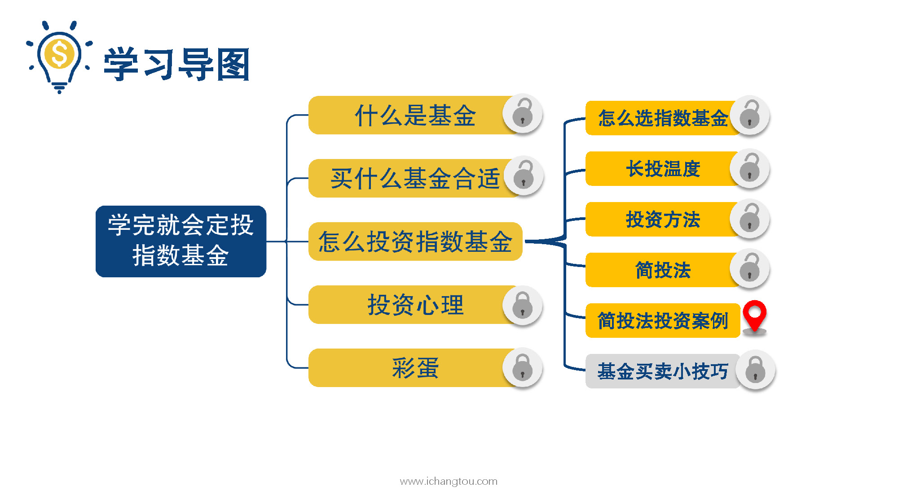
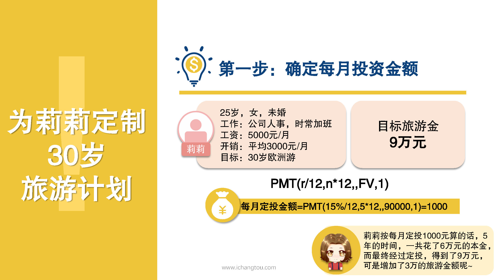
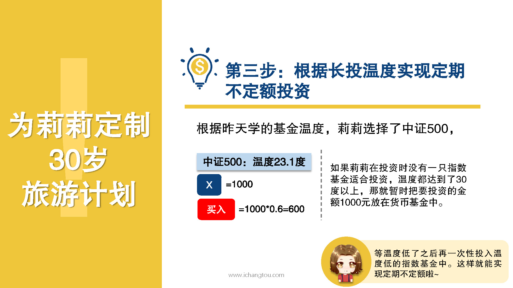
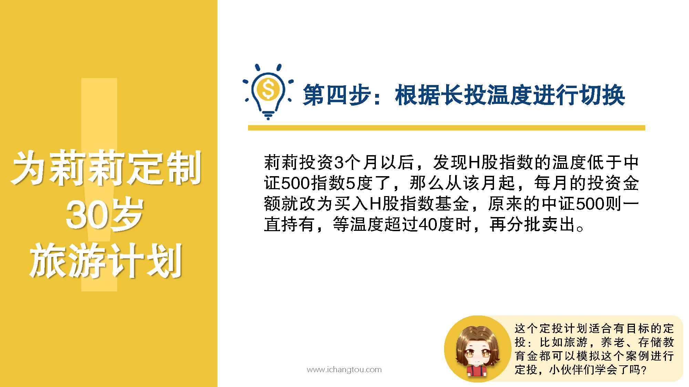

# 基金10-1-定投案例之潇洒欧洲游

## PPT

## 课程内容

### 确定每月投资金额

- xxxx1

  > 

### 根据长投温度选择基金

### 定期不定额投资

### 根据长投温度进行指数切换

## 课后巩固

- 问题

  > 如果一个25岁的MM想在5年内买一辆20万的福特，假设定投能达到的收益率为15%，那她每月需定投多少钱呢？
  >
  > A.3333.33元
  >
  > B.3000元
  >
  > C.2230.11元

- 正确答案

  > C。这个公式PMT(r/12,n*12,,FV,1)大家会用了吗。