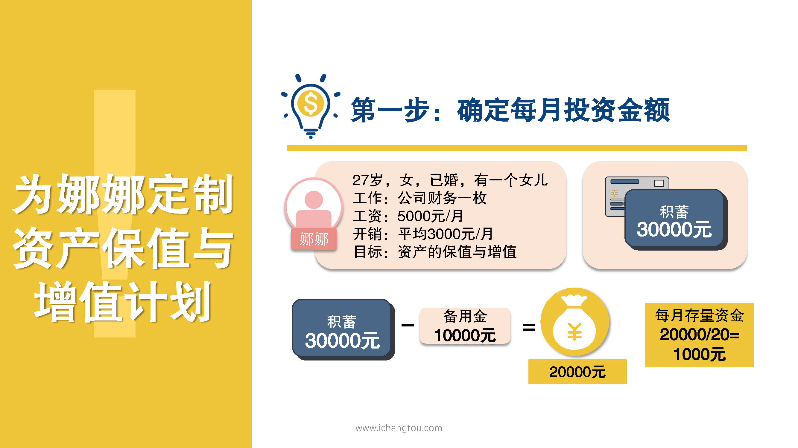
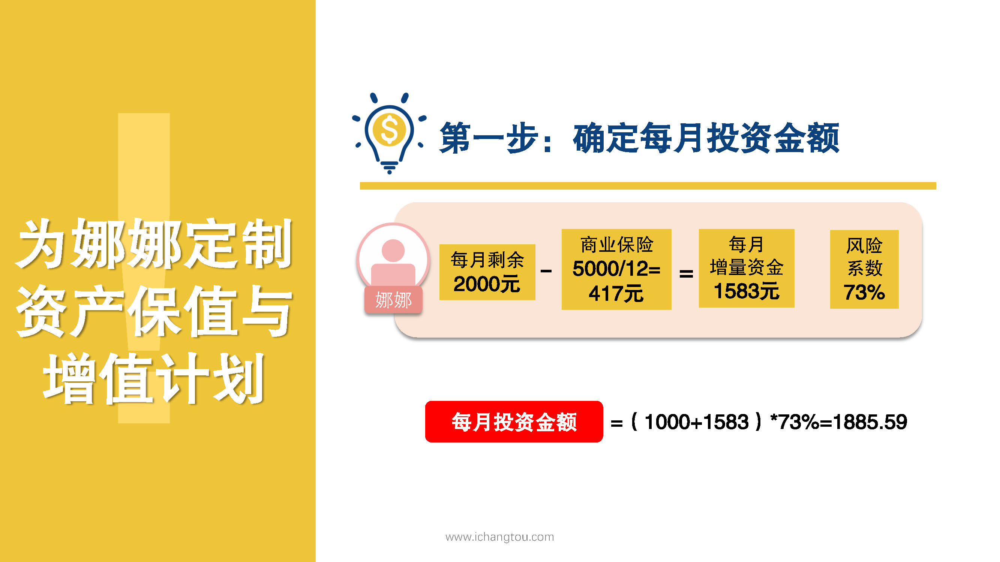
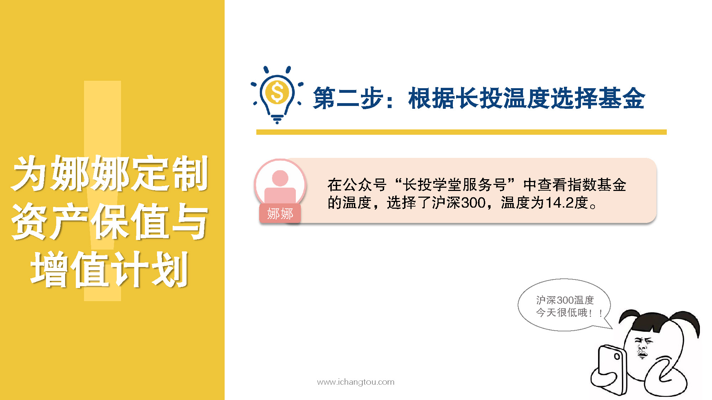
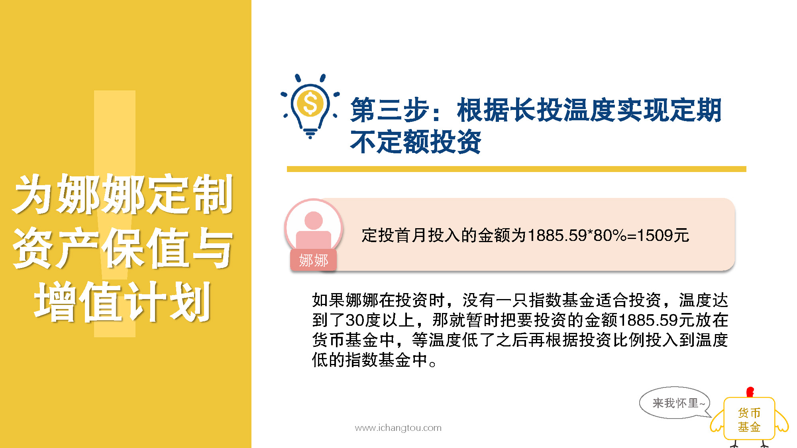
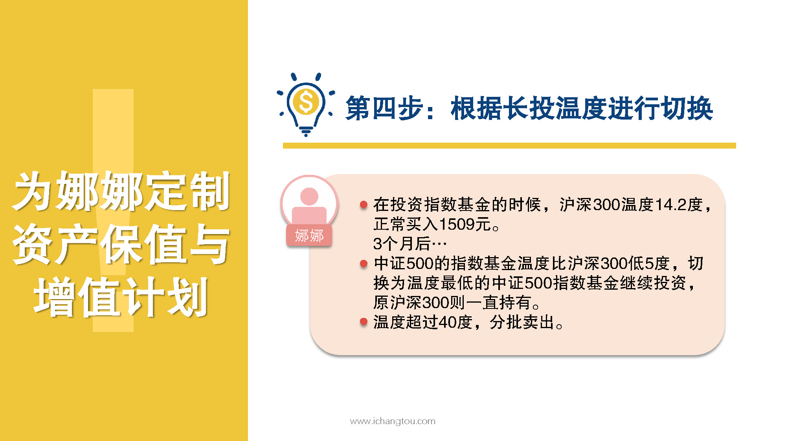
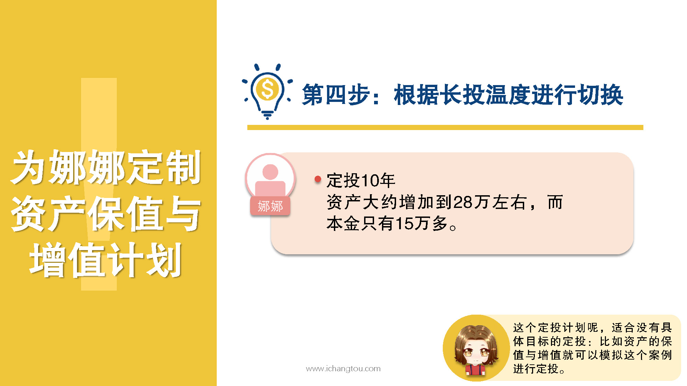
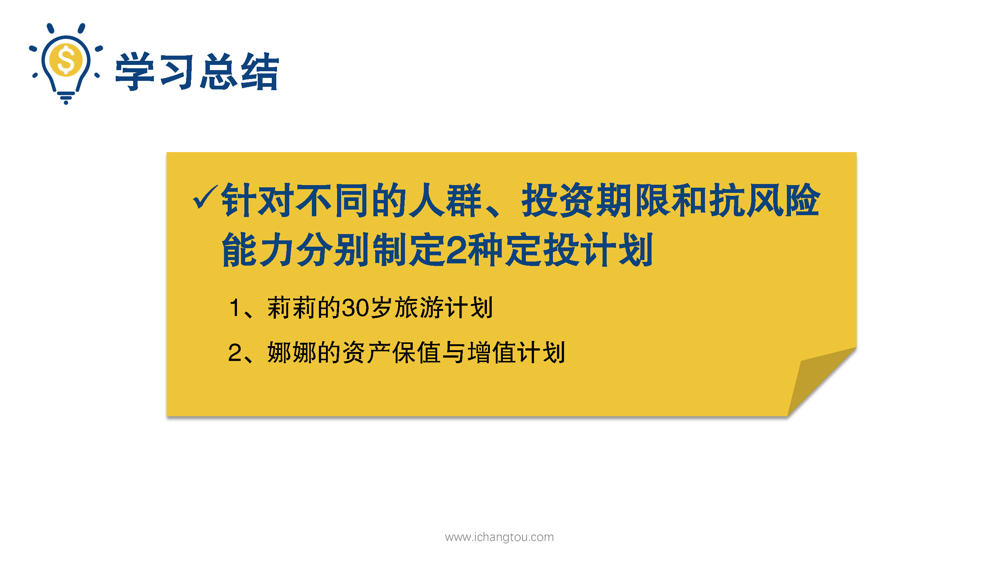

# 基金10-2-按投案例之资产保值增值

## PPT

## 课程内容

### 确定每月投资金额

- xxxx1

  > 听到我为你设计的方案，另一个闺蜜娜娜突然想到如果旅行可以这样子，那让资产保值甚至增值是不是也可以这样准备呢？没错啦，当然是可以的，下面我就来教落落怎么定，投小伙伴们也动动你们的脑袋，光说不练假把式，一起跟着来算一算吧，第1步确定每月投资金额，首先我们盘点一下娜娜的资产状况，但他的档案27岁女已婚，有一个女儿工作，公司财务一枚工资也是5000元每月，平时开销3000元，每月目标资产的保值与增值娜娜有自己的房子，平时自己带饭，偶尔会和同事出去聚餐，以前开销不是很大，可自从有了女儿简直就多了一台碎钞机，每个月的钱就像流水一样。哗哗的往外流，但是好在公婆有时候会补贴一些，现在的积蓄大概有3万元左右之前一直放在余额宝里挣点零花钱，接着呢，我们要预留备用金，在投资之前娜娜首先要考虑的是要给自己留足应急金，这笔钱的数目应该是3~6个月的生活费，娜娜的工作比较稳定，收入也很稳定，所以打算留1万块钱的生活费，这笔钱先放在余额宝，虽然利息少一点，但是苍蝇肉也是肉，不过如果一旦动用了这个应急金，要记得回来补足，然后我们把2万元除以20个月就得出了每个月的存量资金为1000元。接下来我们再来确定每个月的增量资金，娜娜虽然工资不算非常高，但好在有理财意思，每个月大约能固定剩余2000元，另外娜娜娜还打算每年拿出5000元用来配置一部分商业保险，5000除以12个月，我们取个整数得到每月需分摊417元，然后将2000减去417元，得到的1583元，就是那每月的增量资金了，最后我们需要确定娜娜的风险系数，昨天我们讲过一个公式，可以用来确定投资到高风险资产的资金比例，大家还记得吗？那么娜娜就可以把73%的钱投资到高风险资产中，把27%的资金投资到低风险资产中，这个时候我们就能来计算那那每个月投资。饿了上面我们得出拿每月的存量资金为1000元，而每月的增量资金为1583元，然后根据娜娜的风险系数计算出每月投资的金额，即用每月的存量资金1000元，加上每月的增量资金1583元乘以73%得到1885.59元，这个就是每个月的投资结束了，剩余的钱就可以存在货币基金第2步，根据墙头温度选择基金，娜娜也在公众号长投学堂服务号中查看指数基金的温度，他选择了沪深300，温度为14.2度，这里同样只是做举例，说明小伙伴们要以实际投资时的数据为准。根据床头温度实现定期不定额投资，根据昨天学到的知识，那他在第1个月每月应该投入的金额为1885.59×80%等于1508.47元，我们简单点就系1509元吧，同样如果拉拉再投资时，没有一只指数基金适合投资温度都很高，到了30度以上，那就应该暂时把每月要投资的金额1885.59元放在货币基金中，等温度低了之后，再根据投资比例投入到温度低的次数及轻重第4部啊，根据藏头温度进行切换，娜娜很幸运在决定投资指数基金的时候，沪深300只有14.2度比较适合投资，于是就直接投入。百09元，但过了三个月后，发现中证500的指数基金温度更低，比沪深300还低5度，那么那那就要切换为温度最低的中证，500指数基金继续投资原沪深300则一直持有，等温度超过40度时再分批卖出，这样那就可以使资产保值并实现增值了，假设娜娜依照这个方法定投10年，那么他的资产大约会增加到28万左右，而本金只有15万多，是不是很神奇呢？这个定投计划呢，是和没有具体目标的定投，比如资产的保值与增值就可以模拟这个案例进行定投，操作起来其实也是很简单的。我们针对不同的人群，投资期限和抗风险能力的不同，分别制定了两个投资计划，看完之后是不是有一点心动了，小伙伴们可以根据自己的情况制定自己的或短期或长期的定投计划了，但是计划制定好了，买卖具体怎么操作呢？明天我们就会手把手的带大家学习，如何买卖指数基金，那我们明天不见不散吧。

### 根据长投温度选择基金

### 定期不定额投资

### 根据长投温度进行指数切换

## 课后巩固

- 问题

  > 假设27岁时，有5万元的存款，预留备用金1.5万，如果想要实现资产保值与增值，每月投入的存量资金是多少呢？
  >
  > A.1277.5元
  >
  > B.2500元
  >
  > C.1750元
  >
  > D.1377.5元

- 正确答案

  > A。定投时，为了分散风险，要记得分成20个月分批投入喔~另外，别忘乘上73%的风险系数喔。