# 基金11-1-场内买基金去

## PPT

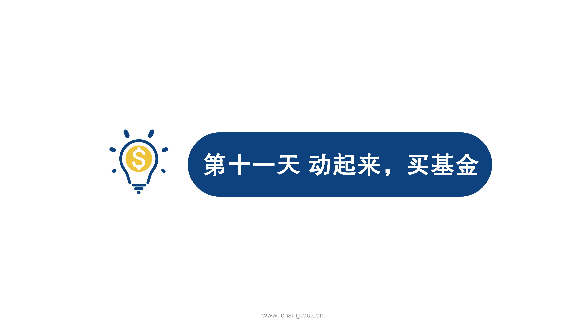

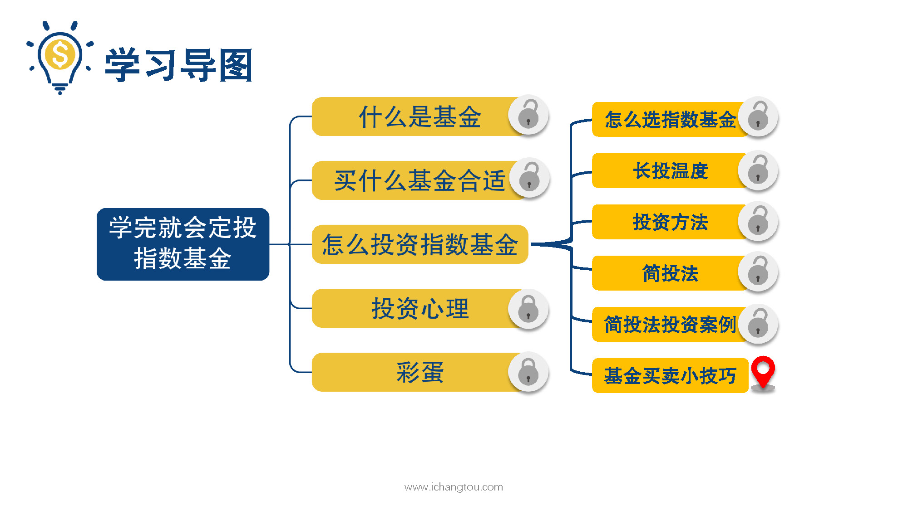

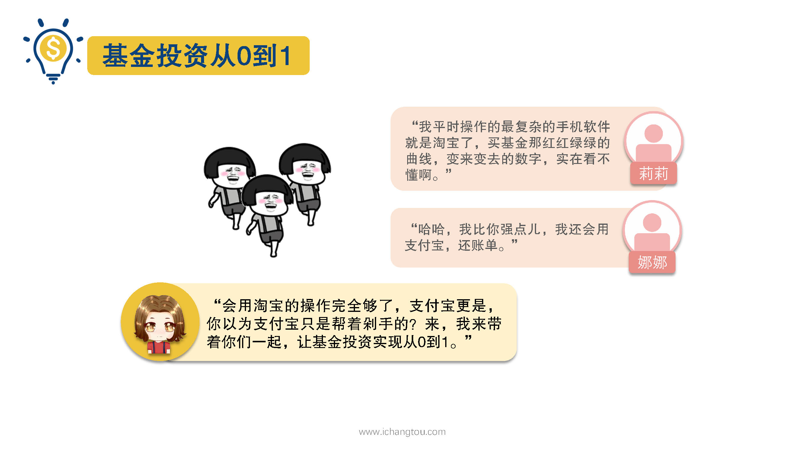

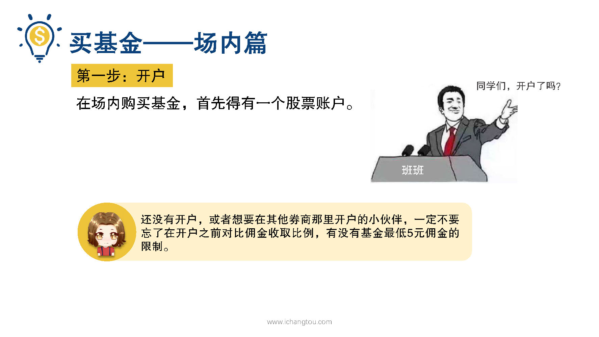

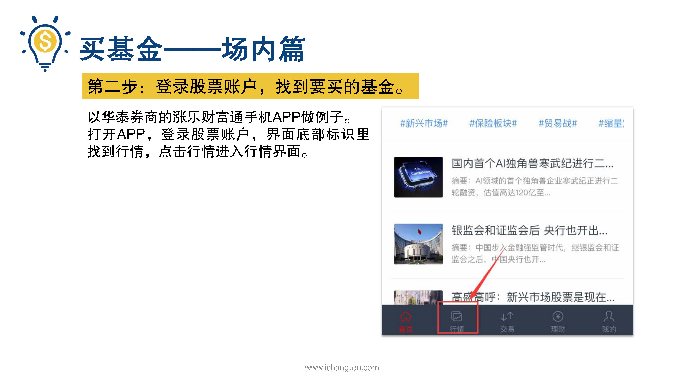

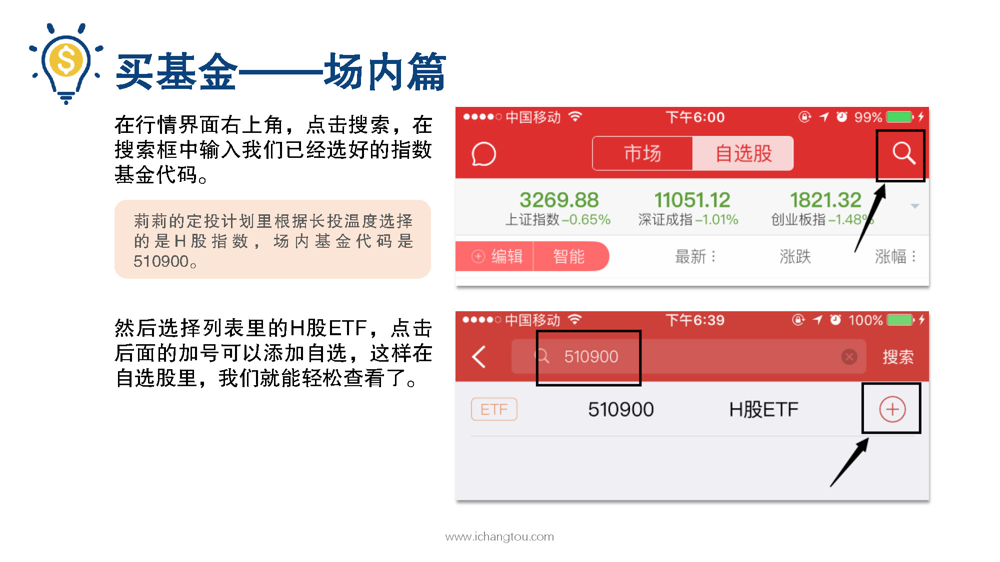

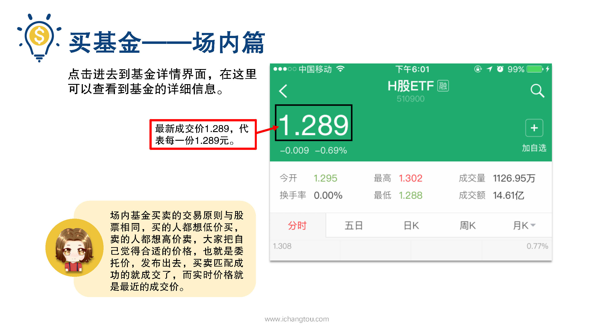

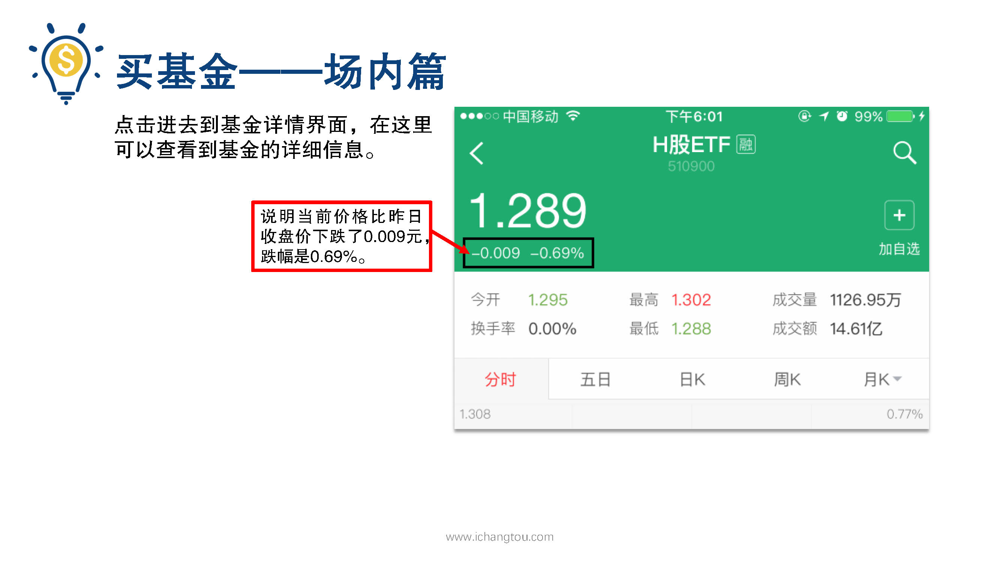

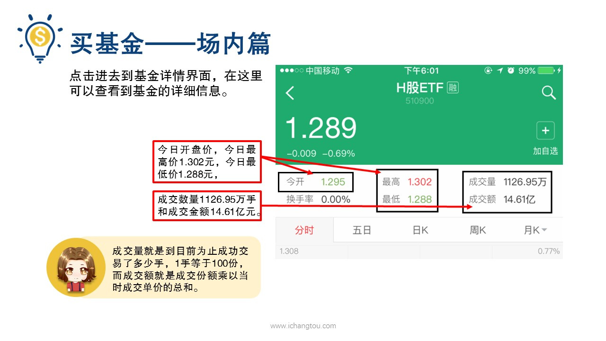

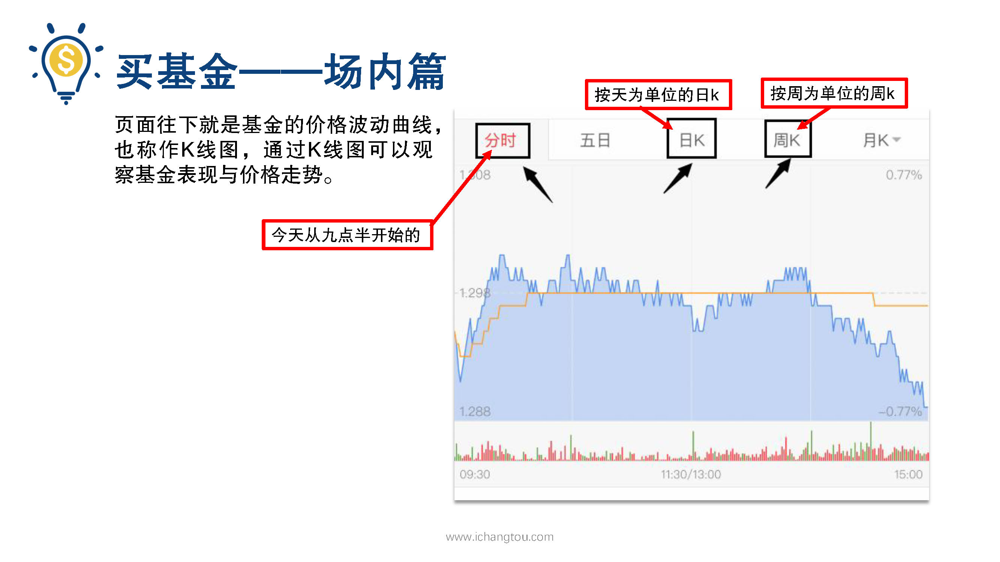

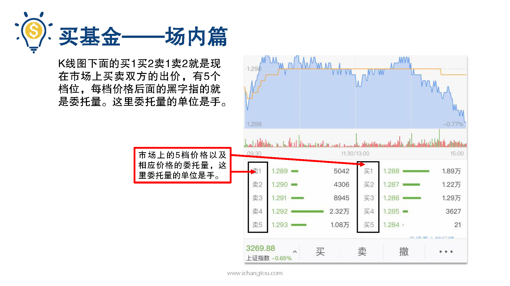

## 课程内容

### 开户

- xxxx1

  > 大家好，我是百合学姐，昨天我们学习了剪头发的操作步骤，大家的定投计划都出炉了吗？我也很关心我两个好朋友的情况，于是就又约他们出来问问，我们以为他们会急匆匆的回去买基金了，没想到碰面问起来居然都没动手，一个说我平时操作最复杂的手机软件就是淘宝了，买基金那个红红绿绿的曲线变来变去的数字实在看不懂啊，另一个说我比你强点，我还会用支付宝还账单呢，我看着她们俩十分无奈告诉他们其实会用淘宝的操作完全够了，支付宝更是你以为支付宝。帮你剁手的吗？来我来带你们一起让基金投资实现从0~1之前大家都学习过，买基金可以通过场内场外两种途径，我们先从场内来说，第1次交易呢，需要经历开户，找到要买的基金下单买入，买好后查看是否成交这4部，我们一步一步来看第1步开户，我们在场内购买基金首先得有一个股票账户，相信很多小伙伴已经在班班的带领下完成开户了，还没有开户的小伙伴一定不要忘了在开户之前对比佣金收取比例，有没有基金最低5元佣金的限制的？第2步登录股票账户找到要买的基金，我们这里用华泰券商的涨乐财付通手机APP为例，带大家熟悉一下操作的。常见的指标是什么意思好，打开APP登录股票账户，在最下面一排标识里找到行情，点击行情，进入行情界面，在行情界面右上角点击搜索，在搜索框中输入我们已经选好的指数基金代码，你的定投计划里根据床头温度选择的是h股指数，场内基金代码是510900，然后选择列表里的h股ETF，点击后面的加号可以添加自选，将在自选股里我们就能轻松查看了，就像你们看到心仪的宝贝把它加到购物车里是一样的效果，点进去之后就到了基金详情界面在这里啊，我们可以查看到基金的详细信息，从最上面开始，他的最新成交价1.289。代表每一份1.289元场内基金买卖的交易原则与股票相同，买的人都想低价，买卖的人都想高价卖，大家把自己觉得合适的价格也就是委托价发不出去，买卖匹配成功的就成交了，而实时价格就是最近的成交价，这种交易方式很像相亲大会，男女嘉宾分别是买方和卖方，然后大家分别给出自己的条件，条件正好合拍的就被牵走了，剩下条件不合适找不到另一半的在苦苦观望，下面的小字-0.009与负0.69%，说明当日价格比昨日收盘价下跌了0.09元，跌幅是0.69%，然后再往下看，我们可以看到经开两个字，经开就是今日开盘。最高是指今日最高价1.302元，最低是今日最低价1.288元，成交数量1126.95万手和成交金额14.61亿元，成交量就是到目前为止，成功交易了多少手？一手等于100份，而成交额就是成交份额乘以当时成交单价的总和，再看下面很博人眼球的曲线，就是基金的价格波动曲线了，也称作k线图，通过k线图可以观察基金表现与价格走势，在这个界面上我们还可以看不同时间单位的k线图，可以选分时的，也就是今天从9:30开始的价格波动，也可以选以天为单位的日k或以周为单位的周k，那k线图下面的买1买2卖1。又是什么呢？这些就是现在市场上买卖双方的出价有5个档位，每档价格后面的黑字指的就是成交量了，这里成交量的单位是手。

### 找到要买的基金

### 查看基金具体信息

## 课后巩固

- 问题

  > 关于场内购买基金的方法，下面哪些说法是错误的？
  >
  > A.场内购买基金首先需要开通股票账户
  >
  > B.在券商APP里查找我们要找的基金时可以输入基金代码进行查找
  >
  > C.场内交易基金时交易的单位是手，一手的份额多少不等

- 正确答案

  > C。本题选择的是错误的，C选项错误。场内交易基金的单位是手，和国内股票交易单位一样，一手等于100股。