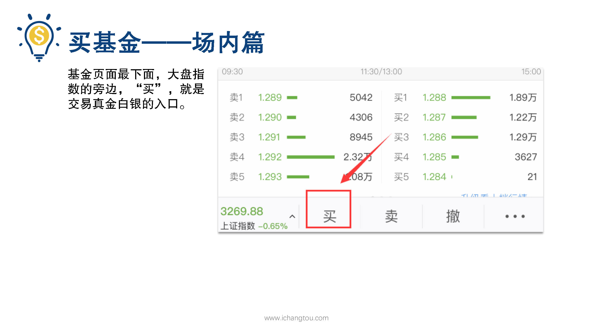
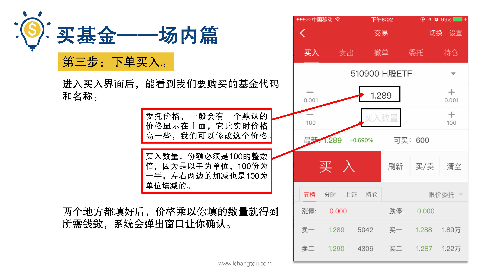
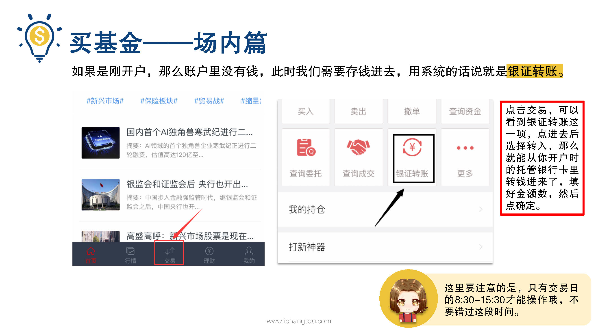
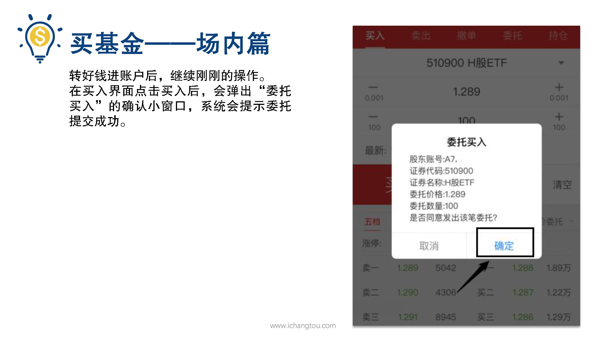
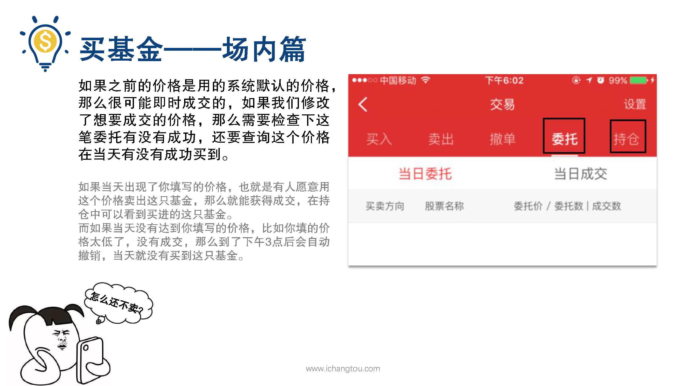
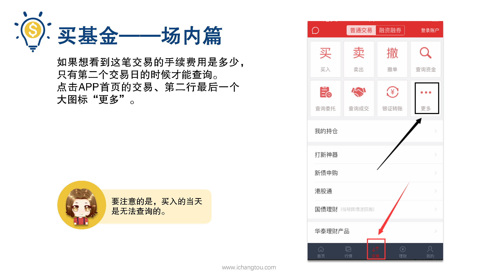
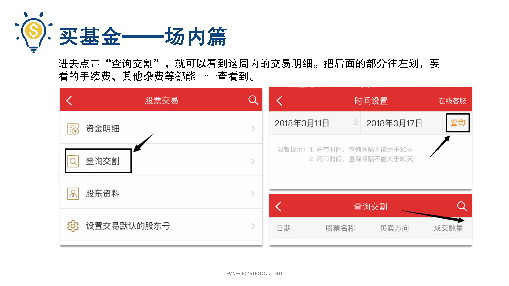

# 基金11-2-场内买入操作

## PPT

## 课程内容

### 下单买入

- xxxx1

  > 好，刚刚我们查看了买入前的各个界面和各个部分名词代表的意思，那接下来进入正题，基金页面最下面大盘指数的旁边买就是交易真金白银的入口了，我们的第3步下单买入，进入买入界面后，能看到我们要购买的基金代码和名称，不用怕，它跟淘宝里点购买效果是一样一样的，接着就是问你要哪个型号数量填一下，咱们这儿变成型号给你定好了，价格嫌你接受的这么一比，好像比淘宝买东西更有成就感了，这时到了交易页面在基金代码下面一行的是委托价格，一般会有一个默认的价格显示在上面，他比实时价格高一丢丢，我们可以修改这个价格设置的价格，只要不超过当天10%的。我们前面说过了，男女相亲大会你可以提自己的条件，如果别人正好愿意以这个价格购买，那你们就牵手成功买入成功了，第二行要填的是买入数量，份额必须是100的整数倍，因为是以所为单位100份为一手左右，两边的加减也是以100为单位增减的，两个地方都填好后，价格乘以你填的数量就得到所需的钱数，系统会跳出来给你看一下，不过如果你是刚开户，那么账户里是没有钱的，就像买东西没有钱付款一样，我们需要存钱进去，用系统的话来说就是银证转账，点击APP界面最下方正中的交易，就可以看到银证转账这一项点进去之后选择转入。自从你开户时的托管银行卡里赚钱进来填好金额数，然后点确定就可以，不过这里要注意的是只有交易日的早上8:30到下午4:00才能操作，不要错过这段时间，现在我们也转好了钱进入账户了，继续刚刚的操作，我们在买入界面点击买入后呢，会弹出委托买入的确认小窗口系统会提示委托提交成功，如果之前的价格是用的系统默认价格，那么很可能是即时成交的，如果我们修改了想要成交的价格，那么需要检查一下这笔委托有没有成功，还要查询这个价格在当天有没有成功买到，如果当天出现了你填写的价格，也就是有人愿意用这个价格卖出这只基金，那么就能获得成交。持仓中可以看到买进的这只基金，而如果当天没有达到你填写的价格，比如你填的价格太低了，没人愿意卖给你，没有成交，那么到了下午3:00后会自动撤销，当天就没有买到这只基金，那如果想看这笔交易的手续费用是多少的话，我们怎么看呢？要注意的是买入的当天是无法查询的，只有第2个交易日的时候才能够查询，还是点击APP首页的交易第2行，最后一个大图标更多，看来APP都是相似的，没地方放的东西都放到了更多，其他里面进去可以看到第2行的查询交割进去之后点击查询，可以看到这周内的交易明细，日期，股票名称，买卖方向和成交数量，这行可以往左划要看的手续费。都能够查看到了好了，我们总结一下场内买基金是需要哪些步骤，首先要开户，有了股票账户才有接下来的操作，然后找到要买的基金，这里可以给它加自选，这样就像在你的购物车里一样方便了，如果账户里没有钱，需要通过银证转账进行转款，接着买入时设定好价格和要买入的数量确认委托，最后不要忘了查看委托有没有成功，成功买入的第2天还能查看这笔交易的手续费等情况。

### 设定好价格和数量，确认委托

### 查看委托有没有成功

### 查看交易手续费

## 课后巩固

- 问题

  > 关于场内购买基金的价格，下面说法正确的是？
  >
  > A.买入基金时显示的价格是可以修改的
  >
  > B.委托价格有可能不能顺利成交
  >
  > C.以上说法都正确

- 正确答案

  > C。买入基金时显示的价格是可以修改的，委托买入价格琮得过低的话，有可能不成交。