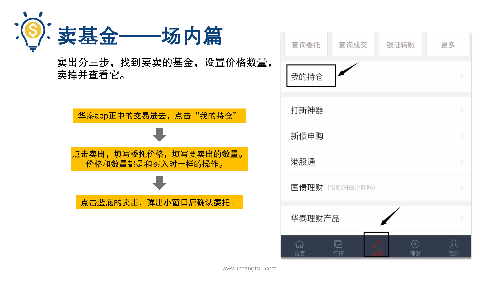
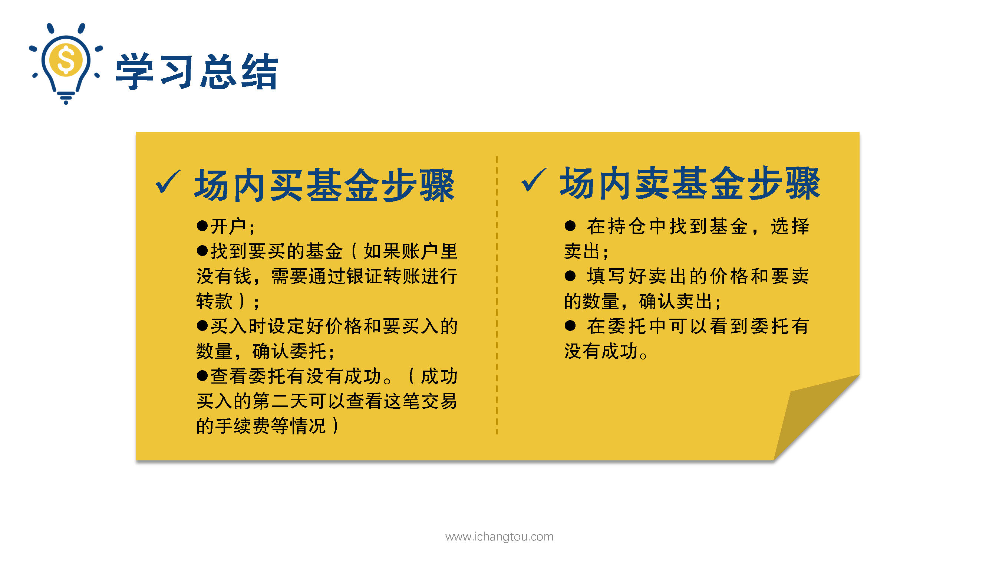
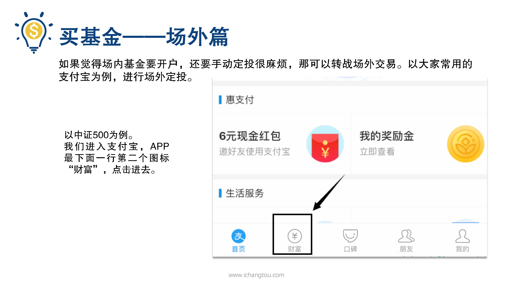
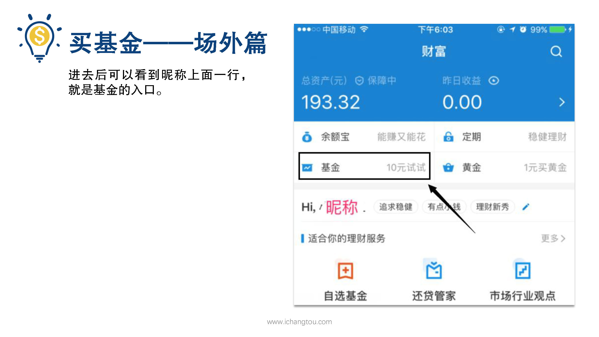
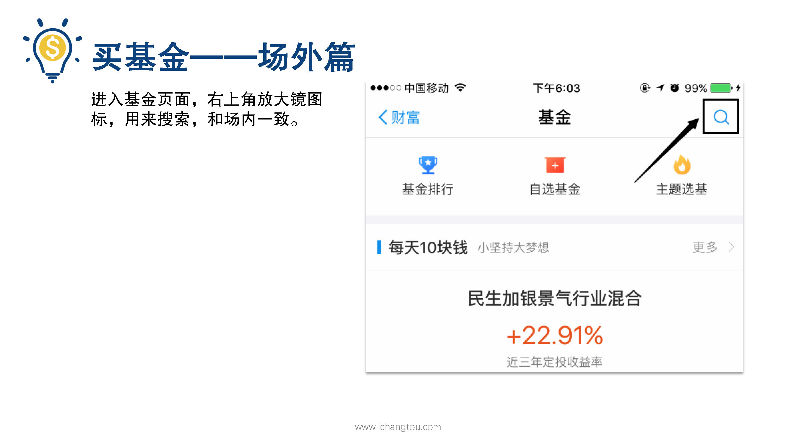
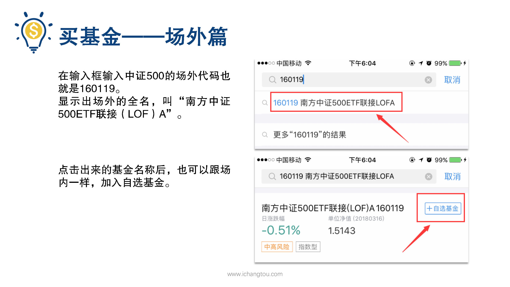
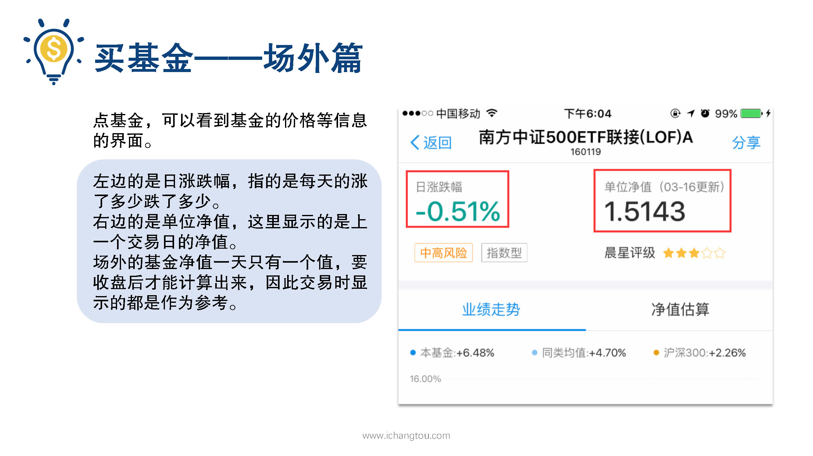
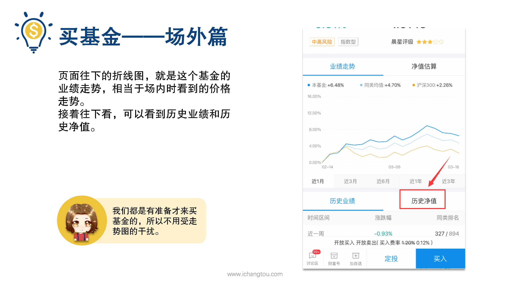
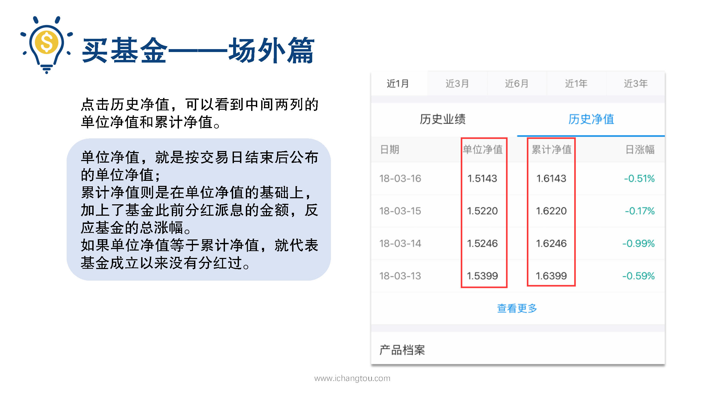

# 基金11-3-场内卖出、场外买入

## PPT

## 课程内容

### 找到要卖的基金

- xxxx1

  > 现在我们已经成功买入了沪深300指数基金，如果过了几个月我们需要卖出，应该怎么操作呢？有了买入的经验后卖出就比较简单了，分三步找到要买的基金设置价格数量卖掉并查看它首先还是点华泰APP正宗的交易进去，中间的第一行字，我的持仓点进去，可以看到你所有的基金选择要卖出的那个，下面会出现一行操作提示，选择卖出，那接下来这个界面跟买入的界面就非常像了，只是买入两个字变成了卖出第2步，点击卖出，填写委托价格，填写要卖出的数量价格和数量都是和买入是一样的操作，第3步点击蓝底的卖出，弹出小窗口后确认为。如果填写的委托价格是系统默认那么会立即成交，如果填写的卖出价格比较高，就要等一等当天有人愿意以这个价格买，那就能成交，如果一直没有到这个价格，那3:00后被自动撤销，卖出成功后的钱汇到你的股票账户里，如果想要取出来用，那还是需要通过银行卡提现操作呢，也是在银证转账进去后选择转出，如果你想看看这笔交易被收了多少手续费，那么在交易成功后的第2个交易日可以在交割查询中查找到和买入时查看的路径一致，仓位卖出总结一下，就是在持仓中小的基金选择卖出，填好卖出的价格和要卖的数量确认卖出，最后在委托中可以看到委托有没有成功。如果有小伙伴觉得场内基金要开户，还要手动定投很麻烦，还容易忘记，那我们就转战场外交易，下面还是莉莉的定投计划，我们以大家常用的支付宝为例进行场外定投，相信大家手机里肯定都有安装支付宝，场外基金呢，也可以分为三步，找到要申购的基金，查看基金的信息，填金额买入，我们接着以中证500为例操作一遍进入支付宝APP最下面一行第2个图标财富点击进去，进去之后可以看到你的昵称，上面一行就是基金的入口，马云爸爸还非常亲民的写着10元试试进入基金页面，可以看到右上角有个放大镜图标，用来搜索也和场内一致，我们点击放大镜后在输入框输入。中证500的场外代码也就是160119，会显示出场外的全名叫南方中证500ETF联接a名字很长，跟龙妈名字一样长，还难记，这个不用管，知道他是跟踪中证500指数的，我们要的那个基金就行了，我们点击出来基金名称后也可以跟场内一样加自选基金，继续点击就可以看到基金的价格等信息的界面，左边最显眼的是日涨跌幅，就是每天涨了多少跌了多少，右边的是单位净值，这里显示的是上一个交易日的净值，因为我们前面学过场外的基金净值是一天只有一个字是要收盘后才能计算出来的，交易时显示的都是作为参考下面抢眼的折线图呢，就是这个基金的业绩走势。相当于场内时看到的价格走势，但是我们都是有准备才来买基金的，所以不用受走势图的干扰，接着往下看可以看到历史业绩和历史镜子，点击历史镜子，可以看到中间两列的单位净值和累计净值，这里稍微解释一下单位净值，就是按交易日结束后公布的单位净值，而累计净值则是在单位净值的基础上加上了基金此前分红派息的金额，反映了基金的总涨幅，如果单位净值等于累积净值，就代表基金成立以来没有分红过。

### 设置价格数量

### 卖掉并查看它

### 场外买入

## 课后巩固

- 问题

  > 下面关于场外申购基金的说法不正确的是？
  >
  > A.支付宝申购基金就是场外路径
  >
  > B.在支付宝上申购基金不用申请股票账户
  >
  > C.场外基金一天有多个净值

- 正确答案

  > C。本题选择的是不正确的，C选项不正确。场外基金净值一天只有一个，要等收盘后才能计算出来，交易时显示的价格仅供参考。