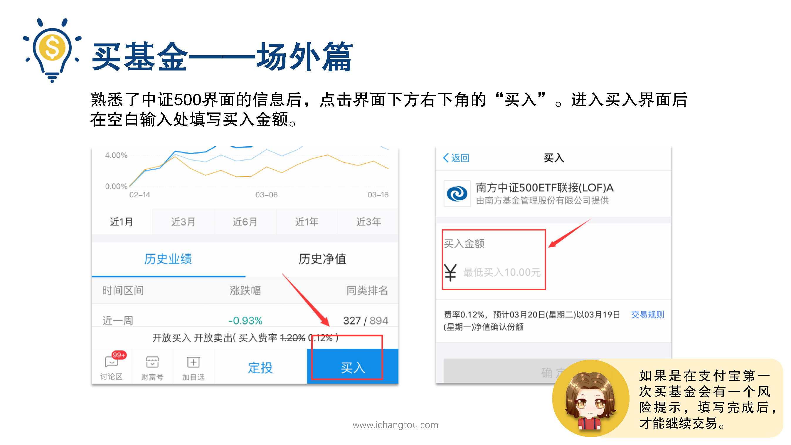
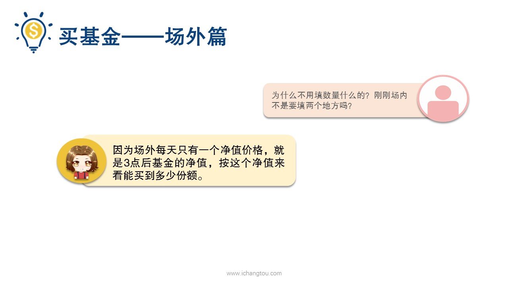
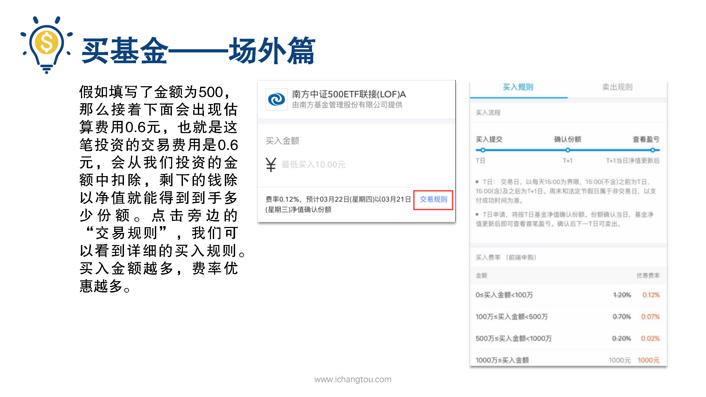
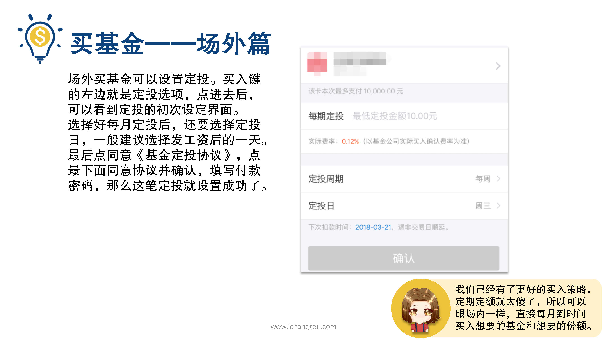
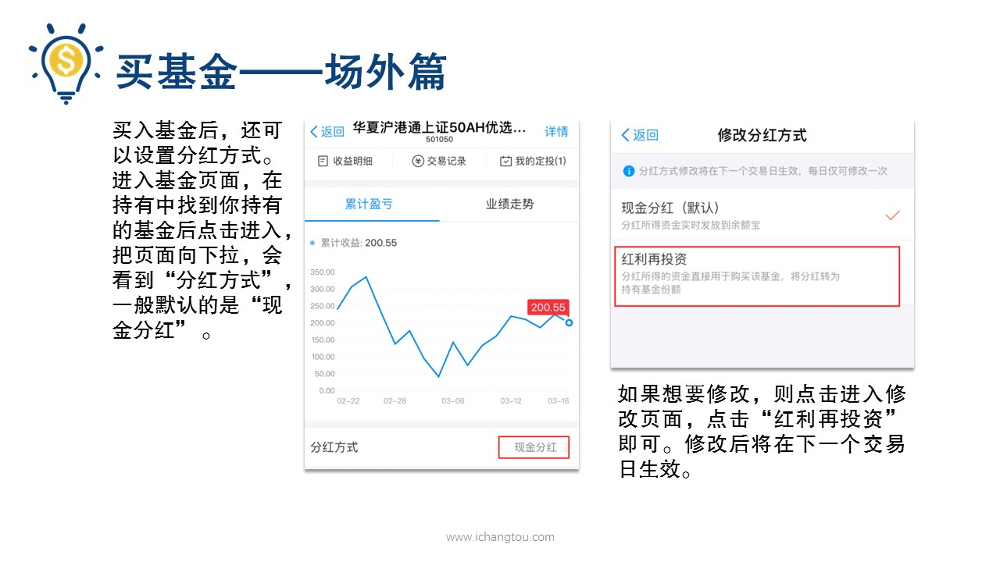

# 基金11-4-场外入习操作

## PPT

## 课程内容

### 正确处理眼利益与长期利益

- xxxx1

  > 

### 属于抓住机会

### 严格按照长投温度定投，赚自己能赚到的钱

## 课后巩固

- 问题

  > 周五3点以前在场外买入的一只基金，什么时候可以卖出呢？
  >
  > A.周六
  >
  > B.下周二
  >
  > C.下周一

- 正确答案

  > B。买入的基金需要T+2日才能卖出，下单买是T日，T+1日确认份额，确认份额扣的那天才可以卖出。