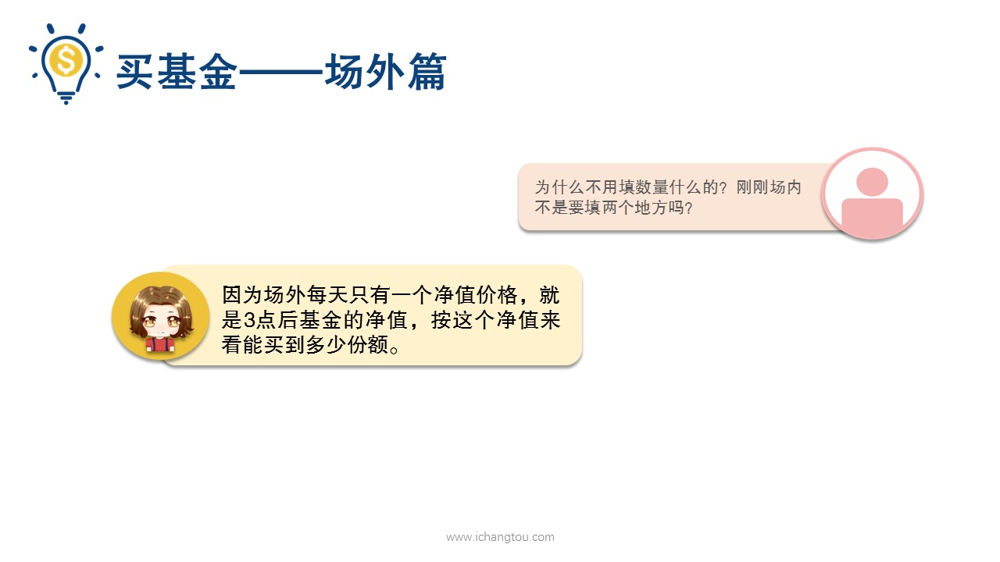
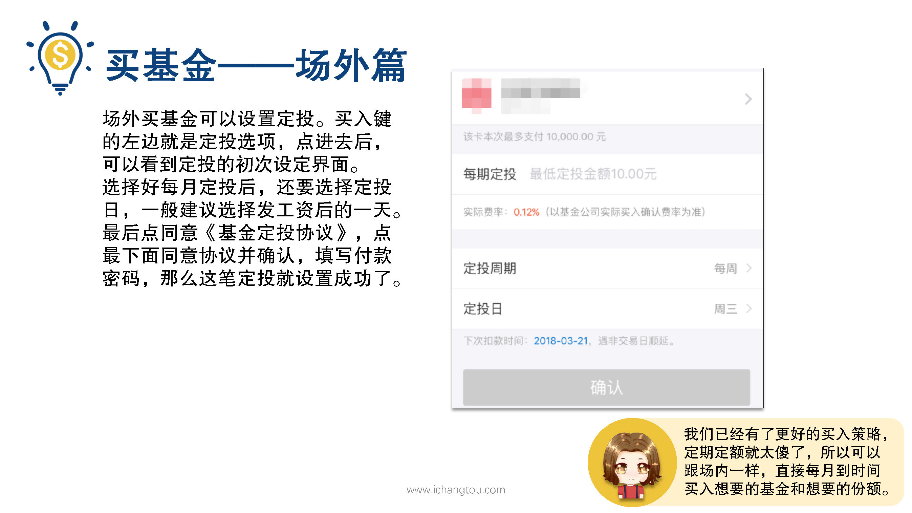

# 基金11-4-场外入操作

## PPT

## 课程内容

### 正确处理眼利益与长期利益

- xxxx1

  > 上一节我们已经熟悉了中证500界面的信息，那怎么买入呢？相信看到这个界面大家都心领神会了，最下方右下角有买入跟淘宝的下单是一个位置没错，如果是在支付宝第1次买基金呢，会有一个风险提示，填写完成后才能继续交易好，我们填写过风险测试可以到买入界面了，在最大空白输入出纳需要填写买入金额。可能有小伙伴有问题了，为什么不用填数量什么的呢？刚刚在场内的时候不是要填两个地方吗？因为场外呢，每天只有一个净值价格，就是3:00后基金的净值按这个镜子来看能够买到多少份额，打个比方场内买卖就像是精打细算的巧妇去买菜，我要多少钱的菜要多少斤？算好了给你钱，而场外呢，就是大出汗去买菜，对着摊贩说给我拿100块钱的，能买多少给我多少，比如我们填写了金额为500，那么接着下面会出现估算费用0.6元，也就是这笔投资的交易费用是0.6元，会从我们投资的金额中扣除剩下的钱除以镜子就能得到到手多少份额，点击旁边的交易规则我们可以看到。买入规则。我们可以看到买入金额越多，费率优惠越多，另外买入的基金需要t+2日才能卖出，下单买是t字t+一日确认份额，确认份额后那天才可以卖出，比如2月17日买入，2月18日确认份额，2月19日才可以卖出，还记得我们说过在厂外买基金是可以定投的吗？就是每个月定期定额投资，其实有小伙伴已经发现了，在买入键的左边就是定投选项，便进去后可以看到定投的初次设定界面，从上到下一次是你的付款方式，就是从哪张银行卡扣钱，接着下面是每期定投的金额最低可以是10元，再往下是定投的周期是每周每两周每个月还是每天其实按日周月定投？接下来的收益是差不多的，因此建议选择每月就可以了，那我们选择好美的镜头后呢，还要选择定投日，就是每个月的几号来扣款定投，一般建议选择发工资后的一天，控制自己买买的最佳方法了，最后点同意基金定投协议，点最下面同意协议并确认填写付款密码，那么这笔定投就设置成功了，不过我们已经有了更好的买入策略，定期定额就太傻了，所以可以跟场内一样，直接每月到时间买入想要的基金和想要的份额，最后买入基金后我们还可以设置分红方式进入基金页面，在持有中找到你持有的基金后，点击进入把页面向下拉，会看到分红方式，一般默认的是现金分红，如果你想要修改则点击进入。在页面点击红利再投资就可以了，修改后将在下一个交易日生效，好的，我们总结一下场外用支付宝买入基金的流程，打开支付宝，进入财富界面，进入基金，用代码找到你要买的那只基金，点击买入后前先买入金额，操作完成后第2天在基金界面下右下角的只有你可以看到你买入成功的基金，你学会了吗？

### 属于抓住机会

### 严格按照长投温度定投，赚自己能赚到的钱

## 课后巩固

- 问题

  > 周五3点以前在场外买入的一只基金，什么时候可以卖出呢？
  >
  > A.周六
  >
  > B.下周二
  >
  > C.下周一

- 正确答案

  > B。买入的基金需要T+2日才能卖出，下单买是T日，T+1日确认份额，确认份额扣的那天才可以卖出。