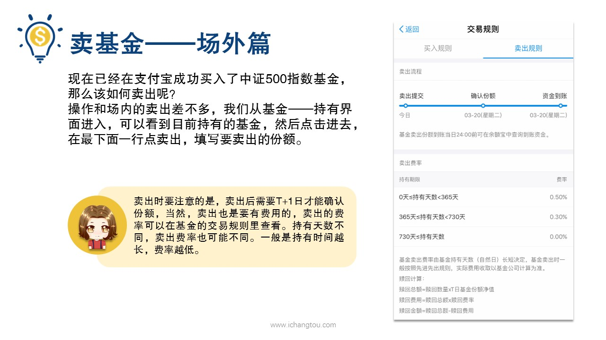
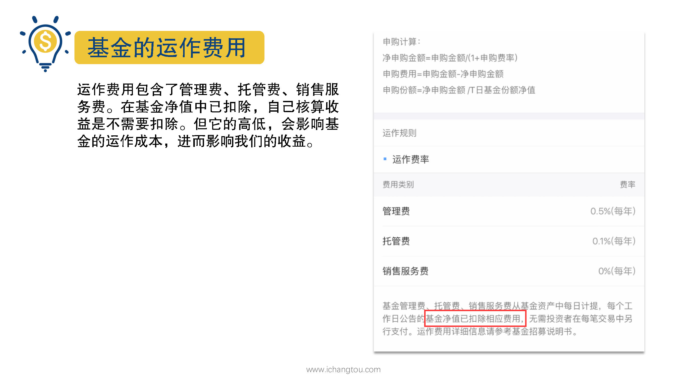
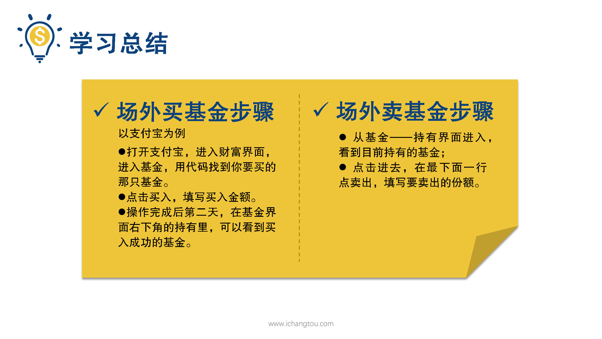
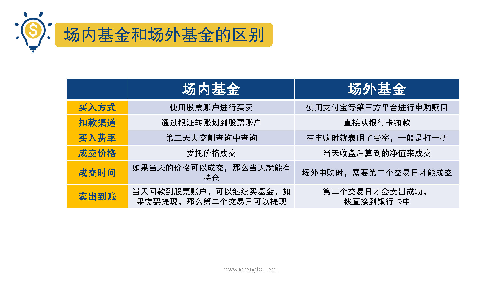

# 基金11-5-场外卖出操作

## PPT

## 课程内容

### 卖出时间及费率

- xxxx1

  > 

### 基金的运作费用

### 场内场外交易对比

## 课后巩固

- 问题

  > 3月118日3点后赎回场外基金，最快哪天可以到账？
  >
  > A.3月18日3点后的第二个交易日
  >
  > B.3月18日
  >
  > C.3月18日后的第一个交易日

- 正确答案

  > C。赎回场外基金时，如果是T日下单，T+1个交易日才能确认份额，确认之后资金才能到账。3月18日3点后赎回，T日就是3月19日了。