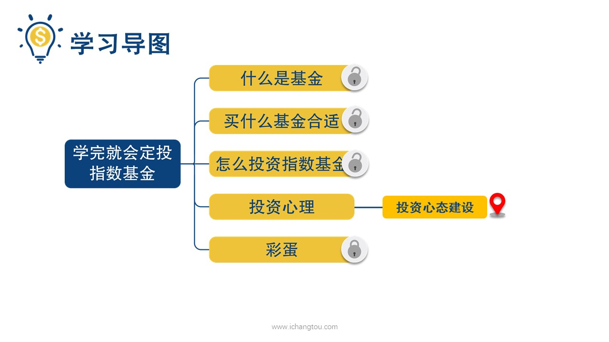
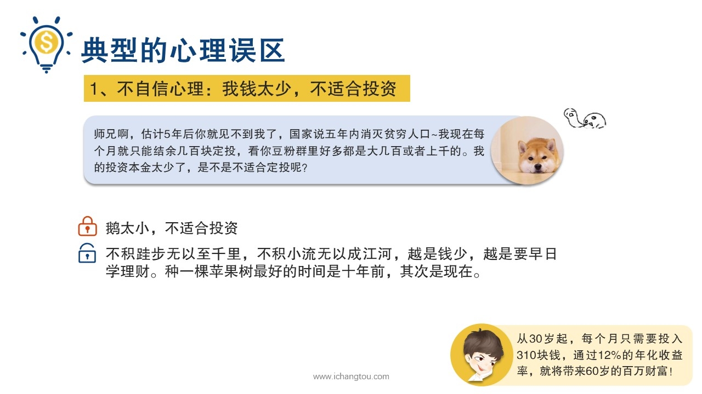
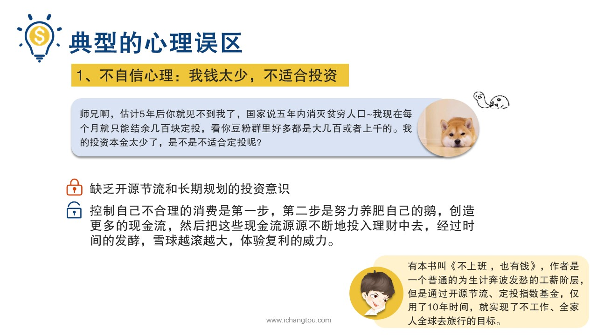

# 基金12-1-不自信心理

## PPT

## 课程内容

### 培养投资的理念，摒除鹅小不自信的念头

- xxxx1

  > 

### 开源节流和长期规划的投资意识

## 课后巩固

- 问题

  > 从30岁起，每个月只需要投入310块钱，通过12%的年化收益率，60岁时，你将会拥有多少财富？
  >
  > A.100万左右
  >
  > B.11万左右
  >

- 正确答案

  > A。从30岁起，每个月只需要投入310块钱，通过12%的年化收益率，60岁时，你将会拥有百万财富，而30年共投入的本金是11万左右，复利的威力有没有让你很惊讶呢？