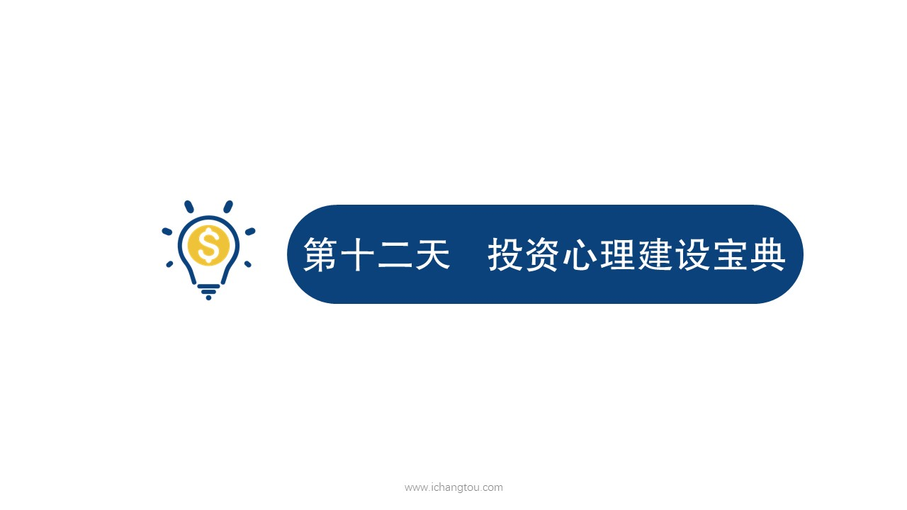

# 基金12-1-不自信心理

## PPT

## 课程内容

### 培养投资的理念，摒除鹅小不自信的念头

- xxxx1

  > 大家好，我是立克师兄，前几节课我们学习了，通过床头温度来选择低温的指数基金，进行定期不定额的投资也明白了，基金定投的两大原则是闲钱和长期小伙伴们甚至还开启了定投的实践，迈出了万里长征的第1步，这是为你们的行动力点赞，今天我们来看看在基金投资过程中小伙伴们会遇到哪些典型的心理误区，又应该如何解决呢？让我们跟着二狗同学的心路历程一起去体验一番吧。能跟着二狗同学的心路历程一起去体验一番吧。郭二狗在学玩基金定投的知识后乘着12分的兴致，勇敢的踏上了基金定投之旅，开始定投后的第2个月，我看她午饭吃鸡腿都不带劲了，我问他怎么了。师兄啊，估计5年后你就见不到我了，国家说五年内得消灭贫困人口。几百块钱买定投，我看你群里好多都是打几百几千头的。太少了，是不是不适合定投呢？这个问题在刚开始投资的人群中很具有代表性，其实这也是一种认识上的误区，就是我嫌太少，不适合投资。这种认识误区的小伙伴主要有两个原因。觉得自己的额太小，不适合投资，俗话说不积跬步无以至千里，不积小流无以成江河，越是钱少越是要早日学理财，种一棵树最好的时间是10年前，其次是现在大家还记得我们在第1天课程里提到变成百万富翁的第3种方法吗？从30岁起每个月只需要投入310块钱，通过12%的收益率将带来60岁的百万财富，还记得当时听师兄讲只需要310块钱的时候的那种难以置信的心情吗？现在经过我们前面11天的学习，你已经知道了，只要坚持采用定期不定额的策略，长期投资低温指数基金年化收益率会比12%更高吧。这就意味着什么呢，这就意味着，每个月都不需要310块，就能在30年后实现百万的小目标了，我想小伙伴们再少310块钱也还是有的吧。产生这种认识误区的第2个原因就是缺乏开源节流和长期规划的投资意识，巴菲特说投资是一种放弃今天的消费，并且试图在未来和消费更多的活动，控制自己不合理的消费是第1步，第2步是努力养肥你的额，创造更多的现金流，然后把这些现金源源不断的投入到我们的理财中去，经过时间的发酵雪球会越滚越大，你就能体验到复利的威力了，时间是投资最好的朋友，尤其是指数基金，在资金少是先拿小笔资金来积累实战经验，养大了就更有信心进行大力投资了，有一本书叫做不上班也有钱，作者是一个普通的为生计奔波发愁的工薪阶层，但是通过开源节流定投指数基金仅仅用了。就实现了不工作，全家人全球去旅行的目标，这个故事告诉我们一定要学会长期规划，明确自己的目标，找到适合自己的投资方式，并且坚持贯彻投资计划未来的你将会特别感谢现在的自己。这一节我们主要认识了投资过程中最常遇到的第1个误区，我钱太少，不适合投资，产生这种认识误区的原因有两个，而且不自信以及缺乏开源节流和长期规划的投资意识，针对这个问题，我们也给出了相应的解决办法，就是要认识到基金定投的金额，没有太大限制，减少也可以实现小目标，要开源节流，增加现金流，再源源不断的投入指数，基金长期坚持我们就能真正体验到的威力了。

### 开源节流和长期规划的投资意识

## 课后巩固

- 问题

  > 从30岁起，每个月只需要投入310块钱，通过12%的年化收益率，60岁时，你将会拥有多少财富？
  >
  > A.100万左右
  >
  > B.11万左右
  >

- 正确答案

  > A。从30岁起，每个月只需要投入310块钱，通过12%的年化收益率，60岁时，你将会拥有百万财富，而30年共投入的本金是11万左右，复利的威力有没有让你很惊讶呢？