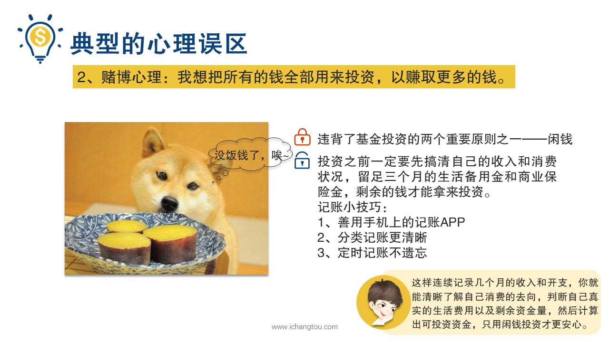
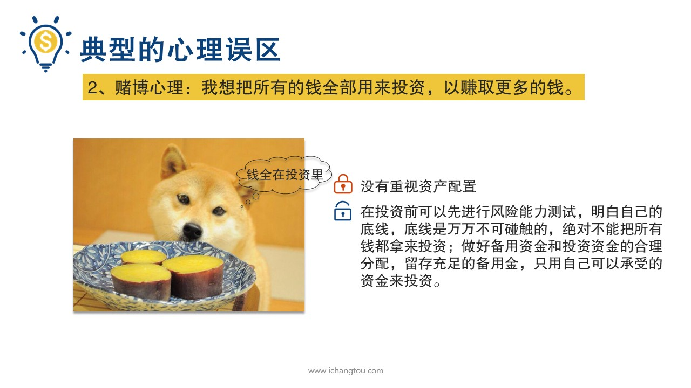
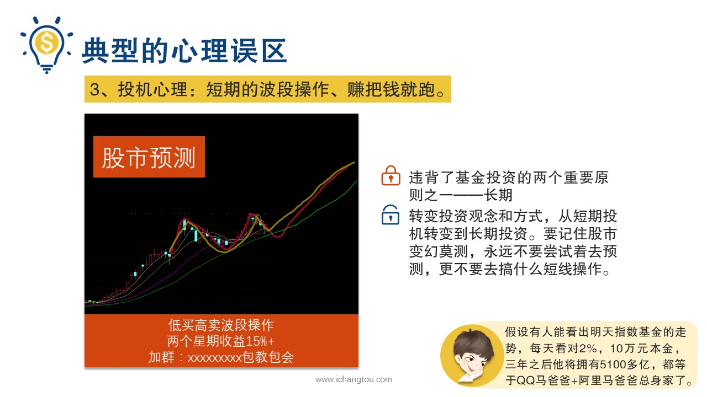

# 基金12-2-赌博心理和投机心理

## PPT

## 课程内容

### 用闲钱投资

- xxxx1

  > 前面开到二狗之后呢，没安生两天又出幺蛾子了，他连吃饭的钱都没了，原来是房租涨价，钱被他算的正正好留一部分生活费，剩下的全部投到基金里面去，房租这么一张饭钱就没着落了，要么举家吃上口温饱饭，要么卖掉尚在低温中的基金，要么就只能跟师兄了，他觉得一二两个选项对他自己都太残忍了，于是选了第3个选项对我残忍，很多小伙伴很好奇啊，二狗为什么会陷入财务危机呢？做法有什么不妥吗？二狗的这个问题其实也是投资中常见的一个误区就是我想把所有的钱全部用来投资，以赚取更多的钱，这是一种典型的赌博心理产生原因有两个，首先它违背了基金投资最重要的。选择之一，那如何判断我们有多少闲钱呢？通过前面的剪头计划学习我们已经知道投资之前一定要先搞清楚自己的收入和消费状况，留足三个月的生活备用金和商业保险性，剩余的钱才能拿来投资，以免遇到像二狗一样房租涨价的意外情况，另外有些小伙伴可能对自己每月的开支没有清晰的概念，这里师兄要说了，想做好投资记账是很重要的，这里是从教大家几个基本的小技巧，你是用手机上的记账APP，比如网易等看自己喜欢哪款都差不多，上面可以同步各大主流银行的信用卡，借记卡，支付宝的账单，线上付款，可以一键同步大大减少了我们的记账时间，第二是分类基础上更清晰，银行卡分为。储蓄账户，投资账户支出可以再分为日常开支和意外开支的，就可以清晰的查看各项支出和自己的资产情况，第3个就是定时记账不遗忘线上付款，无现已同步，针对现金消费设定一个现金支出分类，在每次取钱之后马上记一笔账之后就不用麻烦再寄了，这样连续记录几个月收入和开支你就能清晰的了解消费取向，判断自己真实的生活费用以及剩余的资金量，然后计算出克投资资金，只用闲钱投资才更安心。第2个原因就是他们没有重视资产配置的问题，你有没有思考过这个问题就是当你把所有的钱用来投资指数基金后，万一有一天股市暴跌了，你受得了吗？股市暴跌一来考验我们的财力而来更考验心理压力，所以你的底线在哪里你想清楚了吗？各种投资的风险不同，进行合理的资产配置是我们抵御风险的一种方式，那么如何解决呢？我们推荐各位小伙伴在投资前先进行风险能力测试，明白自己风险承受底线在哪里，底线是万万不可触碰的，绝对不能把所有的钱都用来投资，尤其是投到了同一个投资产品上，做好备用资金和投资资金的合理分配，使用自己可以承受的资金来投资。说二狗陷入财务危机后，急于早日摆脱这种状况，不知道从哪儿加到这个舰机群，推进所谓的地产基金啊，听到里面的人说他们在进行短期的低买高卖的波段操作，两个星期内就赚了15%，感觉找到了活路，回来告诉我这种操作，我说好吧，你把这个月的饭钱结一下先，我不确定你下个月买基金还能不能还的起，你看短期波段操作，你咋不上天了？聪明的小伙伴可能已经知道二狗逼事情对的原因啦，这就是我们说的第3个误区就是想做短期的波段操作，赚了钱就跑，这种心理主要属于投机心理基金投资中的主观心理和短期操作都是最要不得的，严重违背了基金投资最重要的两个原则之一长期，所以投资观念和方式都需要转变，短期投机转变到长期投资小伙伴们。假设有人能看出明天是十五期间的走势，每天看对2%10块钱。他讲995100多亿等于QQ+在马爸爸家，阿里巴巴的总身价之和如果真有这等秘籍，那些人还会愿意告诉你们孩子醒醒吧，在股市中吃肉没赶上，挨打一次没落下的韭菜不在少数，虽然有用的策略还是受不了别人赚钱的刺激，去预测市场搞什么短线操作，不用好好上班了吗？股市变幻莫测永远不要尝试着去预测，就不要去搞什么短线操作，真的会想。我想把所有的钱全部用来投资，以赚取更多的钱，短期的波段操作赚把钱就跑，这两种误区背后体现的赌博心理和投机心理都是我们要坚决杜绝的投资基金，必须严格遵守两个原则，闲钱和长期我们要综合考虑自己的经济压力和心理压力，做好资产配置，远离短线操作，长期坚持按策略投资指数基金，让时间与我们为伍，享受复利带来的威力。

### 放弃投机式的短线波段操作

### 坚决贯彻定投两原则

## 课后巩固

- 问题

  > 基金定投必选坚持的两个基本原则是？
  >
  > A.闲钱
  >
  > B.长期
  >
  > C.以上全部都是

- 正确答案

  > C。定投必须坚持的两个基本原则一个闲钱，一个是长期。