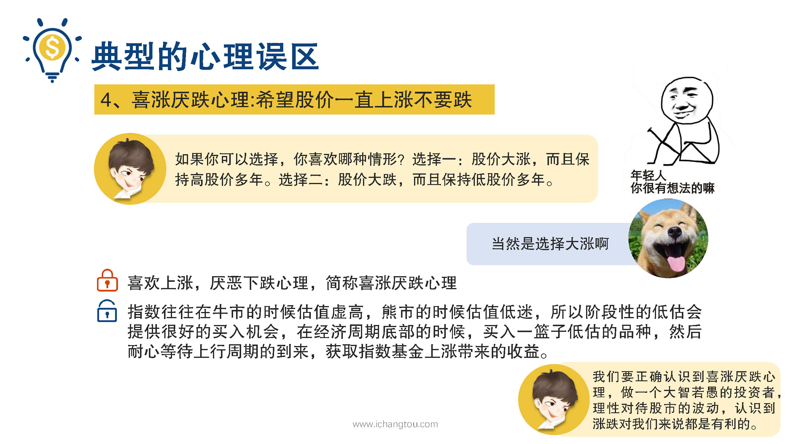
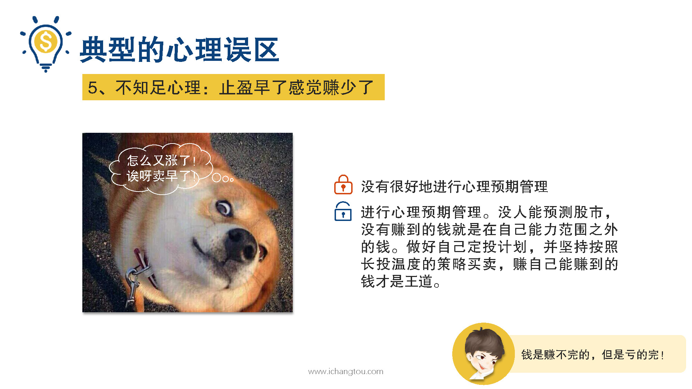

# 基金12-3-喜涨厌跌心理和不知足心理

## PPT

## 课程内容

### 正确处理眼前利益和长期利益

- xxxx1

  > 二狗的财务危机事件波段操作这样的问题真是让师兄操碎了心，我决定好好引导引导他，问他如果你可以选择下面哪种情形，你比较喜欢选择，一是股价大涨而且保持高股价多年。并且保持第一户家多年，结果你猜师兄果然没有看错二狗，她跟绝大多数股民一样，希望股价长期打仗，这是投资艺术中的测试，90%的投资人都选了第1个股价大涨，保持高股价多年，这也是我们要说的第4种误区，希望股价一直上涨不了爹，这种误区背后是洗澡跌的心理波动是股市必然的长期性表现，不管牛熊我们都应该接受，可惜大多数人总是喜欢上涨，却忍受不了股市下跌，甚至有很多新人选择在上涨时入场，希望能斩获更高的收益，这种心理呢，就像在机场看着天上飞的飞机时感觉心潮澎湃，恨不得自己马上就上天而降，等到真的坐上天上飞的飞机时又紧张得要命，老是想着挖，万一跌下去可怎么办呀？遇到气流的。更是吓得半条命都没了，事实上我们要明白股市的上涨可以让我们眼前赚的更多，但是对于定投指数基金的各位而言，下跌反而能让我们买得更便宜，拉低指数基金的持有成本才能在未来赚得更多，因为指数往往在牛市的时候估值虚高，在熊市的时候估值低迷，所以阶段性的低估会给我们提供很好的买入机会，在经济周期底部的时候买入一篮子低估的品种，然后耐心等待上级周期的到来，过去指数基金上涨带来的收益。认识到西藏引蝶心里做一个大智若愚的投资者，理性对待股市的波动，认识到张爹对我们来说都是有利的，在上涨的时候我们赚取眼前的利益，在下跌的时候抓住入场的好机会，这才是一个投资者最高的境界，在我们孜孜不倦循循善诱的教导之下，我终于认识到了自己西藏药业跌的心态，是不正确的方式，太邪规正师兄骄傲呀，觉得自己拯救了一个迷途知返的好青年前几天二狗有一只基金温度到了40度，按照定投计划要开始分到卖出了，然而给我卖出一部分后，发现它又涨了5%，然后他就觉得自己卖早了，然后传到5%就跟自己亏了5%一样，很不开心，甚至有点冲动，想冲进去再赚一波，也就是投资过程中最容易放在第5种误区，只因早了感觉赚少了很不开心。分析它背后的心理，主要是不知足的心理在作怪，没有很好的进行心理预期的管理，没人能预期股市没有赚到的钱，就是在我们能力范围之外的钱先不要惦记了，前面我们学习的指数基金定投9啊，是在指数温度低时买入，在温度高时卖出，而温度的高低是根据历史的温度出现的概率来设置的，在达到50度后可能还会出现60度70度，但是概率低于20%，而温度下降的概率大于80%，如果你持有不卖出，你将有20%的概率赚到更多，但是却有80%的概率承受下跌的风险，你愿意选择哪个呢？师兄教小白投资这么些年，最被大家记得最深的一句话就是钱是赚不完的，但是亏得完，如果你想赚到每一个同伴的机会太多了，刑法民法里面就有很多机会，你要去是吗？所以做好自己的定投。并且坚持按照只数温度的特别买卖赚自己能赚到的那部分钱才是王道好了，西城燕的心理和不知足，心里你知道怎么克服了吗？不管是上涨还是下跌，我们都要坚持定投计划，低位买入高位卖出赚自己能赚到的钱，不急不躁，耐心等待复利带来的惊喜。

### 善于抓住机会

严格按照指数温度定投，赚自己能赚到的钱

## 课后巩固

- 问题

  > 在熊市里，哪一表现是正确的？
  >
  > A.伤心，把定投的基金全部卖掉，从些不再踏入
  >
  > B.冷静，严格根据长投温度定投，摊薄成本
  >
  > C.啥也不干，装死，免得看到伤心

- 正确答案

  > C。熊市里我们定投的指数基金也会跟着波动，指数温度可能会持续下降，意味着可能会有新的投资机会，小伙伴们需要冷静，寻找合适的机会，增加投资额度，摊薄成本，静待股市回暖资产增值。