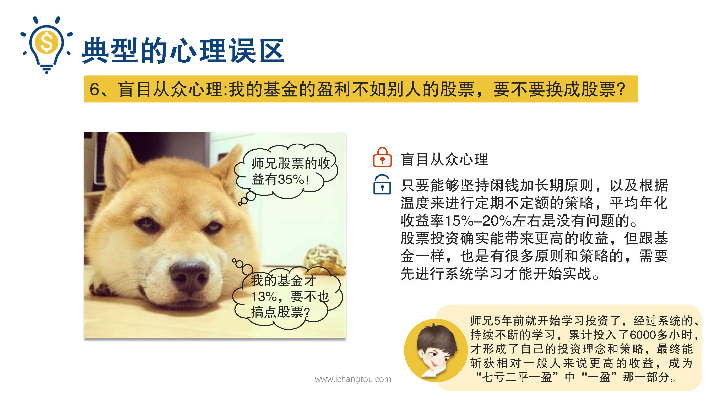

# 基金12-4-盲目从众心理

## PPT

## 课程内容

### 清楚认识自己的能力圈，不懂的不碰

- xxxx1

  > 经过上次的质疑事件，后二个同学倒是真的安静了几天，但好景不长，没几天他又开始神神叨叨了，因为他无意间看到师兄的股票收益率35%以上，他觉得自己的基金年化收益率10~%15%，是不是少了点？纠结着要不要买了基金也跟着去买股票，当在座的小伙伴，听说师兄的年化收益率在35%以上，有没有像二狗一样产生卖了基金去买股票的冲动，如果你。那么你跟偶一样陷入了第6种误区，我的基金盈利不如别人要不要换成股票呢？在未知事实面前，我们很容易掉进盲目从众心理的陷阱，通过前面的学习我们已经确切的知道，只要我们能够坚持长期原则以及根据温度来进行定期不定额的策略，平均年化收益率15~%20%左右是没有问题的，但是当我们听说有的人还有收益更高的投资路径时，仍然免不了心生羡慕之情，这是人之常情，股票投资确实能带来更高的收益，跟基金一样也是有很多原则和策略的，需要先进行系统学习才能开始施展，毕竟我们常说的股市有风险，投资需谨慎，不是空口说说而已，始终希望大家务必记住，在不懂之前先不要跑，还记得第1课中曾说过其中。系统的持续不断的学习，累计投入了6000多个小时，才形成了自己的投资理念和策略，最终能掌握相对，一般人来说更高的收益成为7亏2平1赢一赢的那一部分。我们在羡慕别人的收益时，也一定要弄清楚别人高收益背后所具备的能力，在自己的能力还不够，是真正该做的事先认真执行已经学到的投资知识，坚持指数定投赚自己能赚到的那一部分钱，同时通过不断的学习掌握更多的投资知识，扩大自己的能力圈，才能踏入更多的投资领域，稳健的赚更多的钱。

### 扩大能力圈

## 课后巩固

- 问题

  > 如果你看到别人的股票收益暂时比自己的基金收益高，你会怎么办？
  >
  > A.继续坚持定投自己的基金，同时系统认真学习股票知识，然后再去实战
  >
  > B.把基金卖掉，跟他买股票
  >
  > C.什么也不干

- 正确答案

  > A。我们要清楚自己的能力圈，继续坚持定投自己的基金，同时还要扩大自己的能力圈，开始系统认真的学习股票知识，然后再去实战。