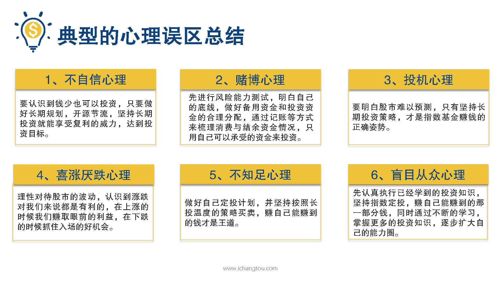
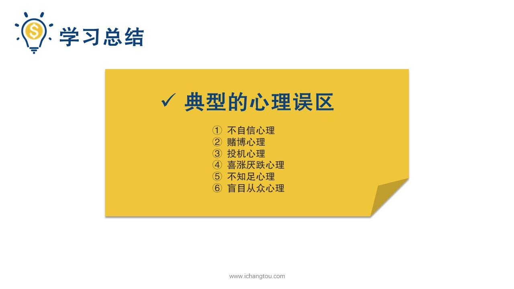

# 基金12-5-最佳心理姿势宝典

## PPT

## 课程内容

### 高筑墙，广积粮，缓称王

- xxxx1

  > 

### 做佛系投资者

## 课后巩固

- 问题

  > 基金投资最佳心旦姿势是什么？
  >
  > A.高筑墙，广积粮，缓称王的方针
  >
  > B.做一名佛系投资者
  >
  > C.以上都是

- 正确答案

  > C。基金投资最佳心理姿势是坚持高筑墙，广积粮，缓称王的方针，做一名佛系投资者，坐观云卷云舒，笑看股涨股落，静待资产升值，享受复利的威力。