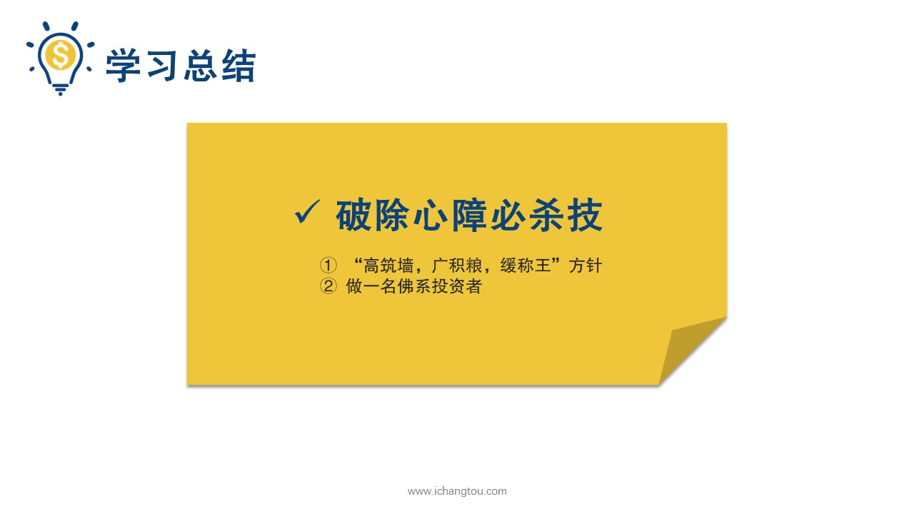

# 基金12-5-最佳心理姿势宝典

## PPT

## 课程内容

### 高筑墙，广积粮，缓称王

- xxxx1

  > 好了，前面我们详细分析了基金投资过程中最常见的6个误区，以及背后体现的6种心理误区，并给出了相应的解决办法，现在总结一下，第1种是不自信心理，觉得自己的儿子太小，不适合投资，主要原因是缺乏开源节流和长期规划的投资意识，解决办法要认识到钱少也可以投资，只要做好长期规划，开源节流，长期坚持就能享受复利的威力，达到投资目标，第2种赌博心理把所有的钱全部用来投资，希望大赚一把，不能坚持基金投资中用闲钱投资的原则，没有重视资产配置的问题，解决办法在投资前进行风险能力，测试明白自己的底线，做好备用资金和投资资金的合理分配，通过记账等方式来梳理自己的消费与结余资金情况，使用自己可以承受的资金。第3种是投机心理，想要通过短期的低买高卖来快速获取收益，解决办法要明白股市难以预测，只有坚持长期投资策略，才是指数基金赚钱的正确姿势，第4种也叫贪婪趋利避祸心理，这是人性共同的问题，喜欢上涨也无下跌解决办法，理性对待股市的波动，认识到张爹对我们来说都是有利的，在上涨的时候我们赚取眼前的收益，在下跌的时候抓住入场的好机会，第5种是不知足，根据策略卖出后又继续上涨，没有赚到的那部分认为是自己的损失而不开心，解决办法，做好自己的定投计划，并坚持按照指数温度的策略买卖赚自己能赚到钱才是王道，第6种盲目从众心理面对未知的事情。掉入盲目从众的陷阱解决办法，先认真执行已经学到的投资知识，坚持指数定投赚自己能赚的那一部分，同时通过不断的学习，掌握更多的投资知识，逐步扩大自己的能力圈，才能踏入更多的投资领域，稳健的赚更多的钱，经过前面各种认识误区的折腾和教训之后，二龙同学终于安静了，经过深思熟虑，他确定了投资新目标，一边坚持基金定投一遍认真系统的学习股票知识，争取将来能够把投资知识和收益都向师兄靠拢，始终觉得二狗的成长还是可以期待准备向二沟传授一套基金投资最佳心理知识考点这套最佳的基金投资心理咨询主要有两个要点，第一点始终坚持高筑墙广积粮缓称王的方针只是。朱元璋平定天下的方针对应的，我们要努力寻找第一温度指数基金，广积粮对应的我们要开源节流，养大下蛋的鹅对应了投资的态度，不急不躁，做的财富增值，享受复利的威力，第2点是做一名佛系投资者优秀的佛系投资是什么意思呢？佛系就是能够坐观云卷云舒笑，看股涨股劲，待资产的升值，享受复利的威力，大家可能还记得前段时间有一个很流行的游戏叫做旅行青蛙玩过的小伙伴都很郁闷，因为我们完全不能控制这只蛙儿子能做的事情，就是收集三叶草获取物品，给青蛙准备最好的行李和便当，然后享受她旅行途中返送回来的惊喜，在这个游戏中我们也看到了一个健康的投资关系。光儿子就像我们手中的指数基金爱的不行，期待的不行，我们知道指数基金这个袜子一定会长期向好的，那是什么时候跌，什么时候涨都不受我们的控制，我们着急也没有用，我们唯一能做的就是努力工作赚钱，然后把更多的钱投到第一温度的指数基金里，静静等待它上涨的时候带给我们更多的惊喜，所以从明天起做一个佛系投资者吧，他总有回归上涨的一天，我们利用好指数基金的长途温度低位买入，近代他带来财富增长。每天的干货什么事特别多，我们列举了投资过程最容易出现的6种心理误区，并且归纳成了不自信，心理赌博，心理投机心理和盲目从众等6类针对每种心理，我们分别制定了破除的方法，帮助小伙伴们找到了自己的问题所在，拿起我们传授的必杀技，勇敢的破除心魔，最后我又传授了一套基金投资最佳的心理姿势宝典，主要包括广积粮方针以及佛系姿态，期待你们在基金投资中有更好的表现，明天我们将迎来基金最后一天的学习会是什么内容呢？始终只能告诉你学完最后一天你就可以在基金江湖里纵横市场怎么样？有没有很期待呢？

### 做佛系投资者

## 课后巩固

- 问题

  > 基金投资最佳心旦姿势是什么？
  >
  > A.高筑墙，广积粮，缓称王的方针
  >
  > B.做一名佛系投资者
  >
  > C.以上都是

- 正确答案

  > C。基金投资最佳心理姿势是坚持高筑墙，广积粮，缓称王的方针，做一名佛系投资者，坐观云卷云舒，笑看股涨股落，静待资产升值，享受复利的威力。