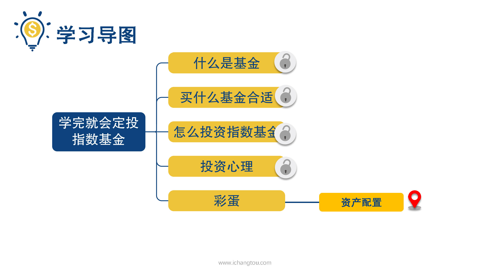
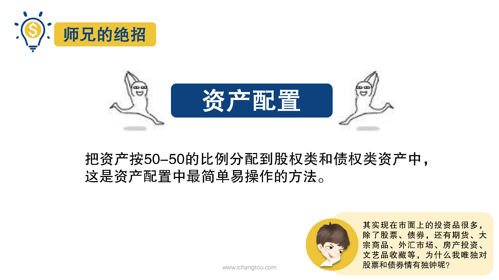
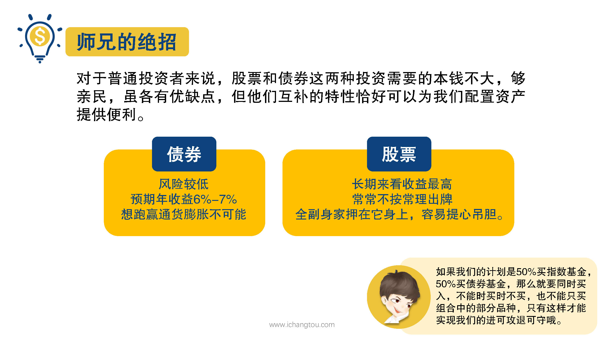

# 基金13-1-如何赚安稳的钱

## PPT

## 课程内容

### 资产配置的概念

- xxxx1

  > 

### 资产配置的目的

### 资产配置的原则

## 课后巩固

- 问题

  > 下面对于资产配置的描述，哪一项是错误的？
  >
  > A.资产配置的目的是在一个较长的时间跨度内用最少风险获取最大程度的收益
  >
  > B.资产配置的基本原则是分散化和灵活配置
  >
  > C.资产配置就是根据自己的风险偏好，利用各种资产的不同属性，按一定比例建立一个包含多种资产的投资组合

- 正确答案

  > B。本题选择的是错误的，B选项错误。制定好组合规划后必须严格按计划执行，不能时买时不买，也不能只买组合中部分品种，否则想通过资产配置用最少风险获取最大程度的收益就成了一句空话。