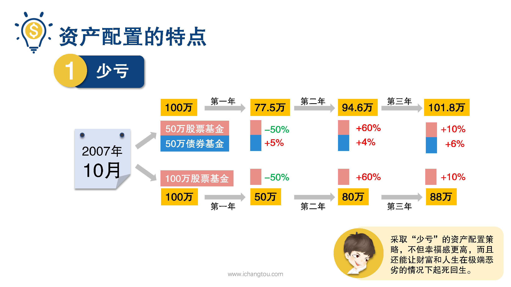
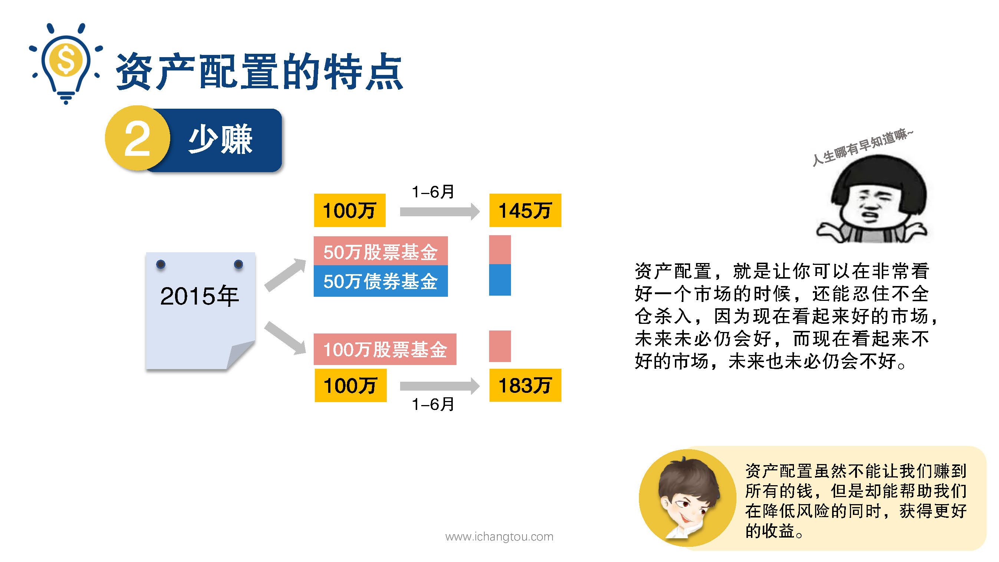

# 基金13-2-资产配置究竟有啥好？

## PPT

## 课程内容

### 资产配置的特点是少亏、少赚

- xxxx1

  > 

## 课后巩固

- 问题

  > 执行资产配置策略最难的一点是什么？
  >
  > A.制定投资组合
  >
  > B.要预测何时才是买入时股权资产的时机
  >
  > C.要忍受“少赚”的折磨

- 正确答案

  > C。资产配置无须择时，但是要想通过资产配置在降低风险的同时尽量争取获得更好的收益回报，关键在于能忍受“少赚”的折磨。