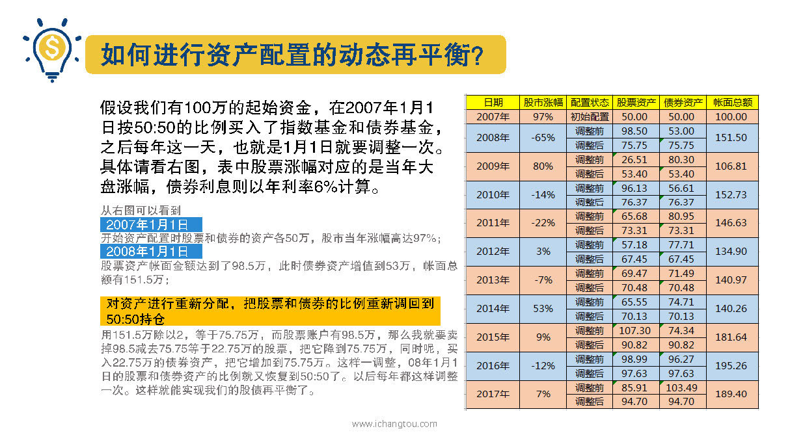

# 基金13-3-如何做好资产配置？

## PPT

## 课程内容

### 确定资产配置的策略和规则

- xxxx1

  > 

### 每年动态再平衡

## 课后巩固

- 问题

  > 资产配置的动态再平衡的调整时间，下述哪个说法是正确的？
  >
  > A.每当自己觉得股市要跌啦就调整
  >
  > B.每调整三次
  >
  > C.每调整一次

- 正确答案

  > C。每年调整一次就可以了。