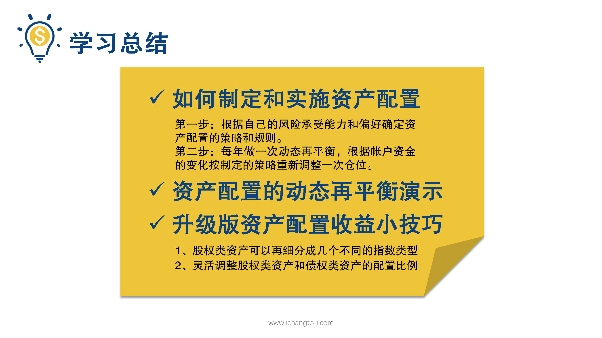

# 基金13-4-资产配置还能升级？

## PPT

## 课程内容

### 股权类资产可以再细分成几个不同指数类型

- xxxx1

  > 

### 灵活调整股权资产和债权类资产的配置比例

## 课后巩固

- 问题

  > 下面哪种说法不能提升资产配置的收益？
  >
  > A.基于对估值的判断，股权类和债权类资产的比例可以在70:30到30:70之间回来变化
  >
  > B.50%的股权类资产可以按不同类型的指数基金再细分
  >
  > C.自我感觉股市有机会才配股权类资产，没有就暂时不配

- 正确答案

  > C。如果想要获得更好的收益，同时更加分散风险，可以将50%的股权类资产按照指数基金的不同类型再细分，而且配置比例并非一成不变的，随着投资水平的不断提高，我们可以动态再平衡策略中加入一主动的因素，比如指数的长投温度低时多配指数基金，相反的情况则多配债券，而资产配置的大忌是加入自己太多的主观因素。