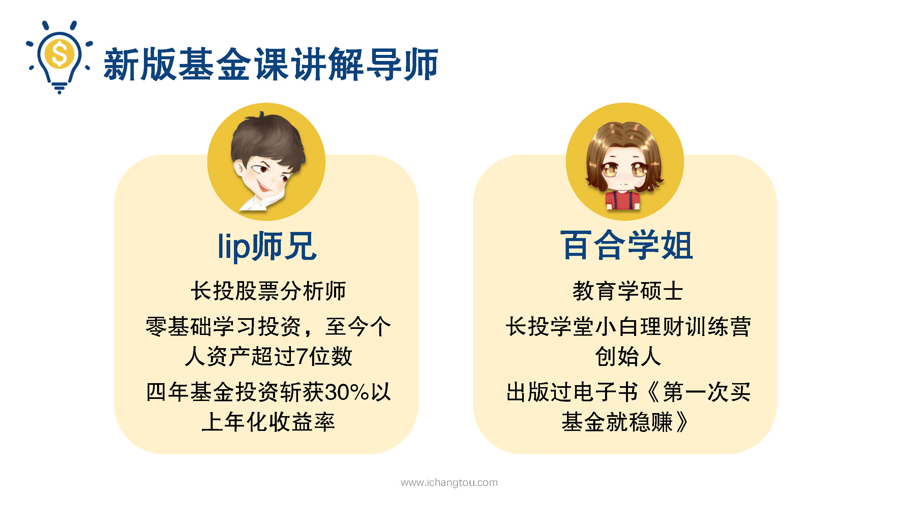
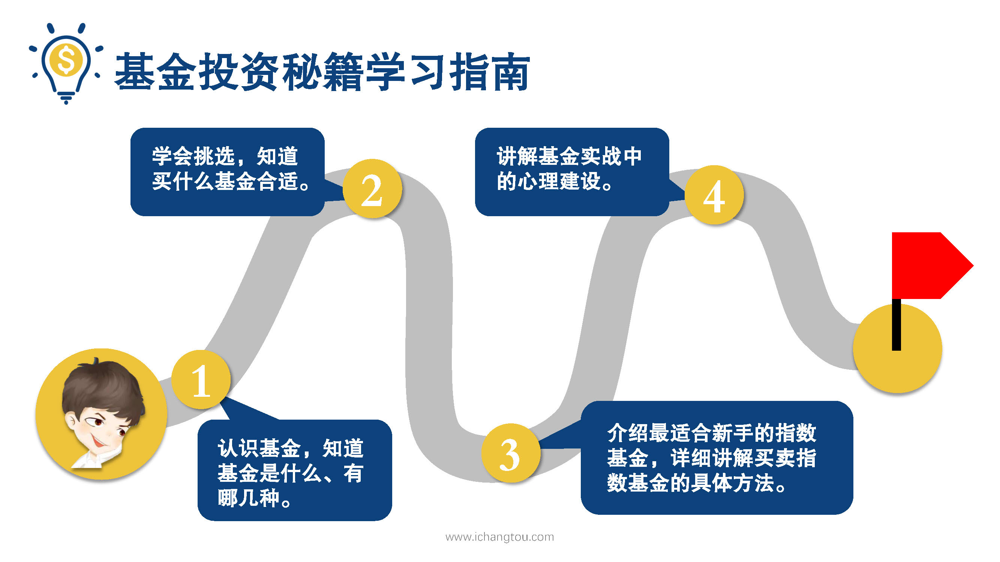
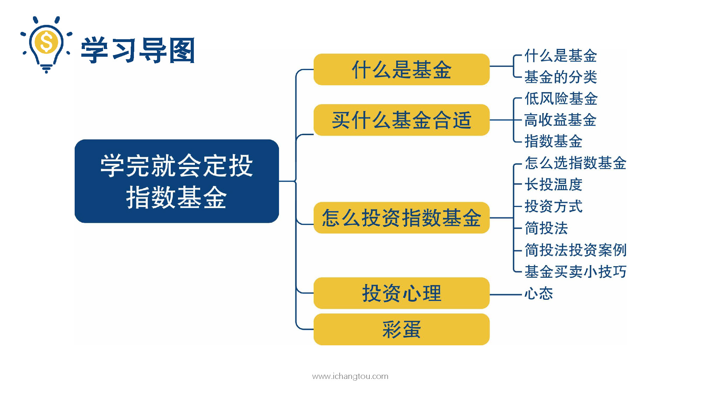
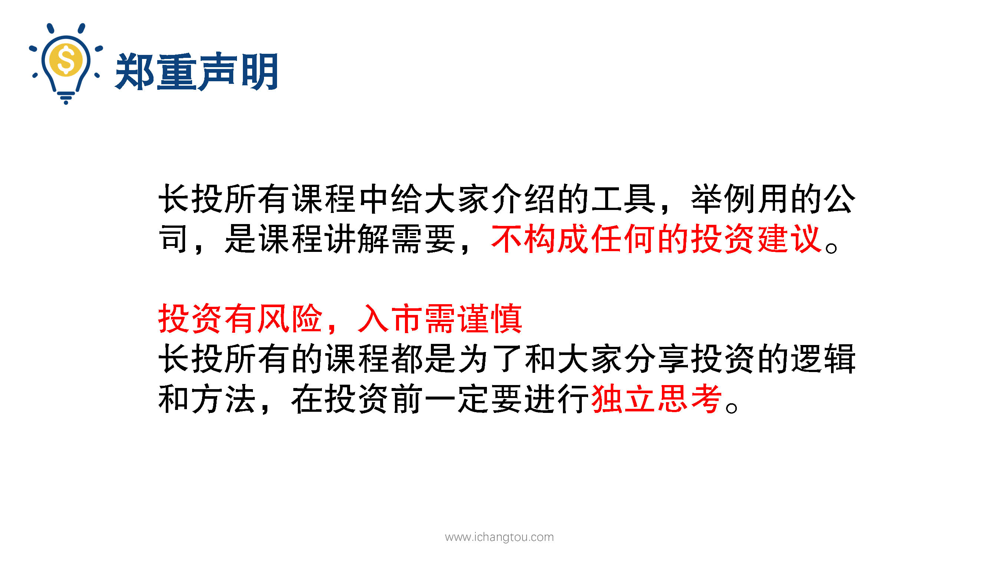

# 基金1-1-剧透基金课

## PPT

## 课程内容

### 讲师介绍

* Lip师兄

  > 欢迎大家来到基金课，我是Lip师兄，本次课程由我和百合学姐共同为大家讲解，嗯，现在大家可能还不认识我们，这里先给大家做一个简单的自我介绍，我呢，是长投的股票分析师，5年前开始零基础学习投资，现在个人资产已经超过7位数，在投资的第2年也就是2014年A股收益率达到105%，港股收益率40%，同时因为用了自己的基金投资策略，投资H股ETF和沪深300都斩获了30%以上的年化收益率。

* 百合学姐

  > 而本次课程的另一位讲师是百合学姐，她是教育学的硕士，长投学堂21天理财训练营的创始人，从2012年开始系统的学习过股票投资、基金投资、保险等理财投资知识，出版过电子书《第一次买基金就稳赚》，擅长设计有用、易学、好玩的课程。

### 基金课备章节简介

* 课程的特点

  > 到了这里你可能会觉得我们是在炫耀个人的投资成绩，其实不是的，我们在炫耀学得够早。好，不开玩笑，师兄想告诉你的是，我们的理财投资之路都是从什么都不懂的小白开始的，这些投资成绩都是一点一滴学到并且经过实践所检验的。现在百合学姐和我把自己多年的策略、在基金投资领域摸爬滚打的血泪经验，总结成为最有用最轻松易懂的秘籍，毫无保留的告诉你，你会发现学习理财投资这些技能干货怎么可以这么轻松有趣，而真正实战投资后，你还会发现通过投资赚钱居然比发奖金还有成就感。

* 课程的知识点

  > 那这套基金投资秘笈能让大家学到的是哪些知识呢？师兄这里给大家先剧透一下。基金节课一共包括4章，
  > 第1章先认识基金，知道基金是什么有哪几种，
  > 第2章学会挑选，知道买什么基金合适，
  > 第3章介绍最适合新手的指数基金，详细讲解买卖指数基金的具体方法，
  > 最后一章讲解基金实战中的心理建设，让你心里纠结的坑。

* 各章节的内容

  > 先来说第1章，我们为什么要学基金？基金有什么优势？市场上各种基金让人眼花缭乱，他们是怎么分类的？这些都会在第1章作出解答，并且还会手把手教大家打开基金详细资料的方法，识别基金的庐山真面目，

  > 第2章，我们从风险和收益的角度对比讲解不同种类的基金收益如何？风险高不高？用什么钱投资怎么筛选，了解不同基金的情况，这样选择起来自然游刃有余，学完这章之后，大家会发现指数基金是最适合工薪阶层投资的基金品种。

  > 光说不练假把式，到了第3章会落实到实践中，为大家详细讲解如何投资指数基金怎么投资才能提高收益，用什么指标？具体怎么操作等等。

  > 不过在实际投资中还是有很多小伙伴学会了怎么选择和怎么投资指数基金后，却因为各种原因不能严格执行，为了把知识更好的运用，在第4章，我们加入了基金投资的心理建设。

* 学完以后的改变

  > 那么14天的课程学完后会有什么改变呢？
  >
  > 学员人数太多无法一一细数，但是有一个学员的经历，我想跟大家分享一下，他的名字叫大董，13年毕业之后在北京做了销售，工作了几年，有了一些积蓄，但是他没有飘，没有去买房买车享受物质带来的腐蚀，而是选择了跟同事一起稳扎稳打的进入了股市，本想着我买的是资产而不是负债，现在又是牛市股票最赚钱的老铁没毛病。没想到，毛病大的去了，2015年6月开始短短两个月他的账户亏了一半，后来受不了内心的煎熬，忍痛全卖了，本来以为再也用不到股票账户了，但是听了师兄和学姐的课程觉得踏实又靠谱，老老实实上了车，用长头温度的策略开始投资，我本来是不认识他的，半年前他主动加到了师兄的微信，发了一个红包留言说盘点账户才发现基金投资已经给他转了半年的工资，想要对师兄说一声“谢谢“。虽然说他当年牛市亏损的缺口还是在，但是师兄相信不久的将来，他会用正确的姿势把当年无知亏的钱赚回来，希望没有亏损的你能做的更好哟。

## 课后巩固

* 问题

  > 基金课包含以下哪些知识点？
  >
  > A.BC都对
  >
  > B.基金是什么以及基金的种类
  >
  > C.挑选基金的方法

- 正确答案

  > A。基金课包括知道基金是什么、有哪几种、如何挑选基金、指数基金、实战中的心理建设等内容哦

