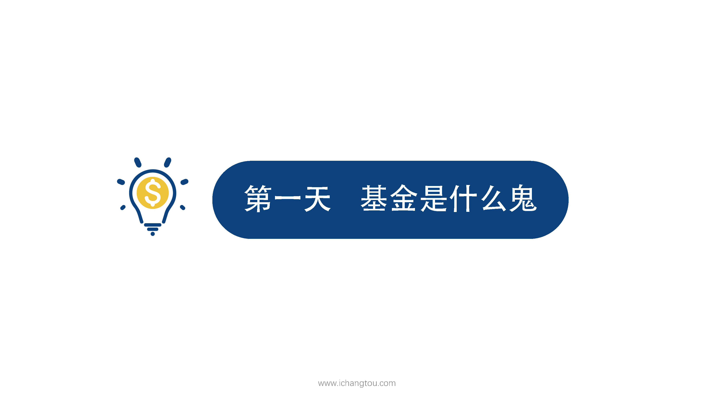
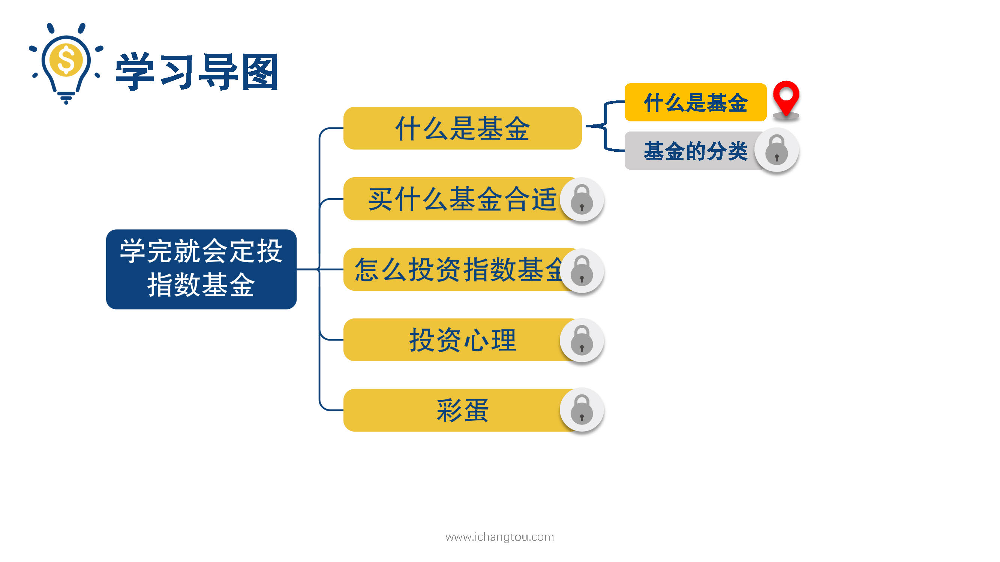
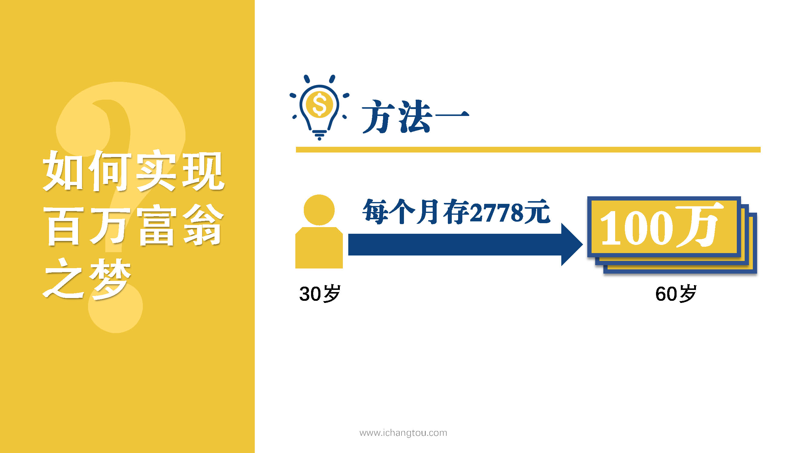
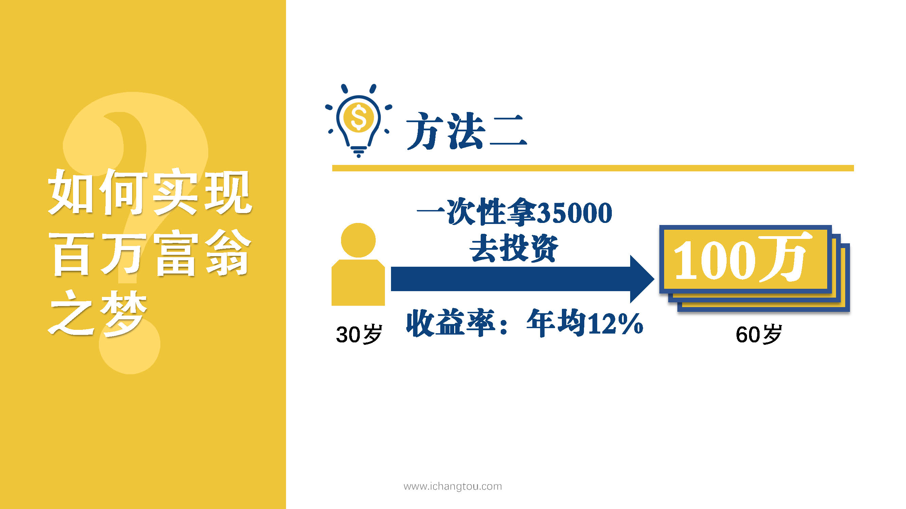
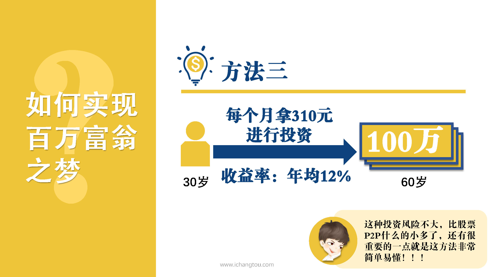

# 基金1-2-你也可以成为百万富翁

## PPT

## 课程内容

### 实现百万财富的途径

- 作个理性的投资人

  > 听了课程内容的介绍后，小伙伴们是不是巴不得马上学习基金的投资方法，并且立刻去买了呢？
  >
  > 不要着急，作为一名理智的消费者，我们在买任何东西之前都会先了解这个东西是什么，好在哪里。投资也不例外，既然我们想通过投资基金赚钱，那么我们首先要知道基金究竟是什么，它的优势是什么，容易给人造成什么样的误区。

- 想过在退休时成为百万富翁吗

  > 为了照顾对基金不是很了解的小伙伴，今天师兄主动给大家普及基金的基础知识，在正式开始先试用，先问大家一个问题，你想过在退休的时候成为百万富翁吗？
  >
  > 回答非常想的同学，继续听课，说不想着同学可以出去玩儿了。好了，不开玩笑，我相信80%以上的小伙伴都是希望退休时拥有一大笔钱可以用来养老、支持自己的兴趣爱好、给老年生活增添便利，甚至有的小伙伴立志要提前退休，早日享受钱生钱的快感。
  >
  > 怎么才能实现呢？我们用退休时手里有100万举例，假设你现在30岁到60岁退休，师兄有三种方法帮大家实现这个100万的小目标，放心师兄很正直，肯定不会推荐大家违法乱纪的方法，更不会让你去一天打三份工的。

- 成为百万富翁的三种方法

  > 来让我们看看是哪三种方法，
  >
  > 第1种方法非常简单，小学生都懂的，那就是我们每个月都存2778元，30年后目标实现了，
  >
  > 第2种方法是我们在30岁时一次性拿35,000元去投资，如果平均每年能够获得12%的收益，没到60岁就有100万了，
  >
  > 第3种办法是从现在开始我们每个月都拿出310元进行投资，从30岁一直到60岁，如果平均每年能获得12%的收益，那么到了60岁时，请你猜猜会有多少钱，机智的小伙伴已经猜到了，没错，那个时候你的账上会有100万。

- 如何做到每年都有12%的收益率

  > 怎么样？是不是听着很不可思议，310块也就一件衣服的钱，每个月用一件衣服的钱，通过12%的年化收益率将带来60岁的百万财富，310元就算是月光族，只要每个月很少买一两件东西都能办到，但收获的却是成为百万富翁的机会，这样的好事相信谁都不愿意错过，但是有小伙伴会说了，每个月拿出310块钱确实是件小事，但是每年都有12%的收益率，这点也太难了吧，告诉大家一个好消息，我们这个课程就是介绍上面的第3种方法的，教大家如何才能找到年化收益率12%的投资品种，而且师兄负责任的告诉你，这种投资风险不大，比股票p2p什么的小多了，还有很重要的一点，就是这个方法非常简单易懂，小伙伴们不必担心，自己听不明白，听到这里嗯是不是迫不及待了呢？是不是特想知道究竟是什么投资品能达到如此惊人的效果呢？答案就是基金。

## 课后巩固

- 问题

  > 普通人最有可能实现百万存款的途径是？
  >
  > A.买彩票
  >
  > B.学习基金投资
  >
  > C.天天吃泡面

- 正确答案

  > B。好好学习基金投资，轻松实现年化收益率12%，百万存款不是梦。