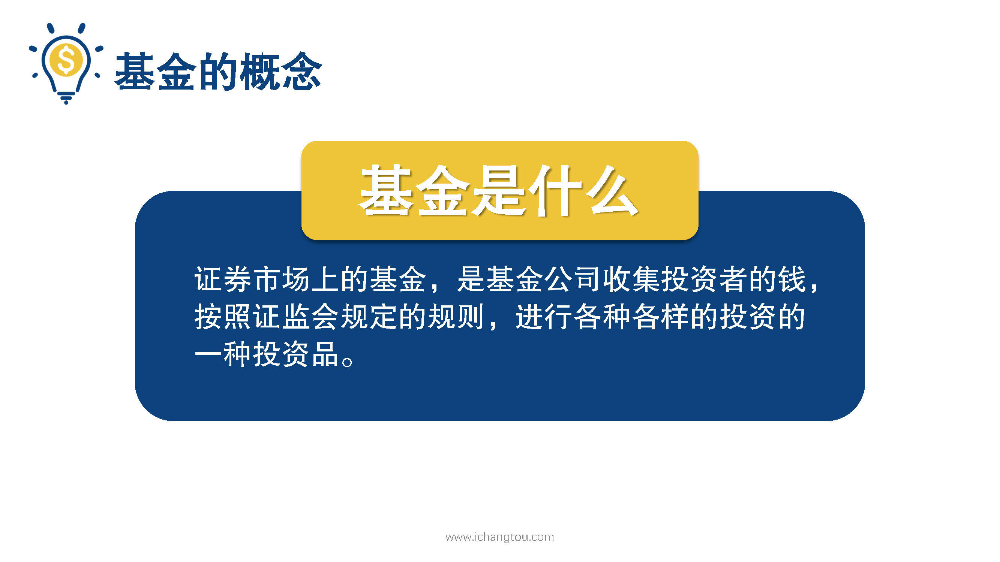
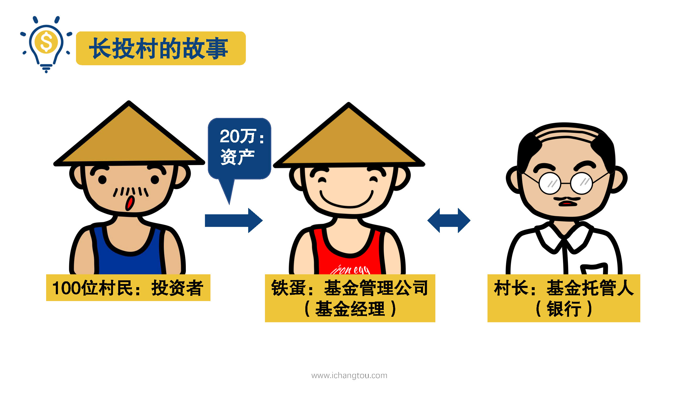
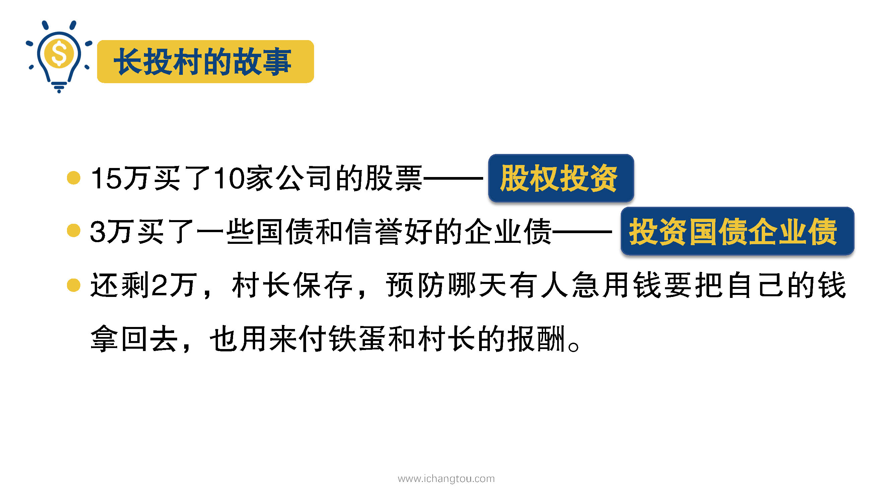

# 基金1-3-长投村里话基金

## PPT

## 课程内容

### 基金的定义

- 能够实现百万目标的基金是什么

  > 嗯，年收益12%能帮你实现百万富翁梦想的基金到底是什么呢？天使基金，家庭教育基金，这些也叫基金，没错了。但是能够实现目标的还是要靠证券市场上的那些基金。

- 基金的概念

  > 证券市场上的基金是基金公司收集投资者的钱，按照证监会规定的规则进行各种各样的投资一种投资品种。

- 一个解释基金的故事

  > 关于基金的概念，这里师兄给大家讲一个长头村的故事来解释一下，话说有个长寿村，村里绝大多数人每天是忙着下地干活，面朝黄土背朝天的，但是呢，也有个叫铁蛋的家伙却从来不干活，他天天研究着怎么投资，靠着投资的钱给自己买了新车，换了新房。哇，其他村民们羡慕不已呀，就跑来找铁蛋，想让他们投资。铁蛋说，可以呀，但是每100块我要收一毛钱的报酬，村民们觉得，一毛，也不是很多嘛，就同意了。但是突然有人问，嗯？如果铁蛋这家伙拿着大家的血汗钱去喝酒泡妞，没去投资，那怎么办？
  >
  > 铁蛋就提议说，大家可以一起去找最公正的村长，把钱存在村长那里，但只有在投资的时候才能用这部分钱，但是呢，村长也不是白做工的，也要收保管费，大家觉得靠谱就凑了20万给铁蛋就行了，于是铁蛋拿着这些钱做了以下投资，他拿其中15万买了10家公司的股票，都是他分析研究后觉得有发展前景的工作，他用3万买了一些国债和信誉好的企业债，还剩了2万，铁蛋但让村长保管好，预防哪一天某个人急用钱，要把自己的钱拿回去，也用来付鞋带和村长得报酬嘛。

- 其金运作过程中的三角色

  > 听完了这个故事，是不是觉得基金很容易理解了呢？铁蛋就是基金管理公司、同时担任基金经理；村长就是基金托管人，也就是银行；而那些村民，就是投资者。投资者不擅长投资，就可以把钱交给基金管理公司；而银行会作为第三方，全权保证这些钱的安全；基金经理则负责从专业的角度选择股票债券等投资品，进行投资。当然，基金经理并不会把所有的钱都投出去，他们会保留一部分现金，来应对投资人把基金卖回给基金公司的情况。

## 课后巩固

- 问题

  > 现实生活中保管基金这些钱的第三方是谁？
  >
  > A.基金经理
  >
  > B.基金公司
  >
  > C.银行

- 正确答案

  > C。银行是负责保管我们投资基金的钱财安全的第三方机构。