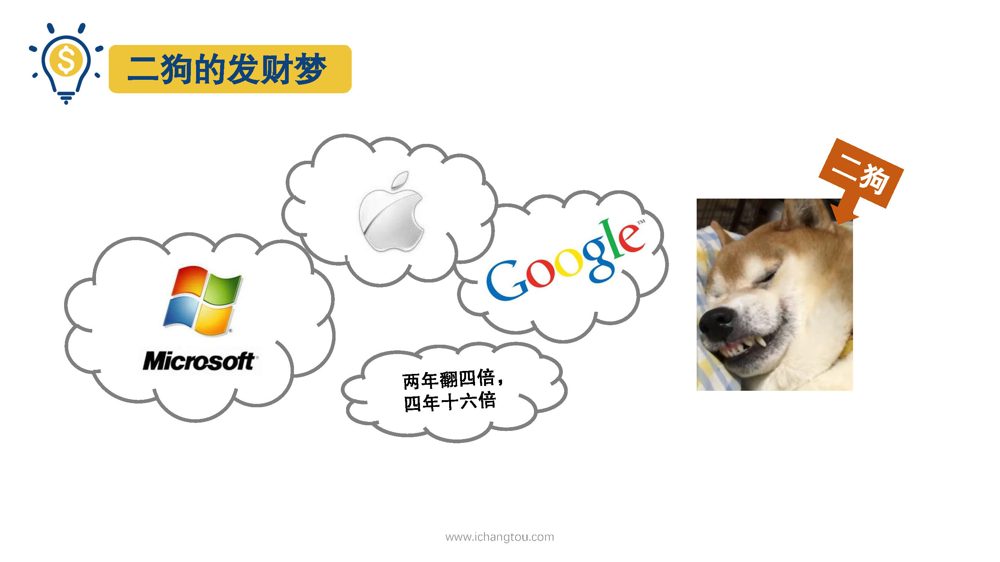
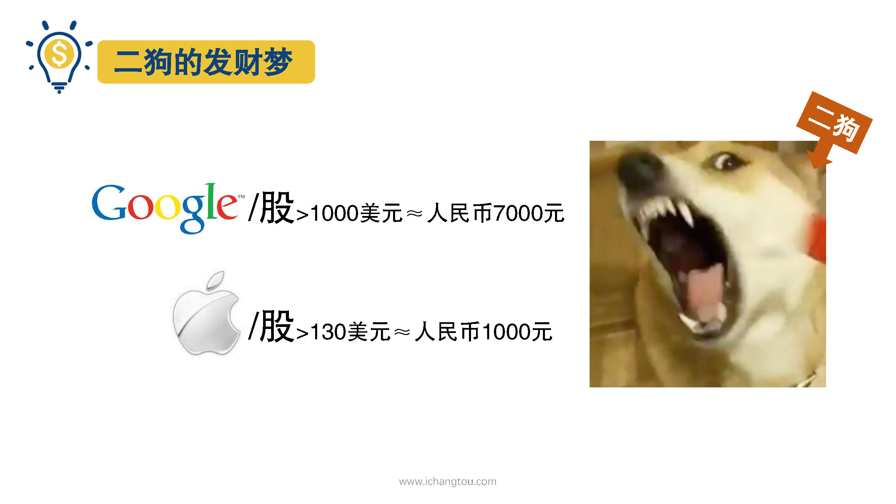
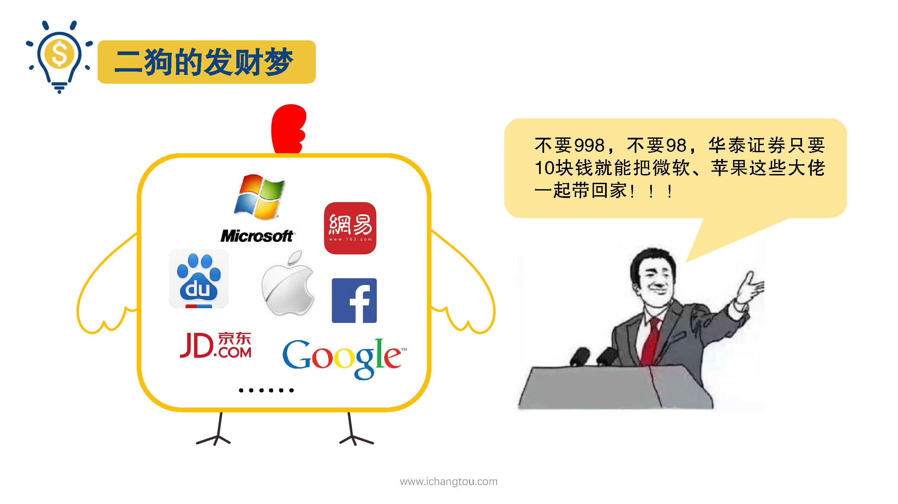
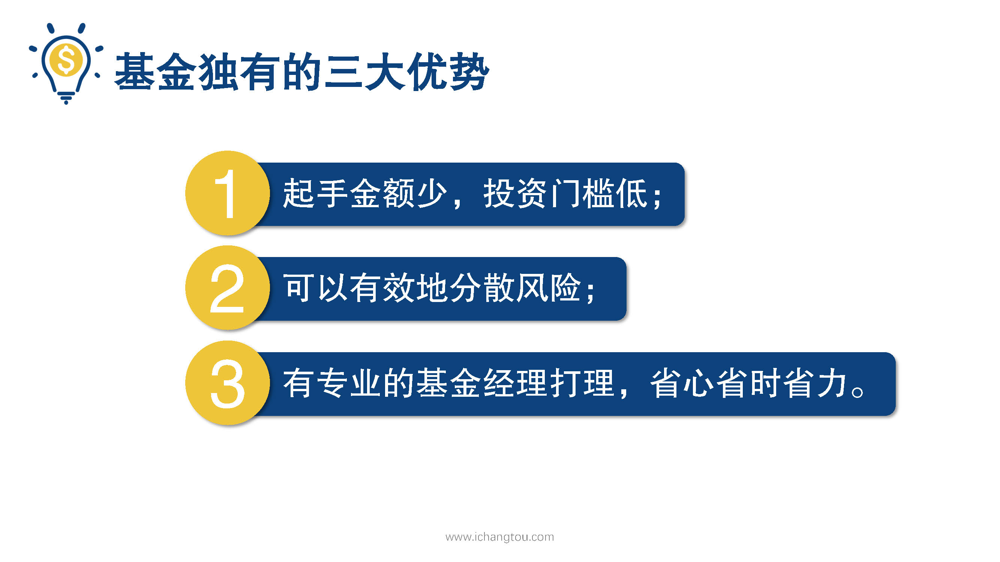

# 基金1-4-基金的优势与特点

## PPT

## 课程内容

### 为什么要通过基金来投资

- 为什么要通过基金来投资

  > 上一节我们了解了什么是基金，有的小伙伴可能要问了股票啊，债券啊，也都是投资品，如果我自己学了投资知识，我们自己可以去买啊，为什么要通过基金来投资他们呢？
  >
  > 说起这个师兄再给你们讲个故事，我有个程序员同事我们叫他二狗吧，由于工作性质的原因对互联网公司情有独钟，特别看好微软、苹果、谷歌等这几家公司，每天做着美梦，幻想自己投资这些世界巨头的股票后，两年翻4倍，4年16倍。但是，当二狗摩挲着自己位数不多的工资卡，准备大展身手时，却发现谷歌一股1000多美元和人民币差不多7000块，苹果倒是便宜一股130多美元也就1000多块，但好在美股，就能买多少也能买一股跟二狗费了九牛二虎之力，花了一周时间，终于开通了美股账户，准备投资时发现手续费就要了好几百。舍不得手续费的他可怜巴巴的跑来问我有没有什么办法呀，我听了后淡淡的说很简单呀，有一只基金不仅投资了这几家公司，还持有Facebook、百度、京东的股票呢，而且职业的基金经理人帮你打理，不要998，不要98，华泰证券里只要10块钱，就能把微软苹果这些大佬一起打包带回家，手续费还超低。

### 基金独有的三大优势

看到二狗听得双眼放光一脸的求知欲，师兄我也就没有卖关子，顺带给他说了基金独有的三大优势，

- 基金投资门槛低

  > 第一呢，马丁的起手金额少，股票不是你想买想买就能买，手里钱少的小伙伴常常苦恼自己根本买不起股票。而基金就帮我们解决了这个问题，基金公司把投资者的钱聚集起来，再切分成一小份一小份，让你每个月即使只有几十块也可以方便投资，甚至还能有很多的结余留做其它的规划；

- 可以分散风险

  > 第二呢，基金可以有效的分散风险，1000块可能只能买一只股票，但用来买基金同样是1000块，却能实现资产配置，做到分散风险。就拿二狗来说，就算他一咬牙，把辛辛苦苦加班换来的积蓄都投进股市，买了苹果的股票，万一哪一天苹果像曾经的诺基亚一样陨落，因为没能有效的分散风险而亏掉了血汗钱，就只能一把鼻涕一把泪了。
  >
  > 如果我们想要自己直接投资不同的股票或债券来实现分散投资的话，就需要我们手动去筛选，对筛选水平和资金量的要求都是非常高的，而基金就不一样了，基金是基金公司向投资者募集了几千万甚至上亿的钱，然后用这些钱投资几十或上百只不错的股票或者债券，我们买入基金，哪怕只是几百块，也是将钱分散到所有这些股票和债券上，大大减少了我们投资单个股票的风险。

- 有专业人士打理

  > 最后一点呢，就是基金由专业的基金经理帮忙打理，试想一下，如果有巴菲特帮你打理资产很难，真是睡觉也能笑醒了，基金公司的基金经理虽然没有把老爷子的能耐，但比起什么都不知道的投资小白那还是专业的多，但是股票就要靠自己了，可能就会像上面的同事二狗一样，就因为不知道入金还要收手续费，所以花了一周时间也没买上股票，更不要提让他自己，就是选择股票了，而投资基金我们只需选对基金，剩下的工作基金经理会帮助我们完成，我们就能省心省时又省力的实现资产增值了。

## 课后巩固

- 问题

  > 基金的优势不包含下列哪项？
  >
  > A.购买时最低限额少小
  >
  > B.有专业人士打理
  >
  > C.需要购买的亲自选股，实时操盘
  >
  > D.可以分散风险，

- 正确答案

  > C。基金有专业的基金经理人打理，无需我们亲自选股时刻操盘哦。