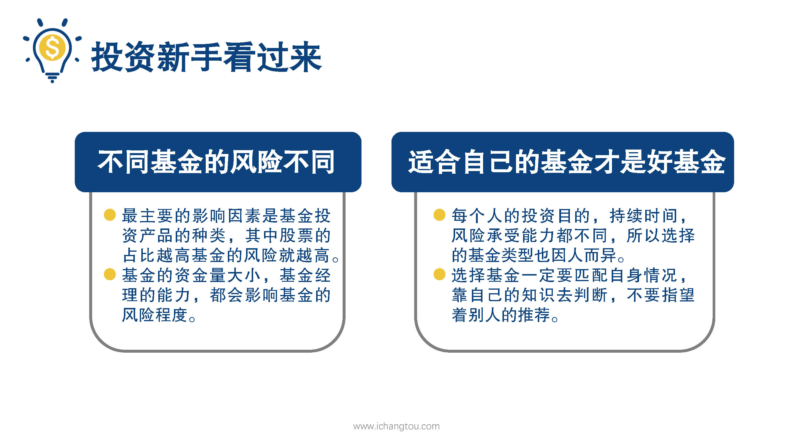
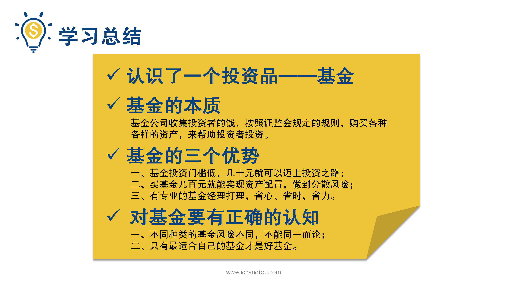

# 基金1-5-基金虽好，也有风险喔

## PPT

## 课程内容

### 基金风险

- 不同基金的风险是不同的

  > 二狗心心念念的好公司能打包买入了，开心的像个200斤的孩子，激动的给他妈妈打电话，幸好师兄就在旁边听到他报代码，让他妈妈去银行取钱全买，才知道什么是基金，就敢把身家都压上去，这孩子也太虎了，我赶紧摁住他，他一脸疑惑的表情，就好像我拦着他捡钱了，我无奈的说，基金虽好可也是有风险的，你还不知道游戏规则，就敢把老妈的积蓄也扯进来，这真是实力坑妈呀。二狗听完之后秒怂，然后又胆怯的问我，那投资基金风险是不是很高呀？
  >
  > 这个问题倒是在我的意料之中，这也是很多基金投资新手都会陷入认知误区，我来给大家解释一下，不同基金的风险是不同的，最主要的影响因素就是基金投资产品的种类，股票的占比越高，基金的风险就越高，另外基金的资金量大小，基金经理的能力也都会影响基金的风险程度，所以不能统一的说基金的风险高或者低，而是要进行具体的区分。

- 选择的基金类型因人而异，最好的基金是最适合你的那一款

  > 究竟如何区分呢？大家先别急，后面的课程始终会详细说给大家。还有个小伙伴也会这么说，师兄你那么有经验给我推荐一支好的基金不就行了吗？师兄只能告诉你，我们每个人的投资目的、持续时间、风险承受能力、资金量都不同，所以我们选择的基金类型也因人而异，最好的基金是最适合你的那一款。
  >
  > 比如说你投资是为了退休后的生活保障，那么你的投资方向就可以是稳健增益中等风险的；而如果你更倾向于高收益的，那就做好面对更大风险的准备。王八绿豆还要看对眼呢，所以选择基金一定要匹配自身的情况，靠自己的知识去判断，而不要指望着别人的推荐，适合他的未必是你的菜哟。

### 总结

- 认识了一个投资品能有效帮助我们实现百万目标的投资品——基金

  > 好了，今天的课就上到这里了，我们一起回顾一下今天的内容，我们认识了一个投资品，它能帮我们有效的在退休时拥有百万资产，这个投资品就是基金。
  >
  > 我们知道了，它的本质就是基金公司收集投资者的钱，按照证监会规定的规则购买各种各样的资产来帮助投资者投资。

- 基金三大优势

  > 并且通过二狗的故事我们也了解到，基金比起直接投资复杂的股票债券等有三大优势：
  >
  > 一是基金投资门槛更低，几十块就可以卖上投资之路，
  >
  > 二是买基金几百元也能实现资产配置，做到分散风险，
  >
  > 三是由专业的基金经理打理，省心、省时、省力，

- 对基金理解的误区

  > 最后我们还跟着二狗认识到了，对基金理解的误区：
  >
  > 一是不同种类的基金风险是不同的，不可同一而论，
  >
  > 二是只有最适合自己的基金才是好基金，

- 后续课程

  > 但是基金的种类究竟有哪些呢？我们提到的股票基金债券基金又是什么呢？小伙们不用着急探究，先巩固好今天的知识，我们明天会详细说说基金都有哪些，以及我们怎么从基金的招募书中挖掘更多基金的家世背景，我是Lip师兄，我们明天再见。

## 课后巩固

- 问题

  > 二狗的朋友买了基金A，三个月赚了10%二狗非常心动，这时候他该怎么办呢？
  >
  > A.果断跟着买
  >
  > B.直接把钱给朋友打理，省心省力，
  >
  > C.自己挑选适合自己的基金，

- 正确答案

  > C。当然要自己分析啦，我们学习了游戏规则，不就是为了配置适合自己的基金么。