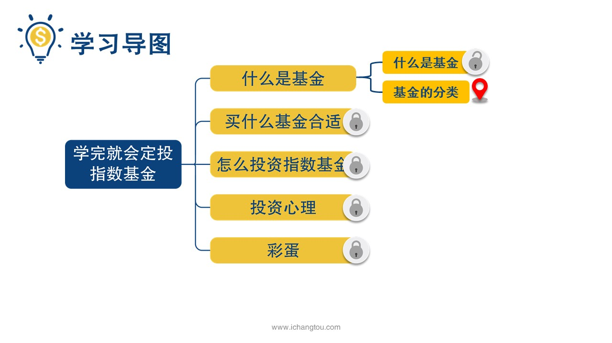
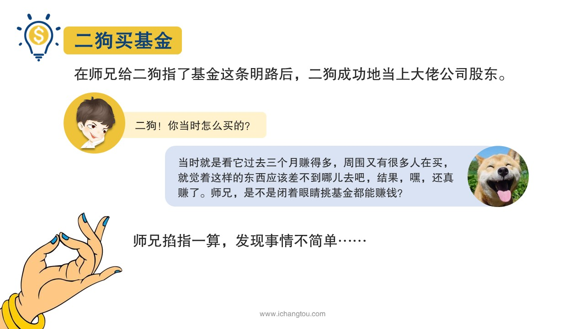
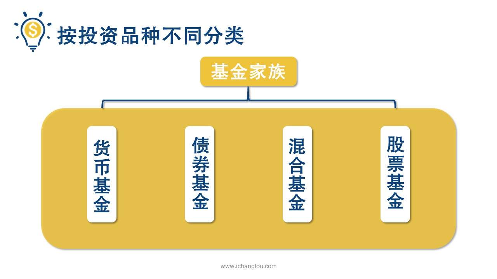
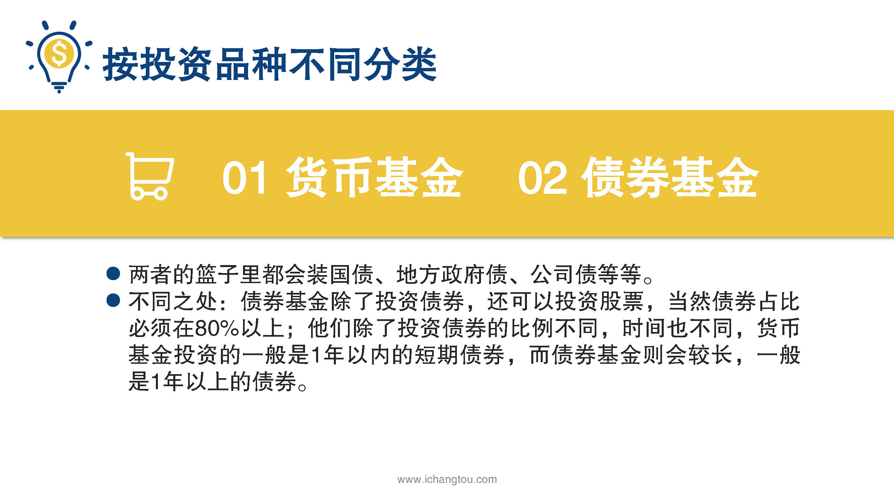
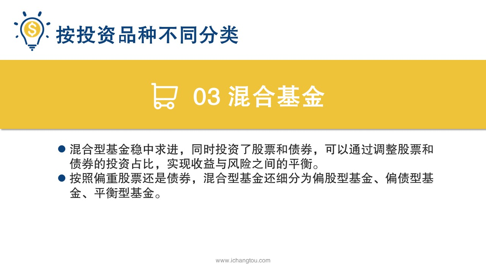
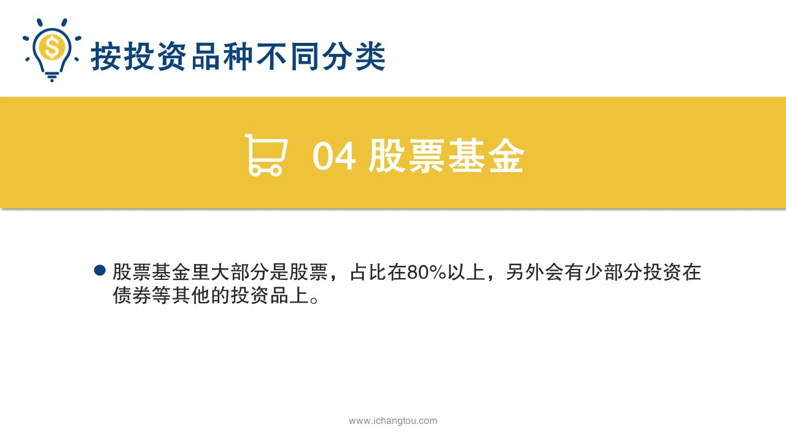

# 基金2-1-基金还分对象？

## PPT

## 课程内容

### 4种基金的定义

- xxxx1

  > 昨天我们说的2狗1心想买心仪的大佬公司，在师兄给他指了基金这条名路后成功的当上了大佬公司的股东，后来过了一段时间，师兄发现二狗每天吃午饭都给自己加餐，以前可都是蹭师兄的肉吃呀，原来这家伙几年前就在淘宝上买过基金，买了之后还忘了，最近突然想到打开一看还赚了20%，热的这家伙每天吃午饭都给自己加鸡腿，唉，你当时怎么买的？我回忆了一会儿说，嗯，当时就是看它过去三个月也赚的多，周围又有很多人都在买，就觉得这样的东西应该差不到哪儿去吧，结果还真赚了，这是不是说明闭着眼睛挑基金就能赚钱了？当然不是，师兄看了一下这只基金的资料，发现给我买的是一只风险很高的股票型基金，而且手续费非常高，这完全是举着火把在加油站溜达吗？你可能会说了，虽然闭着眼睛买的，但是最后赚了20%不也挺不错嘛，加油站还给自己加了油啊，我就是傻人有傻福啊，呵呵，试试也是牛市，这边随便买几只股票都能赚个40~50%的，而这次买股票的基金却只挣了20%，这也就是二狗运气好，要是碰上熊市，什么是股票型基金？为什么股票型基金风险就很高呢？今天我们就一起来学习进行的分类，认清这些基金的真面目，基金呢，可以从三个维度进行分类，分别是按投资品种不同，按交易渠道不同，运作方式不同，我们下面一个应该来看，第1种是基金按照投资品种不同来划分，再说具体分类之前呢，师兄，我先说一下小时候跟妈妈去买菜的故事，要是考试不错庆祝一下，我们就会买不少的猪肉，要是控制支出，那就只买青菜萝卜打发我了，那时候吃的好不好？就看菜篮子里装的是什么呢？其实基金也是这样，基金经理就是那个挎着菜篮子去买买的家庭主妇篮子里装的东西，也就是投资品种不一样，那么这个男子就有不同的叫法，你看分别有哪4种男子？有哪4种基金分别是货币基金，债券基金，混合基金和股票基金，新书，货币基金和债券基金，他们在篮子里都会装国债地方，政府债，公司债等等不同之处在于债券基金，除了投资债券还可以投资股票，当然债券占比必须在80%以上，他们除了投资债券的比例不同，时间也不同，货币基金投资的一般是一年以内的短期债券，而债券基金则比较长，一般是一年以上的债券，另外货币基金投资的企业债中，企业的信用会比债券基金的更高，简单来说就是货币基金对于安全的追求更加的严格，一般来说货币基金的收益在3~%4%，而债券基金占百分之，7%，虽然货币基金的平均收益比债券基金低，但是相应的货币基金的风险也比债券基金的更低，再来说混合型基金这是篮子，里面是既有股票又有债券，基金经理可以通过调整股票和债券的投资占比，实现收益与风险之间的平衡，按照股票和债券的偏重情况，混合型基金还可以分为偏股型基金，偏债型基金和平衡型基金，最后再来看股票基金，这个篮子里装的大部分都是股票，它的占比在80%以上，另外还会有少部分投资在债券等其他的投资品上，混合型基金和股票型基金收益不稳定，高的时候15%，20%以上，但是风险也大幅度增加，亏损起来也是可以让人怀疑人生的，给我买的就是高峰，股票型基金这也就是为什么师兄刚才说杨是碰到熊市，他还不知道会拍成什么样的，

### 收益与风险概述

## 课后巩固

- 问题

  > 收益和风险最低的是哪种基金？
  >
  > A.债券基金
  >
  > B.混合基金
  >
  > C.货币基金

- 正确答案

  > C。货币基金无论是收益还是风险，都是基金中最低的。