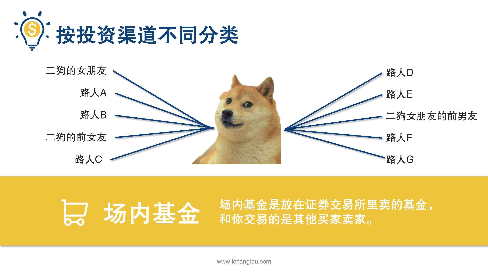
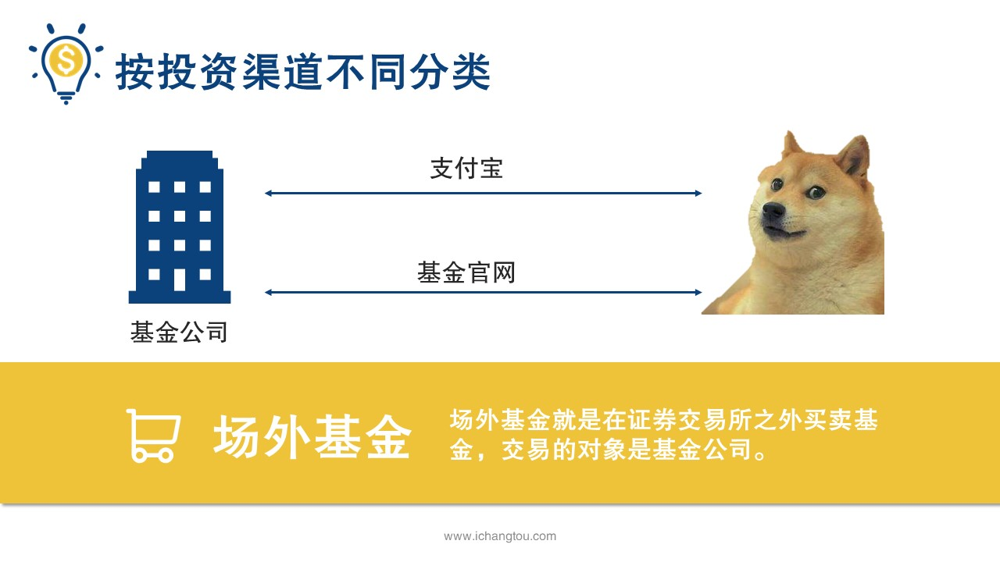
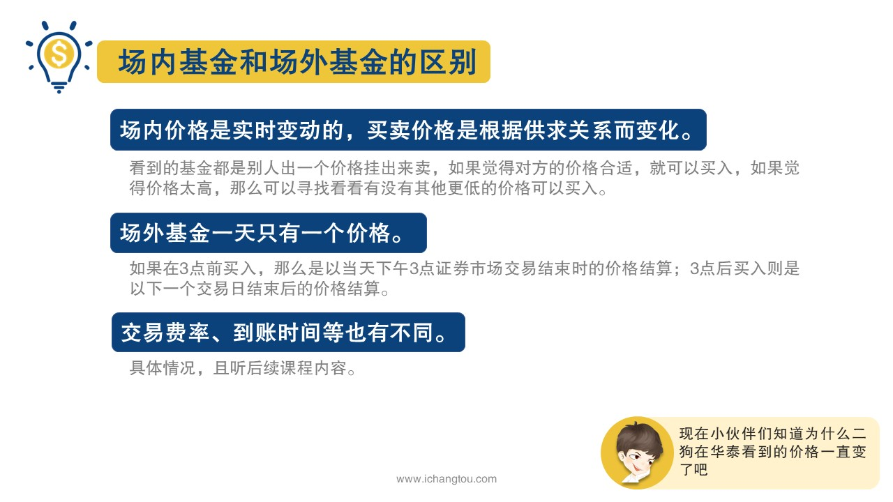

# 基金2-2-基金还分内外？

## PPT

## 课程内容

### 场内基金/场外基金的定义

- xxxx1

  > 上一节我们说到了二狗买股票基金的事儿，请师兄介绍了货币基金，债券基金，混合基金和股票基金之后，二哥后来买基金前都会确认一下这是什么基金，有一天他在微信上问我师兄师兄为什么我在华泰上买基金还有好多价格老是变，以前我在支付宝上买的时候没遇到过这种情况呀，都是固定的价格，是不是华泰的这只基金有问题啊？我跟他说，你在华泰里看到的那只应该是场内基金，而以前支付宝上买的都是场外基金，当然会这样了，什么是场内基金场外基金呢？为什么二沟看到的基金价格一直在变呢？我们买的基金是基金公司的产品，他可以选择放在证券交易所里卖，也可以自己买场内基金，是放在证券交易所里交易的基金和你交易的是其他的买家和卖家购买场内基金需要开通股票账户，通过这个账户和其他买家卖家交易打个比方二狗二狗的女朋友，二狗的前女友，二狗女朋友的前男友都开了股票账户，买的都是同一只基金，有一天选择卖出基金后，他卖出的基金就被其他人买走了，这个其他人可能是二狗的女朋友，具有前女友的前男友等等，也有可能是别的想买这只基金的路人，而场外基金就是在证券交易所之外买卖基金交易的对象是基金公司，也就是说二狗虽然可以在支付宝基金公司官网等不同渠道买卖基金，但是都是向基金公司这个生产厂家买入基金卖出也是卖回给了基金公司，不管阿狗的女朋友啊，前女友什么事儿，这世界多么清静，场内基金和场外基金有一个非常大的区别就是价格不同，场内价格是实时变动的，买卖价格根据供求关系而变化，也就是说你看到的基金都是别人出一个价格挂出来卖，如果你觉得他的价格合适你就可以买入，如果你觉得价格太高，那么可以寻找，看看有没有其他更低的价格可以买入，而场外基金的话，一天只有一个价格，如果你在3:00前买入，那么是以当天，权交易市场结束时的价格结算3:00后买入则是以下一个交易日结束后的价格结算，现在小伙伴们知道为什么二狗在华泰看到的价格一直变化了吧，当然场内场外还有其他的不同，比如交易费率啊，到账时间等也有不同，具体后面的课程还会有详细的介绍，师兄这里就不再展开说明了，

### 价格和交易对象的区别

## 课后巩固

- 问题

  > 二狗在周五下午3点后申请了一只场外基金，基金的价格是如何确定的？
  >
  > A.周五下午3:00后公布的价格
  >
  > B.下周一下午3:00后公布的价格
  >
  > C.周六下午3:00后公布的价格

- 正确答案

  > B。场外基金在下午3点后申购，那么是以当天下午3点证券交易市场交易结束的时的价格结算，下午3后申购则是以下一个交易日结束后的价格结算，周五之后的下一个交易日是下周一，所以是下周一下午3点后公布的价格。