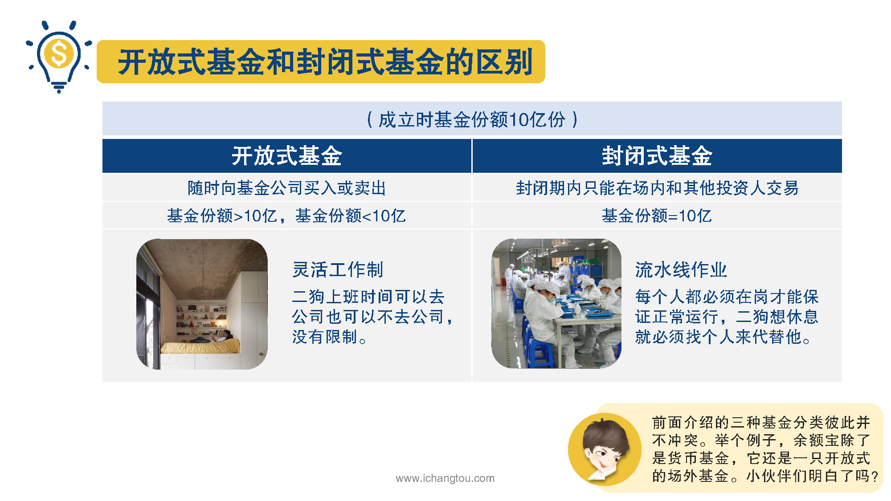

# 基金2-3-基金还分开放不开放？

## PPT

## 课程内容

### 开放式基金/嗯封闭式基金份额区别

- xxxx1

  > 上一节我们讲到按交易渠道的不同基金，可以分为场内基金和场外基金，所以杰师兄要向大家介绍的是基金的第3种分类基金按照运作方式分为开放式基金和封闭式基金，开放式基金是指基金份额是不固定的，投资者可以随时的买入或者卖出基金份额可以增加也可以减少，但是封闭式基金呢，他在成立后的一段时间内基金份额是不变的，投资者只能在场内进行买卖，比如一只开放式基金和封闭式基金，在成立时基金总份额都是10亿，开放式基金的话我们可以随时向基金公司买入或卖出买入的人多，基金份额就会超过10亿，而卖出的人多呢，基金份额就会小于11，他是不固定的，而封闭式基金呢，在封闭期内，基金份额就固定在10亿，这期间我们只能在场内和其他投资人交易，也就是说我们想要卖出时必须有另外一个人想要买入，我把开放式基金比作灵活工作制，二哥我上班时间可以去公司，也可以不去公司没有限制，公司的人数有时多有时少，那么封闭式基金就是流水线作业，每个人都必须在岗，才能保证正常运作，想休息就必须找个人来代替他，我只能沮丧的不是我想走想走就能走啊，这里师兄还要提一下前面师兄介绍的三种基金分类，彼此之间并不冲突，什么意思呢？始终举个例子大家就明白了，余额宝除了是货币基金，它还是一只开放式的场外基金，明白了吗？

### 封闭式基金的交易方式

## 课后巩固

- 问题

  > 下述哪一点不是封闭式基金的特点？
  >
  > A.基金份额固定
  >
  > B.封闭期内不能交易
  >
  > C.一般封闭期在5年以上

- 正确答案

  > B。本题选择的是不属于封闭基金的特点，B选项不属于，封闭式基金在封闭期内不能向基金公司卖出，但是可以在场内和其他投资者进行交易。