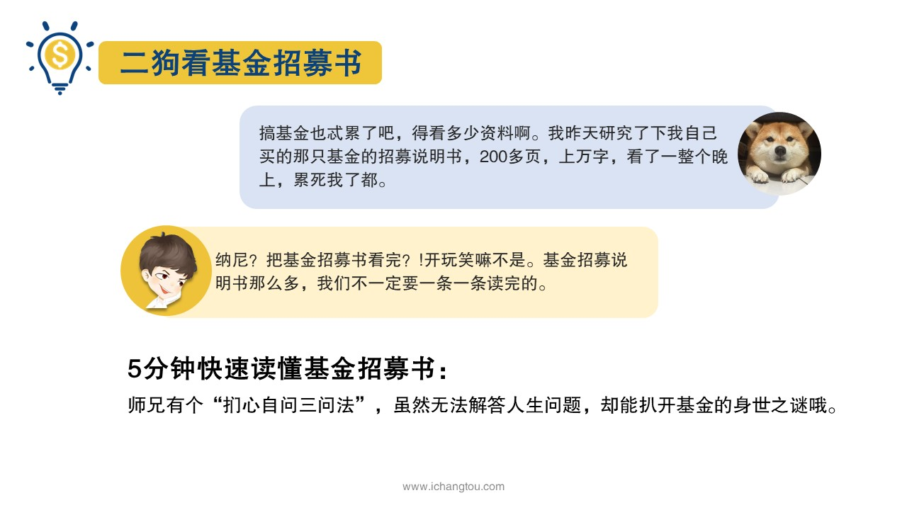
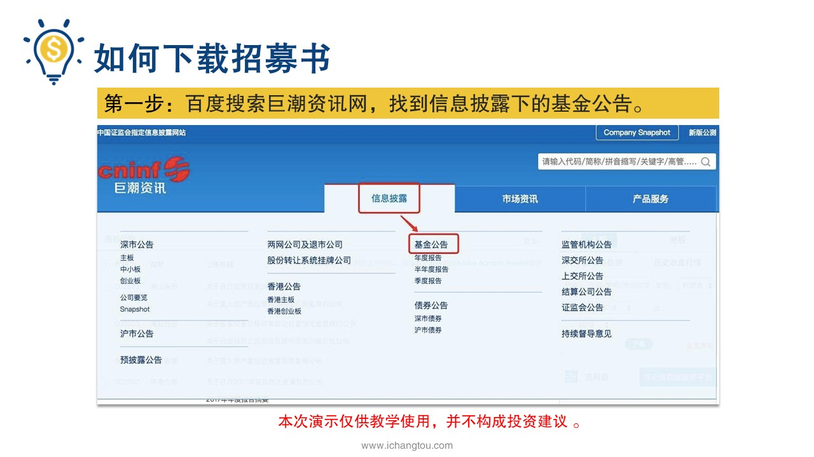
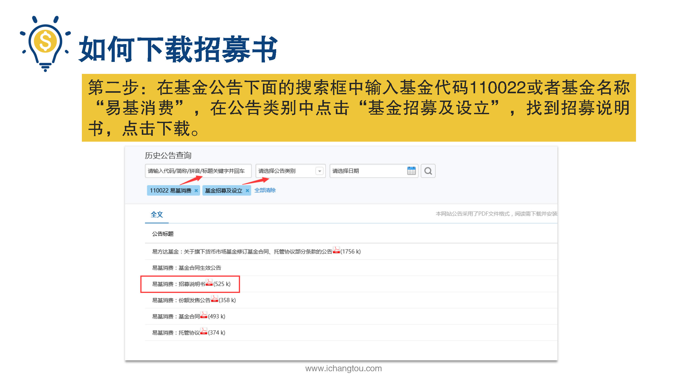
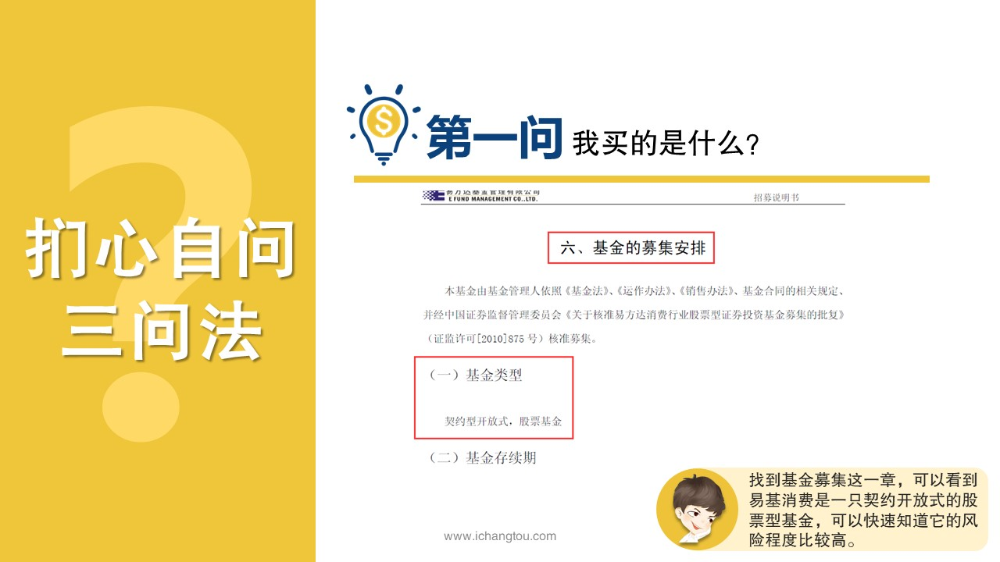
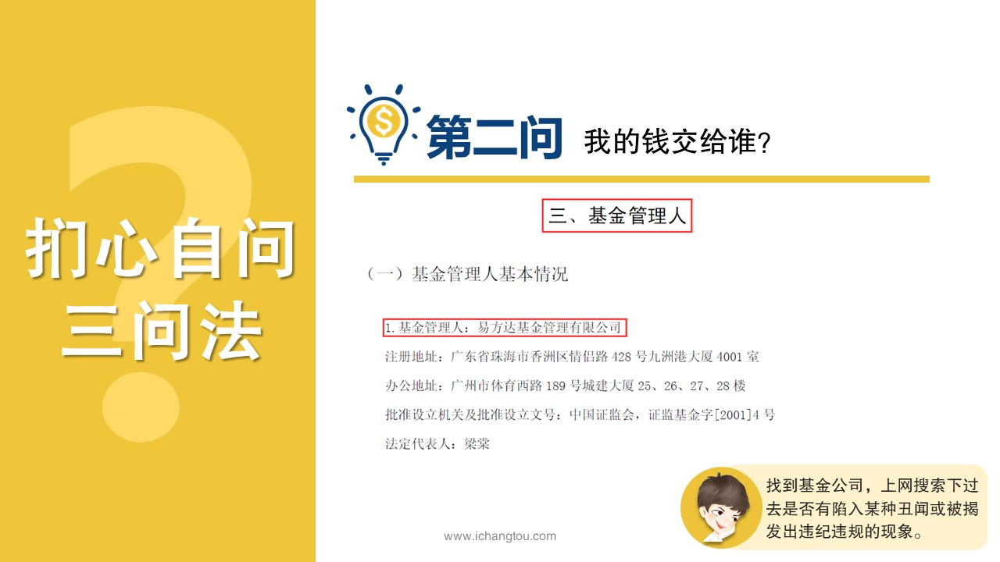
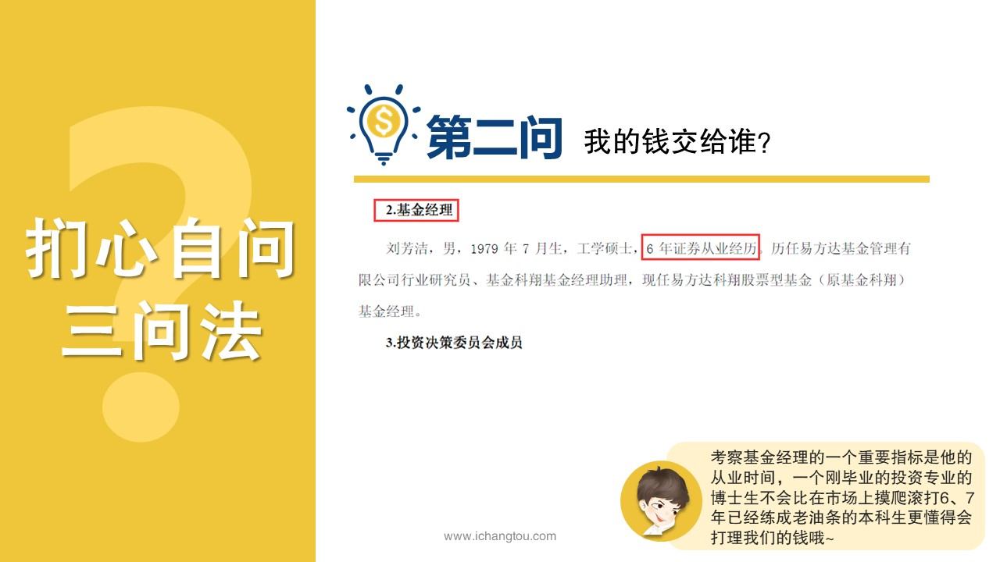
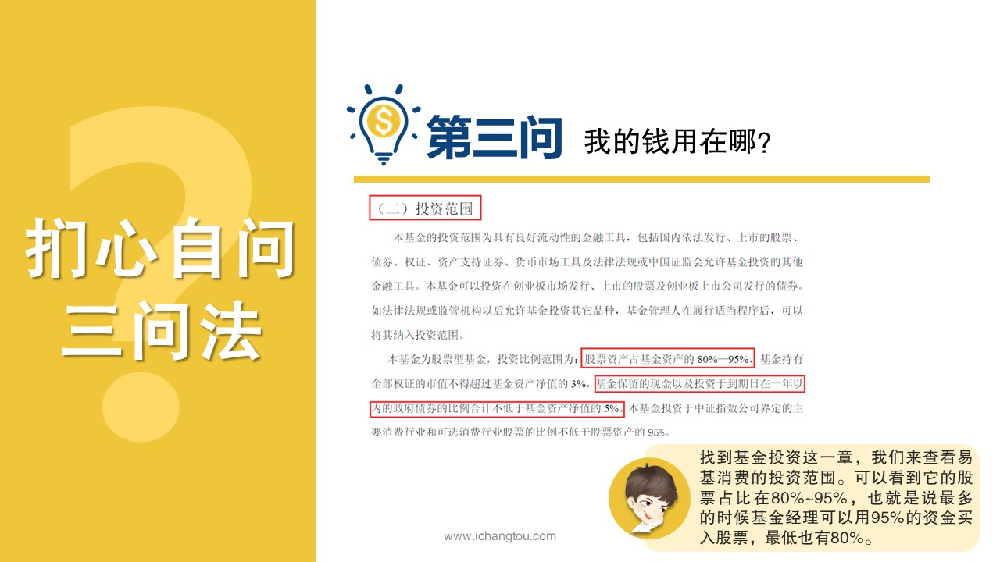
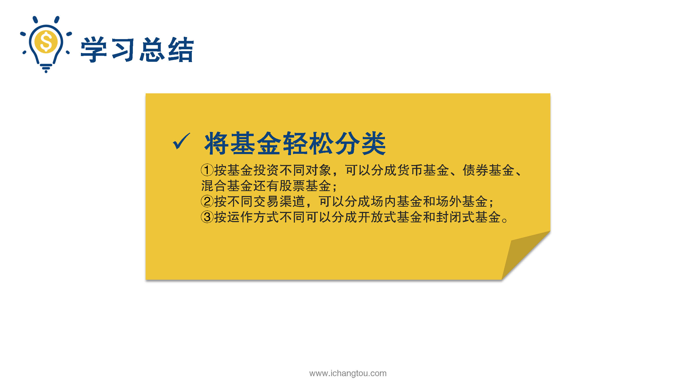
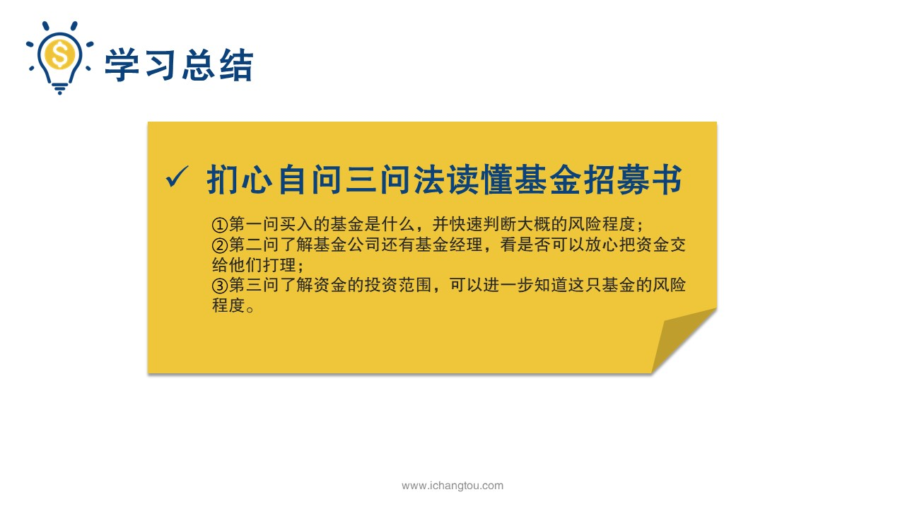

# 基金2-4-扪心自问三问法？

## PPT

## 课程内容

### 巨潮网下载基金招募书

- xxxx1

  > 小伙伴们跟着师兄学习了开放式基金和封闭式基金，这一节师兄要带小伙伴们扒一扒基金的说明书，基金招募说明书，这是基金的发行方提供给基金投资者对基金情况进行说明的法律文件，是非常重要的基金文件，说到这个事儿又不得不再提一下二狗了，他自从开始上来基金这条路后，就发誓要把以前打游戏逝去的青春补回来，开始发奋研究基金了，有一天他来办公室就跟师兄说哇，靠，基金也忒累了吧，得看多少资料呀？我昨天研究了下我自己买的那只基金的招募说明书，好家伙200多页上万字，我看了一整个晚上累死我了都生产把基金招募书看完了，开玩笑不是吗？基金招募书堪比博士论文看完是会上天的枯燥死了，然后上天师兄觉得二狗有，傻子还不先来问问是什么，那么基金招募说明书那么长的文件，我们要一条一条读完吗？当然师兄可有方法，5分钟就能带她快速读懂基金招募书，人生有三大问题，那就是我是谁，我从哪里来要到哪里去，据说解开这三个问题就能解开人生之谜，师兄也有一个扪心自问3万法，虽然无法解答人生问题，却能扒开基金的身世之谜，开盘之前始终要先教小伙伴们如何下载基金招募说明书，在基金公司的官网，上海或深圳的交易所巨潮资讯网这些网站都可以找到说明书，不过呢，基金公司的官网只能查到自己公司的基金，上海或深圳交易所只能查到在自己市场里上市的基金，而巨潮网则没有上述的限制，所以师兄比较推荐巨潮网，因为他的资料最全接下来的课程也会以巨潮网为例子，为大家介绍下载基金招募书的方法走两步第1步百度搜索巨潮资讯网，找到信息披露下的基金公告，第二不在，公告下面的搜索框中输入基金代码110022或者基金名称以及消费在公告类别中点击基金招募及设立，可以轻松的找到我们想要的招募说明书，点击下载so easy下载打开后，下面就正式进入师兄的扪心自问三问法，不过开始之前始终要郑重的提醒一下，这个案例仅供教学并不构成任何的投资建议，希望学完这个课程后，小伙伴们能够掌握更多的基金投资技巧，自己做出合理的，下面我们开始扪心自问的第一问我买的是什么？先找到基金募集这一张，我们可以看到以及消费是一只开放式的股票型基金，从而快速的知道它的风险程度是比较高的，扪心自问的第二问我的钱交给谁找到基金管理人这一张查看基金公司和基金经理，找到基金公司上网搜索一下过去是否又陷入某种丑闻，或者被揭发出违纪违规的现象，无论有什么类型的违规操作，我们都可以把它给剔除掉，要知道这些违规操作最终受害的还是我们普通投资者好，接着我们再看一下基金经理，它可是操控这只基金的核心人物，考察基金经理的一个重要指标是看他的从业时间，一个刚刚毕业的投资专业的博士生不会比在市场上摸爬，67年已经练成老油条的本科生，更懂得打理我们的钱包，一级消费的基金经理从业已经有6年了，符合我们的标准，当然除了从业时间，我们还需要看看基金经理的其它指标业绩水平后面的课程，我们还会有更加详细的介绍基金经理的评估标准哦，扪心自问的第三呢，就是我的钱用在哪儿找到基金投资这一仗，我们来看看以及消费的投资范围，可以看到它的股票占比在80~%95%，也就是说最多的时候，基金经理可以用95%的资金买入股票，而最低的时候也有80%，如果碰上牛市，我们的收益会水涨船高，还是在碰上熊市的话，由于基金经理必须保持80%的资金买入股票，所以亏损起来也是能让人崩溃的，这里是熊孩子，基金保留的现金以及投资于到期日在一年以内的政府债券的比例，合计不低于基金资产净值的5%，这是什么意思呢？如果这只基金的规模有10亿的话，那么基金公司会保留5000万的现金及短期的债券类，这就是为什么开放式基金我们小麦就可以卖出，因为基金公司已经备着足够的钱，当我们作为投资者想要赎回基金的钱是基金公司就可以支付给我们了，非常快速的解读基金招募书中的关键内容，不用像二狗一样傻傻惹人怒了，现在我们一起来回顾一下这一课的内容，今天我们学习了积极的氛围，按照对项目可以分为货币基金，债券基金，股票型基金，混合型基金，场内基金和场外基金按照运作方式不同，可以分为开放式基金和封闭式基金，我们还学习了通过扪心自问三位来快速读懂基金招募书中的关键内容，第1位了解我们买入的基金是什么，并且快速的判断大概的风险程度，你要了解基金公司，还有基金经理看是否可以放心的把我们的资金交给他们打理第3位，了解我们资金的投资范围，可以进一步知道这只基金的风险程度，小伙伴们虽然了解了基金的基本知识，可是打开支付宝面对那么多的基金，你们真的会选吗？明天开始师兄就带着小伙伴们一起详细了解每种基金的详细筛选方法，明天见喽，

### 阅读基金招募书

## 课后巩固

- 问题

  > 下述关于基金招募书描述错误的是？
  >
  > A.基金经理人的学历非常重要，至少要是研究生毕业
  >
  > B.基金招募书是基金的发行方提供给基金投资者，对基金情况进行说明的法律文件，是非常重要的基金文件
  >
  > C.基金招募书只需要找关键的信息查看就可以，不需要全部读完

- 正确答案

  > A。本题选择的是错误的，A选项错误。考察基金经理的一个重要指标是他的从业时间，从业经历丰富的基金经理人比博士刚毕业的基金经理人更懂得打理资金。