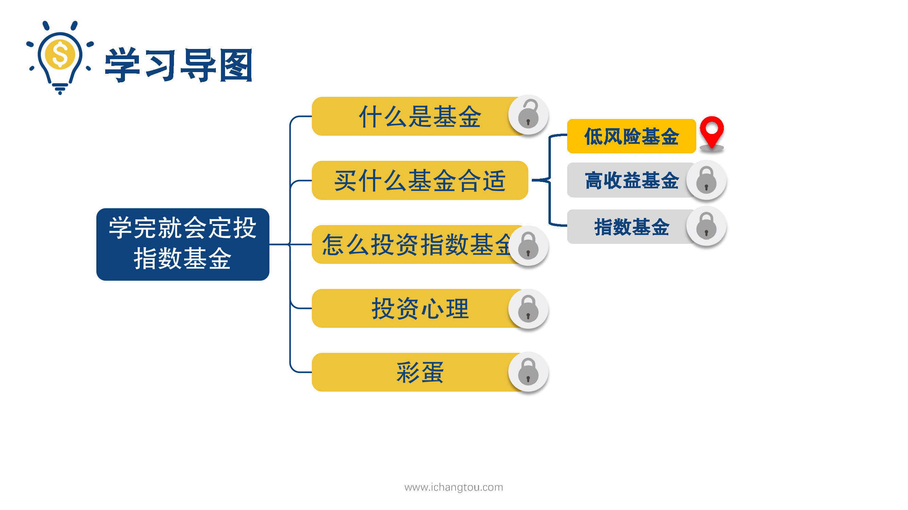
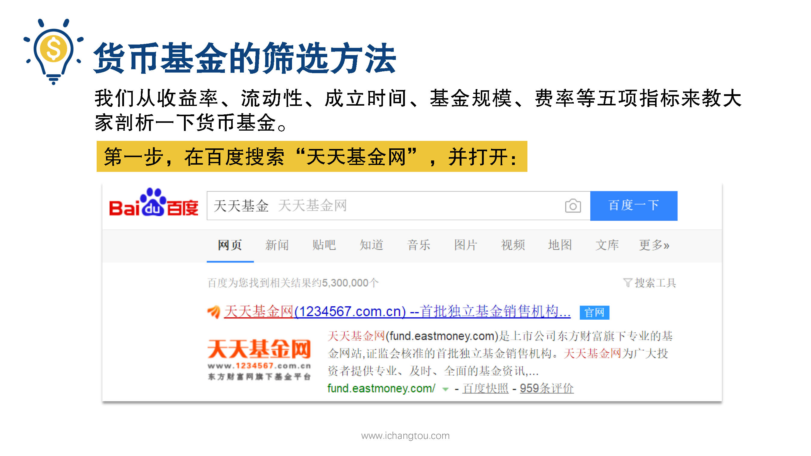
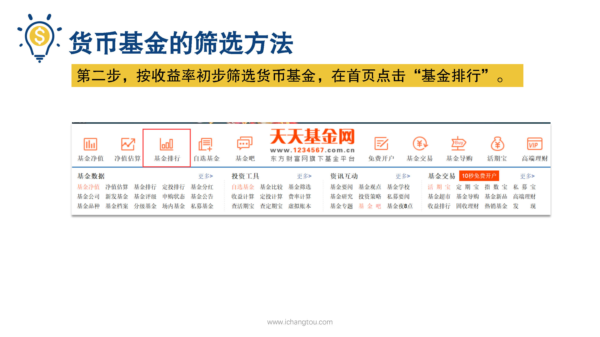
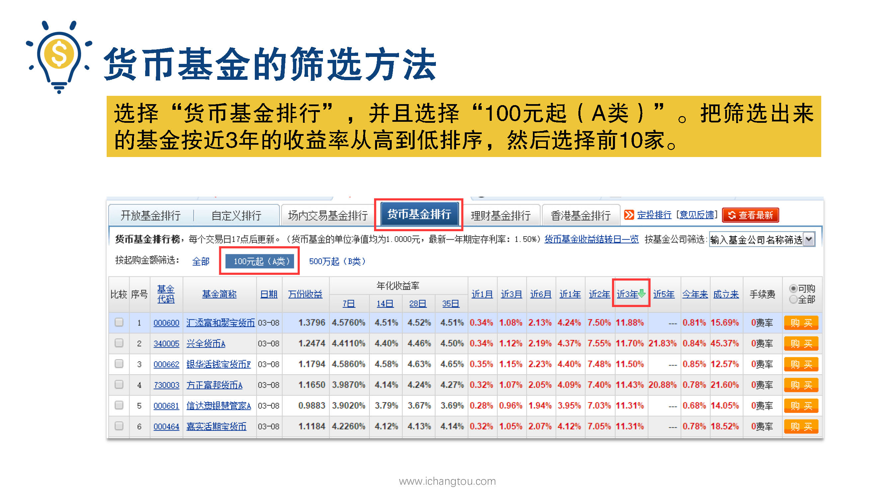

# 基金3-1-货币基金有何妙用？

## PPT

## 课程内容

### 货币基金的收益比银行活期高

- xxxx1

  > 哈喽，大家好，我是李波师兄，恭喜大家来到第3天的学习，昨天我们知道了低风险低收益的基金，有货币基金和债券基金，可是大家知道吗？虽然他们是收益最低的基金，但是比起银行活期0.25~%0.35%的利息来说，可是足足高了十几倍，一般的货币基金的收益可以达到3~%4%，债券基金的平均收益是6~%7%，举个例子，比如说同样是存一年，我们把100块存一年的活期，那么只能拿到3毛5，而放余额宝存一年能够拿到3~4元，而用来投资债券呢，就能有6~7元的收益好，这是100元的情况，那么小伙伴们算算如果是1000元会发生什么呢？相信大家都已经算出来了，不过货币基金的作用可远不止如此，师兄还有一个小秘招，话说有一天那师兄陪朋友二狗去买手机，挑了半天，还是看中了最牛叉的iPhone8，售价5888，就在结账时，师兄眼看着2狗要逃出陷阱，立马打趣道，二狗想不想撸羊毛？如羊毛你不知道吗？就是赚点小钱，我疑惑的看着我买个手机还能赚钱，我没听错吧，想知道为什么可以撸一集怎么撸，师兄给大家一个提示，其实这就和货币基金有关，相信学完这节课大家就知道了基金竟然有不少的好处，那么我们该如何筛选货币基金呢？昨天我们介绍了货币基金，一般投资于一年以内的国债啊，地方政府债和企业债，今天我们就从收益率流动性成立时间，基金规模和费率等5项指标来教大家剖析一下货币基金，在筛选之前我们先要知道从哪儿可以找到基金的信息，常用的网站有晨星基金网，好买基金网，天天基金网，因为天天基金网使用最方便课程中都使用它来做基金的筛选了，知道了在哪儿获取信息后，接下来我们就来看看如何筛选货币基金，请看PPT，第1步我们在百度搜索天天基金网编辑打开第2步，按收益率初步筛选货币基金，在首页点击基金排行货币基金排行，并且选择100元起a类就会出来很多细节，小伙伴们可以将近三年的收益率按从高到低排序，然后选择前10家

### 货币基金撸羊毛

## 课后巩固

- 问题

  > 关于货币基金和债券基金的收益率和风险的说法，下面哪一项是正确的？
  >
  > A.两者收益一样高，风险也一样
  >
  > B.货币基金比债券基金收益高，风险也高
  >
  > C.债券基金收益比货币基金高，风险也高
  >
  > D.货币基金收益高，风险低

- 正确答案

  > C。债券基金收益比货币基金高，风险也要高一些哟，小伙伴们昨天的内容复习了嘛？都答对了吗？