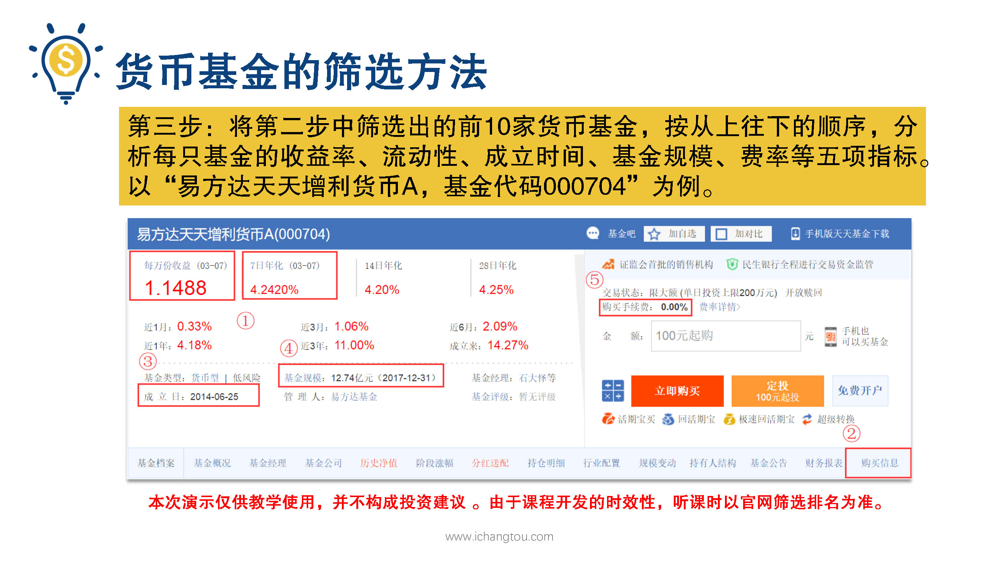
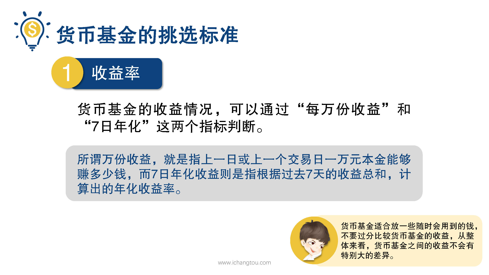
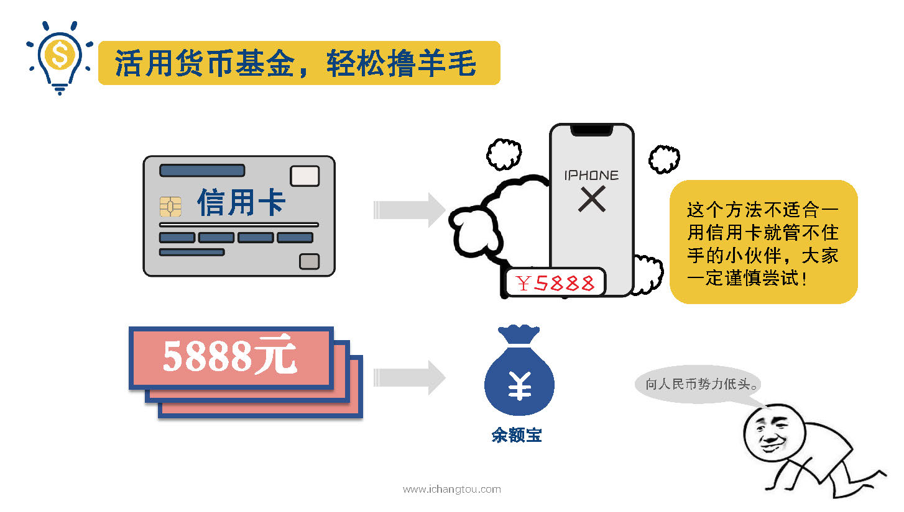

# 基金3-2-收益率是货币基金最重要的指标吗？

## PPT

## 课程内容

### 货基的收益率都差不多，挑个喜欢的就好

- xxxx1

  > 上一节我们学习了筛选货币基金的前两部，现在继续第3部将第2步中筛选出的前10家货币基金按从上往下的顺序分析每只基金的收益率，流动性成立时间，基金规模费率等5项指标这里我们以易方达天天增利货币a基金代码000704为例进行分析，小伙伴们要注意这次演示，仅供教学使用，并不构成投资建议，我们先来看这只货币基金的收益情况，可以通过每万份收益和7日年化这两个指标来判断，师兄先解释一下这两个词分别代表什么，聪明的小伙伴肯定都猜到了，他们就代表了大家最关心的手所谓万份收益就是指上一日或上一个交易日1万元本金能够赚多少钱，而七日年化收益则是指根据过去7天的收益总和计算出的年化收益率，例如如果投资1000元买某个基金过去7天赚了一元，那么它的7日年化就等于1除以1000再除以7，然后乘以365×100=%5.21%，这两个收益率都不需要我们自己计算，天天基金网可以直接查看，从图上我们可以看出来易方达天天增利货币的每万份收益为1.1488，7日年化为4.2420%，大家可能觉得这个收益并不是很高，前两年余额宝甚至很多货币基金横空出世的时候7日年化收益率一度高达7%，但是这种高收益是不可能长期维系的，前期那么高，是通过高收益的营销手段来吸引大家申购的，后来余额宝的收益也慢慢回落到3%左右，2018年3月的时候维持在4%左右，大多数的货币基金都是这个水平的收益，大家都知道这样的收益是跑不赢，通货膨胀物价非常大，因此货币基金适合放一些随时会用到的钱，毕竟把钱丢在银行，活期的利息只有0.35%，这个手艺就像白开水一样，也太没味道了呀，但是如果放货币基金里收益要高出十几倍，对于收益呢，师兄还要啰嗦一句，不要过分比较货币基金的收益率从整体来看，货币基金之间的收益不会有特别大的根据近期在网上查到的数据来看，余额宝2017年的收益率是4.01%，而汇添富现金宝2017年的收益率是4.22%号也就是100元钱，各自放在这两只货币基金中一年的时间余额宝能赚4.01元，而现金宝能赚4.22元，也就差两毛一分钱，1000元的差异也就是2块1毛钱，1万元的差异也就是21块钱，所以小伙伴们真心没必要花很多时间去比较不同，货币基金的收益，更不用为了这么一点点差异转来转去就像馒头花卷没插了，选择一两只你觉得不错的他短时间内可能会用到的钱放在里面就好了，说到这里让我们回到开头，师兄跟大家讲的撸羊毛的故事，大家想知道答案吗？其实就是把信用卡与货币基金结合起来用，如果是消费习惯比较好的小伙伴，可以选择每月工资到账之后，就把生活费都放在货币基金中，平时呢则用信用卡来消费，等到还账单时再用货币基金来还款，这样就相当于免费用银行的钱，而自己的生活费还能挣点利息，比如上面说的如果二狗用信用卡买iPhone手机，把5888元的现金存在余额宝里，那么在消费和还款的时间差里，我们就可以转收益，相当于用信用卡来撸羊毛了，如果你每月开支是5000元，用这个方法每年就可以收一两百元200元轻松到手，当然这个方法不适合一用信用卡就管不住手的小伙伴，大家一定要谨慎尝试

## 课后巩固

- 问题

  > 收益率是我们挑选货币基金是最重要的考虑因素吗？
  >
  > A.当然，收益率非常重要
  >
  > B.不需要，货币基金的收益率都差不多
  >

- 正确答案

  > C。货币基金的收益率都差不多，所以我们在挑选时不要过分看重收益率喔。