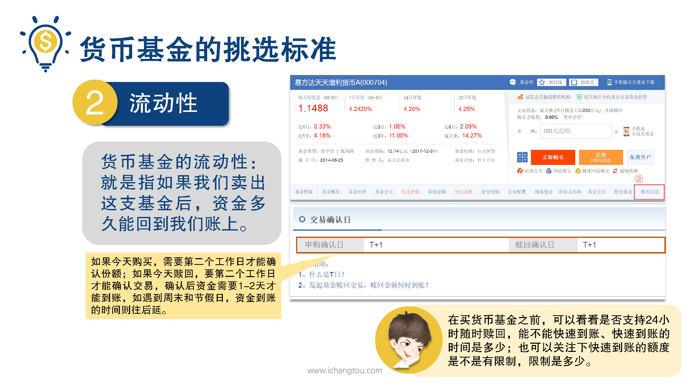
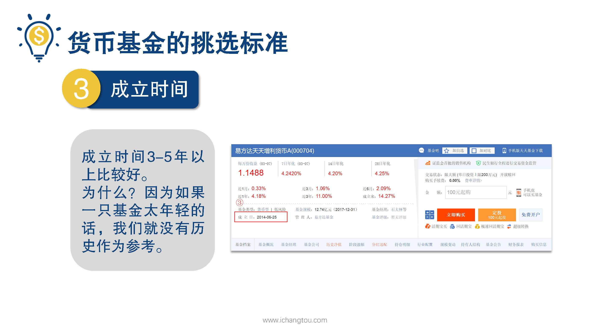

# 基金3-3-对于货币基金流动性才是最重要的？那么成立时间呢？

## PPT

## 课程内容

### 最好能随取随用

- xxxx1

  > 上一节说完了货币基金的收益情况下面，我们来看看它的流动性，什么是货币基金的流动性，其实就是指如果我们卖出这只基金后，资金多久能回到我们账上，我们一般把平时用的钱放在货币基金里，羊毛有收益总比什么都没有的好吗？因为仿货币基金的这部分钱随时要用的，所以对流动性的要求就非常高了，就像找男朋友不需要每天惊险刺激，也不要求天天大餐，但是需要用到你的时候，你要能尽快出现一起过难关就非常重要了，我们选择货币基金时要看能不能快速到账，快速到账的时间是多久，而如果是怕自己做手，不想要向马云爸爸的余额宝那样快的，第一动手的，故意选择t+一到账也是个办法这只基金的流动性我们怎么看呢？我们继续来看PPT上的r的位置，点击购买信息，在找到交易确认日这一栏，这只货币基金的申购确认日和赎回确认日分别都是t+一日，也就是说如果今年购买需要第2个工作日才能确认份额，如果今天赎回也就是卖出，要第2个工作日才能确认交易，确认后资金需要1~2天才能回到我们账上，当我遇到了周六日或者是节假日时，那么资金到账的时间就要往后延了，小伙伴们如果需要动用这部分资金的话，就需要提前算好时间，所以我们在买货币基金之前可以看看是否支持24小时随时赎回，能不能快速到账，快速到账的时间是多少，也可以关注下快速到账的是不是有限制？限制是多少大家都有注意过吗？有些货币基金是有限制的哟，以余额宝为例，预计两小时到账每日限额5万元，如果你的资金量比较大，可能就不适合你，而汇添富的现金宝的快速到账，单笔上限是500万，明显更加适合土豪聪明的小伙伴可能还会问，为什么货币基金会具有这么好的流动性呢？昨天我们学过货币基金投资的都是短期的金融产品，所以它必然具备流动性很好的特征，投资人在需要的时候可以随时赎回自己一般来说赎回之后1~2天资金即可到账，看完流动性我们在看成立时间，成立时间呢，3~5年以上比较好，为什么呢？因为如果一只基金太年轻的话，我们就没有历史作为参考，大家想一下买东西的时候，是不是都会觉得百年老店的东西更好呢？基金也是一样的，如果我成立的时间比较久了，那么说明它的运作就比较稳健了，可以降低我们的风险，那么大家看PPT上三个位置，这只基金在成立日是2014年的6月25日，小伙伴们可以自己算一下，到听课的时候这只基金已经成立多久了这只基金有没有达到要求呢？相信很多同学都有答案了，是不是呢？

### 成立时间大于3~5较好

## 课后巩固

- 问题

  > 货币基金流动性越高越好，下面4个时间点，哪一个流动性最好呢？
  >
  > A.申购确认日为T+2
  >
  > B.确认日为T+1
  >
  > C.赎回确认日为T+0
  >
  > D.随取随用

- 正确答案

  > C。当然是随取随用啦~就像男朋友随叫随到吗嘛~。