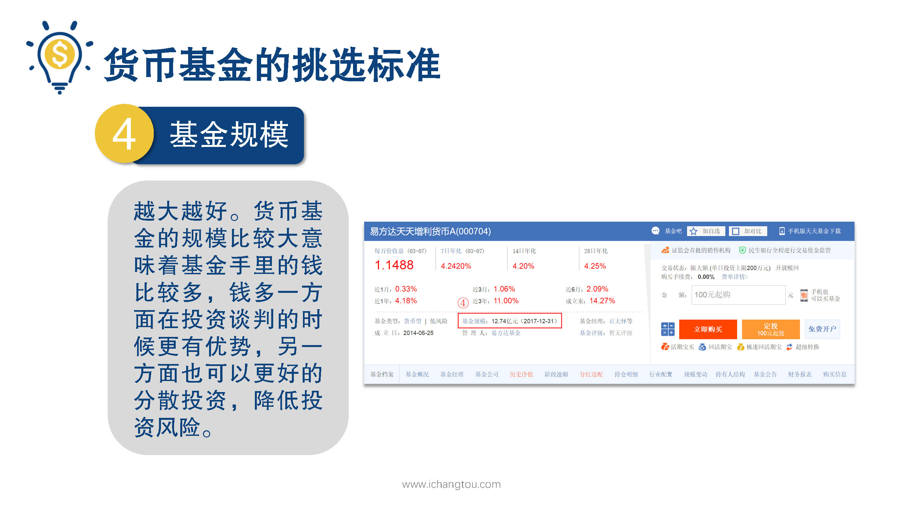

# 基金3-4-货币基金的规模越大越好吗？那么费率呢？

## PPT

## 课程内容

### 规模越大越好

- xxxx1

  > 

### 费率越低越好

## 课后巩固

- 问题

  > 货币基金的规模多少为好？
  >
  > A.10亿
  >
  > B.100亿
  >
  > C.1000亿
  >
  > D.越大越好

- 正确答案

  > D。越大越好，看看余额宝，已经达到可怕的。。15000亿啦！