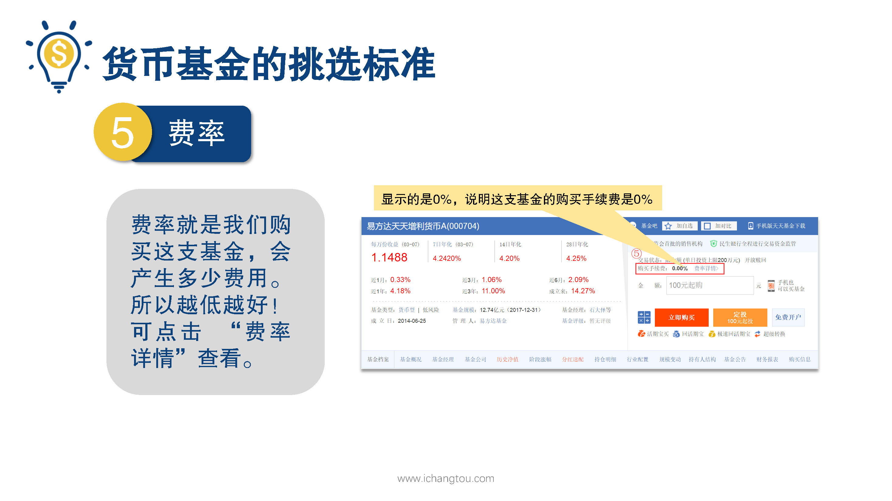
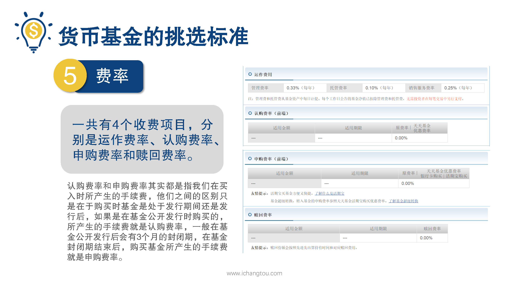

# 基金3-4-货币基金的规模越大越好吗？那么费率呢？

## PPT

## 课程内容

### 规模越大越好

- xxxx1

  > 知道了，成立时间最好在3~5年以上，下面我们来看第4个指标，基金规模这个指标是越大越好，嗯，聪明的小伙伴已经想到了，师兄依旧会问为什么要看规模呢？没错师兄这里来解答一下，货币基金的规模比较大，也就意味着基金手里的钱比较多钱多，一方面是在投资谈判的时候更有优势，另一方面也可以更好的分散投资，降低投资风险，像余额宝的规模是很可怕的，15,000多亿，这个数据是截止到2017年12月31日，已经是亚洲第一大货币基金了，其他的货币基金有个几百亿的规模已经不错了，不能和余额宝相提并论，继续看这张PPT，这只基金的规模接近13亿，相对来说不算大的第5最后我们来看一下费率了，费率相信大家都能理解吧，这是我们购买支持基金会产生多少费用，就像我们之前讲的基金经理啊，银行工作人员在帮我们投资和保管资金的时候可都不是免费的费率，对于我们投资人来说自然是越低越好啦，我们看PPT的右边显示的是购买手续费是0%，说明买这只基金不用支付认购费用，当然大家也可以点击旁边的费率详情，查看基金的其他费用，这里也给大家展示出来，一共有4个收费项目分别是运作费率，认购费率，申购费率和赎回费率，我们先来看运作费率和赎回费率运作费率呢，有点类似基金的管理费，赎回费率呢，就是我们卖出时所产生的费用关于购费率和申购费率其实都是指我们在买入时所产生的手续费，它们之间的区别呢，只是在于购买时基金是处于发行期间还是发行后，如果是在基金公开发行时购买的所产生的手续费就是认购费率，一般在基金公开发行后会有三个月的封闭器，俗称闭关修炼，在基金的封闭期结束后，购买基金所产生的手续费呢，就是神狗废了这里呢，我们只要知道它的费用是0就对了，最后友情提醒小伙伴们，现在大家在网上申购货币基金一定要记得保管好自己的各种账号密码，尤其要看好自己的手机，千万不要发生账号密码泄露和手机丢失的情况，否则因为这种原因造成损失就太遗憾了，好了说了这么多我们来做货币基金的特点是流动性高，风险低，收益稳定，所以货币基金非常适合把一些近期可能会用到的钱放在里面，比如可供我们生活3~6个月的应急金，这笔钱是以备不时之需的，可能随时要用，最好放在货币基金里，等到要用的时候再赎回，以后我们挑选货币基金的时候可以参考以下5个标准，第一收益率都差不多，挑个你喜欢的就好，而流动性最好能随取随用三成立时间3~5年以上比较好，基金规模越大越好，费率越低越好，没有最好

### 费率越低越好

## 课后巩固

- 问题

  > 货币基金的规模多少为好？
  >
  > A.10亿
  >
  > B.100亿
  >
  > C.1000亿
  >
  > D.越大越好

- 正确答案

  > D。越大越好，看看余额宝，已经达到可怕的。。15000亿啦！