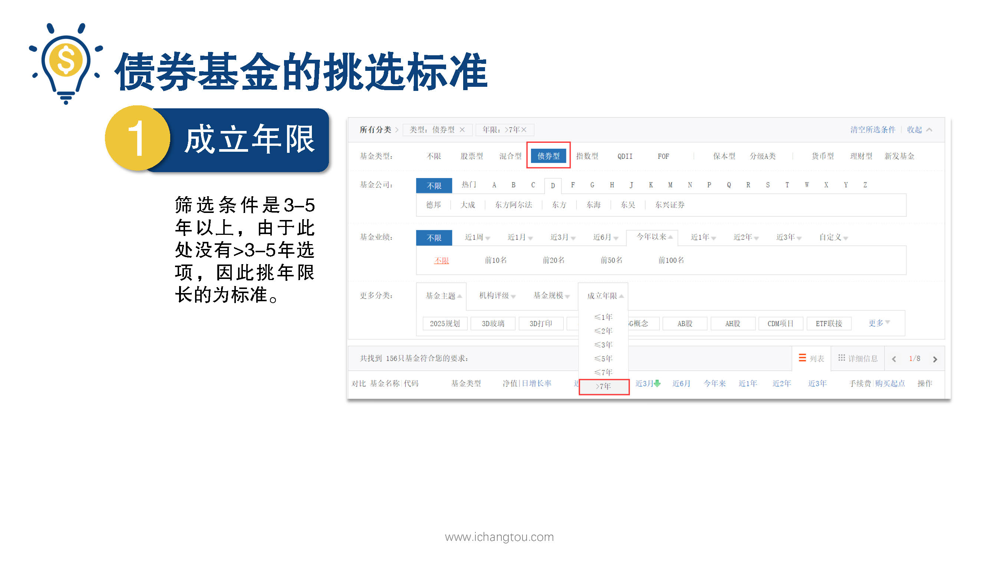
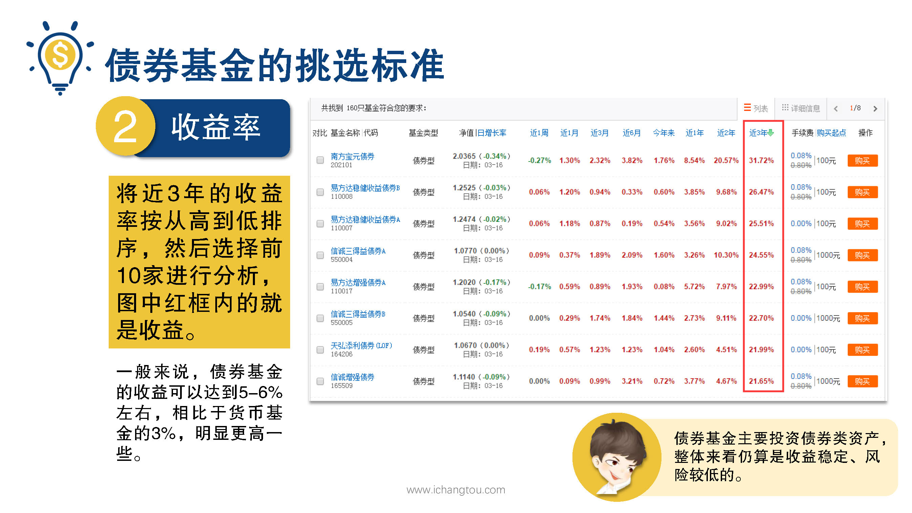
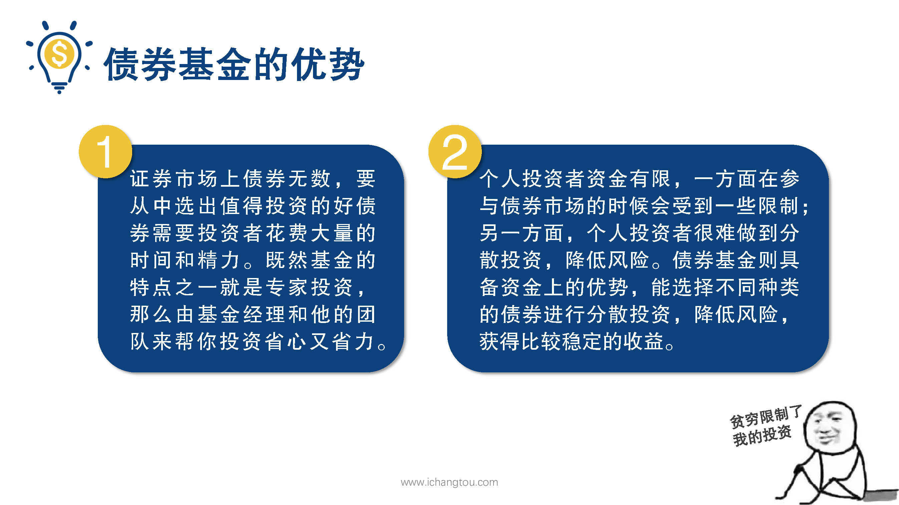

# 基金3-5-债券基金的成立时间越早越好吗？

## PPT

## 课程内容

### 年限3~5年以上

- xxxx1

  > 

## 课后巩固

- 问题

  > 筛选债券基金的其中一个指标是看成立年限，成立年限多久较好？
  >
  > A.3~5年以上
  >
  > B.2年
  >
  > C.1年

- 正确答案

  > A。债券基金的成立时间3~5年以上比较好。