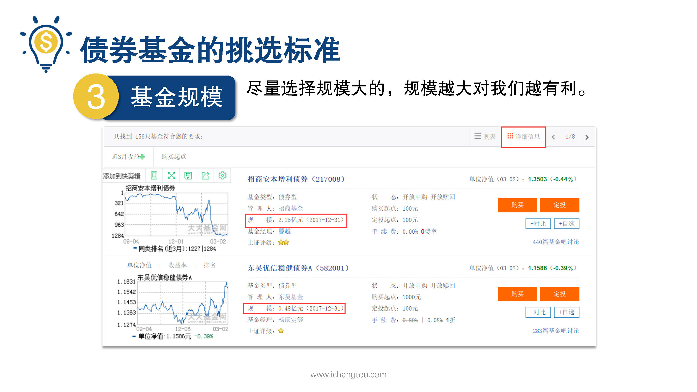
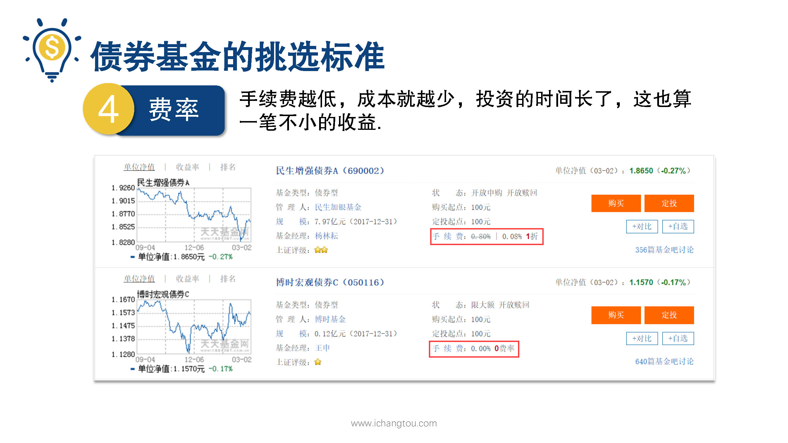
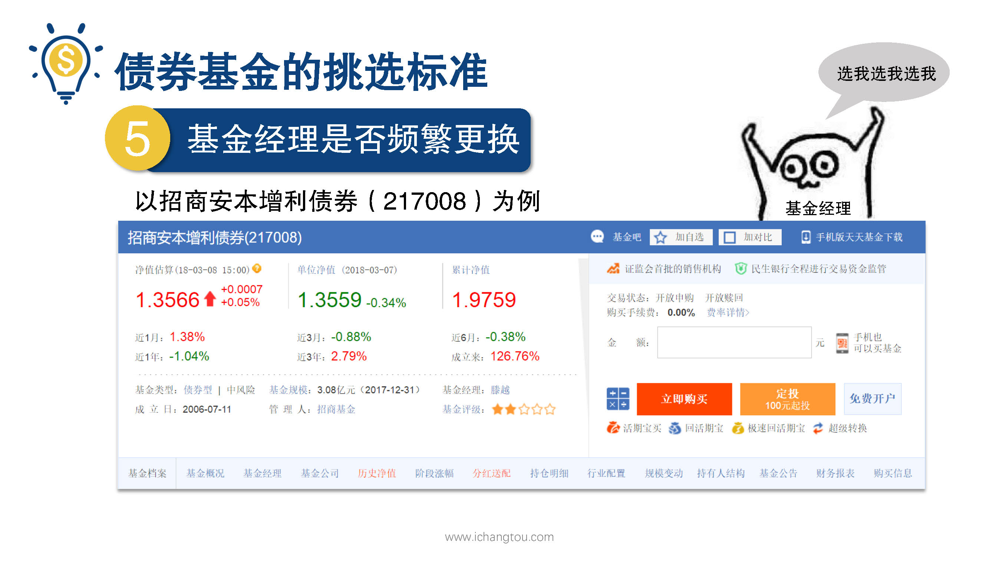

# 基金3-6-债券基金经理频繁换？

## PPT

## 课程内容

### 规模越大越好

- xxxx1

  > 

### 费率越低越好

### 经理更换不频繁

## 课后巩固

- 问题

  > 我们筛选债券基金的时候，以下哪个选项不符合我们的筛选标准？
  >
  > A.资金规模越大越好
  >
  > B.成立时间在3~5年以上
  >
  > C.频繁更换基金经理

- 正确答案

  > C。本题选择的是不符合标准的，c选项不符合筛选标准。如果频繁更换基金经理，可是不太好的~所谓铁打的基金，流水的经理没人爱呀~。