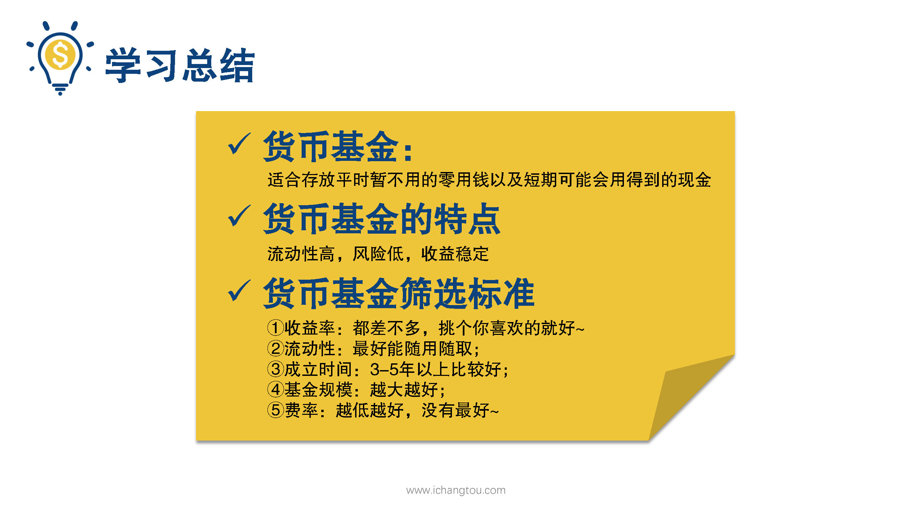
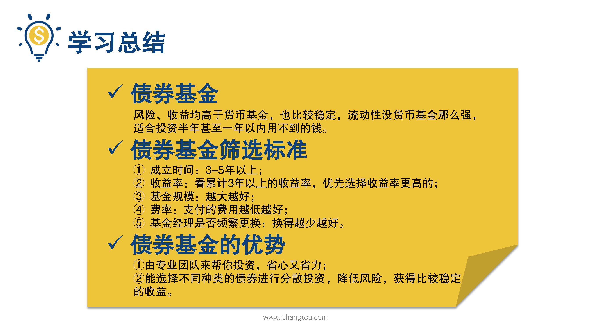

# 基金3-7-货基与债基的筛选，你get到了吗？

## PPT

## 课程内容

### 总结货基与债基的筛选

- xxxx1

  > 

## 课后巩固

- 问题

  > 货基与债基的开展标准有很多相同之处，下面哪一项是货币基金特有的呢？
  >
  > A.成立时间要在3~5年以上
  >
  > B.规模越大越好
  >
  > C.费率越低越好
  >
  > D.流动性越高越好

- 正确答案

  > D。前三项货基和债基的标准都是一样的哦，而流动性是选择货币基金才需要考虑的特点。