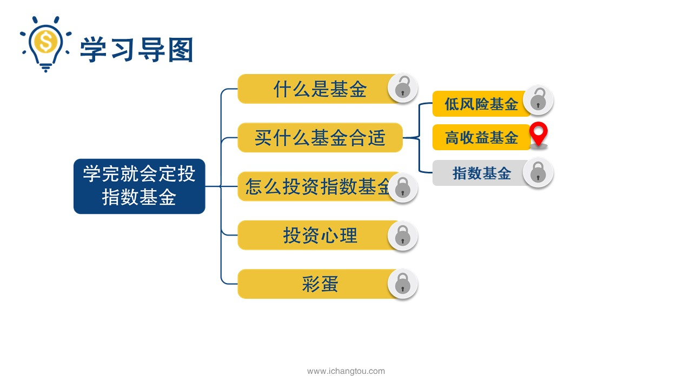

# 基金4-1-基金收益哪家强

## PPT

## 课程内容

### 什么是混合基金

- xxxx1

  > 小伙伴们大家好，我是李师兄，昨天我们一起学习了两种低风险基金的筛选方法，分别是货币基金和债券基金，从成立时间是不是足够长？规模够不够？大费率是不是够低？还有基金经理是不是频繁更换等条件把低风险的基金广中选用，而且还教了大家撸羊毛的技巧，你们学会了吗？只要动手去筛选过一遍，一定是没有问题的，不过我们也知道货币基金，债券基金再好也不能带来多大的收益，就更别提跑赢通货膨胀了，我的同事也挺犯愁的，对，就是那个做了苹果和微软股东的二狗子，他神神秘秘的来找我说师兄啊，你说我是不是能买那个叫嘉实新消费股票的基金啊？酒吧显示支付宝页面的手机凑到了我的鼻子前面，我问他你为什么要买这只鸡？怎么看对眼的？然后我说因为他有五粮液啊，出于对同事的爱，我忍不住对他说，选9可以花很多时间好不好喝？逼格高不高？卖酒的妹子好不好看而买基金呢，尤其是投资股票的基金收益高些，但是风险也高，不会选你就买，你怎么不把钱给师兄还呢？而我被怼完不做声了，师兄怎么会只对人不交人呢？今天就来教大家如何对混合型基金和股票型基金做筛选，要想知道怎么选，想要知道是什么，我们就先来看看什么样的基金是混合型基金，混合型基金是可以同时投资股票，债券货币的基金，其实从他的名字里就可以看出个123来其中组合在一起的才能算是混合基金假如你朋友打算开一家烤肉店，但是钱不太够长，说找你借，你想了几个晚上觉得嗯，这条街上还没有做这个生意的，应该可以搞一个，而且作为朋友确实要帮这个忙，但是另一方面又觉得这个生意还是有风险的，不想冒太大的风险，那么怎么办呢？后来终于想了一个办法，你入股12万，还有8万以借款的形式寄给朋友，这样朋友拿到钱能尽快把店开起来，你不但能从烤肉店以后赚取的收益中获取分红，并且万一经营不好机会还是要还的，不是让你血本无归，其实聪明的小伙伴已经发现了，刚刚这个配置混合型基金就很像了，混合基金有利于股票和债券之间胸襟开阔，敞开心扉，迎接股票，债券，货币等远方来的客人，这就是混合型基金最大的特点，投资选择多同时配置股票，债券，货币等，而且配置比较灵活，间接实现了分散投资，降低了风险是不是很聪明呢？那么什么是资产配置呢？简单来说就是将各种资产按照一定的比例进行组合，以达到收益率最大化风险最小化的目的，听到这里小伙伴们应该很容易理解，为什么混合型基金的收益会比债券型基金更高了吧，有时候表现好的话，混合型基金的收益甚至比纯股票型基金还要高哟，我一听到有时候收益还会比股票基金高，这几个字眼睛就亮了，欣喜的问师兄师兄，你把混合基金说的这么好，那么我应该如何挑选基金，如何判断到底值不值得我投资呢？你快来教教我吧，好，在下一届师兄就手把手的教你，保证你学完就能亲自去挑选一只基金

### 混合基金的资产配置

## 课后巩固

- 问题

  > 关于混合基金，下面哪种说法是错误的？
  >
  > A.混合型基金可以投资股票、债券和货币
  >
  > B.混合基金可以实现一站式资产配置
  >
  > C.混合型基金的风险跟基金经理无关

- 正确答案

  > C。本题选择的是错误的，C选项错误。混合基金由基金经理决定配置比例和调制时间，所以风险跟基金经理的能力有很大关系。