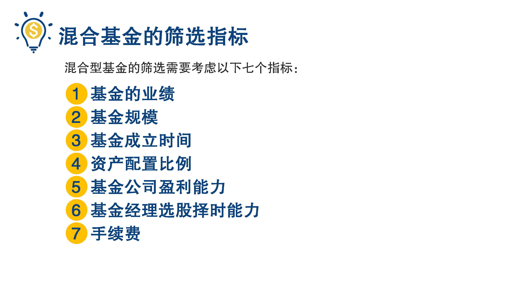
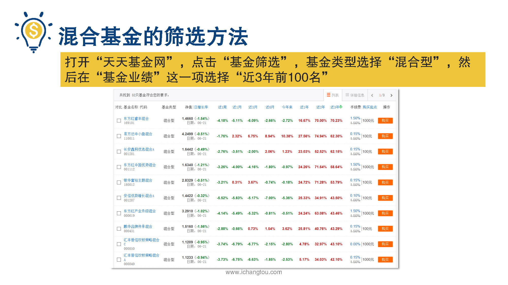
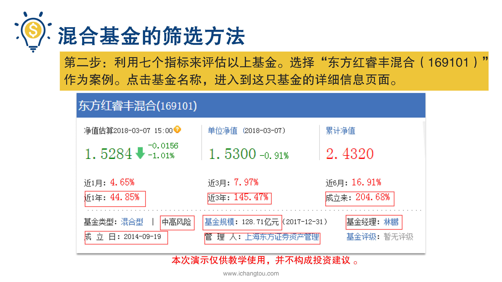
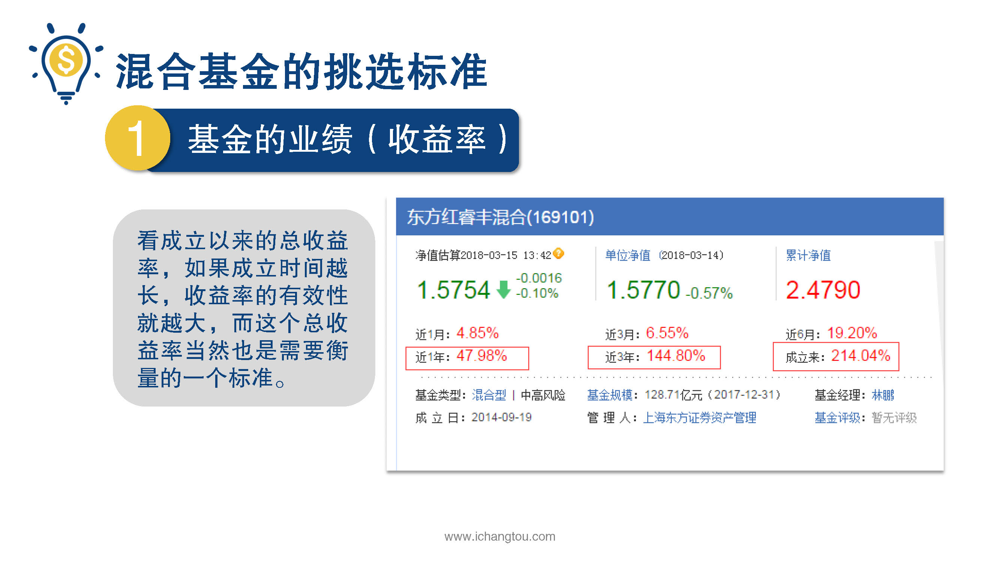
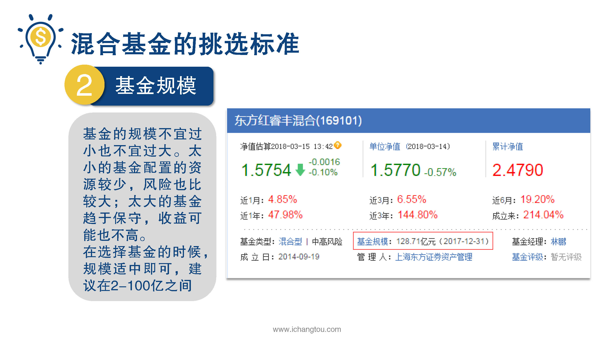

# 基金4-2-混合基金选基大法（上）

## PPT

## 课程内容

### 混合基金的业绩

- xxxx1

  > 

### 基金规模

### 基金成立时间

## 课后巩固

- 问题

  > 混合基金筛选中需要看哪些指标？
  >
  > A.基金的业绩
  >
  > B.基金成立时间
  >
  > C.以上都要

- 正确答案

  > C。混合基金筛选的指标有：基金的业绩、基金的规模、基金成立时间、资产配置比例、基金公司盈利能力、基金经理选股择时能力和手续费等。