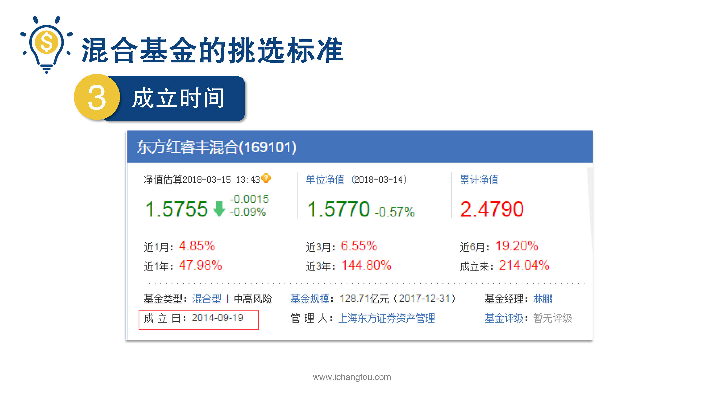

# 基金4-2-混合基金选基大法（上）

## PPT

## 课程内容

### 混合基金的业绩

- xxxx1

  > 上一节我们知道了混合基金是什么，这一节师兄教大家如何筛选混合型基金，混合型基金的筛选需要考虑一下，7个指标有点多，有7个听好了基金的业绩进行了规模成立时间资产配置的比例，基金公司盈利能力，基金经理选股择时能力手续费的好，我们按照之前的老规矩带着大家筛选一遍第1步初步筛选业绩好的品种，打开天天基金官网，点击基金基金类型，选择混合型，然后在基金业绩这一项选择近三年前100名这一波操作是为了选出过去三年里收益率排名前100的基金品种，并将它们按近三年的收益率从高到低排序，结果如下，这里要提醒大家一下，考虑到开发时间的问题，有些小伙伴看到的时候可能跟我们有时差，看到的顺序大概率的会与这个不同了，但是这并不影响筛选基金，大家不用疑虑，毕竟这只是一个例子，那么有些小伙伴可能还要问呢，是说为什么要看三年的不看一年的呢？虽然过去的年化收益率不能作为未来收益率的最低标准，但是呢，这一步可以排除掉很多名不见经传的基金，降低了很多不必要的风险，过去1~2年的收益率，可能是运气，但是3~5年都能保持不错收益率的基金，那么很有可能还是有一定的实力了，第2步我们要用上面说的几个指标来评估我们选出来的基金哪几个指标我们再说一遍基金的业绩进行了规模基金在成立时间资产配置的经理的选股择时能力和手续费这里，我们就从刚刚筛选的基金队伍中选择排名第一的东方红睿丰混合为例，带着大家一起看看如何利用指标来评价这个基金，请大家注意了，这里的例子也是仅供教学参考和讨论，可不构成任何的投资建议用点击及名称我们会进入到这支基金的详细信息页面，接下来就用7个指标来分析它了，第1步先看基金的业绩也就是收益率，分别看成立以来近三年和近一年的收益率都还不错，当然我们在第1步筛选的时候，这只基金已经是收益率排名比较靠前的了，但我们只是看到最近三年而已，会不会是他突然人品大爆发才获得这样的战绩呢？为了排除这种情况，我们就要看它成立以来的总收益率，成立时间越长规律的有效性就越大，而这个总收益率当然也是我们需要衡量的一个标准啊，第2步我们接着看看基金的规模，从图中可以看到基金规模是128.71，通常来说基金的规模比不过小，但也不宜过大，太小的基金配置的资源比较少，风险比较大，而太大的基金趋于保守，收益可能也不高，所以在选择基金的时候规模适中即可，建议在2亿至100亿之间，东方红睿丰超过了100亿的资产稍微大了一点第3步看看基金的成立时间，2014年9月19日成立时间至少也有三年了，虽然不算太长，但也不是一只新基金，可以继续观察下一节，我们将继续介绍后面的4个步骤

### 基金规模

### 基金成立时间

## 课后巩固

- 问题

  > 混合基金筛选中需要看哪些指标？
  >
  > A.基金的业绩
  >
  > B.基金成立时间
  >
  > C.以上都要

- 正确答案

  > C。混合基金筛选的指标有：基金的业绩、基金的规模、基金成立时间、资产配置比例、基金公司盈利能力、基金经理选股择时能力和手续费等。