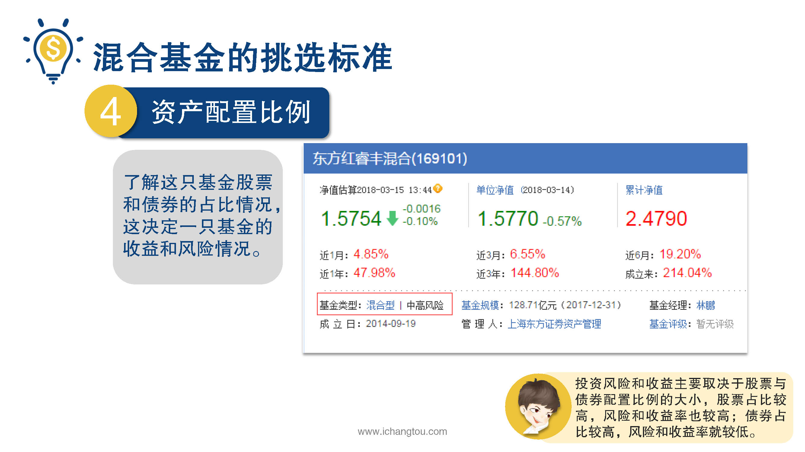
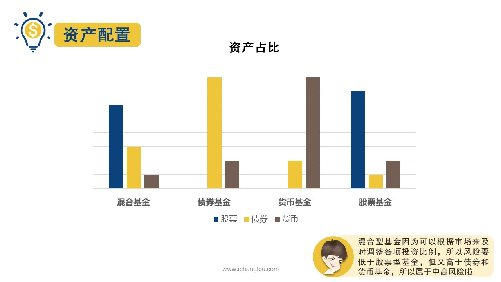
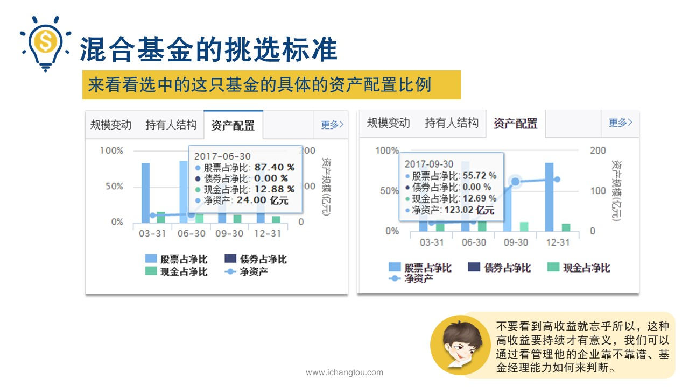
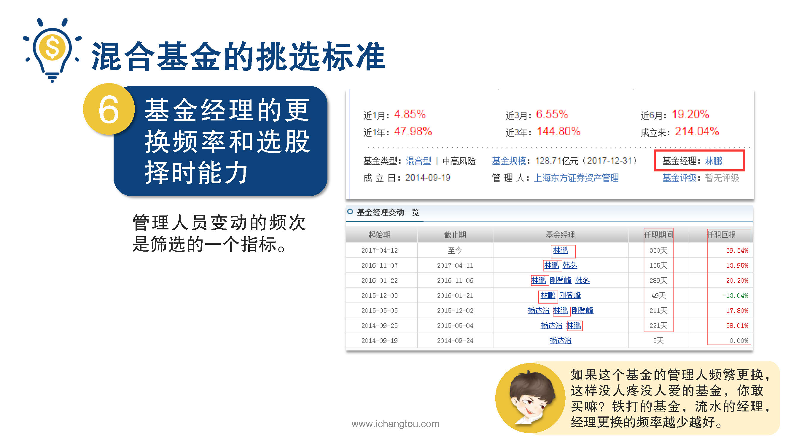
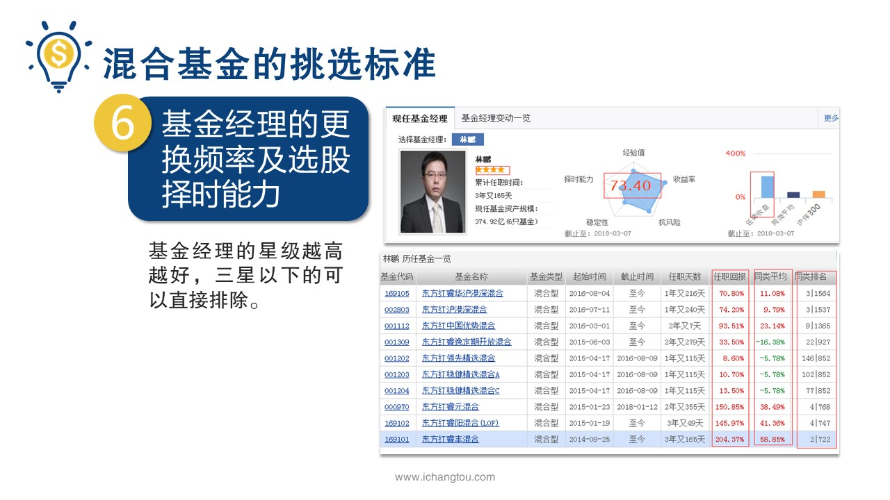
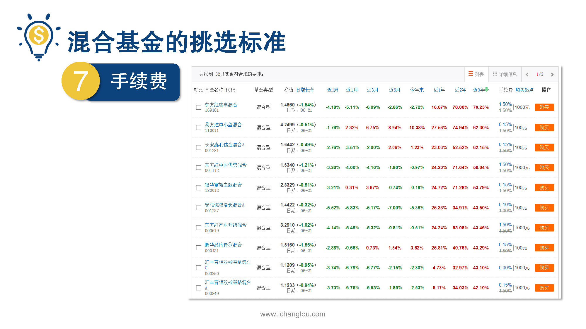

# 基金4-3-混合基金选基大法（下）

## PPT

## 课程内容

### 资产配置比例

- xxxx1

  > 上一节我们带着大家分析了东方红睿丰混合型基金的业绩规模以及成立的时间，这一节我们继续看看他接下来的4个指标，资产配置比例，基金公司盈利能力，基金经理选股，择时能力和手续费，第4步看基金的资产配置比例，这主要是帮助我们了解这只基金股票和债券的占比情况，占比情况，决定这一只基金的收益和风险情况，图中基金类型混合型后面有一个中高风险，这个就是风险等级的预告，为什么是中高等级？前面我们说过收益越大风险也就越大有为什么呢？为什么呢？好了这里又不是10万个，为什么栏目师兄来告诉你，这个问题问得很好，其中要害它涉及到了资产配置问题，混合型基金已包含了几种不同收益和不同风险的投资品股票债券和货币投资风险和收益主要取决于股票与债券配置比例的大小，股票占比较高，风险和收益率也就较高，债券占比较高，风险和收益率就较低，混合型基金可以根据市场来，即使灵活的调整各项投资比例，而股票型基金中股票有最低仓位80%的限制，相比之下混合基金的风险要低于股票型基金，但同时风险又要高于债券和货币基金，所以属于中高风险好了，我们来看看选中的这只基金的资产配置比例吧，还是在详细页面往下拉，可以看到PPT中的资产配置图，我们把鼠标放在蓝色柱状图上会看到一个比例说明很显然这只基金的股票占净比最高的时候有87.4%，跌的时候是55.7%，说明基金经理才根据市场调控比例以及达到最大的收益从收益看，基金经理的调控水平还是很不错的，混合型基金因为配置比较灵活，市场行情看涨是可以大量买进股票，获取更高的收益，而当市场行情不好的时候也可以大量卖出股票，买入债券来稳定收益，减少损失，所以有一些运作良好的混合型基金回报，甚至会超过股票基金的水平，是不是很积极？也不要看到高收益就忘乎所以，这种高收益要持续才有意义，我们可以通过看管理他的企业靠不靠谱基金经理的能力如何来判断第5步企业靠不靠谱考察的就是基金公司的盈利能力，这些基金属于上海东方证券资产管理公司，点击基金公司名称，可以查看详细信息，从PPT中的图可以看到成立5年以来，公司在120家的同类基金公司中排名第六，收益与规模比高达144.8%，远超过同类平均跑赢沪深300指数，说明该基金公司的盈利能力还不错，算是值得托付的好公司第6部我们需要看基金经理的更换频率和基金经理的选股择时能力，如果这个基金的管理人员频繁更换，就说明这个基金没人疼没人爱，这样的基金你敢买吗？铁打的基金流水的经理更换的频率要越少越好，点击基金经理的名字，林鹏可以看到关于基金经理的详细信息，需要提醒大家的是基金经理的具体情况介绍，需要大家在天天基金网上注册登录之后才能看到哟但她的任职时间，管理人员变动的频次是我们筛选的一个指标，从图中可以看出林鹏从基金成立起到2014年起，一直持续管理着这只基金期间有协作管理者，但林鹏一直是主要管理者，再来看基金经理的情况，判断他的选股择时能力，基金经理选股，择时能力这个指标主要作为排除指标来参考，为什么呢？基金经理也是人啊，发挥不一定有稳定，但很多主观因素都在里面，我们很难通过获取的信息来判断，所以这一点我们主要当作排除指标，选股能力主要参考4个指标，从业情况，评分星级和管理的基金收益排名其中的图显示了经理的从业情况和评分还不错，基金经理的星级越高越好，三星以下的就直接排除吧必须图中我们可以看到他管理的混合基金的收益回报率简直完爆同类平均值排名都比较靠前，简直是没有比较就没有伤害，由此我们判断出他的能力还是非常不错的，好到了第7部最后要看的就是基金的手续费当然是越低越好啦，选出来一只好基金最后还要看看手续费高不高，因为手续费会降低我们的收益吗？从PPT中可以看到相对于其他基金0.15%的手续费，这只基金的手续费是1.5%，真是贵啊，有些美中不足好了，经过上面几个方面的筛选评估，你有没有觉得这只混合基金处的手续费有点高之外，收益率，基金规模，基金成立时间，资产配置比例，调控基金公司盈利能力和基金经理的条件都比较优秀，所以这是一支劳务费有点高的产品，属于爆款个性定制产品，如果你就不错，愿意多出些劳务费也是可以的，有没有很想下单的感觉呢？比较着急一些收入自己的基金池，再用师兄教你的方法多挑几次进行评价吗？就像小仙女们挑选如意郎君一样，万里挑一才最称心吗？

### 基金公司盈利能力

### 基金经理选股择时能力

### 手续费

## 课后巩固

- 问题

  > 关于混合型基金的资产配置，哪个说法不正确？
  >
  > A.包含了股票、债券、货币等
  >
  > B.投资风险和收益主要取决于股票与债券配置比例的大小，股票占比较高，风险和收益率也较高
  >
  > C.混合型基金中股票的比例有最低仓位限制

- 正确答案

  > C。本题选择的是不正确的，C嗯选项错误。混合型基金包含了几种不同收益和不同风险的投资品：股票、债券、货币等，投资风险和收益主要取决于股票与债券配置比例的大小，股票占比较高，风险和收益率也较高。混合型基金中股票没有仓位限制，所以可以根据市场来及时、灵活地调整各项投资比我例。