# 基金4-4-股票基金怎么选嗯

## PPT

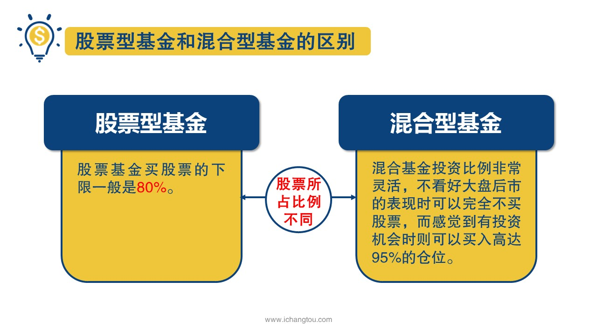

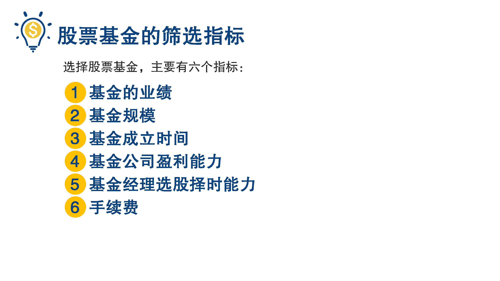

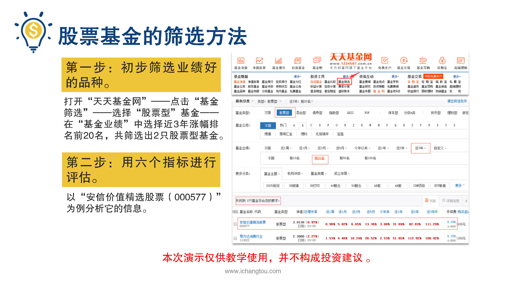

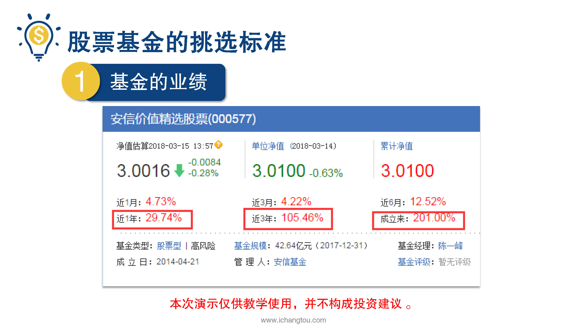

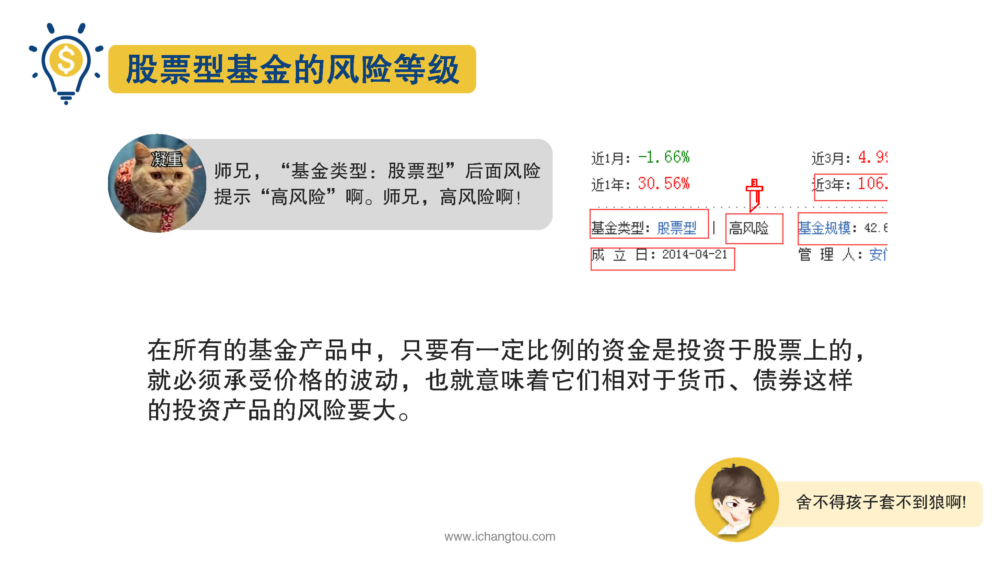

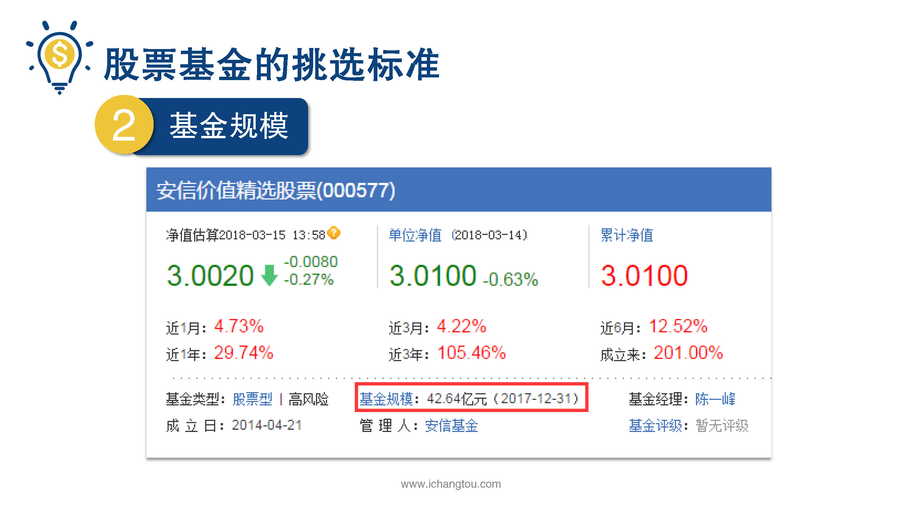

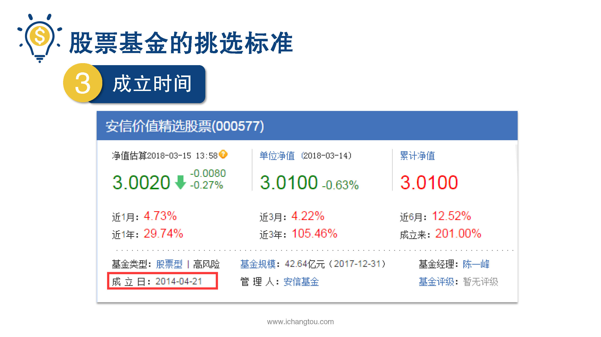

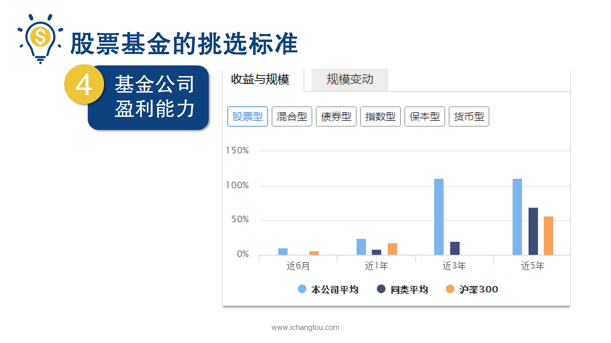

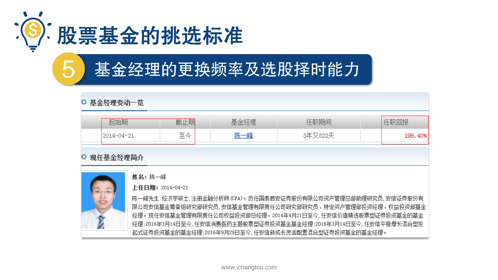

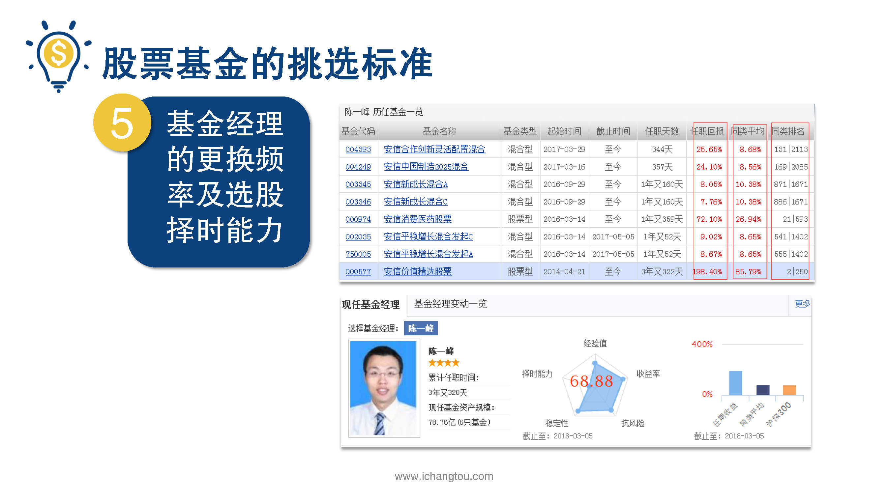

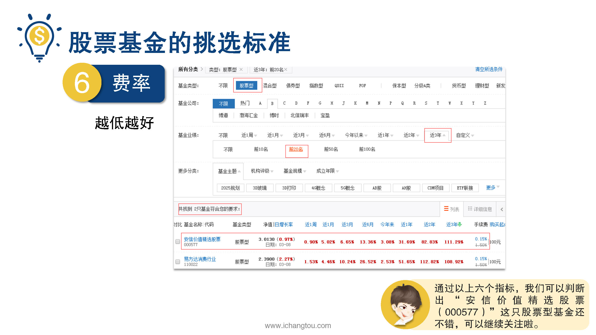

## 课程内容

### 什么是股票型基金

- xxxx1

  > 说完混合型基金，接下来我们来看看股票型基金，说到股票型基金的师兄，想到过一个很有意思的事情和大家分享一下，有一部很有名的电视剧叫做权力的游戏，不知道大家看过没有，里面有一位女主角叫做龙妈，她的本名是丹尼斯，但是大家知道吗？每一次当他登场去征服一个城市的时候，他的手下给他的称呼都是这样的，大草原的卡丽熙解放者龙之母不焚者风暴，降生丹妮莉丝坦格利安清朝有名的慈禧太后，他的是好事，孝钦，慈禧端佑，康颐昭豫，反正我不玩了，大部分人都有一个很普通的名字，但是为了显示自己高大上，震慑住对方，都会给自己取一个高大上的封号，而回到我们的投资主动型基金也是这样，明明只是基金经理拍脑门选择一组股票，但是再穷不能穷教育，再怂不能怂名字，就算咱们水平不行，名字再高大上绝对不能输，所以就有了东方红睿丰混合基金，嘉实新消费股票基金之类的名字，那么什么样的基金才配得上叫做股票型基金呢？接近顾名思义，就是主要投资股票的基金，有小伙伴要问了是什么混合型基金和股票型基金投资股票呀，那么它们的区别是什么呢？让师兄来告诉你吧，两者最主要的区别是股票在基金资产中所占的比例下限不同，股票基金买股票的下限一般是80%，怎么理解呢？这么说吧，就算基金经理认为目前市场风险很大，必须卖出股票，但他也不能把股票全部卖出，必须保留投资范围中所说的下限，就算死扛也没有办法，而混合型基金就不同，投资比例非常的灵活，不看好大盘后市的表现是可以完全不买股票，而感觉到有投资机会时可以买入高达95%的仓位，可以说能够做到进可攻退可守，这是饺子当然这也很考验基金经理的专业水平，收益656还取决于操作流不流我们如何判断某只股票基金是否值得被关注呢？其实和选择混合型基金的方法是差不多的，主要也是有6个指标，基金的业绩进行了规模基金的成立时间，基金公司的盈利能力，基金经理的选股，择时能力手续费，聪明的小伙伴发现了，其实相比混合基金就是少了一个资产配置比例，对的筛选混合基金的时候需要查看资产配置比例，股票型基金几乎大部分都是股票，就不需要这个指标了，我们继续用案例带大家旅游一遍，第1步初步筛选业绩好的品种，还是打开天天基金网基金，筛选股票型基金，在基金业绩中选择近三年涨幅排名前20名，共筛选出两只股票型基金，第2步我们就要用6个指标进行评估了，我们已知安信价值精选000577为例，来分析他的信息，第一先看基金的业绩，同样先看它成立以来近三年和近一年的收益率，嗯，都还不错，但是呢，基金类型，股票型后面风险提示高风险，有的小伙伴要问了，嗯是什么高风险啊？比混合基金风险还要高吗？那是当然啦，前面就说过了，市场不好时混合型基金可以完全空仓，也就是说完全不持有股票，而股票基金中却有个投资下限的限制，光是这一点，你就知道股票基金的风险比混合基金高了，在所有的基金产品中，只要有一定比例的资金是投资于股票上的，就必须承受价格的波动，也就意味着它们相对于货币债券这样的投资产品的风险要更大第二看的是基金的规模，从PPT图中看出规模是42.64亿之中，第3接着看基金的成立时间，从图中看出成立时间是2014年，距今快4年了，不算新品种了，第四然后看基金公司的盈利能力越强越好，基金公司是从图中可以看出近三年近5年收益率都高出同行业，平均值跑赢沪深300指数第五，再看基金经理的更换频率及选股择时能力从PPT的三张图中可以看出你从基金成立日起就管理了，这只基金在分别查看基金经理的任职回报评分等指标，我们得出的结论是这个经理混合基金投资能力，一般，它是股票型基金，投资能力还比较靠前，可以考虑他的股票型基金，他的混合型基金吗？还是算了吧，跟前面混合基金一样，这里也需要明确基金经理的选股，择时能力这个指标也是作为排除指标来参考的，最后第6部看费率越低越好，从图中可以看出手续费0.15%，很喜欢，因为混合基金类似的筛选方法用的是不是越来越熟练了呢？通过以上6个指标安信价值精选股票000577这支股票型基金还不错，可以继续关注比较了

### 股票型基金的筛选方法

## 课后巩固

- 问题

  > 关于股票型基金，下面哪种说法是错误的？
  >
  > A.股票型基金收益和风险都较高
  >
  > B.股票型基金的收益和风险与基金经理有很大的关系
  >
  > C.股票型基金中股票的比例没有最低仓位限制

- 正确答案

  > C。本题选择的是错误的，C选项错误嗯。混合基金中股票的比例没有最低仓位限制，基金中股票有最低仓位80%比例的限制，所以就算股市大跌，基金经理也不能将股票全部卖出。啊