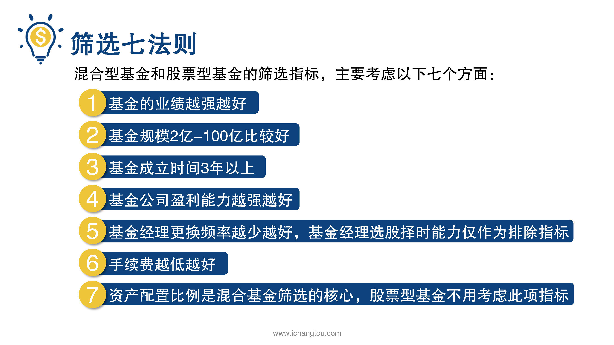

# 基金4-5-筛选高收益基金“七法则”

## PPT

## 课程内容

### 混合型基金和股票型基金的筛选指标

- xxxx1

  > 通过前期的学习，我们了解了混合基金和股票型基金的定义和特点，并且学会了如何对他们进行筛选和分析，我们也发现其实他们的筛选方法是有共通之处的，因此我们可以总结出混合型基金和股票型基金的筛选指标，主要考虑以下7个方面，第一基金的业绩越强越好，几号进行的规模在21~100亿之间比较好，第三基金的成立时间在三年以上比较好，这次基金公司盈利能力越强越好，因为基金经理更换的频率越少越好，基金经理选股择时能力仅作为排除指标，第六手续费越低越好，第七资产配置比例是混合基金筛选的核心股票型基金则不用考虑此项指标，混合基金和股票基金这么狂拽炫酷之后选出来就一定棒棒的呢，还没那么简单，混合型基金和股票型基金由于有不同比例的资金投资于股票市场，所以波动很大一些，鱼目混珠的家伙出差就可能没有被甩出去，不过也不用太担心师兄有一个锦囊送给大家作为出差之后的检查，那就是在熊市里表现很烂，但牛市里表现强于大盘的基金一定要慎重，如果一只基金有这么一个特点，那么它很有可能背后有一个过度投机的基金经理，那么过度投机好不好呢？你可以想象一下坐过山车的感觉，完全就是心跳刺激，有些人享受突然飞升的感觉，可是飞升到高位必然要降到低位才能再次升起，有的人就受不了了，直接吓出毛病来了，怎么样这个消息呢？是不是特别有智慧呢？

### 师兄锦囊

## 课后巩固

- 问题

  > 资产配置比例是哪种基金筛选的核心指标？
  >
  > A.混合基金
  >
  > B.股票基金
  >
  > C.指数基金

- 正确答案

  > A。资产配置比例是混合基金筛选的核心指标，因为配置比例决定着它风险和收益的高低嗯。